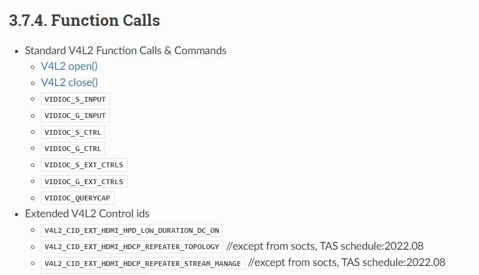

Documentation
=============

문서화 내용을 작성하는 사람을 위한 안내 페이지이다.

.. _Sphinx: https://www.sphinx-doc.org/
.. _restructuredText: https://www.sphinx-doc.org/en/master/usage/restructuredtext/basics.html
.. _rst: https://www.sphinx-doc.org/en/master/usage/restructuredtext/basics.html
.. _Doxygen Docblock: http://www.doxygen.nl/manual/docblocks.html

Overview
--------

규칙:

* 문서화 도구로 Sphinx_ 를 사용 (restructuredText_ - 이하 rst_, `Doxygen Docblock`_)

  * 하나의 페이지 안에서 문서 형식은 rst_ 형식을 따름
  * 서로의 페이지 연결은 rst_ 를 확장한 Sphinx_ 형식을 따름

* 모든 문서는 영문을 우선
* 파일 인코딩은 반드시 UTF-8을 사용
* 들여쓰기는 공백 2칸을 기본으로 하나 rst_ 의 들여쓰기 규칙을 우선
* 별 문제가 없을 경우 80칸을 기준으로 줄바꿈
* 서술어는 기본형을 사용(예, ``이다``, ``하다`` 를 사용하고 ``입니다``, ``합니다`` 사용 않음)

구성:

* Documentations for each Modules (Implementation Guide)
* Documentation for Status Files
* Documents for groups of some modules (*제안*)
* API Reference

배포:

https://ci.seetv.webos.io/doc/linuxtv/ 에 최신 버전을 매일 배포할 예정이며, 지난 버전 또한
유지를 한다.

도움:

http://hlm.lge.com/issue/browse/TVPLAT 프로젝트에 Task로 이슈를 생성하여
sean.lee@lge.com 또는 dy.jin@lge.com 에게 assign 한다.

Module
^^^^^^

Module에 대한 문서화 페이지이다.
A module is a logical sub-unit of the entire LG hal libs header.
Each module is managed into a single page in implementation guide pages

각 category 안의 module 은 사전순으로 정렬되어 표시된다.

API Reference
^^^^^^^^^^^^^

소스파일(헤더파일)의 주석과 비슷한 Docblock 형식으로부터 추출되어 자동으로 생성된
:doc:`/api/index` 문서이다.

Build Documentation
-------------------

Preparation
^^^^^^^^^^^

Requirements:

* 'doxygen' (version 1.6 or higher)
* 'python3' (version 3.6 or higher) and it's 'pip'

.. note::
  The simplest way to use 'doxygen' and 'python3' is install via package system
  (ex, ``apt``) with the root privilege.

  If you don't have the root privilege, you can install in user space locally.
  Build tools like 'gcc', 'make', 'cmake' must be required to install locally.

  In case of installation of 'doxygen', install commands may like this:

  .. code-block:: bash

    ## doxygen installation locally
    ## check more on http://www.doxygen.nl/manual/install.html#install_src_unix

    wget http://doxygen.nl/files/doxygen-1.8.16.src.tar.gz
    tar xf doxygen-1.8.16.src.tar.gz
    cd doxygen-1.8.16
    mkdir build
    cd build
    cmake -G "Unix Makefiles" -DCMAKE_BUILD_TYPE=Release -DCMAKE_INSTALL_PREFIX=$HOME/local -Wno-dev ..
    make; make install

    ## doxygen will be installed in $HOME/local/bin
    ## modify PATH in your rc file like this:
    ## PATH=$PATH:$HOME/local/bin

  'doxygen' requires libraries 'bison', 'flex', and 'iconv'.
  If these libraries are not installed, you can install like this:

  .. code-block:: bash

    ## for example 'bison' library installation locally

    wget https://ftp.gnu.org/gnu/bison/bison-3.0.tar.gz
    tar xf bison-3.0.tar.gz
    cd bison-3.0
    ./configure --prefix=$HOME/local; make; make install

  The libraries may be OK for doxygen:

  * 'bison' version 2.0 or higher
  * 'flex' version 2.0 or higher
  * 'iconv' version 2.0 or higher

Next step requires 'python3'. You can check it's already installed via
``python3 --verison`` command. If it's not installed, install 'python3' via
package system with root privilege or `install using the source code
<https://docs.python.org/3/using/unix.html#building-python>`_.

Install python library requirements for documentation like below:

.. warning::
  If ``Documentation`` directory is not existed in project,
  switch to ``doc`` branch (``git checkout -b doc origin/doc`` or
  ``git switch -c doc origin/doc`` command).
  This situation shows the documentation is ready but not merged into master
  branch.

.. code-block:: bash

  $ cd (somewhere)/linuxtv-ext-header
  $ cd Documentation
  $ pip3 install -r requirements.txt

If last command is fail due to the permission problem, run
``pip3 install --user -r requirements.txt`` (see
https://pip.pypa.io/en/stable/reference/pip_install/#cmdoption-user).

After execution of last command ``sphinx-build`` must be executed. It may
located in ``/usr/bin`` or ``/usr/local/bin``. If not found, it may located in
``$HOME/.local/bin``. Append the directory to PATH environment variable.

Generate HTML
^^^^^^^^^^^^^

In ``Documentation`` directory:

.. code-block:: bash

  $ make clean html

위와 같이 실행하고 나면 ``build/html`` 디렉토리에 문서화 결과물이 생성되며,
브라우저를 통해 ``build/html/index.html`` 파일을 열어 확인할 수 있다.

With version information from the header file (``gcc`` required):

.. code-block:: bash

  $ make clean version
  $ LEH_DOC_VERSION=$(cat build/version.txt) make html

View HTML with Python WebServer
^^^^^^^^^^^^^^^^^^^^^^^^^^^^^^^

Open http://localhost:8000/ after:

.. code-block:: bash

  $ python3 -mhttp.server

or run in background:

.. code-block:: bash

  $ python3 -mhttp.server &

Generate without API Reference
^^^^^^^^^^^^^^^^^^^^^^^^^^^^^^

In ``Documentation`` directory:

.. code-block:: bash

  $ export LEH_DOC_DOXYGENINPUT=none
  $ make clean html

To unset:

.. code-block:: bash

  $ unset LEH_DOC_DOXYGENINPUT

Test Specific Modules in Fast
^^^^^^^^^^^^^^^^^^^^^^^^^^^^^

In ``Documentation`` directory:

.. code-block:: bash

  $ export LEH_DOC_DOXYGENINPUT=../hal_inc/hal_airplay.h
  $ make clean html

To unset:

.. code-block:: bash

  $ unset LEH_DOC_DOXYGENINPUT

Use Parallel Process
^^^^^^^^^^^^^^^^^^^^

In ``Documentation`` directory:

.. code-block:: bash

  $ export SPHINXOPTS="-j 6"
  $ make clean html

To unset:

.. code-block:: bash

  $ unset SPHINXOPTS

Test only Doxygen Syntax
^^^^^^^^^^^^^^^^^^^^^^^^

The `doxygen.conf` is not used to build documentation.
But it can be used to test DocBlocks in source codes.
*(This operation requires only `doxygen`)*

In ``Documentation`` directory:

.. code-block:: bash

  $ doxygen doxygen.conf > /dev/null

will prints all warnings and errors.

in ``html`` directory ``html/index.html`` is generated in doxygen output.

Documentation Templates
-----------------------

Module
^^^^^^

.. seealso::

  For example :doc:`/v4l2/scaler`, :doc:`/alsa/aenc`

**Hierarchy** should be common for all pages of the modules.

**Module Name**

    #. History

        * Decending list of modification history about the module.
        * Columns

            * Version - Use `semver <https://www.semver.org/>`_
            * Date - YYYY-MM-DD
            * Changed by - Email address registered in LGE
            * Comment - Notes about modification without line-break

    #. Overall Description

        * Overall description of the module.

        #. Terminology and Definitions

            * Terminology and definitions of the module.

        #. System Context

            * Picture and description of the module.

        #. Performance Requirements

            * Performance requirements of the module.

        #. Design Constraints

            * Design constraints of the module.

    #. Functional Requirements

        #. Data Types

            * Links to references of structure, define, enum, etc.

        #. Function Calls

            * Links to references of function call including ioctl() interfaces.

        #. Other Information

            * Above section must be ordered strictly.
            But this section and below is free document for module's maintainer.

.. code-block:: rst

    Module Name
    ===========

    History
    -------

    Overall Description
    -------------------

    Terminology and Definitions
    ^^^^^^^^^^^^^^^^^^^^^^^^^^^

    System Context
    ^^^^^^^^^^^^^^

    Performance Requirements
    ^^^^^^^^^^^^^^^^^^^^^^^^

    Design Constraints
    ^^^^^^^^^^^^^^^^^^

    Functional Requirements
    -----------------------

    Data Types
    ^^^^^^^^^^

    * No data types
    * :c:type:`acas_ext_control`

    Function Calls
    ^^^^^^^^^^^^^^

    * no function calls
    * :c:macro:`ACAS_EXT_S_CTL`

Function & ioctl() API
^^^^^^^^^^^^^^^^^^^^^^

(based on v4l2 docs)

.. code-block:: rst

  /**
   * @brief description (ex: Connects Video Front End)
   *
   * @rst
   * Functional Requirements
   *   description
   *
   * Responses to abnormal situations, including
   *   description
   *
   * Performance Requirements
   *   description
   *
   * Constraints
   *   description
   *
   * Functions & Parameters
   *   .. code-block:: cpp
   *
   *     code
   *
   * Return Value
   *   description
   *
   * Control Type
   *   description
   *
   * Example
   *   .. code-block:: cpp
   *
   *     code
   *
   * Remark (optional)
   *   description
   *
   * Seealso (optional)
   *   description
   * @endrst
   */

API exception for SoCTS
^^^^^^^^^^^^^^^^^^^^^^^

SoCTS Coverage(http://swdev.lge.com/coverage.html)에서는 header에 선언된 API 중 얼마나 SoCTS에 구현
되었는가를 표시 하고 있다.
이런 저런 사정에 의하여 SoCTS로의 구현이 불가능할 경우 Coverage에서 미구현된 API로 집계되는 것을 피
해야 한다.
|  그것을 위한 예외처리 방법을 아래에 설명한다.

규칙은 Function Calls 함수 이름 옆에 '//except from socts, TAS schedule:년.월' 을 적는 것이다.
|  TAS schedule은 파트의 TAS test 구현 일정을 말한다.
|  년월은 2022.08과 같이 년은 4개, 월은 2개의 숫자기한다.

.. code-block:: rst

  API_NAME //except from socts, TAS schedule:2022.08

실제 rst 파일의 예시이다.

.. code-block:: rst

  Function Calls
  --------------

  * Extended V4L2 Control ids

    * :c:macro:`V4L2_CID_EXT_HDMI_HPD_LOW_DURATION_DC_ON`
    * :c:macro:`V4L2_CID_EXT_HDMI_HDCP_REPEATER_TOPOLOGY` //except from socts, TAS schedule:2022.08
    * :c:macro:`V4L2_CID_EXT_HDMI_HDCP_REPEATER_STREAM_MANAGE`  //except from socts, TAS schedule:2022.08

위의 코드가 build가 완료되면 하기와 같이 html에서 표현된다.

