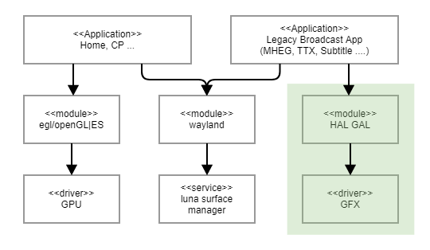

GAL
============

History
-------

======= ========== ============== =======
Version Date       Changed by     Comment
======= ========== ============== =======
1.0.0   2022.04.15 lewis.kim      Add Doc.
======= ========== ============== =======

Overall Description
--------------------

GAL provides several types of surfaces that an APP can render,
and provides blit or strech-blit between surfaces.
And it provides functions for cursors provided by webOS,
such as moving the cursor layer and setting the position of the cursor on the screen.

GAL provided several functions to control fbdev in the early webOS,
but some functions are not required in the current webOS.
For these functions, you can return NOT_CALLABLE or NOT_SUPPORTED .

Terminology and Definitions
^^^^^^^^^^^^^^^^^^^^^^^^^^^^

================================= ======================================
Definition                        Description
================================= ======================================
GFX                               2D Graphic HW
GPU                               3D Graphic HW
fbdev                             The Linux framebuffer
LSM(Luna Surface Manager)         The graphic compositor on the webOS platform
================================= ======================================

System Context
^^^^^^^^^^^^^^

Performance Requirements
^^^^^^^^^^^^^^^^^^^^^^^^^

The response time of each function must respond within
the set time for each function, unless there is a special reason.

Design Constraints
^^^^^^^^^^^^^^^^^^^

GAL must ensure stability for multiple processes.
And a dedicated memory size must be set so that some apps can use it
at any time, and this size may vary depending on the TV specifications.

Functional Requirements
-----------------------

The data types and functions used in this module are as follows.

Data Types
^^^^^^^^^^^^

 * :cpp:type:`HAL_GAL_BLIT_SETTINGS_T`
 * :cpp:type:`HAL_GAL_CURSOR_POSITION_INFO_T`
 * :cpp:type:`HAL_GAL_CURSOR_PROPERTY_INFO_T`
 * :cpp:type:`HAL_GAL_DEVICE_CAPABILITY_INFO_T`
 * :cpp:type:`HAL_GAL_DEVICE_LIMITATION_INFO_T`
 * :cpp:type:`HAL_GAL_DRAW_SETTINGS_T`
 * :cpp:type:`HAL_GAL_FRAMEBUFFER_PROPERTY_EXTENDED_INFO_T`
 * :cpp:type:`HAL_GAL_FRAMEBUFFER_PROPERTY_INFO_T`
 * :cpp:type:`HAL_GAL_FRAMEBUFFER_VISIBILITY_INFO_T`
 * :cpp:type:`HAL_GAL_GRAPHIC_MEM_INFO_T`
 * :cpp:type:`HAL_GAL_IMAGE_INFO_T`
 * :cpp:type:`HAL_GAL_LINE_T`
 * :cpp:type:`HAL_GAL_PALETTE_INFO_T`
 * :cpp:type:`HAL_GAL_POSITION_T`
 * :cpp:type:`HAL_GAL_RECT_T`
 * :cpp:type:`HAL_GAL_RESOLUTION_T`
 * :cpp:type:`HAL_GAL_SOURCE_MASK_T`
 * :cpp:type:`HAL_GAL_SURFACE_INFO_T`
 * :cpp:type:`HAL_GAL_SURFACE_POOL_INFO_T`
 * :cpp:type:`HAL_GAL_T`RAPEZOID_T`

Function Calls
^^^^^^^^^^^^^^^

  * :cpp:func:`HAL_GAL_Init`
  * :cpp:func:`HAL_GAL_Finalize`
  * :cpp:func:`HAL_GAL_GetDeviceCapability`
  * :cpp:func:`HAL_GAL_CreateSurface`
  * :cpp:func:`HAL_GAL_DestroySurface`
  * :cpp:func:`HAL_GAL_Blit`
  * :cpp:func:`HAL_GAL_StretchBlit`
  * :cpp:func:`HAL_GAL_FillRectangle`
  * :cpp:func:`HAL_GAL_DrawRectangle`
  * :cpp:func:`HAL_GAL_DrawLine`
  * :cpp:func:`HAL_GAL_GetSurfacePalette`
  * :cpp:func:`HAL_GAL_SetSurfacePalette`
  * :cpp:func:`HAL_GAL_SetFrameBuffer`
  * :cpp:func:`HAL_GAL_SetFrameBufferWithProperty`
  * :cpp:func:`HAL_GAL_ResetFrameBuffer`
  * :cpp:func:`HAL_GAL_SetFBHWControllerVisibility`
  * :cpp:func:`HAL_GAL_SetFBHWControllerVsync`
  * :cpp:func:`HAL_GAL_SyncGraphic`
  * :cpp:func:`HAL_GAL_DecodeImage`
  * :cpp:func:`HAL_GAL_SetScreenMirrorMode`
  * :cpp:func:`HAL_GAL_SetFBHWControllerPathMode`
  * :cpp:func:`HAL_GAL_Set3DMode`
  * :cpp:func:`HAL_GAL_GetGraphicMemInfo`
  * :cpp:func:`HAL_GAL_SetFrameBufferProperty`
  * :cpp:func:`HAL_GAL_SetFBHWControllerStereoscope`
  * :cpp:func:`HAL_GAL_SetFrameBufferPixelFormat`
  * :cpp:func:`HAL_GAL_GetFrameBufferPixelFormat`
  * :cpp:func:`HAL_GAL_GetFrameBufferList`
  * :cpp:func:`HAL_GAL_GetOSDOutputResolution`
  * :cpp:func:`HAL_GAL_GetFBHWControllerVisibility`
  * :cpp:func:`HAL_GAL_ResetBootLogo`
  * :cpp:func:`HAL_GAL_SetOSDRotationMode`
  * :cpp:func:`HAL_GAL_SetOSDPortraitMode`
  * :cpp:func:`HAL_GAL_SetOSDPortraitARCMode`
  * :cpp:func:`HAL_GAL_SetGraphicOutputResolution`
  * :cpp:func:`HAL_GAL_MoveCursor`
  * :cpp:func:`HAL_GAL_SetCursorPosition`
  * :cpp:func:`HAL_GAL_SetCursorResolution`
  * :cpp:func:`HAL_GAL_GetFBHWControllerSharpness`
  * :cpp:func:`HAL_GAL_SetFBHWControllerSharpness`
  * :cpp:func:`HAL_GAL_CaptureFrameBuffer`

