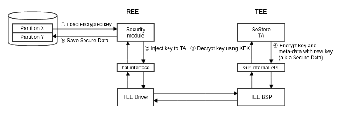
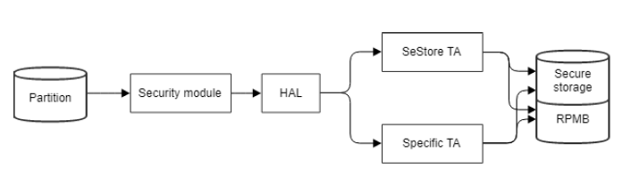
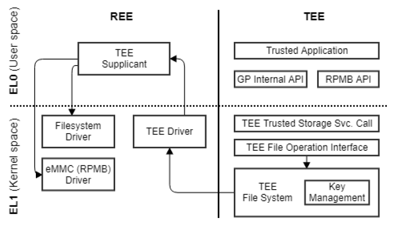
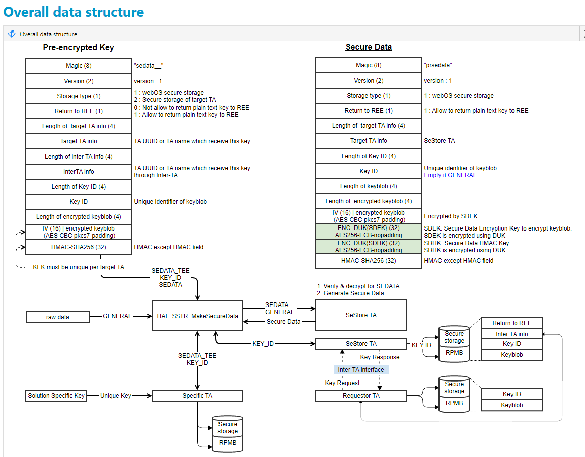
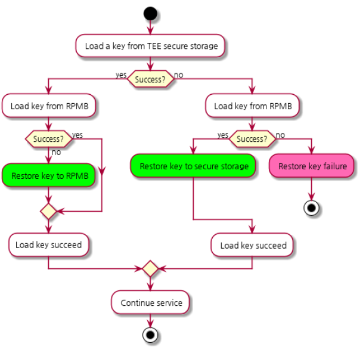
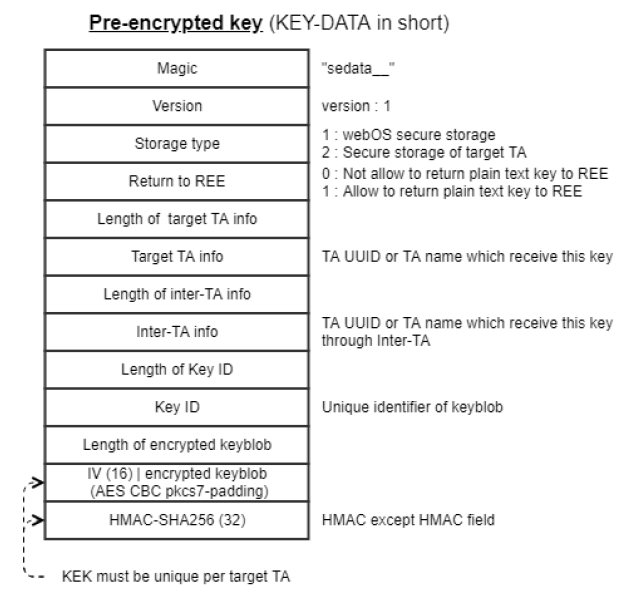
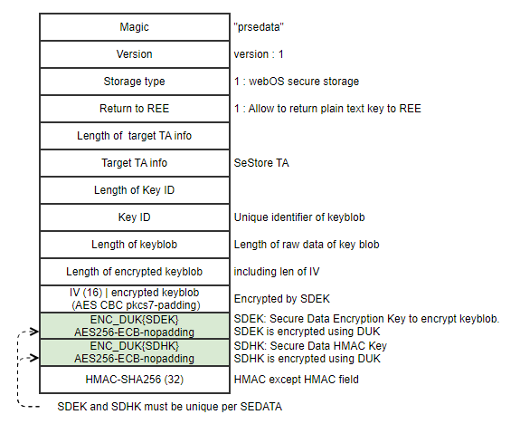

SSTR
==========

History
-------

======= ========== ============== =======
Version Date       Changed by     Comment
======= ========== ============== =======
1.0.0   2022.07.26 hedaesik.kim   Add Doc.
======= ========== ============== =======

Overall Description
--------------------

SSTR provides an API for injecting and using some keys used in TV.

SEDATA containing keys that should be stored on the TV.Download PAK to emmc.
SEDATA.PAK is a set of key data encrypted with an encryption tool provided by vendor.

Encrypted key data included in SEDATA.PAK has the following types.

  * A key that is decrypted with the key of the Secure Store TA, re-encrypted, and stored in the secure storage or RPMB
  * A key that is decrypted with the key of the Secure Store TA, re-encrypted and delivered to the REE, and stored in the emmc from the REE
  * A key that can be decrypted only by a specific DRM TA and is re-encrypted so that only that TA can be used and stored in secure storage or RPMB

if you see this page in HTML, please click below tag.
:download:`webOS TV Secure Storage Requirment <resource/webOSTVSecureStorageRequirement.pdf>`

if you see this page in PDF, please check the webOSTVSecureStorageRequirement.pdf in attachment tab of Adobe Reader
(View > Show/Hide > Navigation Panes > Attachments)

if you see this page in HTML, please click below tag.
:download:`HAL_SSTR implementation guide <resource/hal_sstr_v1.2.zip>`

if you see this page in PDF, please check the hal_sstr_v1.2.zip in attachment tab of Adobe Reader
(View > Show/Hide > Navigation Panes > Attachments)

Terminology and Definitions
^^^^^^^^^^^^^^^^^^^^^^^^^^^^

================================= ======================================
Definition                        Description
================================= ======================================
Device unique key(DUK)            During mass production, device unique keys are injected into specific TA (each device has different key)
SecureData                        Encrypted data from SecureStore TA(TEE)
KEK                               Key encryption key, KEK consist of encryption key and integrity protection key
SDEK                              Secure data encryption key and randomly generated per a SEDATA
SDHK                              Secure data HMAC key and randomly generated per a SEDATA
================================= ======================================

System Context
^^^^^^^^^^^^^^

Performance Requirements
^^^^^^^^^^^^^^^^^^^^^^^^^

There is no clear requirement for response time, but a response must be received within at least 100 ms.

Design Constraints
^^^^^^^^^^^^^^^^^^^

Provisioned keys are critical asset of webOS TV, so SoC vendor must provide key backup and restoration feature

Functional Requirements
-----------------------

Secure storage requirement

================================= ======================================
REQ-ID                            Requirement
================================= ======================================
REQ-SS-001                        MUST support secure storage functionality which complies (or equivalent to) GlobalPlatform TEE standard. MUST support tee-supplicant module which runs in REE to access the file system and RPMB instead of TEE OS.
REQ-SS-002                        MUST support cryptographic isolation for secure storage of each TA and it MUST complies (or equivalent to) OP-TEE implementation. MUST provide a document which describes details (key length, algorithm and key hierarchy) of cryptographic keys. MUST use AES256 CBC/CTR with random IV or AES256 GCM (confidentiality), and HMAC-SHA256 (integrity) at least.
REQ-SS-003                        MUST derive RPMB key from HUK, program it in eMMC securely and never expose it to REE.
REQ-SS-004                        MUST not expose any REE interface which allow to generate HMAC for RPMB packet.
REQ-SS-005                        MUST support confidentiality and integrity of data stored in RPMB. MUST use AES256 CBC/CTR with random IV or AES256 GCM (confidentiality), and HMAC-SHA256 (integrity) at least. MUST support cryptographic isolation for RPMB data of each TA. MUST provide a document which describes details (key length, algorithm and key hierarchy) of cryptographic keys.
REQ-SS-006                        MUST support key backup and restore feature.
REQ-SS-007                        MUST not erase provisioned keys during factory data reset.
================================= ======================================

Key provisioning requirement

================================= ======================================
REQ-ID                            Requirement
================================= ======================================
REQ-KP-001                        Keys stored in specific TA except SeStore TA MUST not be shared (exposed) to REE and MUST not support runtime key distribution through Inter-TA.
REQ-KP-002                        MUST use unique KEK (encryption key and integrity protection key) per TA. MUST use different key for encryption and integrity protection. MUST use AES256 CBC/CTR with random IV or AES256 GCM (confidentiality), and HMAC-SHA256 (integrity) at least. MUST provide a document which describes details (key length, algorithm and key hierarchy) of cryptographic keys.
REQ-KP-003                        MUST not expose KEK used by key data encryption tool in plain text form. MUST provide a document how the KEK is protected in key data encryption tool. MUST provide a document how the KEK is protected in key data encryption tool.
REQ-KP-004                        MUST comply TA design option
REQ-KP-005                        MUST provision device unique key and SEDATA_TEE key to intended TA (not SeStore TA).
REQ-KP-006                        MUST provision a key to specific TA if exist dedicated TA for the key.
REQ-KP-007                        MUST comply with key metadata requirement.
REQ-KP-008                        SHOULD not support runtime key distribution through Inter-TA. MUST support a way to check caller's identity and do access control based on metadata if support runtime key distribution.
REQ-KP-009                        MUST comply with SEDATA key requirement. MUST use AES256 CBC/CTR with random IV or AES256 GCM (confidentiality), and HMAC-SHA256 (integrity) at least.
REQ-KP-010                        MUST generate Secure Data only when metadata requirement it met.
================================= ======================================

Data Types
^^^^^^^^^^^^

Function Calls
^^^^^^^^^^^^^^^

  * :cpp:func:`HAL_SSTR_MakeSecureData`
  * :cpp:func:`HAL_SSTR_GetDataFromSecureData`
  * :cpp:func:`HAL_SSTR_GetHMAC`
  * :cpp:func:`HAL_SSTR_VerifyHMAC`
  * :cpp:func:`HAL_SSTR_GenAESKey` //except from socts, deprecated
  * :cpp:func:`HAL_SSTR_AES_Encrypt` //except from socts, deprecated
  * :cpp:func:`HAL_SSTR_AES_Decrypt` //except from socts, deprecated
  * :cpp:func:`HAL_SSTR_RSA_Encrypt` //except from socts, deprecated
  * :cpp:func:`HAL_SSTR_RSA_Decrypt` //except from socts, deprecated 
  * :cpp:func:`HAL_SSTR_RSA_Sign` //except from socts, deprecated
  * :cpp:func:`HAL_SSTR_RSA_Verify` //except from socts, deprecated
