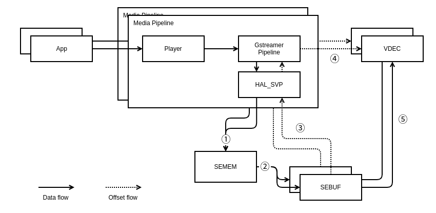

SVP
==========

History
-------

======= ========== ============== =======
Version Date       Changed by     Comment
======= ========== ============== =======
1.0.0   22.05.02   cs.jung
======= ========== ============== =======

Overall Description
--------------------

This document describes how to use and implement the HAL functions, which are available in the webOS TV 23. All the HAL functions in this document are supposed to be implemented by main SoC vendor.

Terminology and Definitions
^^^^^^^^^^^^^^^^^^^^^^^^^^^^

================================= ==============================================================================================
Definition                        Description
================================= ==============================================================================================
DSC                               Dynamic Stream Change
--------------------------------- ----------------------------------------------------------------------------------------------
REE                               Rich Execution Environment
--------------------------------- ----------------------------------------------------------------------------------------------
SEBUF                             Secure Buffer, Permanent space with clear/decrypted video data where is referenced by decoder.
--------------------------------- ----------------------------------------------------------------------------------------------
SEMEM                             Secure Memory, Temporary space with clear/decrypted video data where is referenced by SEBUF.
--------------------------------- ----------------------------------------------------------------------------------------------
TA                                Trsted Application
--------------------------------- ----------------------------------------------------------------------------------------------
TEE                               Trusted Execution Environment
--------------------------------- ----------------------------------------------------------------------------------------------
VDEC                              Video Decoder
================================= ==============================================================================================

System Context
^^^^^^^^^^^^^^

Performance Requirements
^^^^^^^^^^^^^^^^^^^^^^^^^

The minimum requirement is that 1 loop of decryption(or copy), stat, and write of 1 sample (1 Au) be performed within 16ms.

Design Constraints
^^^^^^^^^^^^^^^^^^^

All functions must be multi-thread safe.

Functional Requirements
-----------------------

The data types and functions used in this module are as follows.

Data Types
^^^^^^^^^^^^

  * :cpp:type:`HAL_SVP_RESULT_T`
  * :cpp:type:`SVP_STATUS_T`
  * :cpp:type:`HAL_SVP_OPEN_PARAM_T`
  * :cpp:type:`HAL_SVP_CLOSE_PARAM_T`
  * :cpp:type:`HAL_SVP_STAT_PARAM_T`
  * :cpp:type:`HAL_SVP_SEMEM_PARAM_T`
  * :cpp:type:`HAL_SVP_SEBUF_PARAM_T`
  * :cpp:type:`HAL_SVP_FLUSH_PARAM_T`

Function Calls
^^^^^^^^^^^^^^^

  * :cpp:func:`HAL_SVP_Open`
  * :cpp:func:`HAL_SVP_Close`
  * :cpp:func:`HAL_SVP_Stat`
  * :cpp:func:`HAL_SVP_Copy`
  * :cpp:func:`HAL_SVP_Write`
  * :cpp:func:`HAL_SVP_Flush`
  * :cpp:func:`HAL_SVP_WidevineSelectKey_OverV14`
  * :cpp:func:`HAL_SVP_WidevineDecryptCENC_V16`

