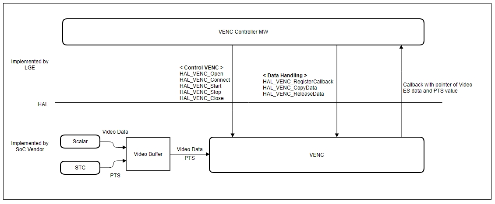
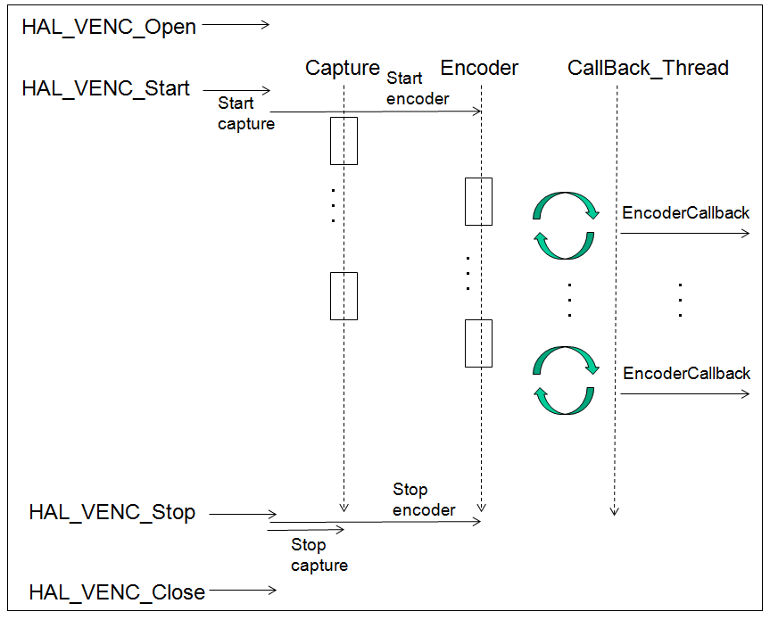

VENC
=============

History
-------

======= ========== ============== =======
Version Date       Changed by     Comment
======= ========== ============== =======
1.0.0   2022.6     hwachin.lee    initial update
======= ========== ============== =======

Overall Description
--------------------

VENC is a module that records video in Analog-Composite format. In webOS, analog-composite format video input is ATV.
LGE Spec supports image display for the following 7 Color-System Standards, and when these signals are decoded by AVD module,
VENC should be able to record all of them.

============= =========== ========
Color-System  Resolution  VFreq
============= =========== ========
NTSC-M        704 x 480   59.94
PAL           704 x 576   50
SECAM         704 x 576   50
NTSC.4.43     704 x 480   59.94
PAL-M         704 x 480   59.94
PAL-Nc        704 x 576   50
PAL-60        704 x 480   59.94
============= =========== ========

Terminology and Definitions
^^^^^^^^^^^^^^^^^^^^^^^^^^^^

================================= ======================================
Definition                        Description
================================= ======================================
We will update the content soon.  We will update the content soon.
================================= ======================================

System Context
^^^^^^^^^^^^^^

The Block-Diagram below shows(Figure 1) the relationship between VENC and its surrounding external modules. In the Video Module located at the front of the VENC,
the Analog-Composite video signal is decoded by the AVD (Analog-Video-Decoder) module and converted into Digital Raw-Video-Data. This Digital
Raw-Video-Data is supplied to the VENC module. The process in which this Digital Raw-Video-Data is supplied to VENC may be VideoPath through AVD and
Video-Scaler, or it can also be an operation that goes through VENC's own dedicated buffer. This is determined by the unique structure of the Soc.
The VENC module performs Video-Capture operation whenever one image frame data is received. When the capture operation of every video frame occurs,
VENC compresses the video data of one frame and then Callback is generated by creating ES (Elementary-Stream), and ES data information must be delivered.
PTS is created based on the time when Video-Capture occurs, and this is also passed as an argument to the callback function. This will be used to synchronize
video and audio when playing back recordings in the future.
LG MW performs the following post-processing of ES-Data on the Kernel-Memory side based on the argument values ​​of this callback function.
1.HAL_VENC_CopyData : Copy ES Data from Driver to MW memory
2.HAL_VENC_ReleaseData : Release memory of ES Data from Driver

Performance Requirements
^^^^^^^^^^^^^^^^^^^^^^^^^

We will update the content soon.

Design Constraints
^^^^^^^^^^^^^^^^^^^

We will update the content soon.

Functional Requirements
-----------------------

Video Capture
^^^^^^^^^^^^^^^
The video capture operation is an operation to capture one frame video data from a scaler (each Soc, it can be called a different name) that includes Raw-Video-Data at one frame rate cycle.
In the current webOS spec, capture data and the resolution / frame rate of the original video must match. During Video Capture, Video-Scaling-Up or Video-Scaling-Down should not occur.
If the original ATV is 720x480 59.9 fps, VENC capture is also captured 59.9 times per second with the same size.
During recording, the setting state or operation (video signal format change, image quality setting, Video-Mute operation) of the Video-Main screen should not affect the video quality being recorded.

Video Encoding
^^^^^^^^^^^^^^^^
The video captured through Video Capture is in the form of uncompressed raw data. You need to encode this with H264 video codec to create ES. In addition, it creates a PTS based on the time of
the Video-Capture moment, and it is used for AV sync when playing back recordings in the future. When the video encoding and PTS generation for one frame is completed, a callback occurs and
the pointer of the generated ES data and various related information must be delivered to the LG MW.
In webOS, the encoding source is ATV, which is an interlaced-type. Interlaced-type video is a video composed of top/bottom fields, and deinterlacing operation is required during playback.
When encoding an interlaced source, it must be encoded in the following two ways.
#. Encoding an interlaced video source as an interlaced-type or
#. After converting the interlaced video source to progressive through the deinterlacer module, then encoding to progressive-type.
It should be noted that the frame rate is also reduced by half when converting to I->P.
(Encoding of interlaced-type signals as progressive-type is not allowed)

Deinterlacing
^^^^^^^^^^^^^^^
The analog composite video signal is an interlaced type. LGE-Spec requires that the original resolution be maintained when playing back the recording. And the level of smoothness of the
video motion is also required to be the same as the original. For this, in the process of capturing and compressing for recording, and controlling the video-path for playback, the Deinterlacing-Scheme
must be carefully decided and the following requirements must be satisfied.
#. There should be no loss of resolution compared to the original when playing the recording in Normal mode.
#. When playing the recorded recording in Normal mode, the video movement should be as smooth as the original.
#. There should be no loss of original contrast or resolution even when playing the recording in trick playback mode (1/2 speed, Pause, 2X speed, 4X speed, 8X speed, 16X speed).
#. Even during Trick Mode playback of the recording, the motion of the video should be sufficiently smooth.
#. When changing between playback modes of recordings (for example, when switching between Pause and 1x speed repeatedly), Motion-Adaptive-Deinterlacing must be appropriately controlled to prevent excessive screen shaking.
#. In the case of the original PAL and DEM-Pattern still images, the Hanover-Bar phenomenon should not occur when playing the recorded material.
#. In all the cases mentioned above, not only the case where the resolution of the original signal is "interlaced", but also the case where the resolution of the original signal is "interlaced in 3:2-Pull-down Film mode" should be considered.

Encoding AV sync
^^^^^^^^^^^^^^^^^
In the case of an ATV input signal, since PTS is not transmitted, PTS must be generated during recording. VENC must generate PTS based on the time when video capture operation for analog-source occurs.
This is because AV sync cannot be guaranteed if the PTS is generated at the start of encoding or at a later operation time.  The generated PTS value is transferred to LG MW as a callback operation.
The PTS generated in this way is used to keep the audio and video included in the analog recording contents in sync with each other when the recording is played back in the future.
This PTS is generated from an independent STC, and AENC and VENC implement sync using the PTS obtained from the same STC.

VENC Callback
^^^^^^^^^^^^^^^
VENC must call the callback function passed through HAL_VENC_RegisterEncodiungCallback whenever picture encoding is completed. To prevent deadlock, VENC should implement the following logic.
#. Do not use same semaphore with ES data(CopyData/ReleaseData) and VENC control (Open/Start/Stop/Close)
#. Normal stop sequence is Stop - Close but in racing condition Close - Stop can happen. So Close should include Stop action.
#. Use timeout for every waiting action (especially wait for Scaler-capture)
#. Add enough check sequence not to make deadlock or crash.

Memory
^^^^^^^^
For the memory of the internal buffer of VENC, a structure that can be dynamically alloc-free should be avoided and a pre-allocated memory structure such as a ring buffer should be used.
Also, dynamic sharing of memory area with other modules is not allowed. Since data needs to be captured and encoded in real time, it is necessary to assign a sufficiently high priority to
memory or CPU access so that Frame-Capture does not fail or noise is encoded.

Sequence Diagram
^^^^^^^^^^^^^^^^^^
Combining the previous explanations, draw a sequence diagram as follows.

Recording start -> Recording progress -> HAL function call sequence according to recording end is as follows.

.. code-block::

    HAL_VENC_Open();
    HAL_VENC_Connect(port, VENC_INPUT_MAIN);

    HAL_VENC_SetParam(port, VENC_INFO_CODEC, VENC_CODEC_H264);
    HAL_VENC_SetParam(port, VENC_INFO_FRAMERATE, VENC_FRAMERATE_AUTO);
    HAL_VENC_SetParam(port, VENC_INFO_PROFILE, VENC_PROFILE_MAIN);
    HAL_VENC_SetParam(port, VENC_INFO_PROFILELEVEL, VENC_PROFILELEVEL_40);
    HAL_VENC_SetParam(port, VENC_INFO_BITRATE, 3562);
    HAL_VENC_SetParam(port, VENC_INFO_RATECONTROL, VENC_RATECONTROL_VBR);

    HAL_VENC_RegisterEncoderCallback(port, _VENC_DataHandlingCB)

    HAL_VENC_Start(port);

    _VENC_DataHandlingCB() // Callback can be triggered every picture encodings
    {
        HAL_VENC_CopyData(0, testBuffer, pMsg->pData, pMsg->dataLen, pMsg->pRStart, pMsg->pREnd);
        HAL_VENC_ReleaseData(0, pMsg->pData, pMsg->dataLen);
    }

    HAL_VENC_Stop(port);
    HAL_VENC_Close();

Data Types
^^^^^^^^^^^^
VENC_MSG_TYPE_T
****************
This structure contains message data transmitted as a parameter of VENC callback.

.. code-block::

    typedef struct VENC_MSG_TYPE {
        UINT32   channel;
        UINT8    pictype;
        UINT64   pts;
        UINT8    *pData;
        UINT32   dataLen;
        UINT8    *pRStart;
        UINT8    *pREnd;
    } VENC_MSG_TYPE_T;

================= ============================================================================================
Member            Description
================= ============================================================================================
channel           Encoded picture type(IDR:1 I:2 P:4 B:8). if I frame with IDR, 1 | 2 = 3.
pts               | PTS value of encoded picture.
                  | Based on the time when the Video-Capture is performed, the pts is decided.
                  | This pts value will be deilvered to LGE-SW-Layer.
                  | The LGE-SW-Layer will create PES based on ES from driver.
                  | The LGE-SW-Layer will create PES-Header.
                  | The LGE-SW-Layer will insert the decided pts into the pts-parameter in the PES-Header.
pData             The pointer of encoded video ES data
dataLen           The length of encoded video ES data
pRStart           The start pointer of Ring buffer of ES data
pREnd             The end pointer of Ring buffer of ES data
================= ============================================================================================

VENC_INPUT_TYPE_T
*******************
This enumeration contains the VENC input source index.

.. code-block::

    typedef enum  {
        VENC_INPUT_MAIN = 0,
        VENC_INPUT_SUB,
        VENC_INPUT_EXT,
        VENC_INPUT_NUM
    } VENC_INPUT_TYPE_T;

================= ===================================================
Member            Description
================= ===================================================
VENC_INPUT_MAIN   Main video source. Normally means main scaler.
VENC_INPUT_SUB    Sub video source. Normally means sub-scaler.
VENC_INPUT_EXT    Extra video source.
VENC_INPUT_NUM    Number of VENC input
================= ===================================================

VENC_CODEC_T
**************
Encoding codec. (see VENC_INFO_CODEC)

.. code-block::

    typedef  enum {
        VENC_CODEC_H264 = 0,
        VENC_CODEC_VP8
    } VENC_CODEC_T;

================= ======================
Member            Description
================= ======================
VENC_CODEC_H264   Encode H.264 codec
VENC_CODEC_VP8    Encode VP8 codec
================= ======================

VENC_FRAMERATE_T
*****************
This enumeration contains the VENC encoding target framerate type. (See VENC_INFO_FRAMERATE)

.. code-block::

    typedef enum {
        VENC_FRAMERATE_AUTO = 0,
        VENC_FRAMERATE_ASIS,
        VENC_FRAMERATE_60P,
        VENC_FRAMERATE_60I,
        VENC_FRAMERATE_30P,
        VENC_FRAMERATE_30I,
        VENC_FRAMERATE_25P,
        VENC_FRAMERATE_25I,
        VENC_FRAMERATE_24P,
        VENC_FRAMERATE_24I,
        VENC_FRAMERATE_INVALID
    } VENC_FRAMERATE_T;

=========================== ===============================================
Member                      Description
=========================== ===============================================
VENC_FRAMERATE_AUTO         Set target framerate automatically.
                            | 60p -> 30p
                            | 60i -> 30p
                            | 50p -> 25p
                            | 50i -> 25p
                            | 30p -> 30p
                            | 30i -> 30p
                            | 24p -> 24p
                            | 24i -> 24p
VENC_FRAMERATE_ASIS         Set target framerate same with video source
VENC_FRAMERATE_60P          Framerate 60 progressive
VENC_FRAMERATE_60I          Framerate 60 interlaced
VENC_FRAMERATE_30P          Framerate 30 progressive
VENC_FRAMERATE_30I          Framerate 30 interlaced
VENC_FRAMERATE_25P          Framerate 25 progressive
VENC_FRAMERATE_25I          Framerate 25 interlaced
VENC_FRAMERATE_24P          Framerate 24 progressive
VENC_FRAMERATE_24I          Framerate 24 interlaced
VENC_FRAMERATE_INVALID      Framerate is Invalid
=========================== ===============================================

VENC_PROFILE_T
*****************
This enumeration contains profile type of encoded video ES. (See VENC_INFO_PROFILE).
Currently Main profile option is used for Analog recording

.. code-block::

    typedef enum {
        VENC_PROFILE_BASE = 0,
        VENC_PROFILE_MAIN,
        VENC_PROFILE_EXT,
        VENC_PROFILE_HIGH
    } VENC_PROFILE_T;

VENC_PROFILELEVEL_T
*********************
This enumeration contains profile level of encoded video ES. (See VENC_INFO_PROFILELEVEL)
Currently 3.1 option is used for Analog recording

.. code-block::

    typedef enum {
        VENC_PROFILELEVEL_30 = 0,
        VENC_PROFILELEVEL_31,
        VENC_PROFILELEVEL_40,
        VENC_PROFILELEVEL_41
    } VENC_PROFILELEVEL_T;

========================= ======================
Member                    Description
========================= ======================
VENC_PROFILELEVEL_30      Profile level 3.0
VENC_PROFILELEVEL_31      Profile level 3.1
VENC_PROFILELEVEL_40      Profile level 4.0
VENC_PROFILELEVEL_41      Profile level 4.1
========================= ======================

VENC_SOURCE_T
*********************
This enumeration contains the type of input source of VENC. Currently only VENC_SOURCE_ATV is used

.. code-block::

    typedef enum {
        VENC_SOURCE_ATV = 0,
        VENC_SOURCE_AV,
        VENC_SOURCE_SCARTIN,
        VENC_SOURCE_NUM
    } VENC_SOURCE_T;

========================= =========================
Member                    Description
========================= =========================
VENC_SOURCE_ATV           VENC source is ATV
VENC_SOURCE_AV            VENC source is AV
VENC_SOURCE_SCARTIN       VENC source is scart-in
========================= =========================

VENC_RATECONTROL_T
*********************
This enumeration contains bitrate control information.

.. code-block::

    typedef enum {
        VENC_BITRATECONTROL_VBR = 0,
        VENC_BITRATECONTROL_CBR
    } VENC_SOURCE_T;

============================ ==============================================================================
Member                       Description
============================ ==============================================================================
VENC_BITRATECONTROL_VBR      Bitrate of encoded video data is changed to optimal quality while encoding.
VENC_BITRATECONTROL_CBR      Bitrate of encoded video data is not changed until finish encoding.
============================ ==============================================================================

VENC_INFO_T
**************
This enum information means the information type used by the HAL_VENC_SetParam() function for VENC control and the HAL_VENC_GetParam() function for obtaining VENC status.

.. code-block::

    typedef enum {
        VENC_INFO_FRAMERATE     = 0,
        VENC_INFO_WIDTH,
        VENC_INFO_HEIGHT,
        VENC_INFO_ASPECTRATIOIDC,
        VENC_INFO_SARWIDTH,
        VENC_INFO_SARHEIGHT,
        VENC_INFO_INPUT,
        VENC_INFO_BITRATE,
        VENC_INFO_PROFILE,
        VENC_INFO_PROFILELEVEL,
        VENC_INFO_CODEC,
        VENC_INFO_RATECONTROL,
        VENC_INFO_GOPLENGTH,
        VENC_INFO_QP,
        VENC_INFO_SOURCE,
        VENC_INFO_NUM
    } VENC_INFO_T;

Function Calls
^^^^^^^^^^^^^^^

  * :cpp:func:`HAL_VENC_Open`
  * :cpp:func:`HAL_VENC_Close`
  * :cpp:func:`HAL_VENC_OpenEx`
  * :cpp:func:`HAL_VENC_CloseEx`
  * :cpp:func:`HAL_VENC_Connect`
  * :cpp:func:`HAL_VENC_Start`
  * :cpp:func:`HAL_VENC_Stop`
  * :cpp:func:`HAL_VENC_SetParam`
  * :cpp:func:`HAL_VENC_GetParam`
  * :cpp:func:`HAL_VENC_RegisterEncoderCallback`
  * :cpp:func:`HAL_VENC_CopyData`
  * :cpp:func:`HAL_VENC_ReleaseData`
  * :cpp:func:`HAL_VENC_ResetGOP`
