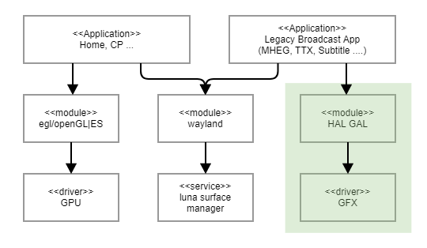

GAL
###

.. _youngman.jung: youngman.jung@lge.com
.. _jinseong1.yang: jinseong1.yang@lge.com
.. _seongcheoll.kim: seongcheoll.kim@lge.com
.. _lewis.kim: lewis.kim@lge.com

Introduction
************

| This document describes the GAL (Graphic Absraction Layer) in the kernel space. The document gives an overview of the GAL and provides details about its functionalities and implementation requirements.

| The GAL is graphic API based on the HAL (Hardware Abstraction Layer). Therefore, the document assumes that the readers are familiar with the HAL API and abstraction layer principles.

| Therefore, it is necessary to understand graphic techniques, including knowledge of render, graphic device, etc.

Revision History
================

+--------------+------------+----------------------+---------------------------------------------------------------------------------------+
| Version      | Date       | Changed by           | Description                                                                           |
+==============+============+======================+=======================================================================================+
|1.1.0         | 2023-11-18 | `youngman.jung`_     | Applied new document template.                                                        |
|              |            |                      |                                                                                       |
|              |            | `jinseong1.yang`_    | Added descriptions for the major function requirements of the driver.                 |
+--------------+------------+----------------------+---------------------------------------------------------------------------------------+
|1.0.0         | 2022-04-15 | `lewis.kim`_         | Add Doc.                                                                              |
+--------------+------------+----------------------+---------------------------------------------------------------------------------------+

Terminology
===========
| The key words "must", "must not", "required", "shall", "shall not", "should", "should not", "recommended", "may", and "optional" in this document are to be interpreted as described in RFC2119. 

| The following table lists the terms used throughout this document: 

=============================== ===============================
Term                            Description
=============================== =============================== 
GFX                             2D Graphic HW
GPU                             3D Graphic HW
fbdev                           The Linux framebuffer
LSM(Luna Surface Manager)       The graphic compositor on the webOS platform
=============================== =============================== 

Technical Assistance
====================

| For assistance or clarification on information in this guide, please create an issue in the LGE JIRA project and contact the following person:

=============== ============ 
Module          Owner         
=============== ============ 
GAL             `youngman.jung`_ 
=============== ============ 

Overview
********

General Description
===================

| GAL provides several types of surfaces that an APP can render, and provides blit or strech-blit between surfaces. And it provides functions for cursors provided by webOS, such as moving the cursor layer and setting the position of the cursor on the screen.

| GAL provided several functions to control fbdev in the early webOS, but some functions are not required in the current webOS. For these functions, you can return NOT_CALLABLE or NOT_SUPPORTED .

Architecture
============

This section describes the architecture for GAL.

Requirements
************

Functional Requirements
=======================

| The data types and functions used in this module in webOS must be supported.

Quality and Constraints
=======================

Performance Requirements
-----------------------

| The response time of each function must respond within the set time for each function, unless there is a special reason.

================================= ======================================
Function name                     Response time (ms)
================================= ======================================
Initialize hal-gal                100
Finalize hal-gal                  100
Create and destroy surface        50
Setting property                  20
Setting framebuffer property      50
Setting mode                      20
Setting visibility                20
Decoding image                    500
Cursor                            50
Capture                           100
Others                            10
================================= ======================================

Design Constraints
-----------------------

| GAL must ensure stability for multiple processes. And a dedicated memory size must be set so that some apps can use it at any time, and this size may vary depending on the TV specifications.

Implementation
**************

This section provides materials that are useful for GAL implementation. 

- The File Location section provides the location of the Git repository where you can get the header file in which the interface for the GAL implementation is defined.
- The API List section provides a brief summary of GAL APIs that you must implement.
- The Implementation Details section sets implementation guidance and example code for some major functionalities.
- The Status Log section provides information about the GAL status log file which is used for examining the status and operation of GAL.

File Location
=============

The GAL interfaces are defined in the hal_gal.h header file, which can be obtained from https://swfarmhub.lge.com/.

- Git repository: bsp/ref/hal-libs-header
- Location: [as_installed]/hal_inc/hal_gal.h

API List
========

The GAL implementation must adhere to the interface specifications defined and implements its functions. Refer to the API Reference for more details.

Data Types
^^^^^^^^^^

The following table lists the LG GAL struct types.

============================================================== ===================================================================================================
Structure                                                      Description
============================================================== ===================================================================================================
:cpp:type:`HAL_GAL_BLIT_SETTINGS_T`                            This structure describes settings for blit operation.
:cpp:type:`HAL_GAL_CURSOR_POSITION_INFO_T`                     This structure describes cursor position information.
:cpp:type:`HAL_GAL_CURSOR_PROPERTY_INFO_T`                     This structure describes cursor property information.
:cpp:type:`HAL_GAL_DEVICE_CAPABILITY_INFO_T`                   This structure describes the 2D graphic capability of device.
:cpp:type:`HAL_GAL_DEVICE_LIMITATION_INFO_T`                   Information of gfx device limitations.
:cpp:type:`HAL_GAL_DRAW_SETTINGS_T`                            This structure describes settings for draw operation.
:cpp:type:`HAL_GAL_FRAMEBUFFER_PROPERTY_EXTENDED_INFO_T`       This structure describes framebuffer property extended information.
:cpp:type:`HAL_GAL_FRAMEBUFFER_PROPERTY_INFO_T`                This enumeration describes framebuffer property information.
:cpp:type:`HAL_GAL_FRAMEBUFFER_VISIBILITY_INFO_T`              This structure describes for control to visibility of framebuffer
:cpp:type:`HAL_GAL_GRAPHIC_MEM_INFO_T`                         This structure describes 2D graphic memory information
:cpp:type:`HAL_GAL_IMAGE_INFO_T`                               This structure describes information about image.
:cpp:type:`HAL_GAL_LINE_T`                                     This structure describes a line specified by two points.
:cpp:type:`HAL_GAL_PALETTE_INFO_T`                             This structure describes the palette information of the surface.
:cpp:type:`HAL_GAL_POSITION_T`                                 This structure describes position information.
:cpp:type:`HAL_GAL_RECT_T`                                     This structure describes a rectangle specified by a point and a dimension.
:cpp:type:`HAL_GAL_RESOLUTION_T`                               This structure is for a resolution info such as width and height.
:cpp:type:`HAL_GAL_SOURCE_MASK_T`                              This structure describes source mask.
:cpp:type:`HAL_GAL_SURFACE_INFO_T`                             This structure describes a surface specified by graphic memory offset, pitch and bpp.
:cpp:type:`HAL_GAL_SURFACE_POOL_INFO_T`                        This structure describes surface pool.
:cpp:type:`HAL_GAL_TRAPEZOID_T`                                This structure describes the trapezoid rendering.
============================================================== ===================================================================================================

Functions
^^^^^^^^^

The following table lists the LG GAL functions.

====================================================== ===================================================================================================
Funtion                                                Description
====================================================== ===================================================================================================
:cpp:func:`HAL_GAL_Init`                               Initializes GAL module
:cpp:func:`HAL_GAL_Finalize`                           Finalize GAL module
:cpp:func:`HAL_GAL_GetDeviceCapability`                Get the capabilities of GFX driver
:cpp:func:`HAL_GAL_CreateSurface`                      Create a surface
:cpp:func:`HAL_GAL_DestroySurface`                     Destroy the surface
:cpp:func:`HAL_GAL_Blit`                               Blit an area from one surface to other surface based on blit flags.
:cpp:func:`HAL_GAL_StretchBlit`                        Stretch blit an area from one surface to other surface based on blit flags.
:cpp:func:`HAL_GAL_FillRectangle`                      Fill a rectangle to a destination surface based on drawing flags.
:cpp:func:`HAL_GAL_DrawRectangle`                      Draw a rectangle to a destination surface based on drawing flags.
:cpp:func:`HAL_GAL_DrawLine`                           Draws a line to a destination surface based on drawing flags.
:cpp:func:`HAL_GAL_GetSurfacePalette`                  Get surface palette for 8bpp surface
:cpp:func:`HAL_GAL_SetSurfacePalette`                  Set surface palette for 8bpp surface
:cpp:func:`HAL_GAL_SetFrameBuffer`                     Set surface as framebuffer
:cpp:func:`HAL_GAL_SetFrameBufferWithProperty`         Sets region(viewRect/dispRect) and Stereoscope(on/off, stereoscope type) about framebuffer.
:cpp:func:`HAL_GAL_ResetFrameBuffer`                   Reset associated resource of FrameBuffer
:cpp:func:`HAL_GAL_SetFBHWControllerVisibility`        Control to visility of specified pChangedFbList according to number of changedFbNum
:cpp:func:`HAL_GAL_SetFBHWControllerVsync`             Decide whether to use vsync operation of specified FBHWController or not.
:cpp:func:`HAL_GAL_SyncGraphic`                        Waits for the all the H/W accelerated graphics operations to be done.
:cpp:func:`HAL_GAL_DecodeImage`                        Draw an image from encoded image to destination surface based on imageFromBuffer flags.
:cpp:func:`HAL_GAL_SetScreenMirrorMode`                Flip screen (all OSDs) vertically and/or horizontally.
:cpp:func:`HAL_GAL_SetFBHWControllerPathMode`          Select output path mode of framebuffer HW controller between main chip and external FRC chip.
:cpp:func:`HAL_GAL_Set3DMode`                          Sets 3D mode(3D on/off) and 3D type(top&bottom, SideBySide ...) of FrameBuffer.
:cpp:func:`HAL_GAL_GetGraphicMemInfo`                  Get the information of GAL memory
:cpp:func:`HAL_GAL_SetFrameBufferProperty`             Sets property about framebuffer.
:cpp:func:`HAL_GAL_SetFBHWControllerStereoscope`       Sets region(viewRect/dispRect) about framebuffer.
:cpp:func:`HAL_GAL_SetFrameBufferPixelFormat`          Change pixelFormat of framebuffer
:cpp:func:`HAL_GAL_GetFrameBufferPixelFormat`          Get pixelFormat of framebuffer
:cpp:func:`HAL_GAL_GetFrameBufferList`                 Get currently enabled framebuffer list
:cpp:func:`HAL_GAL_GetOSDOutputResolution`             Get graphic output resolution of main OSD
:cpp:func:`HAL_GAL_GetFBHWControllerVisibility`        Get visibility for frame buffer of H/W controllers
:cpp:func:`HAL_GAL_ResetBootLogo`                      Reset boot logo
:cpp:func:`HAL_GAL_SetOSDRotationMode`                 Set OSD rotation mode
:cpp:func:`HAL_GAL_SetOSDPortraitMode`                 Set OSD portrait mode
:cpp:func:`HAL_GAL_SetOSDPortraitARCMode`              Set OSD portrait ARC mode
:cpp:func:`HAL_GAL_SetGraphicOutputResolution`         Set graphic output resolution of main OSD
:cpp:func:`HAL_GAL_MoveCursor`                         Move position of cursor.
:cpp:func:`HAL_GAL_SetCursorPosition`                  Set position of cursor.
:cpp:func:`HAL_GAL_SetCursorResolution`                Set resolution of cursor.
:cpp:func:`HAL_GAL_GetFBHWControllerSharpness`         Get sharpness (0~255) of specific framebuffer hw controller
:cpp:func:`HAL_GAL_SetFBHWControllerSharpness`         Set sharpness (0~255) of specific framebuffer hw controller
:cpp:func:`HAL_GAL_CaptureFrameBuffer`                 Get a framebuffer from the fbdev to a surface
====================================================== ===================================================================================================

Implementation Details
======================

This section contains implementation details and example code for some functionality described in the Requirements section.

    .. function:: struct HAL_GAL_BLIT_SETTINGS_T

    This structure describes settings for blit operation.

    ======================================================================== =======================================
    Public Members                                                           Description
    ======================================================================== =======================================
    HAL_GAL_BLEND_FUNCTION_T srcBlend                                        source blend function
    HAL_GAL_BLEND_FUNCTION_T dstBlend                                        destination blend function
    UINT32 alpha                                                             global alpha value
    UINT32 color                                                             global color value
    UINT32 srcColorkey                                                       source colorkey
    UINT32 dstColorkey                                                       destination colorkey
    HAL_GAL_SOURCE_MASK_T srcMask                                            source mask information
    ======================================================================== =======================================

    .. function:: struct HAL_GAL_CURSOR_POSITION_INFO_T

    ======================================================================== =======================================
    Public Members                                                           Description
    ======================================================================== =======================================
    HAL_GAL_POSITION_T position                                              cursor position
    unsigned short width                                                     image width
    unsigned short height                                                    image height
    HAL_GAL_CURSOR_HOTSPOT_TYPES_T hotspot                                   hotspot type
    HAL_GAL_POSITION_T cursorGapPosition                                     hotspot type
    ======================================================================== =======================================

    .. function:: struct HAL_GAL_CURSOR_PROPERTY_INFO_T

    This structure describes cursor property information.

    ======================================================================== =======================================
    Public Members                                                           Description
    ======================================================================== =======================================
    HAL_GAL_POSITION_T position                                              Position
    UINT32 panelWidth                                                        Panel width
    UINT32 panelHeight                                                       Panel height
    UINT32 width                                                             Width
    UINT32 height                                                            Height
    UINT32 dstColorkey                                                       Destination color key
    HAL_GAL_CURSOR_HOTSPOT_TYPES_T hotspot                                   Hotspot type
    HAL_GAL_POSITION_T cursorGapPosition                                     Cursor gap position
    ======================================================================== =======================================

    .. function:: struct HAL_GAL_DEVICE_CAPABILITY_INFO_T

    This structure describes the 2D graphic capability of device.

    ======================================================================== =======================================
    Public Members                                                           Description
    ======================================================================== =======================================
    UINT8 bAllocatorSupported                                                whether the allocator is supported, or not (if supported, then this value is TRUE otherwise FALSE.)
    HAL_GAL_BLIT_FLAGS_T blitFlags                                           supported blit flags
    HAL_GAL_DRAW_FLAGS_T drawFlags                                           supported draw flags
    HAL_GAL_SUPPORTED_FUNC_MASK_T supportedFunctions                         supported functions
    UINT8 maxNumOfLayers                                                     the maximum number of supported layers
    UINT8 maxNumOfFBHWControllers                                            the maximum number of supported FB HW Controller
    UINT32 physicalAddrOfBase                                                physical address of graphic memory start (or base of offset)
    UINT32 gfxMemorySize                                                     The total size of gfx memory
    UINT32 virtualAddrOfBase                                                 virtual address of graphic memory start (or base of offset). This value will be filled at upper level(by LG). Chip vendor need to fill physicalAddrOfBase and offset value of surface.
    HAL_GAL_SUPPORTED_IMAGE_FORMAT_FLAGS_T supportedImageFormat              Image format that can be decoded by HW decoder
    HAL_GAL_DEVICE_LIMITATION_INFO_T deviceLimitationInfo                    Information of gfx device limitations
    UINT8 bFBCSupported                                                      whether the FBC (Frame Buffer Compression) is supported, or not (if supported, then this value is TRUE otherwise FALSE.)
    ======================================================================== =======================================

    .. function:: struct HAL_GAL_DEVICE_LIMITATION_INFO_T

    Information of gfx device limitations.

    ======================================================================== =======================================
    Public Members                                                           Description
    ======================================================================== =======================================
    UINT32 hwDecodeMinLimitWidth                                             Minimum limitation of supported width for HW decoding (Zero means no limitation)
    UINT32 hwDecodeMinLimitHeight                                            Minimum limitation of supported height for HW decoding (Zero means no limitation)
    UINT16 hwDecodeMaxLimitWidth                                             Maximum limitation of supported width for HW decoding (Zero means no limitation)
    UINT16 hwDecodeMaxLimitHeight                                            Maximum limitation of supported height for HW decoding (Zero means no limitation)
    UINT32 hwDecodeMaxLimitArea                                              Maximum limitation of supported area (width*height) for HW decoding (Zero means no limitation). This value may mean the size of allocated surface.
    UINT32 maxScaleUpFactor                                                  maximum factor on scaling up (stretchblit).
    UINT32 minScaleDownFactor                                                minimum factor on scaling down (stretchblit)
    UINT32 swBlitArea                                                        if width*height < swBlitArea then, SW blit operation may be faster.
    UINT16 hwBlitLimitWidth                                                  Limitation of supported width for HW blit (Zero means no limitation)
    UINT16 hwBlitLimitHeight                                                 Limitation of supported height for HW blit (Zero means no limitation)
    UINT16 hwBlitLimitArea                                                   Limitation of supported area (width*height) for HW blit (Zero means no limitation)
    ======================================================================== =======================================

    .. function:: struct HAL_GAL_DRAW_SETTINGS_T

    This structure describes settings for draw operation.

    ======================================================================== =======================================
    Public Members                                                           Description
    ======================================================================== =======================================
    HAL_GAL_BLEND_FUNCTION_T srcBlend                                        source blend function
    HAL_GAL_BLEND_FUNCTION_T dstBlend                                        destination blend function
    UINT32 dstColorkey                                                       destination colorkey
    ======================================================================== =======================================

    .. function:: struct HAL_GAL_FRAMEBUFFER_PROPERTY_EXTENDED_INFO_T

    ======================================================================== =======================================
    Public Members                                                           Description
    ======================================================================== =======================================
    HAL_GAL_RECT_T viewRect                                                  viewRect region on the framebuffer
    HAL_GAL_RECT_T dispRect                                                  dispRect region on the framebuffer
    unsigned char bStereoscope                                               Stereo scope
    HAL_GAL_STEREOSCOPE_TYPE_T stereoscopeType                               This enumeration describes flags for stereoscope mode setting
    ======================================================================== =======================================

    .. function:: struct HAL_GAL_FRAMEBUFFER_PROPERTY_INFO_T

    This enumeration describes framebuffer property information.

    ======================================================================== =======================================
    Public Members                                                           Description
    ======================================================================== =======================================
    HAL_GAL_RECT_T viewRect                                                  viewRect region on the framebuffer
    HAL_GAL_RECT_T dispRect                                                  dispRect region on the framebuffer
    ======================================================================== =======================================

    .. function:: struct HAL_GAL_FRAMEBUFFER_VISIBILITY_INFO_T

    This structure describes for control to visibility of framebuffer

    ======================================================================== =======================================
    Public Members                                                           Description
    ======================================================================== =======================================
    UINT32 fbHWControllerIndex                                               Framebuffe Hardware Controller index
    BOOLEAN bVisibility                                                      Visibility
    ======================================================================== =======================================

    .. function:: struct HAL_GAL_GRAPHIC_MEM_INFO_T

    This structure describes 2D graphic memory information

    ======================================================================== =======================================
    Public Members                                                           Description
    ======================================================================== =======================================
    UINT32 gfxMemTotalSize                                                   GFX memory total size
    UINT32 allocatedMemTotalSize                                             Allocated moemory total size
    UINT32 freeMemTotalSize                                                  Free memory total size
    UINT32 largestFreeMemSize                                                Largest free memory size
    ======================================================================== =======================================

    .. function:: struct HAL_GAL_IMAGE_INFO_T

    This structure describes information about image.

    ======================================================================== =======================================
    Public Members                                                           Description
    ======================================================================== =======================================
    HAL_GAL_IMAGE_FORMAT_T imageFormat                                       Image format
    HAL_GAL_RECT_T rect                                                      Rect value
    UINT32 imageLength                                                       Image length
    HAL_GAL_PIXEL_FORMAT_T pixelFormat                                       Pixel format
    UINT8 bImageFromBuffer                                                   Image from buffer
    CHAR *imagePath                                                          Image path
    UINT32 *imagePtr                                                         Image pointer
    ======================================================================== =======================================

    .. function:: struct HAL_GAL_LINE_T

    This structure describes a line specified by two points.

    ======================================================================== =======================================
    Public Members                                                           Description
    ======================================================================== =======================================
    UINT16 x1                                                                x cordinate of its top-letf point1
    UINT16 y1                                                                y cordinate of its top-left point1
    UINT16 x2                                                                x cordinate of its top-letf point2
    UINT16 y2                                                                y cordinate of its top-left point2
    ======================================================================== =======================================

    .. function:: struct HAL_GAL_PALETTE_INFO_T

    This structure describes the palette information of the surface.

    ======================================================================== =======================================
    Public Members                                                           Description
    ======================================================================== =======================================
    UINT16 palette[256]                                                      palette array
    UINT16 length                                                            size of palette (max: 256)
    ======================================================================== =======================================

    .. function:: struct HAL_GAL_POSITION_T

    This structure describes position information.

    ======================================================================== =======================================
    Public Members                                                           Description
    ======================================================================== =======================================
    SINT16 x                                                                 x
    SINT16 y                                                                 y
    ======================================================================== =======================================

    .. function:: struct HAL_GAL_RECT_T

    This structure describes a rectangle specified by a point and a dimension.

    ======================================================================== =======================================
    Public Members                                                           Description
    ======================================================================== =======================================
    UINT16 x                                                                 x cordinate of its top-letf point
    UINT16 y                                                                 y cordinate of its top-left point
    UINT16 w                                                                 width of it
    UINT16 h                                                                 height of it
    ======================================================================== =======================================

    .. function:: struct HAL_GAL_RESOLUTION_T

    This structure is for a resolution info such as width and height.

    ======================================================================== =======================================
    Public Members                                                           Description
    ======================================================================== =======================================
    unsigned short width                                                     Width
    unsigned short height                                                    Height
    ======================================================================== =======================================

    .. function:: struct HAL_GAL_SOURCE_MASK_T

    This structure describes source mask.

    ======================================================================== =======================================
    Public Members                                                           Description
    ======================================================================== =======================================
    UINT32 offset                                                            bytes offset from the start of graphic memory
    UINT16 x                                                                 x
    UINT16 y                                                                 y
    HAL_GAL_SURFACE_MASK_FLAGS_T flags                                       STENCIL or not
    ======================================================================== =======================================

    .. function:: struct HAL_GAL_SURFACE_INFO_T

    This structure describes a surface specified by graphic memory offset, pitch and bpp.

    ======================================================================== =======================================
    Public Members                                                           Description
    ======================================================================== =======================================
    UINT32 offset                                                            bytes offset from the start of graphic memory
    UINT32 physicalAddress                                                   physical address of surface
    UINT16 pitch                                                             pitch: length of horizontal line
    UINT16 bpp                                                               bits per pixel
    UINT16 width                                                             width of surface
    UINT16 height                                                            height of surface
    HAL_GAL_PIXEL_FORMAT_T pixelFormat                                       pixel format of surface
    HAL_GAL_PALETTE_INFO_T paletteInfo                                       palette information, this field is used when the surface's pixel format is based on indexed color.
    __UINT32 property                                                        reserved for future use
    __UINT32 length                                                          allocated size of the surface
    UINT32 vendorData                                                        reserved for chip vendor
    ======================================================================== =======================================

    .. function:: struct HAL_GAL_SURFACE_POOL_INFO_T

    This structure describes surface pool.

    ======================================================================== =======================================
    Public Members                                                           Description
    ======================================================================== =======================================
    UINT32 physicalAddr                                                      physical address of surface pool base
    UINT32 virtualAddr                                                       virtual address of surface pool base
    UINT32 startOffset                                                       the end of allocated layers (surface pool start with zero offset.)
    UINT32 size                                                              size of surface pool (in bytes). It is not from startOffset but zero offset which means base point of surface pool.
    UINT32 byteOffsetAlign                                                   bytes alignment constraint for the offset value of each surface allocation
    UINT32 bytePitchAlign                                                    bytes alignment constraint for the surface's pitch value
    ======================================================================== =======================================

    .. function:: struct HAL_GAL_TRAPEZOID_T

    This structure describes the trapezoid rendering.

    ======================================================================== =======================================
    Public Members                                                           Description
    ======================================================================== =======================================
    HAL_GAL_RECT_T srcRect                                                   source rectangular which represents source image
    UINT8 alphaConst                                                         constant alpha blending (range: 0~255)
    UINT8 bAntiAliasing                                                      antialising option for trapezoid edge smoothing (0:off, 1:on)
    UINT8 trapDir                                                            Trapezoid direction mode (0: vertical trapezoid rendering mode, 1: horizontal rendering mode)
    UINT8 srcRectRotateDir                                                   Source rectangular clockwise rotation (0: 0 degree, 1: 90, 2: 180 degree, 3: 270 degree)
    UINT8 dstTrapRotateDir                                                   Destination trapezoid clockwise rotation (0: 0 degree, 1: 90 degree, 2: 180 degree, 3: 270 degree)
    UINT16 dstTrapEdge0Pos                                                   y-coor for vertical trapezoid, x-coor for horizontal trapezoid
    UINT16 dstTrapEdge0St                                                    x-coor for vertical trapezoid, y-coor for horizontal trapezoid
    UINT16 dstTrapEdge0End                                                   x-coor for vertical trapezoid, y-coor for horizontal trapezoid
    UINT16 dstTrapEdge1St                                                    x-coor for vertical trapezoid, y-coor for horizontal trapezoid
    UINT16 dstTrapEdge1End                                                   x-coor for vertical trapezoid, y-coor for horizontal trapezoid
    UINT16 dstTrapDistance                                                   the distance between destination parallel edge0 and parallel edge1
    ======================================================================== =======================================

Function Calls
^^^^^^^^^^^^^^

HAL_GAL_Init()
^^^^^^^^^^^^^^

.. function:: HAL_GAL_Init()

    HAL_GAL_Init — Initializes GAL module

    **Functional Requirements**
        Initializes GFX driver which is 2D graphics hardware accelerator engine. 

        Call Chipset driver initialization function and create resources for GAL module such as OSD framebuffer.

    **Responses to abnormal situations, including**
        If the function fails, the return value shall be an one of error in HAL_GAL_STATE_T.

        If the function is not supported, the retur value shall be HAL_GAL_NOT_CALLABLE.

    **Performance Requirements**
        The response time of this function should be within 100ms.

    **Constraints**
        NA

    **Functions & Parameters**
        None
    
    **Return Value**
        If success HAL_GAL_OK, else an one of error in HAL_GAL_STATE_T.

    **Example**
        .. code-block:: cpp
 
           if( HAL_GAL_Init() !=  HAL_GAL_OK) {
               // Error handling
           }

HAL_GAL_Finalize()
^^^^^^^^^^^^^^^^^^

.. function:: HAL_GAL_Finalize()

    HAL_GAL_Finalize — Finalize GAL module

    **Functional Requirements**
        Finalize GFX driver and free OSD framebuffer.

    **Responses to abnormal situations, including**
        If the function fails, the return value shall be an one of error in HAL_GAL_STATE_T.

        If the function is not supported, the retur value shall be HAL_GAL_NOT_CALLABLE.

    **Performance Requirements**
        The response time of this function should be within 100ms.

    **Constraints**
        NA

    **Functions & Parameters**
        None
    
    **Return Value**
        If success HAL_GAL_OK, else an one of error in HAL_GAL_STATE_T.

    **Example**
        .. code-block:: cpp
 
           if( HAL_GAL_Finalize() !=  HAL_GAL_OK) {
               // Error handling
           }

HAL_GAL_GetDeviceCapability()
^^^^^^^^^^^^^^^^^^^^^^^^^^^^^

.. function:: HAL_GAL_GetDeviceCapability(HAL_GAL_DEVICE_CAPABILITY_INFO_T *pDeviceCapabilityInfo)

    HAL_GAL_GetDeviceCapability — Get the capabilities of GFX driver

    **Functional Requirements**
        Get the capabilities of GFX driver.

    **Responses to abnormal situations, including**
        If the function fails, the return value shall be an one of error in HAL_GAL_STATE_T.

        If the function is not supported, the retur value shall be HAL_GAL_NOT_CALLABLE.

    **Performance Requirements**
        The response time of this function should be within 10ms.

    **Constraints**
        NA

    **Functions & Parameters**
        .. code-block:: cpp

           pDeviceCapabilityInfo [IN]  2D graphic capability of device.
    
    **Return Value**
        If success HAL_GAL_OK, else an one of error in HAL_GAL_STATE_T.

    **Remarks**
      The "/dev/gfx" file that is mapping with gfx physical memory space is needed.

      And that file is possible to mmap to mapping with virtual address.

    **Example**
        .. code-block:: cpp
 
           HAL_GAL_DEVICE_CAPABILITY_INFO_T deviceCapabilityInfo = {0,};

           if( HAL_GAL_GetDeviceCapability(deviceCapabilityInfo) !=  HAL_GAL_OK) {
               // Error handling
           }

HAL_GAL_CreateSurface()
^^^^^^^^^^^^^^^^^^^^^^^

.. function:: HAL_GAL_CreateSurface(UINT16 width, UINT16 height, HAL_GAL_PIXEL_FORMAT_T pixelFormat, HAL_GAL_SURFACE_INFO_T *pSurfaceInfo)

    HAL_GAL_CreateSurface — Create a surface

    **Functional Requirements**
        Allocates memory buffer for a surface in the video memory area. (for using H/W accerated graphics)

    **Responses to abnormal situations, including**
        If the function fails, the return value shall be an one of error in HAL_GAL_STATE_T.

        If the function is not supported, the retur value shall be HAL_GAL_NOT_CALLABLE.

    **Performance Requirements**
        The response time of this function should be within 50ms.

    **Constraints**
        NA

    **Functions & Parameters**
        .. code-block:: cpp

           width 		[IN]  surface width in pixels
           height		[IN]  surface height in pixels
           pixelFormat	[IN]  pixel format
           pSurfaceInfo	[OUT]  Pointer to a HAL_GAL_SURFACE_INFO_T structure to information about newly allocated surface
    
    **Return Value**
        If success HAL_GAL_OK, else an one of error in HAL_GAL_STATE_T.

    **Remarks**
      When called this API, do not need surface clear.

      If pixel format is 8bpp, palette values must be initialized as NULL(0x0) using SetSurfacePalette().

    **Example**
        .. code-block:: cpp
 
           HAL_GAL_DEVICE_CAPABILITY_INFO_T deviceCapabilityInfo = {0,};

           if( HAL_GAL_GetDeviceCapability(deviceCapabilityInfo) !=  HAL_GAL_OK) {
               // Error handling
           }

HAL_GAL_DestroySurface()
^^^^^^^^^^^^^^^^^^^^^^^^

.. function:: HAL_GAL_DestroySurface(HAL_GAL_SURFACE_INFO_T *pSurfaceInfo)

    HAL_GAL_DestroySurface — Destroy the surface

    **Functional Requirements**
        Dellocates buffer for a surface in the video memory area.

    **Responses to abnormal situations, including**
        If the function fails, the return value shall be an one of error in HAL_GAL_STATE_T.

        If the function is not supported, the retur value shall be HAL_GAL_NOT_CALLABLE.

    **Performance Requirements**
        The response time of this function should be within 10ms.

    **Constraints**
        NA

    **Functions & Parameters**
        .. code-block:: cpp

           pSurfaceInfo	[IN]  Pointer to a HAL_GAL_SURFACE_INFO_T structure to information
    
    **Return Value**
        If success HAL_GAL_OK, else an one of error in HAL_GAL_STATE_T.

    **Example**
        .. code-block:: cpp
 
           UINT16 w = 1920;
           UINT16 h = 1080;
           HAL_GAL_PIXEL_FORMAT_T pixelFormat = HAL_GAL_PIXEL_FORMAT_ARGB;
           HAL_GAL_SURFACE_INFO_T surf;

           if(HAL_GAL_CreateSurface(w, h, pixelFormat, &surf) != HAL_GAL_OK) {
               // Error handling
           }

HAL_GAL_Blit()
^^^^^^^^^^^^^^

.. function:: HAL_GAL_Blit(HAL_GAL_SURFACE_INFO_T* pSrcSurface, HAL_GAL_RECT_T* pSrcRect, HAL_GAL_SURFACE_INFO_T* pDstSurface, UINT16 dx, UINT16 dy, HAL_GAL_BLIT_FLAGS_T* pBlitFlags, HAL_GAL_BLIT_SETTINGS_T* pBlitSettings)

    HAL_GAL_Blit — Blit an area from one surface to other surface based on blit flags.

    **Functional Requirements**
        Blit an area from one surface to other surface based on blit flags.

        This entire operation must be assured critical section (using Lock/Unlock) until the operation is completed.

        Because some blitFlags may require operation more than twice internal operations.

    **Responses to abnormal situations, including**
        If the function fails, the return value shall be an one of error in HAL_GAL_STATE_T.

        If the function is not supported, the retur value shall be HAL_GAL_NOT_CALLABLE.

    **Performance Requirements**
        The response time of this function should be within 10ms.

    **Constraints**
        NA

    **Functions & Parameters**
        .. code-block:: cpp

           pSrcSurface	[IN]  source surface handler
           pSrcRect		[IN]  source rectangle which represent blited area in the source surface
           pDstSurface	[IN]  destination surface handler
           dx			[IN]  x in destination surface
           dy			[IN]  y in destination surface
           pBlitFlags		[IN] blitFlags blitting flags which indicate various blit operations
           pBlitSettings	[IN] blitSettings settings for blit operation
    
    **Return Value**
        If success HAL_GAL_OK, else an one of error in HAL_GAL_STATE_T.

    **Example**
        .. code-block:: cpp
 
           HAL_GAL_STATE_T retVal;
           HAL_GAL_SURFACE_INFO_T srcSurface, dstSurface;
           HAL_GAL_CreateSurface(200, 200, HAL_GAL_PIXEL_FORMAT_ARGB, &srcSurface);
           HAL_GAL_CreateSurface(200, 200, HAL_GAL_PIXEL_FORMAT_ARGB, &dstSurface);
           HAL_GAL_RECT_T srcRect = {100, 100, 100, 100};
           UINT16 dx=10, dy=10;
           HAL_GAL_BLIT_FLAGS_T blitFlags = HAL_GAL_BLIT_BLEND_COLORALPHA| HAL_GAL_BLIT_BLEND_ALPHACHANNEL| HAL_GAL_BLIT_SRC_PREMULTIPLY;
           blitSettings.srcBlend = HAL_GAL_BLEND_ONE;
           blitSettings.dstBlend = HAL_GAL_BLEND_ INVSRCALPHA;
           HAL_GAL_BLIT_SETTINGS_T blitSettings;
           blitSettings.alpha = 0xe0; // almost opaque global alpha
           blitSettings.srcColorkey = 0x0;
           blitSettings.dstColorkey = 0x0;

           retVal = HAL_GAL_Blit(&srcSurface, &srcRect, &dstSurface, dx, dy, &blitFlags, &blitSettings);
           if (retVal != HAL_GAL_OK) {
               // Error handling
           }

HAL_GAL_StretchBlit()
^^^^^^^^^^^^^^^^^^^^^

.. function:: HHAL_GAL_StretchBlit(HAL_GAL_SURFACE_INFO_T* pSrcSurface, HAL_GAL_RECT_T* pSrcRect, HAL_GAL_SURFACE_INFO_T* pDstSurface, HAL_GAL_RECT_T* pDstRect, HAL_GAL_BLIT_FLAGS_T* pBlitFlags, HAL_GAL_BLIT_SETTINGS_T* pBlitSettings)

    HAL_GAL_StretchBlit — Stretch blit an area from one surface to other surface based on blit flags.

    **Functional Requirements**
        Stretch blit an area from one surface to other surface based on blit flags.

        This entire operation must be assured critical section (using Lock/Unlock) until the operation is completed.

        Because some blitFlags may require operation more than twice internal operations.

    **Responses to abnormal situations, including**
        If the function fails, the return value shall be an one of error in HAL_GAL_STATE_T.

        If the function is not supported, the retur value shall be HAL_GAL_NOT_CALLABLE.

    **Performance Requirements**
        The response time of this function should be within 10ms.

    **Constraints**
        NA

    **Functions & Parameters**
        .. code-block:: cpp

           pSrcSurface	[IN]  source surface handler
           pSrcRect		[IN]  source rectangle which represent blited area in the source surface
           pDstSurface	[IN]  destination surface handler
           pDstRect		[IN]  destination rectangle which represent blited area in the source surface
           pBlitFlags		[IN]  blitting flags which indicate various blit operations
           pBlitSettings	[IN]  settings for blit operation
    
    **Return Value**
        If success HAL_GAL_OK, else an one of error in HAL_GAL_STATE_T.

    **Example**
        .. code-block:: cpp
 
            HAL_GAL_STATE_T retVal;
            HAL_GAL_SURFACE_INFO_T srcSurface, dstSurface;
            HAL_GAL_CreateSurface(200, 200, HAL_GAL_PIXEL_FORMAT_ARGB, &srcSurface);
            HAL_GAL_CreateSurface(500, 500, HAL_GAL_PIXEL_FORMAT_ARGB, &dstSurface);
 
            HAL_GAL_RECT_T srcRect, dstRect;
            srcRect.x = 100;
            srcRect.y = 100;
            srcRect.w = 100;
            srcRect.h = 100;
            dstRect.x = 200;
            dstRect.y = 200;
            dstRect.w = 300;
            dstRect.h = 300;
 
            HAL_GAL_BLIT_FLAGS_T blitFlags = HAL_GAL_BLIT_BLEND_COLORALPHA| HAL_GAL_BLIT_BLEND_ALPHACHANNEL| HAL_GAL_BLIT_SRC_PREMULTIPLY;
            HAL_GAL_BLIT_SETTINGS_T blitSettings;
            blitSettings.srcBlend = HAL_GAL_BLEND_ONE;
            blitSettings.dstBlend = HAL_GAL_BLEND_ INVSRCALPHA;
            blitSettings.alpha = 0xe0; // almost opaque global alpha
            blitSettings.srcColorkey = 0x0;
            blitSettings.dstColorkey = 0x0;
 
            retVal = HAL_GAL_StretchBlit(&srcSurface, &srcRect, &dstSurface, &dstRect, &blitFlags,&blitSettings);
            if(retVal != HAL_GAL_OK) {
                // Error handling
            }

HAL_GAL_FillRectangle()
^^^^^^^^^^^^^^^^^^^^^^^

.. function:: HAL_GAL_FillRectangle(HAL_GAL_SURFACE_INFO_T* pDstSurface, HAL_GAL_RECT_T* pDstRect, UINT32 color, HAL_GAL_DRAW_FLAGS_T* pDrawFlags, HAL_GAL_DRAW_SETTINGS_T* pDrawSettings)

    HAL_GAL_FillRectangle — Fill a rectangle to a destination surface based on drawing flags.

    **Functional Requirements**
        Fill a rectangle to a destination surface based on drawing flags.

        This entire operation must be assured critical section (using Lock/Unlock) until the operation is completed.

        Because some blitFlags may require operation more than twice internal operations.

    **Responses to abnormal situations, including**
        If the function fails, the return value shall be an one of error in HAL_GAL_STATE_T.

        If the function is not supported, the retur value shall be HAL_GAL_NOT_CALLABLE.

    **Performance Requirements**
        The response time of this function should be within 10ms.

    **Constraints**
        NA

    **Functions & Parameters**
        .. code-block:: cpp

           pDstSurface	[IN]  destination surface handler
           pDstRect		[IN]  rectangle which represent drawing area in the destination surface
           color		[IN]  color value for the drawing
           pDrawFlags	[IN]  drawing flags which indicate various blit operations
           pDrawSettings	[IN]  settings for draw operation
    
    **Return Value**
        If success HAL_GAL_OK, else an one of error in HAL_GAL_STATE_T.

    **Example**
        .. code-block:: cpp
 
             HAL_GAL_STATE_T retVal;
             HAL_GAL_SURFACE_INFO_T srcSurface, dstSurface;
             HAL_GAL_CreateSurface(200, 200, HAL_GAL_PIXEL_FORMAT_ARGB, &srcSurface);
             HAL_GAL_CreateSurface(500, 500, HAL_GAL_PIXEL_FORMAT_ARGB, &dstSurface);

             HAL_GAL_RECT_T srcRect, dstRect;
             srcRect.x = 100;
             srcRect.y = 100;
             srcRect.w = 100;
             srcRect.h = 100;
             dstRect.x = 200;
             dstRect.y = 200;
             dstRect.w = 300;
             dstRect.h = 300;
 
             HAL_GAL_BLIT_FLAGS_T blitFlags = HAL_GAL_BLIT_BLEND_COLORALPHA| HAL_GAL_BLIT_BLEND_ALPHACHANNEL| HAL_GAL_BLIT_SRC_PREMULTIPLY;
             HAL_GAL_BLIT_SETTINGS_T blitSettings;
             blitSettings.srcBlend = HAL_GAL_BLEND_ONE;
             blitSettings.dstBlend = HAL_GAL_BLEND_ INVSRCALPHA;
             blitSettings.alpha = 0xe0; // almost opaque global alpha
             blitSettings.srcColorkey = 0x0;
             blitSettings.dstColorkey = 0x0;

             retVal = HAL_GAL_StretchBlit(&srcSurface, &srcRect, &dstSurface, &dstRect, &blitFlags,&blitSettings);
             if(retVal != HAL_GAL_OK) {
                 // Error handling
             }

HAL_GAL_DrawRectangle()
^^^^^^^^^^^^^^^^^^^^^^^

.. function:: HAL_GAL_DrawRectangle(HAL_GAL_SURFACE_INFO_T* pDstSurface, HAL_GAL_RECT_T* pDstRect, UINT32 color, HAL_GAL_DRAW_FLAGS_T* pDrawFlags, HAL_GAL_DRAW_SETTINGS_T* pDrawSettings)

    HAL_GAL_DrawRectangle — Draw a rectangle to a destination surface based on drawing flags.

    **Functional Requirements**
        This function is deprecated.

    **Responses to abnormal situations, including**
        NA

    **Performance Requirements**
        NA

    **Constraints**
        NA

    **Functions & Parameters**
        .. code-block:: cpp

           pDstSurface	[IN]  destination surface handler
           pDstRect		[IN]  rectangle which represent drawing area in the destination surface
           color		[IN]  color value for the drawing
           pDrawFlags	[IN]  drawing flags which indicate various blit operations
           pDrawSettings	[IN]  settings for draw operation
    
    **Return Value**
        HAL_GAL_NOT_CALLABLE

HAL_GAL_DrawLine()
^^^^^^^^^^^^^^^^^^

.. function:: HAL_GAL_DrawLine(HAL_GAL_SURFACE_INFO_T* pDSurface, HAL_GAL_LINE_T* pDstLine, UINT32 color, HAL_GAL_DRAW_FLAGS_T* pDrawFlags, HAL_GAL_DRAW_SETTINGS_T* pDrawSettings)

    HAL_GAL_DrawLine — Draws a line to a destination surface based on drawing flags.

    **Functional Requirements**
        This function is deprecated.

    **Responses to abnormal situations, including**
        NA

    **Performance Requirements**
        NA

    **Constraints**
        NA

    **Functions & Parameters**
        .. code-block:: cpp

           pDSurface	[IN]  destination surface handler
           pDstLine		[IN]  line which represent drawing area in the surface
           color		[IN]  color value for the drawing
           pDrawFlags	[IN]  drawing flags which indicate various blit operations
           pDrawSettings	[IN]  settings for draw operation
    
    **Return Value**
        HAL_GAL_NOT_CALLABLE

HAL_GAL_GetSurfacePalette()
^^^^^^^^^^^^^^^^^^^^^^^^^^^

.. function:: HAL_GAL_GetSurfacePalette(HAL_GAL_SURFACE_INFO_T* pSurface, UINT32* pPalette, SINT32 paletteLength)

    HAL_GAL_GetSurfacePalette — Get surface palette for 8bpp surface

    **Functional Requirements**
        Get surface palette for 8bpp surface

        Read entries to the palette of a surface which is indexed color format such as CPU PIXEL_FORMAT_LUT8.

    **Responses to abnormal situations, including**
        If the function fails, the return value shall be an one of error in HAL_GAL_STATE_T.

        If the function is not supported, the retur value shall be HAL_GAL_NOT_CALLABLE.

    **Performance Requirements**
        The response time of this function should be within 10ms.

    **Constraints**
        NA

    **Functions & Parameters**
        .. code-block:: cpp

           pSurface		[IN] surface handler
           pPalette		[OUT] palette which is array of 32bit ARGB color entries
           paletteLength	[IN] number of entries of palette
    
    **Return Value**
        If success HAL_GAL_OK, else an one of error in HAL_GAL_STATE_T.

    **Example**
        .. code-block:: cpp
 
             HAL_GAL_STATE_T retVal;
             HAL_GAL_SURFACE_INFO_T surface;
 
             UINT32 palette[256];
             SINT32 paletteLegnth = 256;
 
             HAL_GAL_CreateSurface(600, 400, HAL_GAL_PIXEL_FORMAT_LUT8, &surface);
             retVal = HAL_GAL_GetSurfaceSetPalette(surface, palette, paletteLegnth);
             if(retVal != HAL_GAL_OK) {
                 // Error handling
             }

HAL_GAL_SetSurfacePalette()
^^^^^^^^^^^^^^^^^^^^^^^^^^^

.. function:: HAL_GAL_SetSurfacePalette(HAL_GAL_SURFACE_INFO_T* pSurface, UINT32* pPalette, SINT32 paletteLength)

    HAL_GAL_SetSurfacePalette — Set surface palette for 8bpp surface

    **Functional Requirements**
        Set surface palette for 8bpp surface

        Writes entries to the palette of a surface which is indexed color format such as CPU PIXEL_FORMAT_LUT8.

    **Responses to abnormal situations, including**
        If the function fails, the return value shall be an one of error in HAL_GAL_STATE_T.

        If the function is not supported, the retur value shall be HAL_GAL_NOT_CALLABLE.

    **Performance Requirements**
        The response time of this function should be within 10ms.

    **Constraints**
        NA

    **Functions & Parameters**
        .. code-block:: cpp

           pSurface		[IN] surface handler
           pPalette		[OUT] palette which is array of 32bit ARGB color entries
           paletteLength	[IN] number of entries of palette
    
    **Return Value**
        If success HAL_GAL_OK, else an one of error in HAL_GAL_STATE_T.

    **Remarks**
        1. You have to register the palette info to your own surface handler because palette info needs to be referred from your own surface handler in blit or fillrect function. 'Your own surface handler' means the handler that is implemented as 'hash table' or 'linked-list' or 'array' for maintaining surface allocation.
        2. If pPalette is NULL, you have to do initialize as 0x0

    **Example**
        .. code-block:: cpp
 
             HAL_GAL_STATE_T retVal;
             HAL_GAL_SURFACE_INFO_T surface;
             UINT32 palette[256]= {
                 // Black, W, R, G, B, C, Y, M,
                 0xff000000, 0xffffffff, 0xffff0000, 0xff00ff00, 0xff0000ff, 0xff00ffff, 0xffffff00, 0xffff00ff,0x0 };
                 SINT32 paletteLegnth = 256;
 
                 HAL_GAL_CreateSurface(600, 400, HAL_GAL_PIXEL_FORMAT_LUT8, &surface);
                 retVal = HAL_GAL_SetSurfaceSetPalette(surface, palette, paletteLegnth);
                 if(retVal != HAL_GAL_OK) {
                 // Error handling
                 }
             }

HAL_GAL_SetFrameBuffer()
^^^^^^^^^^^^^^^^^^^^^^^^

.. function:: HAL_GAL_SetFrameBuffer(HAL_GAL_SURFACE_INFO_T *pSurface, UINT32 fbHWControllerIndex)

    HAL_GAL_SetFrameBuffer — Set surface as framebuffer

    **Functional Requirements**
        Set surface as framebuffer at specific hw controller such as fbdev0 or fbdev1.
        And chip vendor need to consider to vsync wait to avoid flikerling problem.

    **Responses to abnormal situations, including**
        If the function fails, the return value shall be an one of error in HAL_GAL_STATE_T.

        If the function is not supported, the retur value shall be HAL_GAL_NOT_CALLABLE.

    **Performance Requirements**
        The response time of this function should be within 20ms.

    **Constraints**
        NA

    **Functions & Parameters**
        .. code-block:: cpp

           pSurface		[IN] surface handler
           fbHWControllerIndex	[IN] identifier of framebuffer hw controller(number)
    
    **Return Value**
        If success HAL_GAL_OK, else an one of error in HAL_GAL_STATE_T.

    **Example**
        .. code-block:: cpp
 
           HAL_GAL_STATE_T retVal;
           HAL_GAL_SURFACE_INFO_T surface;
 
           HAL_GAL_CreateSurface(1920, 1080, HAL_GAL_PIXEL_FORMAT_ARGB, &surface);
           ret = HAL_GAL_SetFrameBuffer(&surface, 0);
           if(retVal != HAL_GAL_OK) {
                // Error handling
           }

HAL_GAL_SetFrameBufferProperty()
^^^^^^^^^^^^^^^^^^^^^^^^^^^^^^^^

.. function:: HAL_GAL_SetFrameBufferProperty(UINT32 fbHWControllerIndex, HAL_GAL_FRAMEBUFFER_PROPERTY_FLAGS_T fbPropertyFLags, HAL_GAL_FRAMEBUFFER_PROPERTY_INFO_T* pFbPropertyInfo)

    HAL_GAL_SetFrameBufferProperty — Sets property about framebuffer.

    **Functional Requirements**
        This function is deprecated.

    **Responses to abnormal situations, including**
        The response time of this function should be within 20ms.

    **Performance Requirements**
        NA

    **Constraints**
        NA

    **Functions & Parameters**
        .. code-block:: cpp

           fbHWControllerIndex 	[IN] Identifier of framebuffer hw controller(number)
           fbPropertyFlags		[IN] flags for framebuffer property setting
           pFbPropertyInfo		[IN] information about framebuffer property
    
    **Return Value**
        HAL_GAL_NOT_CALLABLE

HAL_GAL_SetFrameBufferWithProperty()
^^^^^^^^^^^^^^^^^^^^^^^^^^^^^^^^^^^^

.. function:: HAL_GAL_SetFrameBufferWithProperty(HAL_GAL_SURFACE_INFO_T *pSurface, UINT32 fbHWControllerIndex, HAL_GAL_FRAMEBUFFER_PROPERTY_FLAGS_T fbPropertyFlags,HAL_GAL_FRAMEBUFFER_PROPERTY_EXTENDED_INFO_T *pFbPropertyExInfo)

    HAL_GAL_SetFrameBufferWithProperty — Sets region(viewRect/dispRect) and Stereoscope(on/off, stereoscope type) about framebuffer.

    **Functional Requirements**
        This function is deprecated.

    **Responses to abnormal situations, including**
        The response time of this function should be within 20ms.

    **Performance Requirements**
        NA

    **Constraints**
        NA

    **Functions & Parameters**
        .. code-block:: cpp

           fbHWControllerIndex 	[IN] Identifier of framebuffer hw controller(number)
           fbPropertyFlags		[IN] flags for framebuffer property setting
           pFbPropertyInfo		[IN] information about framebuffer property
    
    **Return Value**
        HAL_GAL_NOT_CALLABLE

HAL_GAL_ResetFrameBuffer()
^^^^^^^^^^^^^^^^^^^^^^^^^^

.. function:: HAL_GAL_ResetFrameBuffer(UINT32 fbHWControllerIndex)

    HAL_GAL_ResetFrameBuffer — Reset associated resource of FrameBuffer

    **Functional Requirements**
        This function is deprecated.

    **Responses to abnormal situations, including**
        NA

    **Performance Requirements**
        The response time of this function should be within 20ms.

    **Constraints**
        NA

    **Functions & Parameters**
        .. code-block:: cpp

           fbHWControllerIndex	[IN] identifier of framebuffer hw controller(number)
    
    **Return Value**
        HAL_GAL_NOT_CALLABLE

HAL_GAL_SetFBHWControllerVisibility()
^^^^^^^^^^^^^^^^^^^^^^^^^^^^^^^^^^^^^

.. function:: HAL_GAL_SetFBHWControllerVisibility(HAL_GAL_FRAMEBUFFER_VISIBILITY_INFO_T *pChangedFbList, UINT32 changedFbNum)

    HAL_GAL_SetFBHWControllerVisibility — Control to visility of specified pChangedFbList according to number of changedFbNum

    **Functional Requirements**
        Conrol to visility of specified pChangedFbList according to number of changedFbNum.
        Its operation must not have flikerling problem.

    **Responses to abnormal situations, including**
        If the function fails, the return value shall be an one of error in HAL_GAL_STATE_T.

        If the function is not supported, the retur value shall be HAL_GAL_NOT_CALLABLE.

    **Performance Requirements**
        The response time of this function should be within 20ms.

    **Constraints**
        NA

    **Functions & Parameters**
        .. code-block:: cpp

           pChangedFbList		[IN] changed the framebuffer list
           changedFbNum		[IN] changed the number of framebuffer list
    
    **Return Value**
        If success HAL_GAL_OK, else an one of error in HAL_GAL_STATE_T.

    **Example**
        .. code-block:: cpp

           HAL_GAL_STATE_T retVal;
           ret = HAL_GAL_SetFrameBuffer(&surface, 0);
 
           UINT32 changedFbNum = 2 ;
           HAL_GAL_FRAMEBUFFER_VISIBILITY_INFO_T changedFBList[2];
 
           changedFBList[0].fbHWControllerIndex = 0;
           changedFBList[0].bVisibility = TRUE;
 
           changedFBList[1].fbHWControllerIndex = 1;
           changedFBList[1].bVisibility = FALSE;
 
           retVal = HAL_GAL_SetFBHWControllerVisibility(changedFBList, changedFbNum);
           if(retVal != HAL_GAL_OK) {
                // Error handling
           }

HAL_GAL_GetFBHWControllerVisibility()
^^^^^^^^^^^^^^^^^^^^^^^^^^^^^^^^^^^^^

.. function:: HAL_GAL_GetFBHWControllerVisibility(UINT32 fbHWControllerIndex, BOOLEAN *pbVisibility)

    HAL_GAL_GetFBHWControllerVisibility — Get visibility for frame buffer of H/W controllers

    **Functional Requirements**
        Get visibility for frame buffer of H/W controllers

    **Responses to abnormal situations, including**
        If the function fails, the return value shall be an one of error in HAL_GAL_STATE_T.

        If the function is not supported, the retur value shall be HAL_GAL_NOT_CALLABLE.

    **Performance Requirements**
        The response time of this function should be within 10ms.

    **Constraints**
        NA

    **Functions & Parameters**
        .. code-block:: cpp

           fbHWControllerIndex             [IN]        Framebuffer index
           pbVisibility                          [OUT]     Visibility on/off
    
    **Return Value**
        If success HAL_GAL_OK, else an one of error in HAL_GAL_STATE_T.

    **Example**
        .. code-block:: cpp

           HAL_GAL_STATE_T retVal;
           BOOLEAN visibilty = FALSE;

           ret = HAL_GAL_GetFBHWControllerVisibility(CURSOR_INDEX, &visibilty);
           if(retVal != HAL_GAL_OK) {
                // Error handling
           }

HAL_GAL_SetFBHWControllerVsync()
^^^^^^^^^^^^^^^^^^^^^^^^^^^^^^^^

.. function:: HAL_GAL_SetFBHWControllerVsync(UINT32 fbHWControllerIndex, BOOLEAN bVsync)

    HAL_GAL_SetFBHWControllerVsync — Decide whether to use vsync operation of specified FBHWController or not.

    **Functional Requirements**
        This function is deprecated.

    **Responses to abnormal situations, including**
        NA

    **Performance Requirements**
        NA

    **Constraints**
        NA

    **Functions & Parameters**
        .. code-block:: cpp

           fbHWControllerIndex	[IN] identifier of framebuffer hw controller(number)
           bVsync [IN] vsync usage state of framebuffer
    
    **Return Value**
        HAL_GAL_NOT_CALLABLE

HAL_GAL_SetFBHWControllerPathMode()
^^^^^^^^^^^^^^^^^^^^^^^^^^^^^^^^^^^

.. function:: HAL_GAL_SetFBHWControllerPathMode(UINT32 fbHWControllerIndex, HAL_GAL_OSD_PATH_MODE_FLAGS_T osdPathMode)

    HAL_GAL_SetFBHWControllerPathMode — Select output path mode of framebuffer HW controller between main chip and external FRC chip.

    **Functional Requirements**
        This function is deprecated.

    **Responses to abnormal situations, including**
        The response time of this function should be within 50ms.

    **Performance Requirements**
        NA

    **Constraints**
        NA

    **Functions & Parameters**
        .. code-block:: cpp

           fbHWControllerIndex	[IN] identifier of framebuffer hw controller(number)
           osdPathMode			[IN] select osd path mode
    
    **Return Value**
        HAL_GAL_NOT_CALLABLE

HAL_GAL_SyncGraphic()
^^^^^^^^^^^^^^^^^^^^^

.. function:: HAL_GAL_SyncGraphic(void)

    HAL_GAL_SyncGraphic — Waits for the all the H/W accelerated graphics operations to be done.

    **Functional Requirements**
        This function is deprecated.

    **Responses to abnormal situations, including**
        NA

    **Performance Requirements**
        NA

    **Constraints**
        NA

    **Functions & Parameters**
        None
    
    **Return Value**
        HAL_GAL_NOT_CALLABLE

HAL_GAL_SetScreenMirrorMode()
^^^^^^^^^^^^^^^^^^^^^^^^^^^^^

.. function:: HAL_GAL_SetScreenMirrorMode(HAL_GAL_MIRROR_FLAGS_T mirrorModeFlags)

    HAL_GAL_SetScreenMirrorMode — Flip screen (all OSDs) vertically and/or horizontally.

    **Functional Requirements**
        This function is deprecated.

    **Responses to abnormal situations, including**
        NA

    **Performance Requirements**
        NA

    **Constraints**
        NA

    **Functions & Parameters**
        .. code-block:: cpp

           mirrorModeFlags	[IN] mirror mode information
    
    **Return Value**
        HAL_GAL_NOT_CALLABLE

HAL_GAL_Set3DMode()
^^^^^^^^^^^^^^^^^^^

.. function:: HAL_GAL_Set3DMode(HAL_GAL_3D_MODE_T osd3DOnOffMode, HAL_GAL_3D_TYPE_T osd3DType)

    HAL_GAL_Set3DMode — Sets 3D mode(3D on/off) and 3D type(top&bottom, SideBySide ...) of FrameBuffer.

    **Functional Requirements**
        This function is deprecated.

    **Responses to abnormal situations, including**
        NA

    **Performance Requirements**
        NA

    **Constraints**
        NA

    **Functions & Parameters**
        .. code-block:: cpp

           osd3DOnOffMode 		[IN] select osd 3D on/off mode
           osd3DType			[IN] select osd 3D type
    
    **Return Value**
        HAL_GAL_NOT_CALLABLE

HAL_GAL_SetFBHWControllerStereoscope()
^^^^^^^^^^^^^^^^^^^^^^^^^^^^^^^^^^^^^^

.. function:: HAL_GAL_SetFBHWControllerStereoscope(UINT32 fbHWControllerIndex, BOOLEAN bStereoscope, HAL_GAL_STEREOSCOPE_TYPE_T stereoscopeType)

    HAL_GAL_SetFBHWControllerStereoscope — Sets region(viewRect/dispRect) about framebuffer.

    **Functional Requirements**
        This function is deprecated.

    **Responses to abnormal situations, including**
        NA

    **Performance Requirements**
        NA

    **Constraints**
        NA

    **Functions & Parameters**
        .. code-block:: cpp

           fbHWControllerIndex 	[IN] Identifier of framebuffer hw controller(number)
           bStereoscope			[IN] stereoscope mode on/off
           stereoscopeType		[IN] type of stereoscope (2D-to-3D, S3D)
    
    **Return Value**
        HAL_GAL_NOT_CALLABLE

HAL_GAL_SetFrameBufferPixelFormat()
^^^^^^^^^^^^^^^^^^^^^^^^^^^^^^^^^^^

.. function:: HAL_GAL_SetFrameBufferPixelFormat(UINT32 fbHWControllerIndex, HAL_GAL_PIXEL_FORMAT_EX_T pixelFormat)

    HAL_GAL_SetFrameBufferPixelFormat — Change pixelFormat of framebuffer

    **Functional Requirements**
        This function is deprecated.

    **Responses to abnormal situations, including**
        NA

    **Performance Requirements**
        NA

    **Constraints**
        NA

    **Functions & Parameters**
        .. code-block:: cpp

           fbHWControllerIndex 	[IN] Identifier of framebuffer hw controller(number)
           pixelFormat 			[IN]  pixel format
    
    **Return Value**
        HAL_GAL_NOT_CALLABLE

HAL_GAL_GetFrameBufferPixelFormat()
^^^^^^^^^^^^^^^^^^^^^^^^^^^^^^^^^^^

.. function:: HAL_GAL_GetFrameBufferPixelFormat(UINT32 fbHWControllerIndex, HAL_GAL_PIXEL_FORMAT_EX_T *pPixelFormat);

    HAL_GAL_GetFrameBufferPixelFormat — Get pixelFormat of framebuffer

    **Functional Requirements**
        This function is deprecated.

    **Responses to abnormal situations, including**
        NA

    **Performance Requirements**
        NA

    **Constraints**
        NA

    **Functions & Parameters**
        .. code-block:: cpp

           fbHWControllerIndex 	[IN] Identifier of framebuffer hw controller(number)
           pixelFormat 			[IN]  pixel format
    
    **Return Value**
        HAL_GAL_NOT_CALLABLE        

HAL_GAL_GetFrameBufferList()
^^^^^^^^^^^^^^^^^^^^^^^^^^^^

.. function:: HAL_GAL_GetFrameBufferList( HAL_GAL_SURFACE_INFO_T** ppSurfaceInfoList, UINT32* pNumOfSurface )

    HAL_GAL_GetFrameBufferList — Get currently enabled framebuffer list

    **Functional Requirements**
        This function is deprecated.

    **Responses to abnormal situations, including**
        NA

    **Performance Requirements**
        NA

    **Constraints**
        NA

    **Functions & Parameters**
        .. code-block:: cpp

           ppSurfaceInfoList             [OUT]        information of framebuffer
           pNumOfSurface               [OUT]        The number of enabled framebuffer
    
    **Return Value**
        HAL_GAL_NOT_CALLABLE

HAL_GAL_ResetBootLogo()
^^^^^^^^^^^^^^^^^^^^^^^

.. function:: HAL_GAL_ResetBootLogo(void);

    HAL_GAL_ResetBootLogo — Reset boot logo

    **Functional Requirements**
        This function is deprecated.

    **Responses to abnormal situations, including**
        NA

    **Performance Requirements**
        NA

    **Constraints**
        NA

    **Functions & Parameters**
        None
    
    **Return Value**
        HAL_GAL_NOT_CALLABLE

HAL_GAL_SetOSDRotationMode()
^^^^^^^^^^^^^^^^^^^^^^^^^^^^

.. function:: HAL_GAL_SetOSDRotationMode(HAL_GAL_OSD_ROTATE_TYPE_T type)

    HAL_GAL_SetOSDRotationMode — Set OSD rotation mode

    **Functional Requirements**
        This function is deprecated.

    **Responses to abnormal situations, including**
        NA

    **Performance Requirements**
        NA

    **Constraints**
        NA

    **Functions & Parameters**
        .. code-block:: cpp

           type 	[IN] rotation degree
    
    **Return Value**
        HAL_GAL_NOT_CALLABLE        

HAL_GAL_SetOSDPortraitMode()
^^^^^^^^^^^^^^^^^^^^^^^^^^^^

.. function:: HAL_GAL_SetOSDPortraitMode(HAL_GAL_OSD_ROTATE_TYPE_T type)

    HAL_GAL_SetOSDPortraitMode — Set OSD portrait mode

    **Functional Requirements**
        This function is deprecated.

    **Responses to abnormal situations, including**
        NA

    **Performance Requirements**
        NA

    **Constraints**
        NA

    **Functions & Parameters**
        .. code-block:: cpp

           type 	[IN] rotation degree
    
    **Return Value**
        HAL_GAL_NOT_CALLABLE

HAL_GAL_SetOSDPortraitARCMode()
^^^^^^^^^^^^^^^^^^^^^^^^^^^^^^^

.. function:: HAL_GAL_SetOSDPortraitARCMode(HAL_GAL_OSD_PORTRAIT_ARC_MODE_T gal_osd_portrait_arc_mode)

    HAL_GAL_SetOSDPortraitARCMode — Set OSD portrait ARC mode

    **Functional Requirements**
        This function is deprecated.

    **Responses to abnormal situations, including**
        NA

    **Performance Requirements**
        NA

    **Constraints**
        NA

    **Functions & Parameters**
        .. code-block:: cpp

           gal_osd_portrait_arc_mode 	[IN] portrait ARC mode
    
    **Return Value**
        HAL_GAL_NOT_CALLABLE

HAL_GAL_GetFBHWControllerSharpness()
^^^^^^^^^^^^^^^^^^^^^^^^^^^^^^^^^^^^

.. function:: HAL_GAL_GetFBHWControllerSharpness(UINT32 fbHWControllerIndex, UINT8* sharpness)

    HAL_GAL_GetFBHWControllerSharpness — Get sharpness (0~255) of specific framebuffer hw controller

    **Functional Requirements**
        This function is deprecated.

    **Responses to abnormal situations, including**
        NA

    **Performance Requirements**
        NA

    **Constraints**
        NA

    **Functions & Parameters**
        .. code-block:: cpp

           fbHWControllerIndex  [IN] Identifier of framebuffer hw controller(number)
           sharpness            [OUT] Sharpness value (0~255)
    
    **Return Value**
        HAL_GAL_NOT_CALLABLE

HAL_GAL_SetFBHWControllerSharpness()
^^^^^^^^^^^^^^^^^^^^^^^^^^^^^^^^^^^^

.. function:: HAL_GAL_SetFBHWControllerSharpness(UINT32 fbHWControllerIndex, UINT8 sharpness)

    HAL_GAL_SetFBHWControllerSharpness — Set sharpness (0~255) of specific framebuffer hw controller

    **Functional Requirements**
        This function is deprecated.

    **Responses to abnormal situations, including**
        NA

    **Performance Requirements**
        NA

    **Constraints**
        NA

    **Functions & Parameters**
        .. code-block:: cpp

           fbHWControllerIndex  [IN] Identifier of framebuffer hw controller(number)
           sharpness            [IN] Sharpness value (0~255)
    
    **Return Value**
        HAL_GAL_NOT_CALLABLE

HAL_GAL_DecodeImage()
^^^^^^^^^^^^^^^^^^^^^

.. function:: HAL_GAL_DecodeImage(HAL_GAL_IMAGE_INFO_T* pImageInfo, HAL_GAL_SURFACE_INFO_T* pDestSurface, HAL_GAL_DECODEIMAGE_FLAGS_T decodeFlags)

    HAL_GAL_DecodeImage — Draw an image from encoded image to destination surface based on imageFromBuffer flags.

    **Functional Requirements**
        This function is deprecated.

    **Responses to abnormal situations, including**
        NA

    **Performance Requirements**
        The response time of this function should be within 100ms.

    **Constraints**
        NA

    **Functions & Parameters**
        .. code-block:: cpp

           pImageInfo	[IN]  source image information
           pDestSurface	[IN]  destination surface handler
           decodeFlags	[IN]	decode image flags
    
    **Return Value**
        HAL_GAL_NOT_CALLABLE

HAL_GAL_SetGraphicOutputResolution()
^^^^^^^^^^^^^^^^^^^^^^^^^^^^^^^^^^^^

.. function:: HAL_GAL_SetGraphicOutputResolution(HAL_GAL_RESOLUTION_T graphicOutputResolution)

    HAL_GAL_SetGraphicOutputResolution — Set graphic output resolution of main OSD

    **Functional Requirements**
        This function is deprecated.

    **Responses to abnormal situations, including**
        NA

    **Performance Requirements**
        The response time of this function should be within 20ms.

    **Constraints**
        NA

    **Functions & Parameters**
        .. code-block:: cpp

           width [IN] Width for graphic output resolution
           height [IN] Height for graphic output resolution
    
    **Return Value**
        HAL_GAL_NOT_CALLABLE

HAL_GAL_GetOSDOutputResolution()
^^^^^^^^^^^^^^^^^^^^^^^^^^^^^^^^

.. function:: HAL_GAL_GetOSDOutputResolution(HAL_GAL_RECT_T *pOSDOutputResolution)

    HAL_GAL_GetOSDOutputResolution — Get graphic output resolution of main OSD

    **Functional Requirements**
        This function is deprecated.

    **Responses to abnormal situations, including**
        NA

    **Performance Requirements**
        The response time of this function should be within 20ms.

    **Constraints**
        NA

    **Functions & Parameters**
        .. code-block:: cpp

           pOSDOutputResolution [OUT] OSD resolution
    
    **Return Value**
        HAL_GAL_NOT_CALLABLE

HAL_GAL_GetGraphicMemInfo()
^^^^^^^^^^^^^^^^^^^^^^^^^^^

.. function:: HAL_GAL_GetGraphicMemInfo(HAL_GAL_GRAPHIC_MEM_INFO_T *pGraphicMemInfo)

    HAL_GAL_GetGraphicMemInfo — Get the information of GAL memory

    **Functional Requirements**
        Get visibility for frame buffer of H/W controllers

    **Responses to abnormal situations, including**
        If the function fails, the return value shall be an one of error in HAL_GAL_STATE_T.

        If the function is not supported, the retur value shall be HAL_GAL_NOT_CALLABLE.

    **Performance Requirements**
        The response time of this function should be within 10ms.

    **Constraints**
        NA

    **Functions & Parameters**
        .. code-block:: cpp

           pGraphicMemInfo [OUT] information of GAL memory
    
    **Return Value**
        If success HAL_GAL_OK, else an one of error in HAL_GAL_STATE_T.

    **Example**
        .. code-block:: cpp

           HAL_GAL_STATE_T retVal;
           HAL_GAL_GRAPHIC_MEM_INFO_T graphicMemInfo ;
 
           ret= HAL_GAL_ GetGraphicMemInfo(&graphicMemInfo );
           if(retVal != HAL_GAL_OK) {
                // Error handling
           }

HAL_GAL_MoveCursor()
^^^^^^^^^^^^^^^^^^^^

.. function:: HAL_GAL_MoveCursor(UINT32 fbHWControllerIndex, HAL_GAL_CURSOR_PROPERTY_INFO_T *pCursorProperty)

    HAL_GAL_MoveCursor — Move position of cursor.

    **Functional Requirements**
        Move position of cursor.

    **Responses to abnormal situations, including**
        If the function fails, the return value shall be an one of error in HAL_GAL_STATE_T.

        If the function is not supported, the retur value shall be HAL_GAL_NOT_CALLABLE.

    **Performance Requirements**
        The response time of this function should be within 50ms.

    **Constraints**
        NA

    **Functions & Parameters**
        .. code-block:: cpp

           fbHWControllerIndex	[IN]	identifier of framebuffer hw controller(number)
           pCursorPropert		[IN]	property information of cursor
    
    **Return Value**
        If success HAL_GAL_OK, else an one of error in HAL_GAL_STATE_T.

    **Remarks**
        Size of H/W cursor is 256x256 to be based on FHD OSD.

        So it has to show as same size with FHD on all panel that include FHD, UHD , and so on.

    **Example**
        .. code-block:: cpp

           UINT32 fbHWControllerIndex = CURSOR_INDEX;
           HAL_GAL_CURSOR_PROPERTY_INFO_T cursorProperty;
           cursorProperty.position.x = 200;
           cursorProperty.position.y = 200;
           cursorProperty.panelWidth = 1920;
           cursorProperty.panelHeight = 1080;
           cursorProperty.width = 128;
           cursorProperty.height = 128;
           cursorProperty.hotspot = HAL_GAL_CURSOR_HOTSPOT_LEFTTOP;
 
           retVal = HAL_GAL_MoveCursor(fbHWControllerIndex , &cursorProperty);
           if(retVal != HAL_GAL_OK) {
                // Error handling
           }

HAL_GAL_SetCursorPosition()
^^^^^^^^^^^^^^^^^^^^^^^^^^^

.. function:: HAL_GAL_SetCursorPosition(HAL_GAL_CURSOR_POSITION_INFO_T* pCursorPosition )

    HAL_GAL_SetCursorPosition — Set position of cursor.

    **Functional Requirements**
        Set cursor position and property to move position or change cursor status.

    **Responses to abnormal situations, including**
        If the function fails, the return value shall be an one of error in HAL_GAL_STATE_T.

        If the function is not supported, the retur value shall be HAL_GAL_NOT_CALLABLE.

    **Performance Requirements**
        The response time of this function should be within 50ms.

    **Constraints**
        NA

    **Functions & Parameters**
        .. code-block:: cpp

           pCursorPosition	[IN]	position and property information of cursor
    
    **Return Value**
        If success HAL_GAL_OK, else an one of error in HAL_GAL_STATE_T.

    **Remarks**
        The cursor position is set on the basis of graphic input.

    **Example**
        .. code-block:: cpp

           HAL_GAL_CURSOR_POSITION_INFO_T cursorPosition;
           cursorPosition.position.x = 200;
           cursorPosition.position.y = 200;
           cursorPosition.width = 128;
           cursorPosition.height = 128;
           cursorPosition.hotspot = HAL_GAL_CURSOR_HOTSPOT_LEFTTOP;
 
           retVal = HAL_GAL_SetCursorPosition(&cursorPosition);
           if(retVal != HAL_GAL_OK) {
                // Error handling
           }          

HAL_GAL_SetCursorResolution()
^^^^^^^^^^^^^^^^^^^^^^^^^^^^^

.. function:: HAL_GAL_SetCursorResolution(HAL_GAL_RESOLUTION_T cursorCoordinateResolution, HAL_GAL_RESOLUTION_T cursorImageResolution)

    HAL_GAL_SetCursorResolution — Set resolution of cursor.

    **Functional Requirements**
        This API determine cursor resolution to calculate like below fomular.
        - cursor width of resolution on panel = cursorImageResolution.width / cursorCoordinateResolution.width
        - cursor height of resolution on panel = cursorImageResolution.height/ cursorCoordinateResolution.height

    **Responses to abnormal situations, including**
        If the function fails, the return value shall be an one of error in HAL_GAL_STATE_T.

        If the function is not supported, the retur value shall be HAL_GAL_NOT_CALLABLE.

    **Performance Requirements**
        The response time of this function should be within 10ms.

    **Constraints**
        NA

    **Functions & Parameters**
        .. code-block:: cpp

           cursorCoordinateResolution  [IN]    coordinate resolution
           cursorImageResolution   [IN]    original cursor image resolution
    
    **Return Value**
        If success HAL_GAL_OK, else an one of error in HAL_GAL_STATE_T.

    **Remarks**
        We are going to invoke this APIS at initial time then you set cursor resolution.

    **Example**
        .. code-block:: cpp

           HAL_GAL_RESOLUTION_T cursorCoordinateResolution, cursorImageResolution;
 
           cursorCoordinateResolution.width = 1920;
           cursorCoordinateResolution.height = 1080;
           cursorImageResolution = 1920;
           cursorImageResolution = 1080;
 
           retVal = HAL_GAL_SetCursorResolution(cursorCoordinateResolution, cursorImageResolution);
           if(retVal != HAL_GAL_OK) {
                // Error handling
           }    

HAL_GAL_CaptureFrameBuffer()
^^^^^^^^^^^^^^^^^^^^^^^^^^^^

.. function:: HAL_GAL_STATE_T HAL_GAL_CaptureFrameBuffer(HAL_GAL_SURFACE_INFO_T *pSurfaceInfo)

    HAL_GAL_CaptureFrameBuffer — Get a framebuffer from the fbdev to a surface

    **Functional Requirements**
        Get a framebuffer from the fbdev to a surface.

        The surface is created by user and the driver do stretch blit from the framebuffer to the surface.

    **Responses to abnormal situations, including**
        If the function fails, the return value shall be an one of error in HAL_GAL_STATE_T.

        If the function is not supported, the retur value shall be HAL_GAL_NOT_CALLABLE.

    **Performance Requirements**
        The response time of this function should be within 100ms.

    **Constraints**
        NA

    **Functions & Parameters**
        .. code-block:: cpp

           pSurfaceInfo [IN/OUT]  The target surface to store the read framebuffer from the fbdev
    
    **Return Value**
        If success HAL_GAL_OK, else an one of error in HAL_GAL_STATE_T.

    **Remarks**
        This function is supported from webOS4.5 and later and the SoC supports Linux framebuffer(fbdev).

    **Example**
        .. code-block:: cpp

           HAL_GAL_STATE_T retVal;
           HAL_GAL_SURFACE_INFO_T surfaceInfo;
 
           HAL_GAL_CreateSurface(1920, 1080, HAL_GAL_PIXEL_FORMAT_ARGB, &surfaceInfo);
           if(HAL_GAL_CaptureFrameBuffer(&surfaceInfo) != GM_OK)
           if(retVal != HAL_GAL_OK) {
                // Error handling
           }

Status Log
==========

To examine the status and operation of the GAL, you can use the status log file, a text-based log file.

Testing
*******

| To test the implementation of the GAL, webOS provides SoCTS (SoC Test Suite) tests. 
| The SoCTS checks the basic operation of the GAL and verifies the kernel event operation for the module by using a test execution file. 
| For details, see :doc:`GAL Unit Test in SoCTS Unit Test Specification </part4/socts/Documentation/source/producer-manual/producer-manual_hal/producer-manual_hal-gal>`.

References
**********

None
