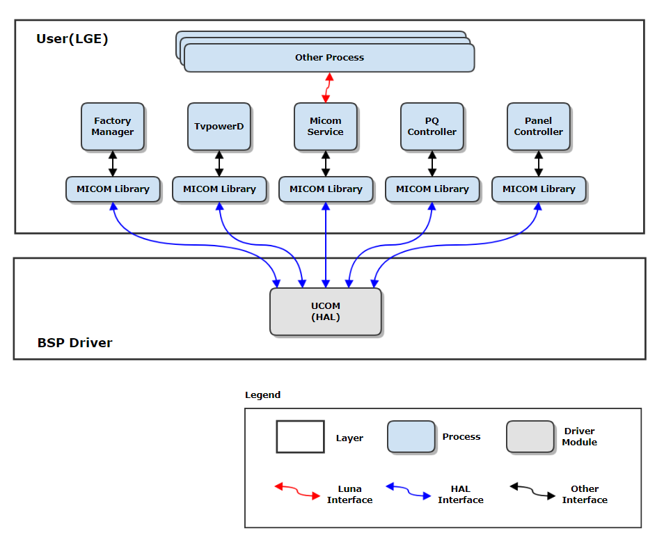
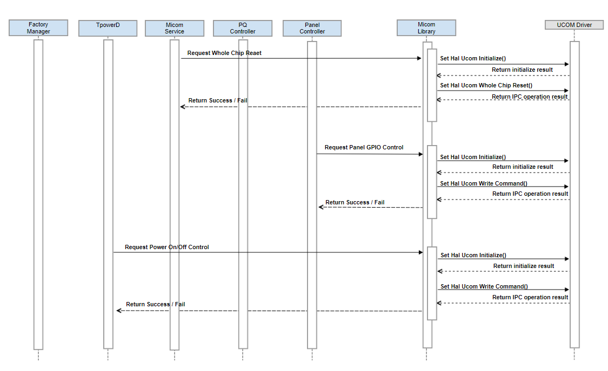
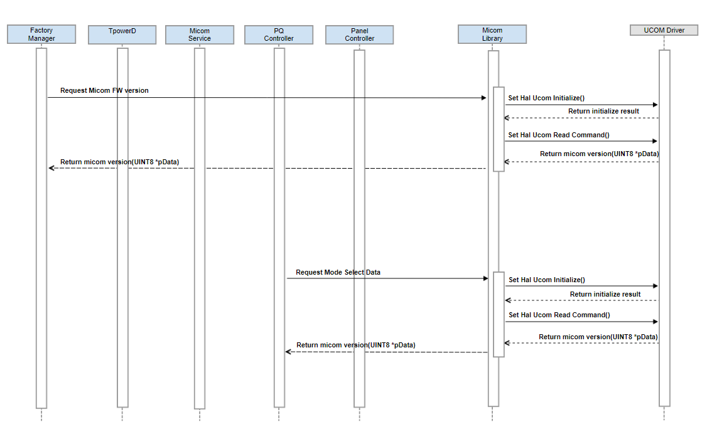

UCOM
#######

.. _sungbae.park: sungbae.park@lge.com
.. _jjeonghyeon.kim: jjeonghyeon.kim@lge.com
.. _sungyun.nam: sungyun.nam@lge.com

Introduction
************

|  This document describes the UCOM driver in the HAL libs layer of the webOS.
|  The document gives an overview of the UCOM driver and provides details about its functionalities and implementation requirements.
|  Therefore, the document assumes that the readers are familiar with the IPC communication mechanism.
|  The UCOM driver is based on the IPC communication between Main SOC and Micom FW.
|  The UCOM driver reads data from micom FW or writes data to micom FW.

Revision History
================

======= ========== ===================== ======================
Version  Date        Changed by          Description
======= ========== ===================== ======================
3.0.0   2023.11.06   `sungbae.park`_     Update contents and new document form
2.0.0   2022-11-15   `sungbae.park`_     Modify documentation new format
1.0.0   2022-04-13   `sungbae.park`_     First release
======= ========== ===================== ======================

Terminology
===========

|  The key words "must", "must not", "required", "shall", "shall not", "should", "should not", "recommended", "may", and "optional" in this document are to be interpreted as described in RFC2119.
|  The following table lists the terms used throughout this document:

================= ==================================================
Definition                Description
================= ==================================================
IPC                Inter-Process Communication
PQ                 Picture Quality Service
UCOM               User Communication (Internal Micom communication interface)
================= ==================================================

Technical Assistance
====================
|  For assistance or clarification on information in this guide, please create an issue in the LGE JIRA project and contact the following person:

================= ============================
Module             Owner
================= ============================
UCOM               `sungbae.park`_,
                   `jjeonghyeon.kim`_,
                   `sungyun.nam`_
================= ============================

Overview
********

General Description
===================

|  The UCOM module is controlled using IPC communication between Main SOC and Micom.
|  The main features provided by the UCOM module are :
- Initialize UCOM device
- Read UCOM command
- Write UCOM command
- Whole Chip reset

Architecture
============

|  The following diagram shows the system context of hal-libs ucom.
|  Through this system context, external entities are identified and the system boundary is clarified.

====================== ====================================================================================================
Entity                  Responsibility
====================== ====================================================================================================
Factory Manager         This service is in charge of necessary operations related to TV production.
TvpowerD                This service is in charge of necessary operations related to TV Power On/Off.
Micom Service           This service is in charge of TV key processing and interface operation with external services.
PQ controller           This service controls the quality of the video output on the TV screen.
Panel controller        This service controls the power sequence and panel-related functions to display the screen.
Micom Library           It is responsible for communication and information transfer between Main SOC and Micom FW.
====================== ====================================================================================================

Overall Workflow
================

|  The following shows the sequence diagram of the Write operation.

====================================== ====================================================================================================
Relationships                           Responsibility
====================================== ====================================================================================================
External Service -> Micom Library       Make write command set and call the Micom library API
Micom Library -> UCOM Driver            Call the HAL_UCOM_Initialize function and the HAL_UCOM_WriteCommand(UINT8 *pCmd, UINT16 size)
UCOM Driver -> Micom Library            Return the IPC operation result (SUCCESS/FAIL)
Micom Library -> External Service       Return the IPC operation result (SUCCESS/FAIL)
====================================== ====================================================================================================

|  The following shows the sequence diagram of the Read operation.

====================================== ====================================================================================================
Relationships                           Responsibility
====================================== ====================================================================================================
External Service -> Micom Library       Make read command set and call the Micom library API
Micom Library -> UCOM Driver            Call the HAL_UCOM_Initialize function and the HAL_UCOM_ReadCommand(UINT8 cmd, UINT16 dataSize, UINT8 *pData)
UCOM Driver -> Micom Library            Return the IPC operation result (SUCCESS/FAIL)
Micom Library -> External Service       Return the IPC operation result (SUCCESS/FAIL)
====================================== ====================================================================================================

Requirements
************

|  This section describes the main functionalities of the UCOM module in terms of the module's requirements and constraints.

Functional Requirements
=======================

|  The data types and functions used in this module are described in the Data Types and Functions in the API List.

Quality and Constraints
=======================

Performance Requirements
------------------------

|  Each function in the API List must return within 10ms, unless there are any special reasons.

Implementation
**************

|  This section provides supplementary materials that are useful for UCOM module implementation.
- The File Location section provides the location of the Git repository where you can get the header file in which the interface for the UCOM module implementation is defined.

- The API List section provides a brief summary of UCOM APIs that you must implement.

File Location
=============
|  The UCOM interfaces are defined in the hal_ucom.h header file, which can be obtained from https://swfarmhub.lge.com/.
- Git repository: bsp/ref/hal-libs-header
|  This Git repository contains the header files for the UCOM implementation as well as documentation for the UCOM implementation guide and UCOM API reference.

API List
========

|  The data types and functions used in this module are as follows.

Data Types
----------

Enumerations
^^^^^^^^^^^^

============================== ===================================
Name                           Description
============================== ===================================
:c:macro:`DRV_STATUS_T`        Struct for the UCOM API result
============================== ===================================

Functions
---------

==================================== ======================================================
Name                                 Description
==================================== ======================================================
:cpp:func:`HAL_UCOM_Initialize`      Initialize UCOM device.
:cpp:func:`HAL_UCOM_ReadCommand`     Read operation from Main SoC to Micom FW.
:cpp:func:`HAL_UCOM_WriteCommand`    Write operation from Main SoC to Micom FW.
:cpp:func:`HAL_UCOM_WholeChipReset`  Whole chip reset operation.
==================================== ======================================================

Implementation Details
======================

| The UCOM API is a common API based HW Layer (HAL) for various modules.
| Therefore, the UCOM API is simple and the header file already contains details comments for each functions.
| Please refer to "hal_ucom.h".

Testing
*******
|  To test the implementation of the UCOM module, webOS TV provides SoCTS (SoC Test Suite) tests.
|  The SoCTS checks the basic operations of the UCOM module.
|  For more information, see :doc:`UCOM's SoCTS Unit Test Manual. </part4/socts/Documentation/source/producer-manual/producer-manual_hal/producer-manual_hal-ucom>`.
