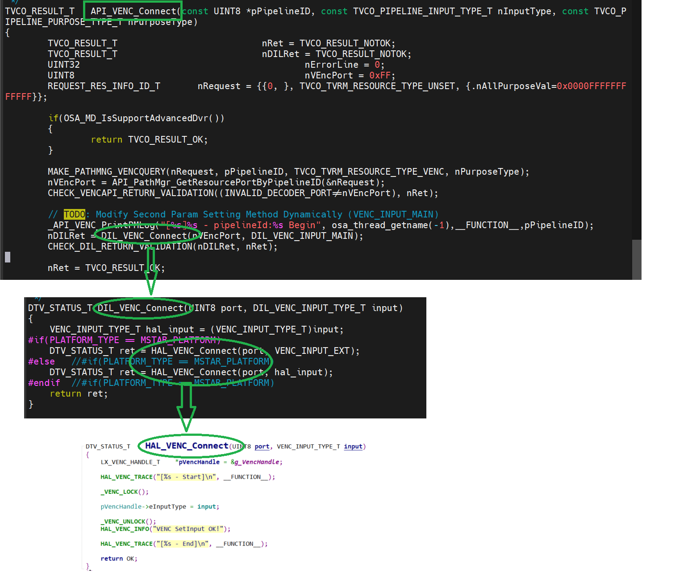

VENC
####

.. _usha.mp: usha.mp@lgepartner.com
.. _hwachin.lee: hwachin.lee@lge.com

Introduction
************

| This document gives an overview of the Video Encoder (VENC) module and provides details about its working, functionalities, and implementation requirements. The converted Video ES Data is re-muxed with Audio ES Data encoded in the same way in AENC, and delivered to the PVR download module.

Revision History
================

=============== ============ =================== ================================
Version         Date         Changed by          Description
=============== ============ =================== ================================
1.0.0           2023.11.23   `usha.mp`_          initial update
=============== ============ =================== ================================

Terminology
===========

| The key words "must", "must not", "required", "shall", "shall not", "should", "should not", "recommended", "may", and "optional" in this document are to be interpreted as described in RFC2119.

| The following table lists the terms used in the VENC module guide. These are frequently used terms in the field of video encoding.

=================== ==========================================
Term                Description
=================== ==========================================
AENC                Audio Encoder.
DASY                DVR middle ware. It is responsible for all processing and control related to DVR functions.
ES                  Elementary stream
NTSC	            National Television System comity, color encoding method.
PAL	            Phase Alternation Line, it is color encoding method.
PTS                 Presentation time stamp. Used in the AV sync control logic.
PVR                 Personal Video Recorder.
SECAM	            Séquentiel de couleu mémoire, analog color encoding method.
SENC                Muxer. Generate TS by muxing video stream data and other data received from VENC.
STC                 System time clock. Used in the AV sync control logic.
VENC                Video Encoder. Video data entered into the scaler is encoded and encoded into video ES data.
=================== ==========================================

Technical Assistance
====================

For assistance or clarification on information in this guide, please create an issue in the LGE JIRA project and contact the following person:

=========== ===============================
Module      Owner
=========== ===============================
VENC        `hwachin.lee`_
=========== ===============================

Overview
********

General Description
===================

| The VENC module is a module that receives video raw data from the video, encodes the digital video, and sends it to the place where it is needed (mainly SENC).

| The VENC module provides digital video encoding capabilities. The encoding codec supported by VENC is H.264. It depends on the performance of the HW, but it supports resolutions up to 1280x720. The frame rate is supported up to 30fps, and several frames can be dropped or repeated to adjust the frame rate.

| The VENC module delivers the encoded data and PTS value to the requested module using a callback method. To do this, it supports the callback request function.

| VENC is a module that records video in Analog-Composite format. In webOS, analog-composite format video input is ATV. LGE Spec supports image display for the following 7 Color-System Standards, and when these signals are decoded by AVD module, VENC should be able to record all of them.

**webOS TV specific**

======================= ===================== ===========
Color-System            Resolution            VFreq
======================= ===================== ===========
NTSC-M                  704 x 480             59.94
PAL                     704 x 576             50
SECAM                   704 x 576             50
NTSC.4.43               704 x 480             59.94
PAL-M                   704 x 480             59.94
PAL-Nc                  704 x 576             50
PAL-60                  704 x 480             59.94
======================= ===================== ===========

Features
========

| TV video encoders serve to compress and convert video signals into a format suitable for transmission and display.

| The key features of the VENC module are as follows:

- Compression Standards: TV encoders support various compression standards like H.264, H.265 (HEVC), or even newer standards for efficient video compression.

- Resolution Support: They handle different video resolutions, such as Full HD (1080p), 4K, and sometimes even higher resolutions.

- Frame Rate Control: TV encoders allow for control over the frame rate, ensuring smooth video playback.

- Bitrate Control: Users can adjust the bitrate to balance video quality and bandwidth usage.

- Input Interfaces: They provide various input interfaces to connect with different video sources, including HDMI, SDI, or others.

- Streaming Protocols: Support for streaming protocols like RTMP, HLS, or MPEG-DASH to enable content delivery over the internet.

- Audio Encoding: In addition to video, TV encoders handle audio encoding, supporting different audio formats and bitrates.

- Low Latency: Some encoders are designed for low-latency streaming, crucial for live broadcasts or interactive content.

- Network Connectivity: TV encoders often have Ethernet or Wi-Fi connectivity options for network communication.

- Hardware Acceleration: Many modern encoders utilize hardware acceleration to optimize video processing and reduce CPU load.

Architecture
============

This section describes the architecture of the VENC module from an inter-module perspective (driver architecture) as well as its internal point of view (internal architecture).

Driver Architecture
-------------------

The following diagram shows the driver level architecture of the VENC module where the VDEC module’s interaction with other modules is described.

| The diagram above shows the relationship between VENC and its surrounding external modules. In the Video Module located at the front of the VENC, the Analog-Composite video signal is decoded by the AVD (Analog-Video-Decoder) module and converted into Digital Raw-Video-Data. This Digital Raw-Video-Data is supplied to the VENC module. The process in which this Digital Raw-Video-Data is supplied to VENC may be VideoPath through AVD and Video-Scaler, or it can also be an operation that goes through VENC’s own dedicated buffer. This is determined by the unique structure of the SoC. The VENC module performs Video-Capture operation whenever one image frame data is received. When the capture operation of every video frame occurs, VENC compresses the video data of one frame, and then a Callback is generated by creating ES (Elementary-Stream), and ES data information must be delivered. PTS is created based on the time when Video-Capture occurs, and this is also passed as an argument to the callback function. This will be used to synchronize video and audio when playing back recordings in the future.

| LG MW performs the following post-processing of ES-Data on the Kernel-Memory side based on the argument values ​​of this callback function.

- HAL_VENC_CopyData : Copy ES Data from Driver to MW memory

- HAL_VENC_ReleaseData : Release memory of ES Data from Driver.

Requirements
************

| This section describes the requirements that SoC vendors must meet to successfully incorporate VENC.

Functional Requirements
=======================

| This section sets forth the requirements imposed on VENC's basic functionalities.

| **Video Capture**

| The video capture operation is an operation to capture one frame video data from a scaler (each SoC, it can be called a different name) that includes Raw-Video-Data at one frame rate cycle. In the current webOS spec, capture data and the resolution / frame rate of the original video must match. During Video Capture, Video-Scaling-Up or Video-Scaling-Down should not occur. If the original ATV is 720x480 59.9 fps, VENC capture is also captured 59.9 times per second with the same size. During recording, the setting state or operation (video signal format change, image quality setting, Video-Mute operation) of the Video-Main screen should not affect the video quality being recorded.

| **Video Encoding**

| The video captured through Video Capture is in the form of uncompressed raw data. You need to encode this with H264 video codec to create ES. In addition, it creates a PTS based on the time of the Video-Capture moment, and it is used for AV sync when playing back recordings in the future. When the video encoding and PTS generation for one frame are completed, a callback occurs and the pointer of the generated ES data and various related information must be delivered to the LG MW. In webOS, the encoding source is ATV, which is an interlaced-type. Interlaced-type video is a video composed of top/bottom fields, and deinterlacing operation is required during playback. When encoding an interlaced source, it must be encoded in the following two ways. #. Encoding an interlaced video source as an interlaced-type or #. After converting the interlaced video source to progressive through the deinterlacer module, then encoding to progressive-type. It should be noted that the frame rate is also reduced by half when converting to I->P. (Encoding of interlaced-type signals as progressive-type is not allowed)

| **Deinterlacing**

| The analog composite video signal is an interlaced type. LGE-Spec requires that the original resolution be maintained when playing back the recording. And the level of smoothness of the video motion is also required to be the same as the original. For this, in the process of capturing and compressing for recording, and controlling the video-path for playback, the Deinterlacing-Scheme must be carefully decided and the following requirements must be satisfied. #. There should be no loss of resolution compared to the original when playing the recording in Normal mode. #. When playing the recorded recording in Normal mode, the video movement should be as smooth as the original. #. There should be no loss of original contrast or resolution even when playing the recording in trick playback mode (1/2 speed, Pause, 2X speed, 4X speed, 8X speed, 16X speed). #. Even during Trick Mode playback of the recording, the motion of the video should be sufficiently smooth. #. When changing between playback modes of recordings (for example, when switching between Pause and 1x speed repeatedly), Motion-Adaptive-Deinterlacing must be appropriately controlled to prevent excessive screen shaking. #. In the case of the original PAL and DEM-Pattern still images, the Hanover-Bar phenomenon should not occur when playing the recorded material. #. In all the cases mentioned above, not only the case where the resolution of the original signal is “interlaced”, but also the case where the resolution of the original signal is “interlaced in 3:2-Pull-down Film mode” should be considered.

| **Encoding AV sync**

| In the case of an ATV input signal, since PTS is not transmitted, PTS must be generated during recording. VENC must generate PTS based on the time when video capture operation for analog-source occurs. This is because AV sync cannot be guaranteed if the PTS is generated at the start of encoding or at a later operation time. The generated PTS value is transferred to LG MW as a callback operation. The PTS generated in this way is used to keep the audio and video included in the analog recording contents in sync with each other when the recording is played back in the future. This PTS is generated from an independent STC, and AENC and VENC implement sync using the PTS obtained from the same STC.

| **VENC Callback**

| VENC must call the callback function passed through HAL_VENC_RegisterEncodiungCallback whenever picture encoding is completed. To prevent deadlock, VENC should implement the following logic. #. Do not use same semaphore with ES data(CopyData/ReleaseData) and VENC control (Open/Start/Stop/Close) #. Normal stop sequence is Stop - Close but in racing condition Close - Stop can happen. So Close should include Stop action. #. Use timeout for every waiting action (especially wait for Scaler-capture) #. Add enough check sequence not to make deadlock or crash.

| **Memory**

| For the memory of the internal buffer of VENC, a structure that can be dynamically alloc-free should be avoided and a pre-allocated memory structure such as a ring buffer should be used. Also, dynamic sharing of memory area with other modules is not allowed. Since data needs to be captured and encoded in real time, it is necessary to assign a sufficiently high priority to memory or CPU access so that Frame-Capture does not fail or noise is encoded.

| **IDR(Instantaneous Decoder Refresh) Picture**

| In video compression technology, Intra-coded frames (I-frames) encompass a specific category known as Instantaneous Decoder Refresh (IDR) frames. These frames are pivotal in facilitating independent decoding, ensuring rapid access to video content, and bolstering error recovery mechanisms. Their significance is particularly pronounced in applications involving video streaming and communication systems.

| Instantaneous Decoder Refresh (IDR) Frame API in Video Encoding

| API Functionality: The HAL_VENC_ResetGOP() function is instrumental in the context of IDR frames. It initiates a request for IDR frame data. Subsequently, the obtained IDR picture data is expected to be processed through the VENC  picture callback mechanism.

| Definition and Importance: IDR frames are a fundamental component in video encoding, particularly relevant in the H.264/AVC and H.265/HEVC codecs. These frames serve as critical reference points within the encoding process.

| Function in H.264 Encoder: In the H.264 encoding schema, the transmission of an IDR coded picture is executed to effectively reset or clear the contents of the reference picture buffer. This operation is a key aspect of maintaining the integrity of the video stream.

| Role in Video Quality Maintenance: The introduction of IDR frames is strategically implemented to mitigate potential distortions in video playback. This is especially beneficial when there is a requirement to skip or fast-forward to a specific segment in the video or to commence viewing from a midpoint. IDR frames thus ensure continuity and clarity in such scenarios.

- Use of IDR picture

| GOP Structure and IDR Frame Interval: The temporal frequency of Instantaneous Decoder Refresh (IDR) frames within a video stream is directly influenced by the Group of Pictures (GOP) structure. This structure plays a crucial role in defining the interval at which IDR frames are introduced in the sequence.

| Video Encoder Configuration Parameters: In the configuration process of a video encoder, there are specific parameters that pertain to IDR frames. These include, but are not limited to, the length of the GOP and the interval of IDR frames.
|       - GOP Length: The GOP length parameter is instrumental in determining the number of frames encompassed within a single GOP.
|       - IDR Interval: The IDR interval parameter explicitly specifies the occurrence of an IDR frame within the GOP. This parameter is essential for dictating the pattern and frequency of IDR frames in the video encoding process.

| These parameters are pivotal in optimizing video encoding settings, ensuring efficient video compression and maintaining high-quality video playback.

| **FrameRate**

| Frame rate, quantified in frames per second (fps), signifies the count of distinct frames or images that are exhibited during one second of video playback. As a fundamental aspect of video production, encoding, and playback, frame rate holds significant importance. Predominantly, a higher frame rate is associated with the smoother portrayal of motion in video content.

-  Applications and Implications of High Frame Rate:

|       Enhanced Motion Clarity: The adoption of a higher frame rate, by providing more frames per second, plays a pivotal role in diminishing motion blur. This results in a more fluid and lifelike representation of movement within the video.
|       Compatibility with Playback Systems: It is imperative to ensure that the chosen frame rate is compatible with the intended playback devices and platforms. This compatibility is crucial for delivering a seamless and uninterrupted viewing experience to the audience.

| In summary, the frame rate is not merely a technical specification but is also instrumental in defining the viewer's perceptual experience of video content.

| **Subscaler**

| Before understanding sub scaler we should know about video scaling. A video scaler is a system which converts video signals from one display resolution to another typically, scalers are used to convert a signal from a lower resolution (such as 480p standard definition) to a higher resolution (such as 1080i high definition).

| The Video Scaler (VSC) driver is based on the V4L2 framework and is responsible for performing video signal processing, video scaling, and video capture by controlling the Scaler IP. The VSC driver receives the video input data from VDEC/HDMI/AVD, scales it to fit the main/sub window, and then transmits the video output data to other modules to display on the TV screen.

| Scalar module processes,scales,captures video signal after receiving a video selection from the VFE(video front end).The scalar modules's primary duties include receiving the chosen video input from VFE, showing the video in the main/sub window and sending the output to PQ/FRC.

| Features of VSC :

- Video input connection:
        - The VSC driver is connected to VDEC/HDMI/AVD, which corresponds to the input. When the video frames and related information are sent from VDEC/HDMI/AVD to VSC, the VSC driver processes these video frames and related information.

- Video signal processing
        - The VSC driver processes the video signal by passing the video data to the backend after additional signal processing for the digitized video signal input from VDEC/HDMI/AVD.

- Video size settings
        - The VSC driver enables the adjustment of the video size including scaling up or down, cropping, and zooming the video by setting the input window and output window of the incoming video data.

- Video mode settings (Single/PIP/PBP)
        - The VSC driver supports Multi View modes that can split the TV screen into two areas and display different sources in each area. These modes include Single (displaying a single video source), PIP (Picture-in-Picture, displaying a smaller video source within a larger one), and PBP (Picture-by-Picture, displaying multiple video sources side by side).

- Video memory data reading
        - The VSC driver supports reading data from the input video frame buffer for verifying video data. This feature is utilized by SoC Compliance Test Suite (SoCTS).

- Video mute control
        - Noise may occur during video transitions caused by input or signal switching. The VSC driver controls video mute (blank) during the transition period to cover them with black.

- Video freeze control
        - The VSC driver supports freezing the video frame, allowing it to be held or paused, resulting in a static image being displayed. This feature enables the video output to appear as if it is paused or stopped at a specific frame.

| **Secure VENC**

| Purpose:
- Secure VENC is utilized for video encoding, specifically designed to store data in secure memory. This feature enhances the security of encoded video data.

| Key Components:
- HAL_VENC Modifications: Changes in HAL_VENC facilitate the use of secure memory in the encoder path.
- VENC_INFO_SECURE: Defined as a typedef enum in VENC_INFO_T. Located in [bsp/ref/hal-libs-header.git]/hal_inc/hal_venc.h.

| Usage Scenarios

- For ATV Recording
        - Avoid set_secure_memory API: Do not use this API in ATV recording.
        - Encoder Callback: Register a callback using HAL_VENC_RegisterEncoderCallback.
        - Data Access: Access the pData address area via HAL_VENC_CopyData pData from HAL_VENC_MSG_TYPE_T delivered through the callback.
        - Data Utilization: Use the copied encoded data for processing.

- For Reverse Mirroring
        - Use set_secure_memory API: Ensure this API is called for reverse mirroring.
        - Encoder Callback Registration: Register a callback using HAL_VENC_RegisterEncoderCallback.
        - Data Encryption: The pData from HAL_VENC_MSG_TYPE_T via the callback is encrypted using HAL_HDCP2_Data_Encrypt. Encrypted data is passed to outEncryptedData in user-allocated space.
        - Utilization of Encrypted Data: Utilize the outEncryptedData for further processing.

- Mode Selection
        - Secure Mode: Activate by calling HAL_VENC_SetParam(ch, VENC_INFO_SECURE, 1).
        - Non-Secure Mode: Activate by calling HAL_VENC_SetParam(ch, VENC_INFO_SECURE, 0). This is the default mode.

- Data Handling for Reverse Mirroring
        - Encoding and Security: VENC data for reverse mirroring must be encoded and passed in the secure world.
        - pDataPhysical: Represents the address for the encoded VENC ES data, designated for the secure world.
        - Environment Selection: VENC_INFO_SECURE allows the selection between real or secure world encoding environments.

- Operational Sequence
        - Key Setting: Call HAL_HDCP2_SetProtectedDecryptionKey to set the HDCP2 Protected Key for encryption.
        - Memory and Start: Invoke HAL_VENC_SetParam(ch, VENC_INFO_SECURE, 0) to request secure memory usage for the encoder path, followed by HAL_VENC_Start.
        - Address Handling: The driver returns an inaccessible address to the user (‘UINT8 *pDataPhysical’ in HAL_VENC_MSG_TYPE_T). Direct user access should trigger an error.
        - Data Encryption: The user calls HAL_HDCP2_Data_Encrypt with parameters including the user-allocated REE address and the driver-provided inaccessible address.
        - Data Filling: The driver fills the REE buffer with encrypted data.

Quality and Constraints
=======================

| These non-functional requirements contribute to the overall performance, reliability, and usability of the TV video encoder system. It includes:

- Performance: The encoder should operate efficiently, handling video encoding tasks with minimal delays or lag.

- Scalability: Ability to handle increased loads and demands as the number of users or video sources grows.

- Reliability: Ensuring stable and consistent performance, minimizing the risk of failures or crashes during operation.

- Compatibility: Support for a variety of video formats and devices to ensure broad compatibility with different TVs and playback systems.

- Security: Implement measures to protect against unauthorized access, tampering, or interception of encoded video streams.

- User Interface: Provide a user-friendly interface for configuration and monitoring, making it easy for users to manage settings.

| Constraints and Configuration of GOP Length in Video Encoding:

| GOP Length Limitations:
|       - Range Specification: The Group of Pictures (GOP) length, an essential parameter in video encoding, is restricted to a range of 1 to 300.
|       - Immutability Post-Encoding Start: Once video encoding (venc) commences, it is imperative to note that the GOP length becomes immutable and cannot be altered.
|       - IDR Frame Encoding Restrictions: Additionally, it is not feasible to selectively encode a desired picture into an Instantaneous Decoder Refresh (IDR) frame

|  Parameter Setting in Video Encoding:
|       - Configuration Function: The VENC_INFO_GOPLENGTH parameter is utilized in the HAL_VENC_SetParam() function to set the GOP length.
|       - Value Assignment and Effects: Assigning a value to this parameter dictates the frequency of I-frame generation within the GOP. For instance:
|               -  A value of 10 implies the creation of an I-frame at intervals of every 10 frames
|               -  Similarly, a value of 20 results in the generation of an I-frame every 20 frames.
|       -  Upper Limit: The maximum value that can be set for the GOP length is 300.

Implementation
**************

| This section provides supplementary materials that are useful for VENC implementation.

- The File Location section provides the location of the Git repository where you can get the header files in which the interface for the VENC implementation is defined.

- The API List section provides a brief summary of VENC APIs.

File Location
=============

| The VENC interfaces are defined in the `hal_venc.h header file <http://10.157.97.248:8000/bsp_document/master/latest_html/api/file_full_build_source_part3_hal-libs-header_hal_inc_hal_venc.h.html#file-full-build-source-part3-hal-libs-header-hal-inc-hal-venc-h>`_, which can be obtained from https://swfarmhub.lge.com/.

- Git repository: `bsp/ref/hal-libs-header <https://wall.lge.com/admin/repos/bsp/ref/hal-libs-header,general>`_.

| This Git repository contains the header files for the VENC implementation as well as documentation for the VENC implementation guide and VENC API reference.

API List
========

| This section describe what are API's & functions are used for VENC implementation.

Data Types
==========

VENC_MSG_TYPE_T
---------------
This structure contains message data transmitted as a parameter of VENC callback.

		.. code-block::

				typedef struct VENC_MSG_TYPE {
					UINT32   channel;
					UINT8    pictype;
					UINT64   pts;
					UINT8    *pData;
					UINT32   dataLen;
					UINT8    *pRStart;
					UINT8    *pREnd;
				} VENC_MSG_TYPE_T;

================= ============================================================================================
Member            Description
================= ============================================================================================
channel           Encoded picture type(IDR:1 I:2 P:4 B:8). if I frame with IDR, 1 | 2 = 3.
pts               | PTS value of encoded picture.
                  | Based on the time when the Video-Capture is performed, the pts is decided.
                  | This pts value will be delivered to LGE-SW-Layer.
                  | The LGE-SW-Layer will create PES based on ES from driver.
                  | The LGE-SW-Layer will create PES-Header.
                  | The LGE-SW-Layer will insert the decided pts into the pts-parameter in the PES-Header.
pData             The pointer of encoded video ES data
dataLen           The length of encoded video ES data
pRStart           The start pointer of Ring buffer of ES data
pREnd             The end pointer of Ring buffer of ES data
================= ============================================================================================

VENC_INPUT_TYPE_T
-----------------
This enumeration contains the VENC input source index.

		.. code-block::

				typedef enum  {
					VENC_INPUT_MAIN = 0,
					VENC_INPUT_SUB,
					VENC_INPUT_EXT,
					VENC_INPUT_NUM
				} VENC_INPUT_TYPE_T;

================= ===================================================
Member            Description
================= ===================================================
VENC_INPUT_MAIN   Main video source. Normally means main scaler.
VENC_INPUT_SUB    Sub video source. Normally means sub-scaler.
VENC_INPUT_EXT    Extra video source.
VENC_INPUT_NUM    Number of VENC input
================= ===================================================

VENC_CODEC_T
------------
Encoding codec. (see VENC_INFO_CODEC)

		.. code-block::

				typedef  enum {
					VENC_CODEC_H264 = 0,
					VENC_CODEC_VP8
				} VENC_CODEC_T;

================= ======================
Member            Description
================= ======================
VENC_CODEC_H264   Encode H.264 codec
VENC_CODEC_VP8    Encode VP8 codec
================= ======================

VENC_FRAMERATE_T
----------------
This enumeration contains the VENC encoding target framerate type. (See VENC_INFO_FRAMERATE)

		.. code-block::

				typedef enum {
					VENC_FRAMERATE_AUTO = 0,
					VENC_FRAMERATE_ASIS,
					VENC_FRAMERATE_60P,
					VENC_FRAMERATE_60I,
					VENC_FRAMERATE_30P,
					VENC_FRAMERATE_30I,
					VENC_FRAMERATE_25P,
					VENC_FRAMERATE_25I,
					VENC_FRAMERATE_24P,
					VENC_FRAMERATE_24I,
					VENC_FRAMERATE_INVALID
				} VENC_FRAMERATE_T;

=========================== ===============================================
Member                      Description
=========================== ===============================================
VENC_FRAMERATE_AUTO         Set target framerate automatically.
                            | 60p -> 30p
                            | 60i -> 30p
                            | 50p -> 25p
                            | 50i -> 25p
                            | 30p -> 30p
                            | 30i -> 30p
                            | 24p -> 24p
                            | 24i -> 24p
VENC_FRAMERATE_ASIS         Set target framerate same with video source
VENC_FRAMERATE_60P          Framerate 60 progressive
VENC_FRAMERATE_60I          Framerate 60 interlaced
VENC_FRAMERATE_30P          Framerate 30 progressive
VENC_FRAMERATE_30I          Framerate 30 interlaced
VENC_FRAMERATE_25P          Framerate 25 progressive
VENC_FRAMERATE_25I          Framerate 25 interlaced
VENC_FRAMERATE_24P          Framerate 24 progressive
VENC_FRAMERATE_24I          Framerate 24 interlaced
VENC_FRAMERATE_INVALID      Framerate is Invalid
=========================== ===============================================

VENC_PROFILE_T
--------------
This enumeration contains profile type of encoded video ES. (See VENC_INFO_PROFILE).
Currently Main profile option is used for Analog recording

		.. code-block::

				typedef enum {
					VENC_PROFILE_BASE = 0,
					VENC_PROFILE_MAIN,
					VENC_PROFILE_EXT,
					VENC_PROFILE_HIGH
				} VENC_PROFILE_T;

VENC_PROFILELEVEL_T
-------------------
This enumeration contains profile level of encoded video ES. (See VENC_INFO_PROFILELEVEL)
Currently 3.1 option is used for Analog recording

		.. code-block::

				typedef enum {
					VENC_PROFILELEVEL_30 = 0,
					VENC_PROFILELEVEL_31,
					VENC_PROFILELEVEL_40,
					VENC_PROFILELEVEL_41
				} VENC_PROFILELEVEL_T;

========================= ======================
Member                    Description
========================= ======================
VENC_PROFILELEVEL_30      Profile level 3.0
VENC_PROFILELEVEL_31      Profile level 3.1
VENC_PROFILELEVEL_40      Profile level 4.0
VENC_PROFILELEVEL_41      Profile level 4.1
========================= ======================

VENC_SOURCE_T
-------------
This enumeration contains the type of input source of VENC. Currently only VENC_SOURCE_ATV is used

		.. code-block::

				typedef enum {
					VENC_SOURCE_ATV = 0,
					VENC_SOURCE_AV,
					VENC_SOURCE_SCARTIN,
					VENC_SOURCE_NUM
				} VENC_SOURCE_T;

========================= =========================
Member                    Description
========================= =========================
VENC_SOURCE_ATV           VENC source is ATV
VENC_SOURCE_AV            VENC source is AV
VENC_SOURCE_SCARTIN       VENC source is scart-in
========================= =========================

VENC_RATECONTROL_T
------------------
This enumeration contains bitrate control information.

		.. code-block::

				typedef enum {
					VENC_BITRATECONTROL_VBR = 0,
					VENC_BITRATECONTROL_CBR
				} VENC_SOURCE_T;

============================ ==============================================================================
Member                       Description
============================ ==============================================================================
VENC_BITRATECONTROL_VBR      Bitrate of encoded video data is changed to optimal quality while encoding.
VENC_BITRATECONTROL_CBR      Bitrate of encoded video data is not changed until finish encoding.
============================ ==============================================================================

VENC_INFO_T
-----------
This enum information means the information type used by the HAL_VENC_SetParam() function for VENC control and the HAL_VENC_GetParam() function for obtaining VENC status.

		.. code-block::

				typedef enum {
					VENC_INFO_FRAMERATE     = 0,
					VENC_INFO_WIDTH,
					VENC_INFO_HEIGHT,
					VENC_INFO_ASPECTRATIOIDC,
					VENC_INFO_SARWIDTH,
					VENC_INFO_SARHEIGHT,
					VENC_INFO_INPUT,
					VENC_INFO_BITRATE,
					VENC_INFO_PROFILE,
					VENC_INFO_PROFILELEVEL,
					VENC_INFO_CODEC,
					VENC_INFO_RATECONTROL,
					VENC_INFO_GOPLENGTH,
					VENC_INFO_QP,
					VENC_INFO_SOURCE,
					VENC_INFO_NUM
				} VENC_INFO_T;

Function Calls
==============

================================================ ===========================================================================================================================================
Function      		       		         Descrption
================================================ ===========================================================================================================================================
:cpp:func:`HAL_VENC_Close`		   	 Close VENC driver.
:cpp:func:`HAL_VENC_CloseEx`                   	 Close VENC driver. This is for only LG SIC. For others implement it as empty.
:cpp:func:`HAL_VENC_CopyData`		         Copy encoded ES data from VENC driver memory source to user memory destination.
:cpp:func:`HAL_VENC_Connect`		  	 Determine which module VENC will connect with set VENC input video source.
:cpp:func:`HAL_VENC_GetParam`		  	 Get VENC encoding parameters.
:cpp:func:`HAL_VENC_Open`                      	 Initialize and open VENC driver. Perform basic setting work to operate VENC.
:cpp:func:`HAL_VENC_OpenEx`	   		 Initialize and open VENC driver. Perform basic setting work to operate VENC. Encoding port number can be set as parameter.
:cpp:func:`HAL_VENC_RegisterEncoderCallback`	 Register callback function that receives VENC callback message.
:cpp:func:`HAL_VENC_ReleaseData`		 (In callback function) Free driver memory of encoded ES data after copy.
:cpp:func:`HAL_VENC_ResetGOP`			 Request IDR frame data by calling HAL_VENC_ResetGOP.The IDR picture data should be passed VENC picture callback.
:cpp:func:`HAL_VENC_SetParam`	   		 Set VENC encoding ES parameters and various parameters for encoding.
:cpp:func:`HAL_VENC_Start`		  	 | Start VENC encoding. ES data is newly generated per every video-frame is input. New ES data is saved in ES-Buffer. A Callback is generated from driver to Upper-SW-Layer.
:cpp:func:`HAL_VENC_Stop`	   		 Stop VENC encoding.
================================================ ===========================================================================================================================================

VSC API'S
---------

we can load the encoder in two ways

1.VSC with V4L2

2.VT with V4L2

| open and set the VSC with V4L2 framework by that the VENC encoder will be loaded.

================================================ ===========================================================================================================================================
Function                                         Descrption
================================================ ===========================================================================================================================================
:cpp:func:`v4l2_open_for_vsc`                    except from socts, opens the video file that needs to be scaled
:cpp:func:`v4l2_set_for_vsc_connect_info`        except from socts, Set the video input and output information
:cpp:func:`v4l2_set_for_vsc_win_region`          except from socts, Set video output
:cpp:func:`V4L2_EXT_VSC_DEST_VENC`               close the VSC connection
================================================ ===========================================================================================================================================

| Open and set the VT with V4L2 framework by that the VENC encoder will be started

================================================ ===========================================================================================================================================
Function                                         Descrption
================================================ ===========================================================================================================================================
:cpp:func:`v4l2_open_for_vt`                     except from socts, Opens the captured video file received from video front end.
:cpp:func:`v4l2_set_for_vt_plane_prop`           except from socts, Get plane information.
:cpp:func:`v4l2_close_for_vt`                    except from socts, close the VT connection.
================================================ ===========================================================================================================================================

Function Description
====================

| **HAL_VENC_DebugMenu()**

| Primary Functionality:
|       - The HAL_VENC_DebugMenu() function is designed to facilitate advanced debugging processes within video encoding systems.
|       - The SENC_Debug_Menu() function plays an important role in the debugging process. It examines the value of the SENC_DEBUG_PrintMenu variable and, based on this value, proceeds to invoke the relevant API functions.

| Operational Sequence:
|       - Upon the SENC_Debug_Menu() function detecting the value 0x31 (which corresponds to DIL_VENC_DebugMenu), it triggers the DIL_VENC_DebugMenu() function.
|       - The DIL_VENC_DebugMenu() function, in turn, calls the DIL_VENC_DEBUG_DisplayMenu() function to retrieve the current DisplayMenu value. In the context of this operation, the DisplayMenu value is determined to be 0x01, which is synonymous with HAL_VENC_Debug.  As the selected value is 0x01, the sequence culminates in the invocation of the HAL_VENC_DebugMenu() function.

| HAL_VENC_DebugMenu Function:
|       - The HAL_VENC_DebugMenu() function initiates the debugging process by calling the DEBUG_VENC_Menu() function.

| DEBUG_VENC_Menu Function:
|       - The DEBUG_VENC_Menu() function is responsible for assessing the current displayMenu value. This value is subsequently stored in the variable nSelect.
|       - To capture user input, the function employs KADP_DBG_GetHexInput(), which retrieves hexadecimal input from the user.

| Processing User Input:
|       - In a scenario where the input value is 0x01, this corresponds to the DumpInitial() command. Consequently, the function _DEBUG_VNC_DumpInitial() is invoked.
|       - Within _DEBUG_VNC_DumpInitial(), a sequence of operations is executed, which includes:
|               - Calling HAL_VENC_Open to open the video encoding session.
|               - Establishing a connection through an appropriate function.
|               - Setting various parameters for the encoding process using SetParam.
|               - Registering the encoder callback through registerEncoderCallback.

| This structured process illustrates the systematic approach employed in the HAL_VENC debugging framework, ensuring precise and controlled execution of debugging tasks based on user inputs and pre-defined operational sequences.

| **API_VENC_Open()**

| Overview of the API_VENC_Open Function in the SENC System Encoder

| Primary Function Call:
|       The API_VENC_Open() function serves as a pivotal element in the SENC system encoder. Its primary role is to initiate the video encoding process. This is achieved by calling a driver function responsible for opening the video encoder, thereby enabling the encoding of data.

| Resource Port Acquisition:
|       The process begins with the invocation of the API_PathMgr_GetResourcePortByPipelineID() function. This function is tasked with obtaining the appropriate resource port corresponding to the requested pipeline ID.
|       Subsequently, the PATHMGR_GetResourcePortByPipelineId() function is executed to further refine the resource port acquisition. This step involves calling the PathMgr_GetPipeLineInfo() function to retrieve detailed information about the pipeline.

| Validation and Encoder Initialization:
|       Upon acquiring the necessary pipeline information, the system conducts a verification check to ascertain the validity of the Vencport value.
|       Once validated, the process advances to the DIL_VENC_Open() function. This function is instrumental in the overall workflow as it calls the HAL_VENC_Open() function, effectively initiating the video encoder driver.

| The API_VENC_Open() function, through this structured sequence of calls and checks, plays a critical role in bridging the SENC system encoder with the underlying video encoder driver, thereby facilitating the commencement of the video encoding process.

| **HAL_VENC_Open()**

| Purpose:
|        - The purpose of HAL_VENC_Open is to initialize and open the video encoder hardware or software component. This includes setting up necessary resources, logging systems, and preparing the encoder for operation.

| Usage:
|        - This function is called at the beginning of a video encoding session, before starting any encoding operations.

| Functionality:
|        - The function initializes the logging system for the video encoder, checks and sets the encoder status, initializes semaphores for resource management, and sets up encoder parameters.

| Parameters taken:
|        - The function does not take any parameters.

| Return Value
|        - Returns a DTV_STATUS_T value, indicating the success or failure of the operation. NOT_OK is returned in case of failure.

| Explanation:
|        - The function initializes a handle to the global video encoder handle.
|        - It sets up a logging system for the encoder (g_hal_venc_logm_fd), registering and setting log levels.
|        - Checks if the video encoder is already initialized to avoid reinitialization.
|        - Initializes a semaphore (_gSemVENCDDI) for managing access to the encoder resources.
|        - Locks the encoder to prevent concurrent access during initialization.
|        - Sets up the recording parameters using KADP_VENC_RecordSetup.
|        - Optionally sets the rate control type and creates a task for the encoder based on compilation flags.
|        - Updates the global encoder status to indicate initialization.
|        - Unlocks the encoder and returns the status of the operation.

| Initial Status Check:
|       The HAL_VENC_Open() function commences its operation by conducting a status check of the video encoder (venc). This is achieved through the utilization of the VENC_CHECK_CODE() function.
|       To ensure operational integrity and avoid potential deadlocks, VENC_CHECK_CODE() is strategically re-invoked, following which the port is assigned a value of '0'.

| Recording Setup:
|       The next step involves setting up the video encoder recording configuration. This is executed by calling the KADP_VENC_RecordSetup() function. The outcome of this setup process, denoted by the return value, is stored in the variable ret.

| Task Creation and Initialization:
|       Subsequently, the VENC_CreateTask() function is employed to create a Venc task. This task creation is parameterized by pVencHandle.
|       Upon successful initialization of the Venc, the status is updated to VENC_STATUS_INIT, reflecting the readiness of the video encoder for operation.

| The HAL_VENC_Open() function, through this sequence of meticulous checks and configurations, ensures a robust and reliable initialization of the video encoder, setting the stage for efficient and effective video encoding operations.
| This function performs  initialization steps necessary for the video encoder to function properly, ensuring that the encoder is ready for subsequent operations like starting and stopping video encoding.

| **HAL_VENC_Close()**

| Purpose:
|        - HAL_VENC_Close is designed to shut down and clean up the video encoder hardware or software component. This includes stopping any ongoing encoding processes and releasing resources.

| Usage:
|        - This function is used at the end of a video encoding session or when the encoder is no longer needed, to ensure proper shutdown and resource management.

| Functionality:
|        - The function stops the encoder if it's running, cleans up resources, and sets the encoder's status to indicate it's not initialized.

| Parameters taken:
|        - The function does not take any external parameters.

| Return Value:
|        - Returns a DTV_STATUS_T value, indicating the success or failure of the operation. NOT_OK is returned in case of failure.

| Explanation:
|        - The function starts by locking access to the encoder to prevent concurrent operations.
|        - Checks if the encoder is not initialized and, if so, goes to the function exit.
|        - If the encoder is running, it stops the encoder stream dump and pauses the recording.
|        - Depending on the compilation flags, it destroys the encoder task if necessary.
|        - Cleans up the recording setup.
|        - Sets the encoder status to VENC_STATUS_NOTINIT indicating the encoder is no longer initialized.
|        - Unlocks the encoder and returns the operation status.

| This function is for ensuring that the video encoder is properly shut down, resources are released, and the system is left in a clean state, ready for the next encoding session or system shutdown.

| **API_VENC_Connect()**

| Function Invocation and Purpose:
|       The API_VENC_Connect() function is a core component of the SENC system encoder's main functionality. Its primary role is to establish a connection with the video encoder, thus facilitating data encoding. This is accomplished through the invocation of the VENC_Connect function.

| Resource Port Acquisition Process:
|       The initial step in the process involves the API_PathMgr_GetResourcePortByPipelineID() function, which is tasked with acquiring the appropriate resource port corresponding to the specified pipeline ID.
|       This step is further refined through the execution of the PATHMGR_GetResourcePortByPipelineId() function, which is followed by a call to PathMgr_GetPipeLineInfo() in order to obtain detailed information regarding the pipeline.

| Validation and Connection Establishment:
|       Following the acquisition of pipeline information, the system conducts a validation check to ensure the Venc port value is correct and valid.
|       Upon successful validation, the workflow progresses to the DIL_VENC_Connect() function. This function is crucial as it triggers the HAL_VENC_Connect() driver function, thereby establishing a connection with the video encoder.

| The API_VENC_Connect() function, through this structured sequence of operations, plays an integral role in linking the SENC system encoder with the video encoder, ensuring a seamless and effective connection for video data encoding.

| **HAL_VENC_Connect()**

| Purpose:
|        - The purpose of HAL_VENC_Connect is to configure the video encoder with a specified input type and connect it to a specific port.

| Usage:
|        - This function is  used to set up or change the input source type for the video encoder, such as when initializing the encoder or switching between different video sources.

| Functionality:
|        - The function sets the input type for the video encoder based on the provided parameters.

| Parameters taken:
|        - UINT8 port: The port number or identifier to which the encoder is being connected.
|        - VENC_INPUT_TYPE_T input: The type of input source to be connected to the encoder.

| Return Value:
|        - Returns DTV_STATUS_T, which is likely an enumeration. OK is returned to indicate successful connection.

| Explanation:
|        - The function begins by obtaining a pointer to the global encoder handle.
|        - It locks access to the encoder to prevent concurrent modifications.
|        - Sets the input type of the encoder handle to the provided input.
|        - Unlocks the encoder.
|        - Logs the successful setting of the input.
|        - The function ends and returns OK to indicate success.

| This function primarily deals with configuring the input type for the video encoder, ensuring that the encoder is correctly set up to process the desired type of video input. The function safely updates the encoder's configuration.

| **HAL_VENC_SetParam()**

| Purpose:
|        - The HAL_VENC_SetParam function is designed to set various parameters of a video encoder. It configures different aspects of the encoding process, such as frame rate, aspect ratio, bitrate, codec type, etc.

| Usage:
|        - This function is used whenever there's a need to configure or modify the settings of the video encoder, such as during initialization, or when changing encoding settings in response to different requirements.

| Functionality:
|        - The function updates the encoder's settings based on the provided info and value. It handles different types of parameters, setting each in the encoder's handle structure.

| Parameters taken:
|        - UINT8 port: The port number or identifier for the encoder.
|        - VENC_INFO_T info: An enumeration indicating which parameter to set.
|        - SINT32 value: The value to set for the specified parameter.

| Return Value:
|        - Returns DTV_STATUS_T, indicating the success (OK) or failure (NOT_OK) of the operation.

| Explanation:
|        - Begins by checking if the encoder is initialized; if not, returns NOT_OK.
|        - Locks access to the encoder.
|        - Uses a switch statement to handle different info cases:
|            - For each case, such as frame rate, aspect ratio, bitrate, etc., it sets the corresponding value in the encoder handle.
|            - Some parameters are marked as "READ_ONLY" and are not settable.
|        - Unlocks the encoder after setting the parameters.
|        - Logs the start and end of the function execution.

| Debug Menu Verification and Function Invocation:
|       The SENC_Debug_Menu() function initiates the process by verifying if the debug menu corresponds to VENC=0x31. If so, it proceeds to call DIL_VENC_DebugMenu(). Within the debugMenu() function, driver functions are called based on the input value, with 0x31 StartTestEnc being a specific case.
|       The _DIL_Debug_VENC_StartTest() function is then invoked. This function is responsible for commencing the video encoding process upon receiving string input. It executes a series of functions including DIL_VENC_Open(), DIL_VENC_Connect(), DIL_VENC_RegisterEncoderCallback(), and DIL_VENC_SetParam() with various parameters such as codec, width, height, frame rate, bitrate, etc.
|       In the context of DIL_VENC_SetParam(), the function HAL_VENC_SetParam() is called.

| Parameter Setting in HAL_VENC_SetParam:

|       GOP Length Parameter:
|               - Example: HAL_VENC_SetParam(0, VENC_INFO_GOPLENGTH, 120). This function call includes parameters such as port number, information type (depending on functionality), and the value of the information.
|               - The function first checks the VENC status for initialization. It then evaluates the case based on the passed info value. For example, in the case of VENC_INFO_GOPLENGTH, the past value is stored in the variable GOP.
|               - The VENC is locked before checking the info variable and unlocked after storing the value, ensuring thread safety.
|               - The function concludes by returning an "OK" status.

| Frame Rate Parameter:
|       Example: HAL_VENC_SetParam(0, VENC_INFO_FRAMERATE, VENC_FRAMERATE_AUTO). In this instance, the parameters include port, frame rate, and value.
|       The function initializes the scan type and sets the frame rate to 0, then calls VENC_InterpretFramerate() with parameters such as frame rate value, frame rate type, and scan type.
|       The frame rate value is adjusted based on the passed frame rate value, and the frame rate and scan type values are stored.
|       The function then stores the value of frame rate and scan type, along with the value of the frame type pointer variable in pVencHandle.
|       It completes the process by returning an "OK" status.

| Through this comprehensive set of operations, HAL_VENC_SetParam plays a vital role in configuring various parameters for the video encoder, ensuring its optimal functionality and efficiency in the encoding process.
| This function is essential for flexible and dynamic configuration of the video encoder, allowing for various parameters to be set based on the needs of the encoding session. The implementation ensures safe and orderly modification of the encoder's settings.

| **HAL_VENC_GetParam()**

| Purpose:
|        - The HAL_VENC_GetParam function retrieves various parameters of a video encoder, such as frame rate, width, height, aspect ratio, bitrate, codec type, etc.

| Usage:
|        - This function is used to query the current settings or state of the video encoder, typically for monitoring, debugging, or configuration verification purposes.

| Functionality:
|        - The function reads various encoder parameters based on the requested info type and returns the corresponding values.

| Parameters taken:
|        - UINT8 port: The port number or identifier for the encoder.
|       - VENC_INFO_T info: An enumeration indicating which parameter to retrieve.
|        - void *pValue: A pointer to a memory location where the retrieved value will be stored.

| Return Value:
|        - Returns DTV_STATUS_T, indicating the success (OK) or failure (NOT_OK) of the operation.

| Explanation:
|        - Begins by checking if the encoder is initialized; if not, returns NOT_OK.
|        - Verifies that the pValue pointer is not NULL.
|        - Uses a switch statement to handle different info cases:
|        - For each case, such as frame rate, width, height, etc., it retrieves the corresponding value from the encoder handle or from other functions (KADP_VENC_RecordGetInfo) and stores it in the location pointed to by pValue.
|        - Certain parameters are marked as "WRITE_ONLY" and cannot be retrieved.
|        - Returns the status of the operation.

| This function is vital for obtaining the current configuration or state of the video encoder, allowing for effective monitoring and management of the encoder settings. The implementation ensures that the requested information is safely and correctly retrieved based on the encoder's current state and configuration.

| **API_VENC_Start()**

| Operational Process of API_VENC_Start in the VENC System.

| Initial Function Invocation and Verification:
|       The API_VENC_Start() function is a critical component of the SENC system. It initiates its process by collaborating with the SENC_Debug_Menu() function. The SENC_Debug_Menu() conducts a preliminary check to ascertain if the debug menu corresponds to VENC=0x31. Upon confirmation, it proceeds to call DIL_VENC_DebugMenu().
|       Within the debugMenu() function, subsequent actions are determined based on the input value. In this context, the pertinent input value is 0x31 StartTestEnc.

| Sequential Function Calls and Video Encoding Initiation:
|       The _DIL_Debug_VENC_StartTest() function is then invoked. This function plays a pivotal role in the video encoding process. It receives string input and triggers the start of video encoding. This is achieved by calling the DIL_VENC_Start() function.
|       Subsequently, the DIL_VENC_Start() function takes over, which in turn calls HAL_VENC_Start() to effectively initiate the video encoding operation.

| **HAL_VENC_Start()**

| Purpose:
|        - The HAL_VENC_Start function is designed to start the video encoding process on the specified port. It involves setting up encoding parameters and beginning the encoding operation.

| Usage:
|        - This function is used to initiate the video encoding process, after the encoder has been configured with the necessary settings.

| Functionality:
|        - It configures the encoder's bitrate, frame rate, and other parameters, then starts the encoder.

| Parameters taken:
|        - UINT8 port: The port number or identifier for the encoder to be started.

| Return Value:
|        - Returns DTV_STATUS_T, indicating the success (OK) or failure (NOT_OK) of the operation.

| Explanation:
|        - Starts by locking access to the encoder.
|        - Checks if the encoder is already initialized or running, and if so, exits.
|        - Sets the encoder type based on the handle's eCodecType.
|        - If a target bitrate is set, it configures the bitrate and whether to use constant bitrate (CBR) mode.
|        - Sets the Sample Aspect Ratio (SAR) width and height if they are specified.
|        - Sets the frame rate if specified.
|        - Configures the input settings of the encoder.
|        - Refreshes and starts the encoder recording.
|        - Resets bitrate and frame count statistics in the handle.
|        - Updates the encoder status to indicate it is running.
|        - Unlocks the encoder and returns the operation status.

| Initial Validation:
|       The HAL_VENC_Start() function initiates its operation by verifying the initialization status of the video encoder (VENC). This is achieved by utilizing the VENC_CHECK_CODE() function with parameters VENC_STATUS_NOTINIT and VENC_STATUS_RUN to ensure that the encoder is appropriately initialized and not currently running.

| Configuration and Setting Operations:
|       The function then proceeds to configure the recording settings by calling KADP_VENC_RecordSetEncodeType().
|       It further evaluates the nTargetBitrate variable. If this value is valid and true, KADP_VENC_RecordSetTargetBitrate() is invoked to set the target bitrate for the recording.
|       The function checks the values of nSarWidth and nSarHeight, and accordingly stores the width and height dimensions in the encInput pointer.
|       The frame rate is then verified to be positive. If so, the nFramerate value from pVencHandler is assigned to encInput.ui32FrameRate.
|       To configure the recording input, KADP_VENC_RecordSetInputConfig() is called.
|       Subsequently, KADP_VENC_RecordSetCmd() is used to set the necessary commands for the recording process.

| Task Initiation and Additional Operations:
|       The VENC_ESDump_Start() function is executed to begin the VES task. Within this function, _VENC_OpenDebugFile() is called to facilitate debugging of the opened file, and _VENC_InitBufVar() is used to initialize the buffer variable of VENC.
|       The function notes the necessity to thoroughly review additional functions embedded within HAL_VENC_Start() for a comprehensive understanding.

| Conclusion of Function:
|       The function concludes by returning an "OK" status, indicating the successful commencement of the video encoding process.

| **HAL_VENC_Stop()**

| Purpose:
|        - HAL_VENC_Stop is designed to stop the video encoding process on the specified port. It involves pausing the encoding operation and updating the encoder's status.

| Usage:
|        - This function is used to halt the video encoding process, typically when the encoding session is complete or needs to be paused for any reason.

| Functionality:
|        - The function stops the encoder's stream dump, sends a pause command to the encoder, and updates the encoder status to indicate that it has stopped.

| Parameters taken:
|        - UINT8 port: The port number or identifier for the encoder to be stopped.

| Return Value:
|        - Returns DTV_STATUS_T, indicating the success (OK) or failure (NOT_OK) of the operation.

| This function plays a  role in managing the video encoder's lifecycle, ensuring that the encoding process is halted cleanly and the system is left in a consistent state. The implementation focuses on safely stopping the encoder and updating its status, which is critical for the overall reliability of the encoding system.

| **HAL_VENC_RegisterEncoderCallback()**

| Purpose:
|        - The HAL_VENC_RegisterEncoderCallback function is designed to register a callback function for the video encoder. This callback is typically used for handling encoded data or notifications.

| Usage:
|        - This function is used to set up a mechanism by which the calling application can receive notifications or data from the video encoder. It's especially useful in systems where the encoder operates asynchronously.

| Functionality:
|        - It registers a provided callback function (pfnCallBack) with the video encoder associated with the specified port.

| Parameters taken:
|        - UINT8 port: The port number or identifier for the encoder.
|        - pfnVENCDataHandlingCB pfnCallBack: Pointer to the callback function to be registered.

| Return Value:
|        - Returns DTV_STATUS_T. If the registration is successful, it returns OK; otherwise, it returns NOT_OK.

| Explanation:
|        - Starts by logging the function start.
|        - Depending on the support for device async operations (SUPPORT_VENC_DEVICE_FASYNC_FOPS), it calls VENC_RegEncoderCallback with arguments tailored to whether the encoder handle needs to be passed or not.
|        - Checks the return status of the callback registration function. If the registration fails, it returns NOT_OK.
|        - Logs the end of the function and returns OK if the registration was successful.

| This function is key in enabling asynchronous communication between the video encoder and the application, allowing for efficient handling of encoded data or encoder notifications without blocking the main application flow.

| **HAL_VENC_CopyData()**

| Purpose:
|        - The HAL_VENC_CopyData function is designed to copy encoded video data from a buffer to a destination buffer, updating encoding statistics in the process.

| Usage:
|        - This function is used in scenarios where encoded video data needs to be transferred from the encoder's buffer to another location, typically for storage, further processing, or transmission.

| Functionality:
|        - It copies encoded video data and updates the encoder's frame count and bitrate statistics.

| Parameters taken:
|        - UINT8 port: The port number or identifier for the encoder.
|        - UINT8 *pDest: Pointer to the destination buffer where the data will be copied.
|        - UINT8 *pBufAddr: Pointer to the source buffer containing the encoded data.
|        - UINT32 datasize: Size of the data to be copied.
|        - UINT8 *pRStart: Unused in the provided snippet but typically indicates the start of a readable area in a circular buffer.
|        - UINT8 *pREnd: Unused in the provided snippet but typically indicates the end of a readable area in a circular buffer.

| Return Value:
|        - Returns DTV_STATUS_T, indicating the success (OK) or failure (NOT_OK) of the operation.

| Explanation:
|        - Validates the pDest and pBufAddr pointers, and checks if datasize is zero.
|        - Sets the encoder handle's buffer pointer to the destination buffer.
|        - Calls VENC_CopyVideoESFrame to perform the data copy.
|        - Updates the encoder handle's frame count and bitrate statistics.
        - Returns the result of the copy operation.

| This function plays a  role in managing encoded video data, ensuring that it is properly transferred and that relevant encoding statistics are maintained accurately. The operation includes both the actual data transfer and the statistical update, which are essential for effective video encoding and streaming systems.

| **_VENC_UpdateFramerate()**

| Purpose:
|        - The _VENC_UpdateFramerate function is designed to update the frame rate and scan type information in the video encoder's handle based on the current source type and frame rate.

| Usage:
|        - This function is typically used to refresh or update the encoder's frame rate settings, possibly in response to changes in the input source or as part of an initialization or configuration process.

| Functionality:
|        - The function retrieves information about the current video source, interprets the frame rate and scan type, and updates these values in the encoder's handle.

| Parameters taken:
|        - UINT8 port: The port number or identifier for the encoder whose frame rate is being updated.

| Return Value:
|        - The function is void, so it does not return any value.

| This function is  for maintaining accurate frame rate settings in the video encoder, especially in systems where input sources may vary or change over time. The implementation ensures that the encoder's frame rate and scan type are kept up-to-date with the current characteristics of the video source.

| **HAL_VENC_IsRecoding()**

| Purpose:
|        - HAL_VENC_IsRecoding is designed to check whether the video encoder is currently in a recording state.

| Usage:
|        - This function is used to query the current state of the video encoder, specifically to determine if it is actively encoding video.

| Functionality:
|        - The function checks the global encoder status and returns a boolean indicating whether the encoder is recording.

| Parameters taken:
|        - UINT8 port: The port number or identifier for the encoder being queried. However, in this implementation, the port parameter is not used.

| Return Value:
|        - Returns BOOLEAN. It returns TRUE if the encoder is recording, and FALSE if not or if the encoder is not initialized.

| This function provides a simple yet effective way to check the recording status of the video encoder. It is particularly useful in systems where the state of the encoder needs to be monitored or checked before performing certain operations, such as stopping the encoder or changing its settings. The implementation is straightforward and relies on the global status variable _gVencStatus to determine the encoder's current state.

| **HAL_VENC_GetThumbnail()**

| Purpose:
|        - HAL_VENC_GetThumbnail is designed to retrieve a thumbnail image from the video encoder. It's typically used to get a compressed or small representation of the current or recent video frame.

| Usage:
|        - This function can be used in scenarios where a preview or thumbnail of the video content is required, such as for generating video summaries, previews in video editors, or for display in user interfaces.

| Functionality:
|        - The function prepares a thumbnail request structure, invokes a lower-level API to fetch the thumbnail, and stores the result in the provided buffer.

| Parameters taken:
|        - UINT8 port: The port number or identifier for the encoder.
|        - UINT32 width: The width of the thumbnail to be retrieved.
|        - UINT32 height: The height of the thumbnail.
|        - UINT8 *pBufAddr: Pointer to the buffer where the thumbnail will be stored.
|        - UINT32 datasize: The size of the buffer.

| Return Value:
|        - Returns DTV_STATUS_T, indicating the success (OK) or failure (NOT_OK) of the operation.

| This function is  for obtaining a visual representation of the video content being processed by the encoder. It can be especially useful in user interfaces or systems where a quick preview of the video stream is needed without processing or displaying the entire video frame. The implementation ensures that the thumbnail is fetched correctly and the buffer parameters are validated to avoid errors.

| **v4l2_init_for_vsc**

| API :
|       - v4l2_init_for_vsc(enum v4l2_ext_vsc_input_src input_src, gint vsc_out_width, gint vsc_out_height)

| parameters :
|       - enum v4l2_ext_vsc_input_src input_src
|       - gint vsc_out_width
|       - gint vsc_out_height

| return value :
|       - return boolean.

| Function call :
|       - v4l2_open_for_vsc()
|       - v4l2_set_for_vsc_connect_info(input_src)
|       - v4l2_set_for_vsc_win_region(vsc_out_width, vsc_out_height)

| explanation :
|       - initialize the VSC module with v4l2 by which we can scale the video according to our purpose.

| This API calls the following functions to perform scaling operation using v4l2 framework .

| **v4l2_open_for_vsc**

| API :
|       - v4l2_open_for_vsc(void)

| Parameters :
|       - none

| Return value :
|       - return boolean

| Explanation :
|       - This API helps us in opening the file which is then used for further video scaling purpose. The video file is located inside dev folder(dev/video31) which is specified as V4L2_EXT_DEV_PATH_SCALER1 macro and the O-RDWR it opens the file in read and write mode.

| **v4l2_set_for_vsc_connect_info**

| API name :
|       - v4l2_set_for_vsc_connect_info(enum v4l2_ext_vsc_input_src vsc_input_src)

| Parameters :
|       - connection - enum v4l2_ext_vsc_input_src
|       - disconnection - V4L2_EXT_VSC_DEST_VENC

| Return value :
|       - Return boolean(connected or not)

| Explanation :
|       - This API helps us in connecting VSC module with V4L2 framework. Once the connection is done VFE(ATV video front end) module will be set as input and scalar will be set as output. Black image should be displayed when input type is V4L2_EXT_VSC_INPUT_SRC_NONE and output type is V4L2_EXT_VSC_DEST_NONE.
|       - To adjust the subscaler by setting v4l2 we need to pass the v4l2_ext_vsc_connect_info ( V4L2_EXT_VSC_INPUT_SRC_FB ) following parameter to this API.
|       - SRC_FB means source feedback.
|       - The ioctl() system call helps us to perform various harward controllling operations like,
|       - Volume control for an audio device
|       - display configurtation for a video device
|       - reading device registers
|       - This structured information is passed on to the v4l2_ext_Set() function whether its connecting or not which alerts the hardware device suing ioctl commands.

| **v4l2_set_for_vsc_win_region**

| API :
|       - v4l2_set_for_vsc_win_region(gint vsc_out_width, gint vsc_out_height)

| Parameters :
|       - gint vsc_out_width , gint vsc_out_height

| return value :
|       - return boolean

| explanation :
|       - This API allows to scale the video inside the main / sub scaler window by cropping the captured video in specified size.

| **v4l2_deinit_for_vsc**

| API :
|       - v4l2_deinit_for_vsc(void)

| parameter :
|       - none

| Return :
|       - return boolean

| Function call :
|       - v4l2_set_for_vsc_connect_info(NONE))
|       - v4l2_close_for_vsc()

| Enum :
|       - V4L2_EXT_VSC_DEST_VENC =  = 0

| Explanation :
|       - When we pass None value inside vsc_connect_info() the source will be vsc_input_src_none and the output will be V4l2_EXT_VSC_DEST_NONE which produces a black image. then the v4l2_close_for_vsc causes disconnection between v4l2 and VSC.

| **v4l2_init_for_vt**

| API :
|       - v4l2_init_for_vt(enum v4l2_ext_capture_location location, gint vt_out_width, gint vt_out_height)

| parameters :
|       - enum v4l2_ext_capture_location location
|       - gint vt_out_width
|       - gint vt_out_height

| Return value :
|       - Return boolean.

| Function calls :
|       - v4l2_open_for_vt()
|       - v4l2_set_for_vt_plane_prop()

| Explanation :
|       - initialize the VT driver by setting with V4l2 framework.

| **v4l2_open_for_vt**

| API :
|       - v4l2_open_for_vt(void)

| Parameter :
|       - None

| Return value :
|       - return booolean

| Explanation :
|       - Opens the video Captured and stored in the V4L2_EXT_DEV_PATH_CAPTURE (/dev/video60).
|       - It opens the file in read and write mode
|       - The video is captured or recorded or OSD blended when we execute the open(V4L2_EXT_DEV_PATH_CAPTURE, O_RDWR) function it establsihes the connection between VT and V4l2 module.

| **v4l2_set_for_vt_plane_prop**

| API :
|       - v4l2_set_for_vt_plane_prop(enum v4l2_ext_capture_location location, gint vt_out_width, gint vt_out_height)

| parameters :
|       - enum v4l2_ext_capture_location
|       - gint vt_out_width
|       - gint vt_out_height

| Return value :
|       - return boolean value

| explanation :
|       - we will create a structure  v4l2_ext_capture_plane_prop which holds information about how to capture the video and how to display the information.

| **v4l2_deinit_for_vsc**

| API :
|       - v4l2_deinit_for_vsc(void)

| Parameter :
|       - none

| return :
|       - return boolean

| Explanation :
|       - deinitialize the connection by closing the file path. when we pass None v

Sequence Diagram
----------------

| The following shows the sequence diagram for when we start recording the data, VENC module works according to below mentioned flow.

**Recording start -> Recording progress -> HAL function call sequence according to recording end is as follows.**

  .. code-block:: cpp

		HAL_VENC_Open();
		HAL_VENC_Connect(port, VENC_INPUT_MAIN);

		HAL_VENC_SetParam(port, VENC_INFO_CODEC, VENC_CODEC_H264);
		HAL_VENC_SetParam(port, VENC_INFO_FRAMERATE, VENC_FRAMERATE_AUTO);
		HAL_VENC_SetParam(port, VENC_INFO_PROFILE, VENC_PROFILE_MAIN);
		HAL_VENC_SetParam(port, VENC_INFO_PROFILELEVEL, VENC_PROFILELEVEL_40);
		HAL_VENC_SetParam(port, VENC_INFO_BITRATE, 3562);
		HAL_VENC_SetParam(port, VENC_INFO_RATECONTROL, VENC_RATECONTROL_VBR);

		HAL_VENC_RegisterEncoderCallback(port, _VENC_DataHandlingCB)

		HAL_VENC_Start(port);

		_VENC_DataHandlingCB() // Callback can be triggered every picture encodings
		{
			HAL_VENC_CopyData(0, testBuffer, pMsg->pData, pMsg->dataLen, pMsg->pRStart, pMsg->pREnd);
			HAL_VENC_ReleaseData(0, pMsg->pData, pMsg->dataLen);
		}

		HAL_VENC_Stop(port);
		HAL_VENC_Close();

Flow Diagram of VENC DebugMenu
------------------------------

| The following diagram shows the functional flow of VENC debugmenu from SDEC debugmenu to HAL_VENC.

Flow Diagram of VSC with v4l2
-----------------------------

| The following diagram shows the block diagram of the Scaler IP, which is controlled by the VSC driver to achieve video signal processing, video scaling, and video capture.

The flow :

- ATV captured video will send into the subscaler module
- Performs the scaling operation and passes the output to the mainscaler output
- It then passes to the PQ module
- The PQ module passes its value to the FRC module.

Flow Diagram of VT with v4l2
----------------------------

| The following diagram shows the flow of VT driver with v4l2 interface of VENC.

.. figure:: ../resources/V4L2_VT_FLOW.png

Flow diagram of secure VENC
---------------------------

| The following diagram shows the changes made in HAL_VENC to apply secure memory to encoder path.

- When secure mode is set, data from VDEC passed to VENC. VENC send this data to secure memory(VENC Buffer).

- HDCP2 gets the data from VENC Buffer and encrypts it. This encrypted data is sent to Miracast TX where it sends to wirelessly.

Code Flow of secure VENC
------------------------

Testing
*******

| To test the implementation of the VENC module, webOS TV provides SoCTS (SoC Test Suite) tests.

| The SoCTS checks the basic operations of the VENC module and verifies the kernel event operations for the module by using a test execution file.

| For more information, :doc:`VENC’s SoCTS Unit Test manual </part4/socts/Documentation/source/producer-manual/producer-manual_hal/producer-manual_hal-venc>`.

References
**********

* https://www.kernel.org/doc/html/v4.9/media/uapi/v4l/hist-v4l2.html

* http://swdev.lge.com:8000/linuxtv/master/1.0.1-107/v4l2.html

* http://swdev.lge.com:8000/linuxtv/master/1.0.1-107/api/define_v4l2-controls-ext_8h_1af0e0aebe5e913a6f4231261dbb86d5eb.html

* http://swdev.lge.com:8000/linuxtv/master/1.0.1-107/api/enum_videodev2-ext_8h_1a954c087153cbb80358c8c010666b594f.html#_CPPv4N22v4l2_ext_vsc_input_src27V4L2_EXT_VSC_INPUT_SRC_NONEE

* https://www.opensourceforu.com/2011/08/io-control-in-linux/
