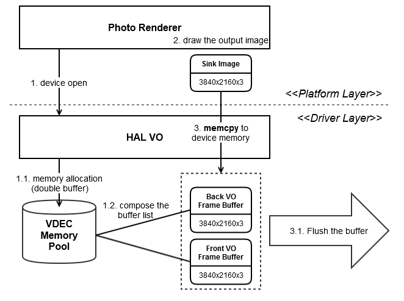
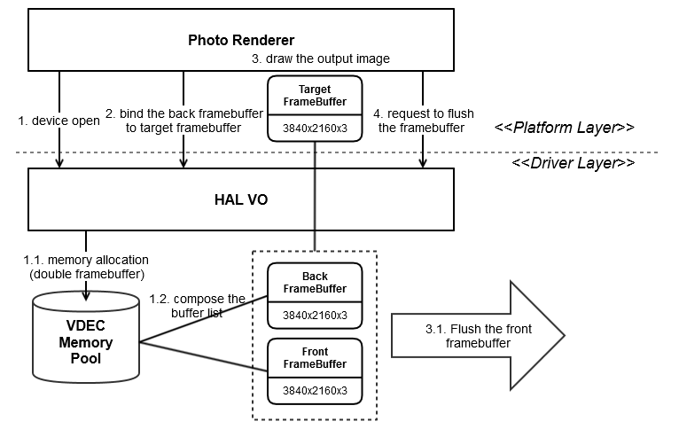
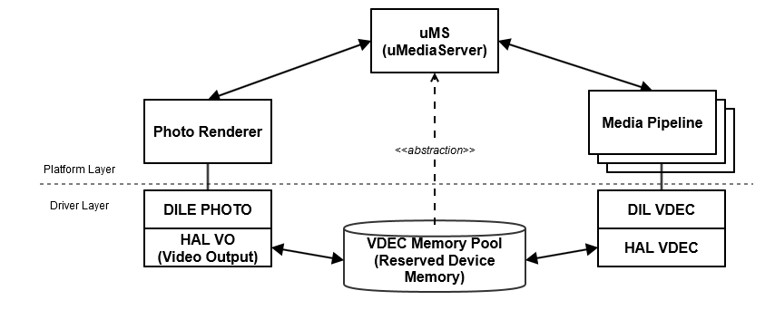

VO
==========

History
-------

======= ========== ============== =======
Version Date       Changed by     Comment
======= ========== ============== =======
1.0     2013-06-20 jh0506.lee     done
1.0.1   2013-10-21 jh0506.lee     done
1.1     2014-05-13 jh0506.lee     modify
1.1.1   2014-05-22 jh0506.lee     modify
1.1.2   2014-12-01 jh0506.lee     modify
1.2     2016-05-25 jh0506.lee     new
1.3     2016-06-13 jh0506.lee     modify
1.4     2018-02-36 jh0506.lee     modify
1.5     2019-08-27 jjaem.kim      HAL_VO_PANEL_TYPE add 8K UHD panel type
======= ========== ============== =======

Overall Description
--------------------

The photorenderer introduces a technique to draw the image directly on the VDEC memory (device memory), it leads to reduce the system memory usage.

HAL_VO Family Functions: memcpy sink image (system memory) of the photorenderer to the framebuffer (device memory) of the HAL VO module
The photorenderer allocates the system memory as the sink image. Invoking HAL_VO_DisplayPicture is to set the framebuffer to be duplicated with this sink image, and the HAL VO calls memcpy() function to do it.

Functions: HAL_VO_Open / HAL_VO_Close / HAL_VO_DisplayPicture / HAL_VO_Config / HAL_VO_RedrawPicture

HAL_VO_FB Family Functions: draw sink image (device memory) on the target framebuffer binded to the writable framebuffer - Not Available
The photorenderer gets the target framebuffer to draw the sink image and requests to flush it. The HAL VO is returns the writable framebuffer (maybe, back framebuffer) as the target framebuffer and flushs it though VDEC port.

Functions: HAL_VO_GetDeviceCapability / HAL_VO_Open / HAL_VO_Close / HAL_VO_SetAlphaBlending / HAL_VO_SetInOutDisplayRegion / HAL_VO_GetTargetFrameBuffer / HAL_VO_UpdateFrameBuffer

Terminology and Definitions
^^^^^^^^^^^^^^^^^^^^^^^^^^^^

================================= ======================================
Definition                        Description
================================= ======================================
VO                                Video Output
================================= ======================================

System Context
^^^^^^^^^^^^^^

Following Diagram is a system context around the photorenderer program.

Performance Requirements
^^^^^^^^^^^^^^^^^^^^^^^^^

Please refer to the performance requirements of each API function..

Design Constraints
^^^^^^^^^^^^^^^^^^^

There are no special requirements.

Functional Requirements
-----------------------

The data types and functions used in this module are as follows.

Data Types
^^^^^^^^^^^^
  * :cpp:type:`HAL_VO_PIXEL_FORMAT`
  * :cpp:type:`HAL_VO_PANEL_TYPE`
  * :cpp:type:`HAL_VO_CFG_TYPE`
  * :cpp:type:`HAL_VO_SUPPORT_PIXEL_FORMAT_T`
  * :cpp:type:`HAL_VO_SUPPORT_PANEL_TYPE_T`
  * :cpp:type:`HAL_VO_FB_FRAMEBUFFER_PROPERTY_FLAGS_T`
  * :cpp:type:`HAL_VO_RECT_T`
  * :cpp:type:`HAL_VO_IMAGE_T`
  * :cpp:type:`HAL_VO_CFG_VALUE_T`
  * :cpp:type:`HAL_VO_CFG_T`
  * :cpp:type:`HAL_VO_DEVICE_CAPABILITY_T`
  * :cpp:type:`HAL_VO_FB_FRAMEBUFFER_T`
  * :cpp:type:`HAL_VO_FB_FRAMEBUFFER_PROPERTY_T`

Function Calls
^^^^^^^^^^^^^^^

  * :cpp:func:`HAL_VO_Open`
  * :cpp:func:`HAL_VO_Config`
  * :cpp:func:`HAL_VO_DisplayPicture`
  * :cpp:func:`HAL_VO_Close`
  * :cpp:func:`HAL_VO_GetDeviceCapability`
  * :cpp:func:`HAL_VO_Connect` //except from socts, this will be deleted
  * :cpp:func:`HAL_VO_RedrawPicture` //except from socts, this will be deleted
  * :cpp:func:`HAL_VO_FB_Initialize` //except from socts, this will be deleted
  * :cpp:func:`HAL_VO_FB_Finalize`   //except from socts, this will be deleted
  * :cpp:func:`HAL_VO_FB_GetTargetFrameBuffer` //except from socts, this will be deleted
  * :cpp:func:`HAL_VO_FB_UpdateFrameBuffer`    //except from socts, this will be deleted
  * :cpp:func:`HAL_VO_FB_UpdateFrameBufferProperty` //except from socts, this will be deleted
