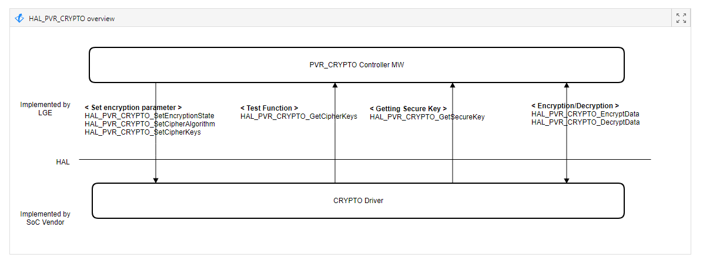

PVR
==========

History
-------

======= ========== ============== =======
Version Date       Changed by     Comment
======= ========== ============== =======
1.0.0   2022.5     hwachin.lee    Initial release
======= ========== ============== =======

Overall Description
--------------------
The interface of HAL_PVR_CRYTO series is a set of functions necessary to encrypt and decrypt the encrypted recording. The BSP Driver must cache the encoding parameters transmitted from the controller and encrypt and decrypt the transmitted data.

Terminology and Definitions
^^^^^^^^^^^^^^^^^^^^^^^^^^^^

================================= ======================================
Definition                        Description
================================= ======================================
PVR                               Module to record and play broadcasts
Encryption / Decryption           Encrypting and decrypting recordings
cipher key                        Base key for recording encryption. Each device has different cipher key.
secure key                        Key required for encryption of cipher key Every device has same secure key.
trust zone                        Secure zone for only authorized process
================================= ======================================

System Context
^^^^^^^^^^^^^^^

Performance Requirements
^^^^^^^^^^^^^^^^^^^^^^^^^
Both encryption and decryption of up to 4K 30 video must be performed in real time

Design Constraints
^^^^^^^^^^^^^^^^^^^
Both secure key and cipher key should be stored at trust zone.

Both encryption and decryption should be executed at trust zone.

Functional Requirements
-----------------------

The data types and functions used in this module are as follows.

Data Types
^^^^^^^^^^^
PVR_CIPHER_T
*************
This enum value is used to specify the format of the cipher algorithm used to encrypt the recording. Currently, PVR only uses PVR_CIPHER_AES_ECB.

.. code-block::

    typedef enum _PVR_CIPHER_T
    {
       PVR_CIPHER_NONE = 0,
       PVR_CIPHER_AES_ECB,
       PVR_CIPHER_AES_CBC
    } PVR_CIPHER_T;

================================= ======================================
Member                            Description
================================= ======================================
PVR_CIPHER_NONE                   Does not use cipher algorithm
PVR_CIPHER_AES_ECB                Use AES_ECB
PVR_CIPHER_AES_CBC                Use AES_CBC
================================= ======================================

PVR_CIPHER_KEY_T
*****************
This enum value specifies the type of cipher key used in PVR. Currently, only ODD type is used in PVR.

.. code-block::

    typedef enum _PVR_CIPHER_KEY_T
    {
       PVR_CIPHER_KEY_EVEN = 0,
       PVR_CIPHER_KEY_ODD
    } PVR_CIPHER_KEY_T;

================================= ======================================
Member                            Description
================================= ======================================
PVR_CIPHER_KEY_EVEN               Even key
PVR_CIPHER_KEY_ODD                Odd key
================================= ======================================

PVR_CIPHER_OPERATION_T
***********************
This enum value is used to specify the type of cipher operation. (You can specify separate keys for encryption and decryption)

.. code-block::

    typedef enum _PVR_CIPHER_OPERATION_T
    {
       PVR_CIPHER_OPERATION_ENCRYPT = 0,
       PVR_CIPHER_OPERATION_DECRYPT,
       PVR_CIPHER_OPERATION_NUM
    } PVR_CIPHER_OPERATION_T;

================================= ======================================
Member                            Description
================================= ======================================
PVR_CIPHER_OPERATION_ENCRYPT      Encrypt operation
PVR_CIPHER_OPERATION_DECRYPT      Decrypt operation
PVR_CIPHER_OPERATION_NUM          Number of all operations
================================= ======================================

PVR_CIPHER_TYPE_T
******************
This structure stores encryption-related overall information, and is used to set key and other information using the HAL_PVR_CRYPTO_[Set,Get]CipherKeys() API or to obtain already set information.

.. code-block::

    typedef struct _PVR_CRYPTO_TYPE_T
    {
       PVR_CIPHER_T             cipherAlgorithm;
       PVR_CIPHER_KEY_T         cipherKeyType;
       PVR_CIPHER_OPERATION_T   cipherOperation;
       UINT32                   keyBitLen;
       UINT8                    *pIV;
       UINT8                    *pCipherKey;
    } PVR_CRYPTO_TYPE_T;

================================= ======================================
Member                            Description
================================= ======================================
cipherAlgorithm                   Cipher Algorithm [none/AES_ECB/AES_CBC]
cipherKeyType                     Key type [EVEN/ODD]
cipherOperation                   Kind of operation[encrypt/decrypt]
keyBitLen                         Bit length of cipher key
pIV                               pointer of initial vector
pCipherKey                        Array of cipher key
================================= ======================================

Function Calls
^^^^^^^^^^^^^^^
  * :cpp:func:`HAL_PVR_InitializeCrypto`
  * :cpp:func:`HAL_PVR_FinalizeCrypto`
  * :cpp:func:`HAL_PVR_CRYPTO_SetEncryptionState`
  * :cpp:func:`HAL_PVR_CRYPTO_SetCipherAlgorithm`
  * :cpp:func:`HAL_PVR_CRYPTO_GetSecureKey`
  * :cpp:func:`HAL_PVR_CRYPTO_SetCipherKeys`
  * :cpp:func:`HAL_PVR_CRYPTO_GetCipherKeys`
  * :cpp:func:`HAL_PVR_CRYPTO_EncryptData`
  * :cpp:func:`HAL_PVR_CRYPTO_DecryptData`

