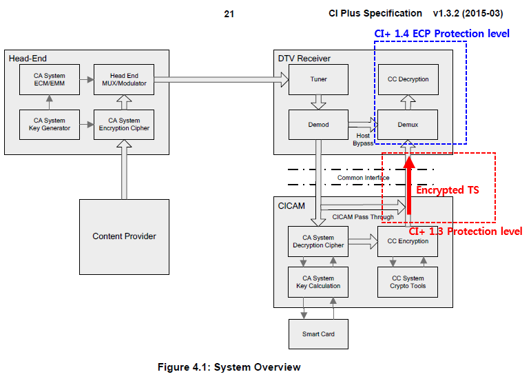
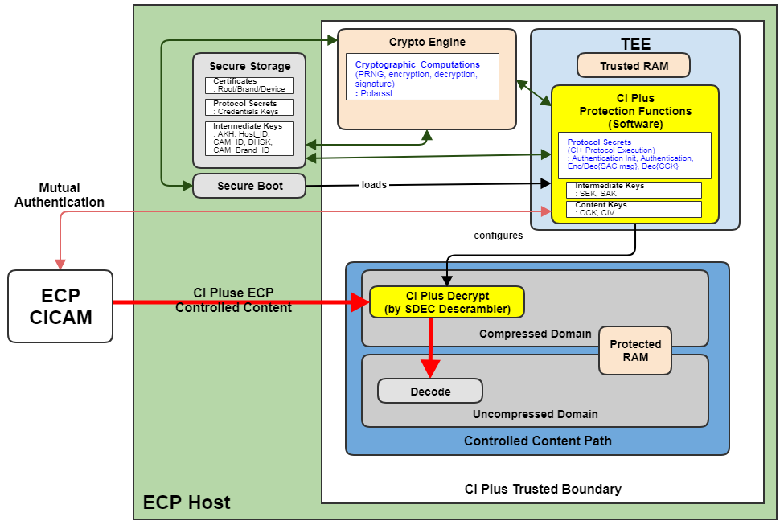
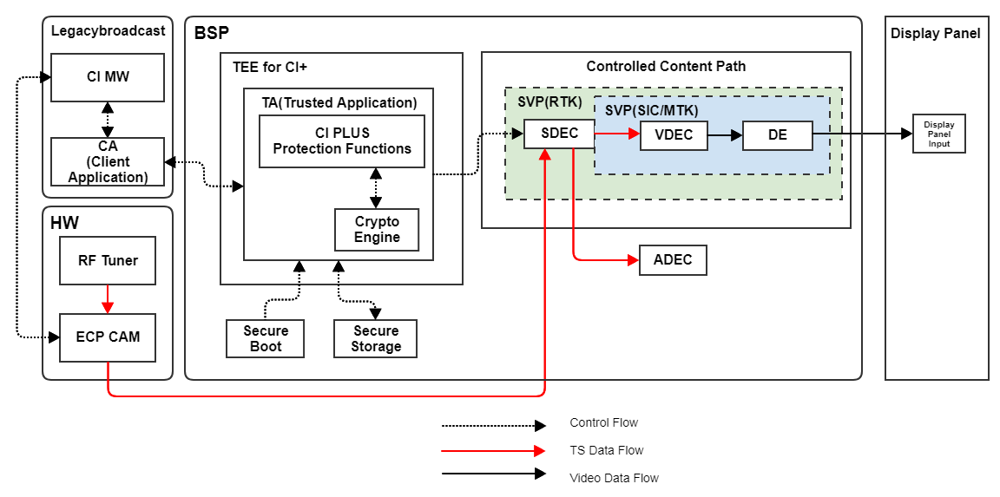
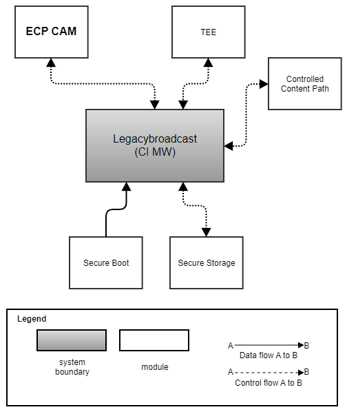
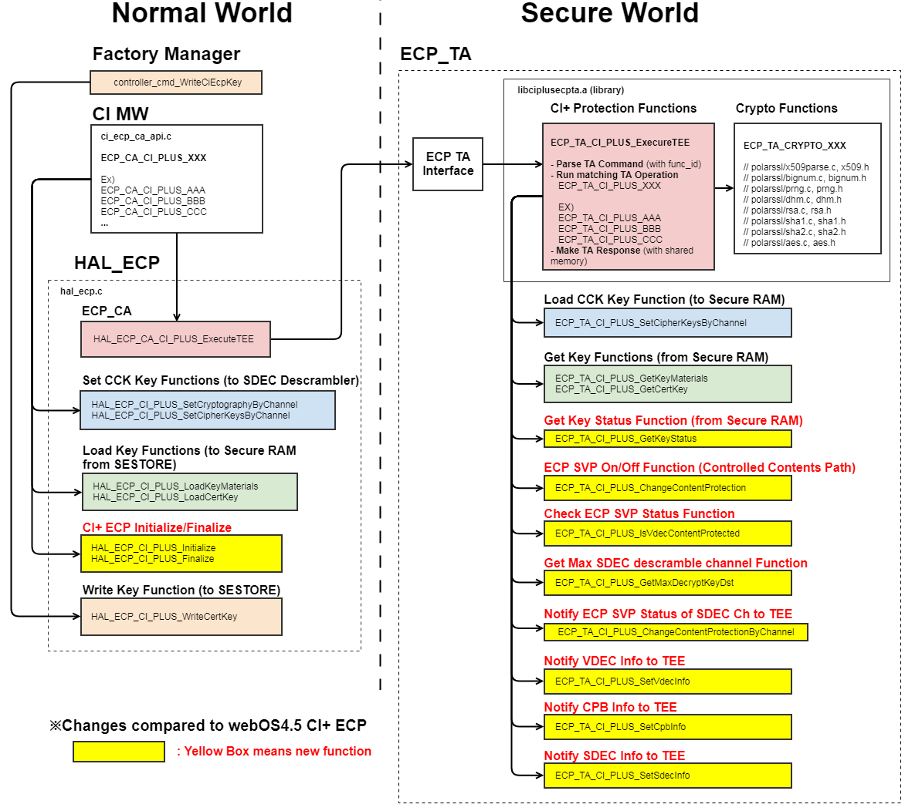
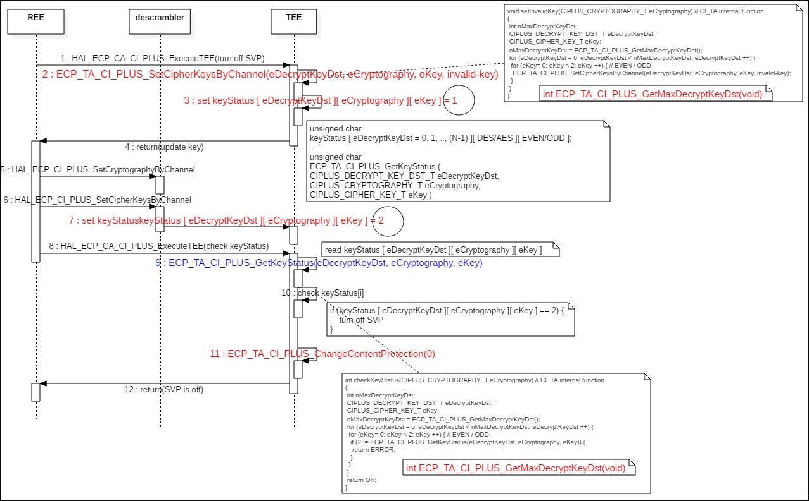
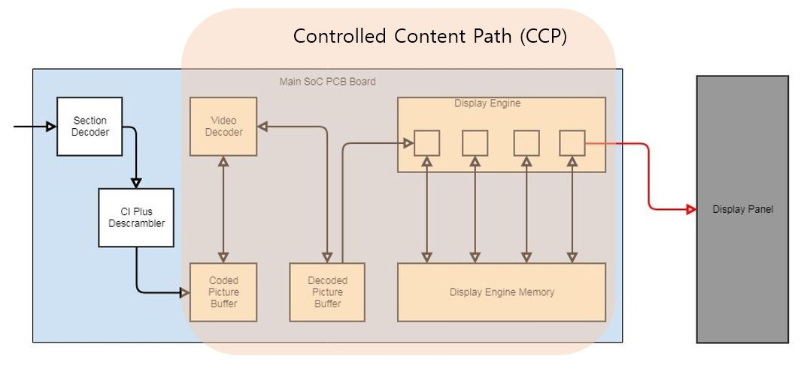

ECP
==========

History
-------

======= ========== ============== =======
Version Date       Changed by     Comment
======= ========== ============== =======
1.0.0   2022.04.20 sunwoong.yoo      Add Doc.
======= ========== ============== =======

Overall Description
--------------------

ECP (Enhanced Content Protection) is a CI+ protection technology of increased level for high quality contents like 4K, High-Dynmic Rage and High Frame Rate.

**Why CI+ ECP is needed?**
    * Recent technological advances of 4K, High-Dynamic Range and High Frame Rate, enable high quality Ultra High Definition (UHD) Content to be created.
    * Content owners require an increased level of protection for this high quality content, so called Enhanced Content Protection (ECP).
    * CI Plus LLP has defined a new CI Plus ECP Security Level as
    * To adapt to the latest developments in content security
    * To support the MovieLabs specifications for Next Generation Video and Enhanced Content Protection
    * Several European broadcasters have plans to adopt ECP functionality.
    * Thus, we need to apply this ECP for customers who want to watch UHD contents which is scrambled with ECP.

**What is the difference of protection level between CI+ ECP and CI+ 1.3?**
    * CI+ 1.3 Protection level is focused on preventing the hacking or attack about the TS which is from CAM to TV
    * CI+ ECP Protection level is focused on preventing the hacking or attack on internal TV systems (CI+ ECP is including the CI+ 1.3 Protection level)

**Why New HAL for CI+ ECP is needed?**
    * According to CI+ ECP Spec, CI+ Protection Functions should be protected and performed in TEE (Refer to the 1.1 CI+ ECP HW Block Diagram)
    * CI MW cannot access directly CI+ Protection Functions in TEE
    * CI MW will use Client Application(CA) to run the CI+ Protection Functions in TEE (Refer to the 1.2 CI+ ECP Big Picture)
    * Client Application(CA) will be implemented by new HAL (HAL_ECP)

**1.1 CI+ ECP HW Block Diagram**
    * Below block diagram is based on **ci-plus_ecp_robustness_considerations_attacks_and_countermeasures_v1.1.pdf**
    
if you see this page in HTML, please click below tag.
:download:`ci-plus_ecp_robustness_considerations_attacks_and_countermeasures_v1.1 <resource/ci-plus_ecp_robustness_considerations_attacks_and_countermeasures_v1.1.pdf>`

if you see this page in PDF, please check the ci-plus_ecp_robustness_considerations_attacks_and_countermeasures_v1.1.pdf in attachment tab of Adobe Reader
(View > Show/Hide > Navigation Panes > Attachments)

    * CI+ Protection Functions should be protected and performed in TEE

**1.2 CI+ ECP Big Picture**

Terminology and Definitions
+++++++++++++++++++++++++++++++

.. list-table:: 
  :widths: auto
  :header-rows: 1

  * - Definition
    - Description
  * - ECP
    - ECP (Enhanced Content Protection) is a CI+ protection of increased level for high quality contents like 4K, High-Dynmic Rage and High Frame Rate
  * - APDU
    - APDU (Application Protocol Data Unit) is used for all protocols in the Application Layer of CAM and Host(TV)
  * - CCK
    - CCK (Content Control Key) is used for descrambling of re-encryption TS from CAM
  * - Re-encryption
    - Re-encryption means CAM scramble the clear TS with AES-128-CBC or DES-56-ECB before sending it to Host(TV)
  * - TEE
    - Trusted Execution Environment (TEE) means a processing environment on a device that hardware-enforced prevents unauthorized hardware and software from discovering, modifying or interfering with its code and data
  * - Secret value
    - CI+ related keys like Device Keys, Content Keys, Intermediate Keys and Protocol Secrets
  * - Trust Value
    - CI+ Root/Brand/Device Certificate
  * - Protocol Secrets
    - all numerical, algorithmic and implementation secrets related to CI Plus protocol execution
  * - SDEC
    - Section Decoder
  * - VDEC
    - Video Decoder
  * - ADEC
    - Audio Decoder
  * - DE
    - DE is in charge of image quality processing for video data output from VDEC. Video data processed in quality is input to the Display Panel
  * - Display Panel
    - It is displayed on the Display Panel to display the video data that has been processed in quality to the user
  * - Display Panel Input
    - The video data that has been processed for quality is displayed on the Display Panel, which means the block just before being displayed on the physical panel

System Context
+++++++++++++++++++++++++

Performance Requirements
++++++++++++++++++++++++++++++++

NA

Design Constraints
++++++++++++++++++++++++

CI+ ECP SW Flow Diagram
^^^^^^^^^^^^^^^^^^^^^^^^^^^
* CI MW 
    * CI MW communicates with ECP CAM through command line interface of PCMCIA
    * If secure operation or calculation is needed, then CI MW will call the HAL function of ECP_CA to run CI+ Protection Function

* ECP_CA
    * ECP_CA communicates with ECP_TA based on SoC own TEE system
    * ECP_CA function is HAL_ECP_CA_CI_PLUS_ExecuteTEE
    * CA interface code for SoC own TEE system is in the function
    * The TA command data will be sent with func_id through the function

* ECP TA Interface
    * ECP TA Interface for SoC own TEE system is to handle the command from CA and to call the ECP_TA_CI_PLUS_ExecuteTEE

* CI+ Protection Functions
    * CI+ Protection Functions perform secure operation or calculation
    * After parse the TA command data with func_id by ECP_TA_CI_PLUS_ExecuteTEE, CI+ Protection Functions is performed
    * This is LG code and provided by library(.a) from LG

* Crypto Functions
    * It performs cryptographic computations
    * It only used by CI+ Protection Functions
    * This is LG code and provided by library(.a) with CI+ Protection Functions from LG

* To set CCK to SDEC Descrambler
    * In case of some SoC, ECP TA cannot set the CCK to SDEC Descrambler directly.
    * For considering every SoC's capabilities, there are two operation in secure world and normal world (The meaning of secure RAM is accessible memory only in the secure world, NOT in normal world. It's TEE memory)

    * ※ Two memory space is needed to save each 'even CCK' and 'odd CCK' because even/odd CCK can be set at same time in reset case

    * ※ In case of ECP SVP Off, several memory space will be more needed to set invalid key to all SDEC descramble channel (refer to the 1.4 CI+ ECP SVP Sequence Diagram and example of 4.7 ECP_TA_CI_PLUS_GetMaxDecryptKeyDst)
    
    * ※ Additionally, one memory space is needed to save the 'keyStatus'
        #. In secure world, ECP TA write the CCK and the keyStatus by 2 to secure RAM(TEE memory) when ECP_TA calls the Load CCK Key Functions
        #. In normal world, SDEC Descrambler read the CCK from the secure RAM(TEE memory) and save the keyStatus by 2 to secure RAM(TEE memory) when CI MW calls the Set CCK Key Functions (for more details, refer to the example of 3.6 HAL_ECP_CI_PLUS_SetCipherKeysByChannel)

* To read key from SESTORE
    * In case of some SoC, ECP TA cannot read the SESTORE directly.
    * For considering every SoC's capabilities, there are two operation in secure world and normal world (The meaning of secure RAM is accessible memory only in the secure world, NOT in normal world. It's TEE memory)

    1. In normal world, the key is loaded to secure RAM(TEE memory) from SESTORE when CI MW calls the Load Key Functions
    2. In secure world, ECP TA read the key from secure RAM(TEE memory) by Get Key Functions

* Factory Manager
    * When CI+ ECP Key is downloaded by Key Write Tool in Factory, Factory Manager service will call the Write Key Functions to write the CI+ ECP Key buffer to SESTORE directly

* Notify REE info to TEE for security enhancements
    * This design is for security enhancements. 
    * Some SoC can already know these information in TEE, then the SoC can ignore this API call.
    * Some SoC can need additional information from REE, then request it to LG CI Engineer.

    #. void ECP_TA_CI_PLUS_SetCpbInfo (unsigned int sizeOfCpb, unsigned int offsetOfCpb)
        * This API will be used to protect only VDEC port of watching ECP channel because we need to consider USB play case at same time.
        * Even if SoC can protect whole VDEC port by ECP_TA_CI_PLUS_ChangeContentProtection(1), SoC should protect only VDEC port of watching ECP channel 
    #. void ECP_TA_CI_PLUS_SetVdecInfo(unsigned char portOfVtp, unsigned char portOfVdec)
        * This API will be used to protect the change of VDEC port by force from any attack   
    #. void ECP_TA_CI_PLUS_SetSdecInfo(unsigned char channelOfSdec, unsigned char numberOfPids, unsigned short *valueOfPids)
        * This API will be used to protect the change of video pid to PES type by force from any attack
    #. DTV_STATUS_T ECP_TA_CI_PLUS_ChangeContentProtectionByChannel(CIPLUS_DECRYPT_KEY_DST_T eDecryptKeyDst, int nSecurityLevel)
        * This API provide the SDEC channel info of watching ECP and the ECP SVP status of the channel.
        * PVR can refer to the information before operation.
        4-1) PVR should block attempts to access the channel of nSecurityLevel is non-zero.
        4-2) In case of two tuner model, there is one ECP channel watching and one FTA channel recording case. Before start record, PVR can know whether PVR channel is ECP SVP or not.

CI+ ECP SVP Sequence Diagram (SVP Off Case) 
^^^^^^^^^^^^^^^^^^^^^^^^^^^^^^^^^^^^^^^^^^^^^^^
: This is for HAL_ECP_CI_PLUS_SetCipherKeysByChannel, ECP_TA_CI_PLUS_SetCipherKeysByChannel, ECP_TA_CI_PLUS_GetKeyStatus, ECP_TA_CI_PLUS_GetMaxDecryptKeyDst.

**What is ECP SVP?**
    * ECP SVP means ECP Controlled Content Path (CCP) defined in **ci-plus_ecp_robustness_considerations_attacks_and_countermeasures_v1.1.pdf**

if you see this page in HTML, please click below tag.
:download:`ci-plus_ecp_robustness_considerations_attacks_and_countermeasures_v1.1 <resource/ci-plus_ecp_robustness_considerations_attacks_and_countermeasures_v1.1.pdf>`

if you see this page in PDF, please check the ci-plus_ecp_robustness_considerations_attacks_and_countermeasures_v1.1.pdf in attachment tab of Adobe Reader
(View > Show/Hide > Navigation Panes > Attachments)

    * Some SoC call ECP SVP as Full Video Path or Whole Video Path

ECP Controlled Content Path is described like following in **ci-plus_ecp_robustness_considerations_attacks_and_countermeasures_v1.1.pdf**

if you see this page in HTML, please click below tag.
:download:`ci-plus_ecp_robustness_considerations_attacks_and_countermeasures_v1.1 <resource/ci-plus_ecp_robustness_considerations_attacks_and_countermeasures_v1.1.pdf>`

if you see this page in PDF, please check the ci-plus_ecp_robustness_considerations_attacks_and_countermeasures_v1.1.pdf in attachment tab of Adobe Reader
(View > Show/Hide > Navigation Panes > Attachments)

The ECP Controlled Content Path (CCP) is the path followed by the ECP Controlled Content from reception by the Host until storage, export to network or display on the user screen.
This path should implement end-to-end security in the sense that non-encrypted ECP Controlled Content should never be accessible from outside the CI Plus Trusted Boundary.
The content itself is mainly video content. This content usually undergoes several transformations before being finally displayed to the user, including:
    * Decryption;
    * Re-protection;
    * Decoding/Transcoding;
    * Composition;
    * Rendering.

There are several ways of implementing a secure ECP Controlled Content Path:
    * Each operation can be implemented by a separate hardware block;
    * All operations can be performed in isolated regions of the RAM.

The ECP Controlled Content Path should at least guarantee that:
    * The outside of the CI Plus Trusted Boundary (which includes the REE) cannot access unencrypted data in any of the video buffers;
    * The inside of the CI Plus Trusted Boundary (which includes the TEE) should have the minimal required permissions, i.e. write access but no read access to unencrypted data in the audio or video buffers when not required.
  For instance, if the transformations on video content are implemented by several hardware blocks, then the TEE may need write access to these blocks but the TEE should have no read access to the final video content (which may be unencrypted).

When leaving the CI Plus Trusted Boundary to be displayed on the screen or exported to network, the output should be protected using DTCP-IP, HDCP 1.4 or HDCP 2.2.

It is important that the RAM of the ECP Controlled Content Path is protected against physical data extraction, such as by using encryption or scrambling. The RAM may also be protected against software attacks that may target the REE using memory filtering and memory partitioning.
The configuration of the memory partition and memory filters should be securely controlled.
The encryption/scrambling should take place before the data leaves the main SoC to prevent bus probing, i.e. prevent an attacker from acquiring unprotected content during transit from the SoC to the RAM.

Functional Requirements
-----------------------

Data Types
+++++++++++++++
NA

Function Calls
++++++++++++++++

  * :cpp:func:`HAL_ECP_CI_PLUS_Initialize`
  * :cpp:func:`HAL_ECP_CI_PLUS_Finalize`
  * :cpp:func:`HAL_ECP_CA_CI_PLUS_ExecuteTEE`
  * :cpp:func:`HAL_ECP_CI_PLUS_LoadKeyMaterials`
  * :cpp:func:`HAL_ECP_CI_PLUS_LoadCertKey`
  * :cpp:func:`HAL_ECP_CI_PLUS_WriteCertKey`
  * :cpp:func:`HAL_ECP_CI_PLUS_SetCryptographyByChannel`
  * :cpp:func:`HAL_ECP_CI_PLUS_SetCipherKeysByChannel`

