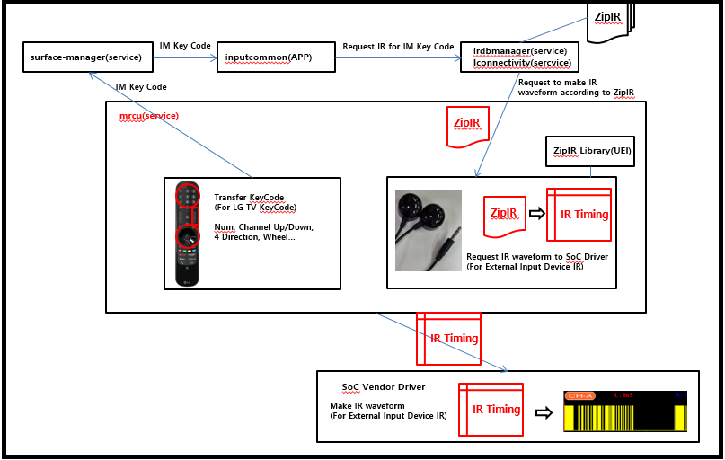

IR Blaster
##########

.. sivashankari.m: sivashankari.m@lge.com

Introduction
************

| This document describes the IR Blaster wave form generation using the SoC vendor. The document gives an overview of the IR blaster wave form generation and provides details about its functionalities.

| The UEI is responsible for gathering the IR keycode information about the different external devices like Set top box, OTT, Blueray player and its collaborate with SOC vendor for generate IR Blaster wave form for a gathered IR keycode. Therefore, it is necessary to understand wave form generation API parameters and its output.

| **Implementation that NDA between UEI company and SoC vendor is required for function development**

Revision History
================

+--------------+------------+----------------------+---------------+
| Version      | Date       | Changed by           | Description   |
+==============+============+======================+===============+
|1.0           |2023.11.22  |sivashankari.m@lge.com|First release  |
+--------------+------------+----------------------+---------------+

Terminology
===========

| The key words "must", "must not", "required", "shall", "shall not", "should", "should not", "recommended", "may", and "optional" in this document are to be interpreted as described in RFC2119.

| The following table lists the terms used throughout this document:

=============================== ===============================
Term                            Description
=============================== ===============================
IR Blaster                      Infrared blaster
=============================== ===============================

Technical Assistance
====================

| For assistance or clarification on information in this guide, please create an issue in the LGE JIRA project and contact the following person:

=============== =======================
Module          Owner
=============== =======================
MRCU            raja.rathinavel@lge.com
=============== =======================

Overview
********

General Description
===================

| An infrared (or IR) blaster is a gadget that accepts some sort of input from the remote and "blasts" it via to the IR-compatible device. The IR remote control sends a modulated IR light signal to a receiver (in a TV or other appliance) that encodes a control data stream. The appliance then demodulates and decodes the data stream and acts accordingly.

| The equipment connected to the TV is various such as a set-top box, a Blu-ray player, and a sound bar, and LG TV provides functions to control such equipment with its magic remote control. LGTV provides an IRBlaster function for device control management. IRBlaster is a function for generating IR waveforms for the purpose of controlling external equipment connected to a TV.

Features
========

| The IR Blaster provides the following features:

- This copies the functionality of an infrared remote (that comes bundled with devices) to control the same appliance
- IR blasters send out much stronger signals than the average remote. So, they can be particularly useful when dealing with appliances with less sensitive IR sensors
- An IR blaster can be used to implement remote control of components from a mobile phone, tablet, or computer

Architecture
============

Internal Architecture
---------------------

- Internally when press the key from the MRCU, The lginput service will convert the LG keycode to IM Key code and its sends through the surface manager and inputcommon(APP) service to irdbmanager for request to convert the IM key code to corresponding connected external device IR.

- The converted IR key information sends to the iconnectivity service for request to UEI for generate the ZipIR.

- Once the ZipIR generated by the UEI, that information send to the lginput for request to make the IR waveform according to ZipIR.

- For generating the waveform using the SOC vendor API.

- The generated waveforms blasted to the external devices from the IR blaster.

Implementation
**************

| The IR Blaster generates an IR signal for the desired key on the SoC to control external equipment. IR for controlling external devices is generated through IR parameters provided by UEI company. The IRB HAL layer serves to generate IR waveforms with the received IR parameters.

File Location
=============

The HAL interfaces are defined in the hal_ird.h header file

API List
========

The lginput service implementation must adhere to the waveform generation interface specifications defined and implements its IR waveform generation

Data Types
----------

Extended Structures
^^^^^^^^^^^^^^^^^^^

  .. list-table::
    :header-rows: 1
    
    * - **Structure**
      - **Member Description**
    * - uei_irb_waveform_t
      - - numToggleIndex -> It is for the Philips protocols and for configuring the toggle bit. The value (1,2 or 4) is the number of waveform

        - *characteristicTime -> Time value to be composed of MAKE/REPEAT/BREAK signal
        
        - numCharTimes -> The number of the characteristic time
        
        - numMakeTimes -> The number of the MAKE time
        
        - *makeTimes -> Index of the characteristic to construct the MAKE waveform
        
        - numRepeatTimes -> The number of the REPEAT time
        
        - *repeatTimes -> Index of the characteristic to construct the REPEAT waveform
        
        - numBreakTimes -> The number of the BREAK time
        
        - *breakTimes -> Index of the characteristic to construct the BREAK waveform

Functions
---------

Extended Controls
^^^^^^^^^^^^^^^^^

The following table lists the LG extended IR Blaster waveform generation

================================= ===================================================================================================
Control ID                        Description
================================= ===================================================================================================
HAL_IRB_GenerateUEIWaveform()	  | Is a SoC Vendor Driver wrapper function(HAL Layer) for generate the IR blaster UEI waveform
================================= ===================================================================================================

References
**********

For additional information on related standards or technical topics, refer to:

- <https://en.wikipedia.org/wiki/Infrared_blaster>

