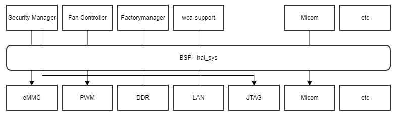

SYS
####

.. _khkh.lee: khkh.lee@lge.com
.. _denis.hong: dinis.hong@lge.com
.. _kwangseok.kim: kwangseok.kim@lge.com
.. _abhishek.p: abhishek.p@lge.com
.. _jaesung5.lee: jaesung5.lee@lge.com 
.. _hedaesik.kim: hedaesik.kim@lge.com
.. _jongyeon.yoon : jongyeon.yoon@lge.com
.. _hedaesik.kim : hedaesik.kim@lge.com

Introduction
************

| This document describes the common system function(SYS) in the HAL(Hardware Abstraction Layer) libs layer of the webOS. This document provides details about its functionalities and implementation requirements.

Revision History
================

======= ========== ===================== =============
Version  Date        Changed by          Description
======= ========== ===================== =============
2.0.0   2023.11      `khkh.lee`_         Change format & Update contents
1.0.0   2022.6.14    `denis.hong`_       First release
======= ========== ===================== =============

Terminology
===========

| The following table lists the terms used in the webOS. HAL_SYS functions to support some modules, so you should also refer to the modules related to the fuction. 

**webOS TV & System specification**

=============================== ===============================
Term                            Description
=============================== =============================== 
Fan Contoller                   webOS system service. Fan Controller is a S/W developed to control the installed fan H/W to reduce the temperature inside the TV and provide temperature information of the SoC and external FRC chip.
DFT                             Digital Function Test system. The PCB is inspected in the factory prior to manufacturing, so we should provide functions for DFT inspection.
WOL                             Wake On Lan. To power on by network.
PWM                             Pulse Width Modulation
Debug Port                      Debug port is for debugging port such as Jtag or etc.
RPMB                            Replay Protection Memory Block
=============================== ===============================

Technical Assistance
====================

For assistance or clarification on information in this guide, please create an issue in the LGE JIRA project and contact the following person:

================== ==============================================
Module             Owner
================== ==============================================
Fan Contoller(PWM) `kwangseok.kim`_
STD/STR            `abhishek.p`_
WOL                `jaesung5.lee`_
Security(RPMB)     `hedaesik.kim`_
etc..              `khkh.lee`_ & `kwangseok.kim`_
================== ==============================================

Overview
********

General Description
===================

SYS is to support for various functions associated with the system or others.
The main features provided are :

  * Set debug port
      - A debug port, such as JTAG, is used for debugging during the development period. However, this port should not be used after development. Therefore, the SoC vendor must provide a way to control the debug port.
  * Memory test in DFT process
      - Memory test function
  * Get/Set PWM data from Fan controller
      - It provides control over the PWM for the cooling fan.
  * Check RPMB Partition
      - It provides RPMB infomation 

Architecture
============

SYS is designed to support various functions associated with the system or others. Please refer to the image below.

Requirements
************
This section describes the requirments of the SYS module.

Functional Requirements
=======================
The data types and functions used in this module are described in the Data Types and Functions in the API List. Please refer to the functional requirements of each function.

Quality and Constraints
=======================
Please refer to the performance requirements and constraints of each function the API Reference.

Implementation
**************

| This section provides supplementary materials that are useful for SYS Function implementation.

    * The File Location section provides the location of the Git repository where you can get the header file in which the interface for the SYS module implementation is defined.
    * The API List section provides a brief summary of SYS APIs that you must implement.

File Location
=============

The SYS interfaces are defined in the hal_sys.h header file, which can be obtained from https://swfarmhub.lge.com/.

    - Git repository: bsp/ref/hal-libs-header

This Git repository contains the header files for the SYS implementation as well as documentation for the SYS implementation guide and SYS API reference.

API List
========
The SYS implementation must adhere to the interface specifications defined and implements its functions. Refer to the API Reference for more details.

Data Types
----------

Extented Structures
^^^^^^^^^^^^^^^^^^^^

=========================================== ===========================================================
Name                                        Description
=========================================== ===========================================================
:c:macro:`HAL_SYS_PWM_CAPABILITY_INFO_T`      Structure of PWM Capability Infomaition. 
=========================================== ===========================================================

Extented Enumerations
^^^^^^^^^^^^^^^^^^^^

=========================================== ===========================================================
Name                                        Description
=========================================== ===========================================================
:c:macro:`DFT_MEM_TEST_RESULT_T`             About Memory Test Result. 
=========================================== ===========================================================

Functions
---------

Extented Functions
^^^^^^^^^^^^^^^^^^

=========================================== ===========================================================
Function                                    Description
=========================================== ===========================================================
:cpp:func:`HAL_SYS_LockDebugPort`           Enable/Disable debug port(T32, register tool, debug tool)    
:cpp:func:`HAL_SYS_SetWolOnOff`             Enable/Disable WOL. except from socts, right assignment is required
:cpp:func:`HAL_SYS_GetWolStatus`            Get WOL Status. except from socts, right assignment is required
:cpp:func:`HAL_SYS_WakeUpInternalMicom`     Used only for RTK. WAKE Up Internal Micom. except from socts, this function supports up to webOS4.5
:cpp:func:`HAL_SYS_ReadBootData`            Used only for MTK. Read for boot area. except from socts, this function supports up to webOS4.5
:cpp:func:`HAL_SYS_WriteBootData`           Used only for MTK. Write for boot area. except from socts, this function supports up to webOS4.5
:cpp:func:`HAL_SYS_ReadPMData`              Used only for MTK. Read for Internal Micom. except from socts, right assignment is required
:cpp:func:`HAL_SYS_WritePMData`             Used only for MTK. Write for Internal Micom. eexcept from socts, right assignment is required
:cpp:func:`HAL_IPC_Write`                   Used only for RTK. For webOS and Internal Micom communicatoin. except from socts, right assignment is required
:cpp:func:`HAL_IPC_Read`                    Used only for RTK. For webOS and Internal Micom communicatoin. except from socts, right assignment is required
:cpp:func:`HAL_SYS_CheckRPMBPartition`      Check RPMB Partition.(This is for security team.) except from socts, tright assignment is required
:cpp:func:`HAL_SYS_StartDFTMemTest`         DDR memory test in DFT proces.
:cpp:func:`HAL_SYS_GetDFTMemTestResult`     Get DDR memory test results in DFT process
:cpp:func:`HAL_SYS_GetPWMCapability`        Get PWM Capability for Fan controller
:cpp:func:`HAL_SYS_SetPWM`                  Set PWM for Fan controller
:cpp:func:`HAL_SYS_GetPWMData`              Get PWM Data for Fan controller
:cpp:func:`HAL_SYS_CheckModelIdStatus`      except from socts, check that modeil id key is exit in RPMB
=========================================== ===========================================================

Implementation Details
======================

| SYS API is common API based HW Layer(HAL) for various modules. So SYS API is simple and the header file already has details comment for each functions. 

| please refer to `hal_sys.h <https://wall.lge.com/gitweb?p=bsp/ref/hal-libs-header.git;a=blob;f=hal_inc/hal_sys.h;h=858195c036d04e836f6e839aac036d48352a1474;hb=refs/heads/master>`_

Testing
*******
To test the implementation of the SYS module, webOS TV provides SoCTS (SoC Test Suite) tests. The SoCTS checks the basic operations of the SYS module and verifies the kernel event operations for the module by using a test execution file. 
For more information, see :doc:`HAL SYS's SoCTS Unit Test manual. </part4/socts/Documentation/source/producer-manual/producer-manual_hal/producer-manual_hal-sys>`

