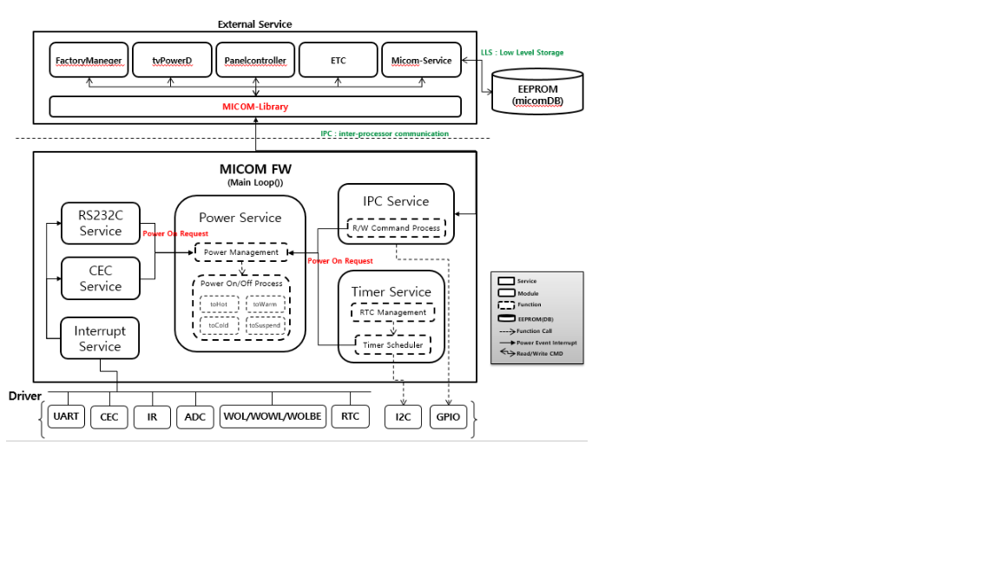

UCOM
==========

History
-------

======= ========== ============== =====================================
Version Date       Changed by     Comment
======= ========== ============== =====================================
1.0.0   2022-04-13 joonwoo.hong   First release
1.0.1   2022-06-02 joonwoo.hong   Modify documentation format
1.0.2   2022-11-15 sungbae.park   Modify documentation new format
======= ========== ============== =====================================

Overall Description
--------------------

The Internal Micom module is included inside the Main SOC.
This is controlled using IPC communication between Main SOC and Micom.(ex. MailBox Commuication)

The main features are as follows.
   1. Remote control and local key scan function.
   2. External interrupt processing through GPIO port control(AMP Mute, WOL/WOWL, etc)
   3. RTC function
   4. Timer function(On Timer, Reservation, OTA, etc)
   5. Power Management

After the Micom standardization work, the inside of FW is also divided into LG Application Layer (common area) and Driver Layer (separated area).
LG Application <-> API is provided to exchange information between drivers.

Terminology and Definitions
^^^^^^^^^^^^^^^^^^^^^^^^^^^^
Definitions of terms and abbreviations used in this document are as follows.

================================= ===============================================================
Definition                        Description
================================= ===============================================================
IR                                infrared, used for remote control
RTC                               Real Time Clock
CEC                               Consumer Electronics Control
WOL/WOWL                          Wake On LAN / Wake On Wireless LAN
ADC                               Analog to Digital Converter
ISR                               Interrupt Service Routine
Instant Boot                      same with QSM+ boot or STR boot
BDP                               Burnt Detect Protection
Micom-libs                        Execute IPC communication between micom F/W and other services.
================================= ===============================================================

System Context
^^^^^^^^^^^^^^

Performance Requirements
^^^^^^^^^^^^^^^^^^^^^^^^^

Please refer to the performance requirements of each API function.

Design Constraints
^^^^^^^^^^^^^^^^^^^

Please refer to the constraints of each API function.

Functional Requirements
-----------------------

The data types and functions used in this module are as follows.

Data Types
^^^^^^^^^^^^

typedef UINT32 (* UCOM_KEY_CALLBACK_T) (UINT8 value, UINT8 repeat );

typedef enum {
	OK					= 0,
	NOT_OK				= -1,
	INVALID_PARAMS		= -2,
	TIMEOUT 			= -3,
} DRV_STATUS_T;

typedef struct KEY_DATA_T {
	UINT8 Cus;
	UINT8 xorCus;
	UINT8 Key;
	UINT8 xorKey;
} KEY_DATA;

typedef enum PWM_ChNum {
	PWM_CH0,
	PWM_CH1,
	PWM_CH2,
	PWM_CH3,
	PWM_CH4,
	PWM_CH5,
	PWM_CH6,
	PWM_CH7,
} PWM_ChNum;

typedef struct TIME_T {
	UINT8 YearHigh;
	UINT8 YearLow;
	UINT8 Month;
	UINT8 Week;
	UINT8 Day;
	UINT8 Hour;
	UINT8 Min;
	UINT8 Sec;
	UINT8 Mode;
	UINT8 enable_flag;
	UINT8 force_disable;
} TIME;

typedef enum UART_BAUDRATE_T
{
	BAUDRATE_2400 = 0,
	BAUDRATE_4800,
	BAUDRATE_9600,
	BAUDRATE_14400,
	BAUDRATE_19200,
	BAUDRATE_38400,
	BAUDRATE_57600,
	BAUDRATE_115200,
	BAUDRATE_460800,
	BAUDRATE_UNKNOWN
} UART_BAUDRATE_TYPE;

Function Calls
^^^^^^^^^^^^^^

  * :func:`HAL_UCOM_Initialize`
  * :func:`HAL_UCOM_ReadCommand`
  * :func:`HAL_UCOM_WriteCommand`
  * :func:`HAL_UCOM_WholeChipReset`

*. UCOM FW DRV Function List The definition below is MICOM-related Driver Function List information.
   Functions such as simple port change are replaced with Description.
   The sample is written in any one of SoC Vendor because the driver's internal implementation method is different for each SoC.
   Therefore, it is used as a reference, not a mandatory requirement.

Reference Function Calls
^^^^^^^^^^^^^^^^^^^^^^^^

  * :func:`DRV_PowerOff`
  * :func:`DRV_PowerOn`
  * :func:`DRV_IR_Init`
  * :func:`DRV_IR_Enable`
  * :func:`DRV_IR_Disable`
  * :func:`DRV_IR_GetRawData`
  * :func:`DRV_IR_ClearBuf`
  * :func:`DRV_ADC_Init`
  * :func:`DRV_ADC_Read`
  * :func:`DRV_CEC_Init`
  * :func:`DRV_CEC_Enable`
  * :func:`DRV_CEC_Disable`
  * :func:`DRV_CEC_SendMessage`
  * :func:`DRV_CEC_ReceiveMessage`
  * :func:`DRV_WOL_Enable`
  * :func:`DRV_WOL_Disable`
  * :func:`DRV_WOL_Get_Status`
  * :func:`DRV_WOWL_Enable`
  * :func:`DRV_WOWL_Disable`
  * :func:`DRV_WOV_Enable`
  * :func:`DRV_WOV_Disable`
  * :func:`DRV_IPC_Init`
  * :func:`DRV_IPC_ReadBuffer`
  * :func:`DRV_IPC_WriteBuffer`
  * :func:`DRV_NVM_Init`
  * :func:`DRV_NVM_Read`
  * :func:`DRV_NVM_Write`
  * :func:`DRV_PWM_Init`
  * :func:`DRV_PWM_SetDuty`
  * :func:`DRV_PWM_GetDuty`
  * :func:`DRV_RTC_Init`
  * :func:`DRV_RTC_SetCounter`
  * :func:`DRV_RTC_GetCounter`
  * :func:`DRV_GPIO_init`
  * :func:`DRV_GPIO_Set`
  * :func:`DRV_GPIO_Get`
  * :func:`DRV_GPIO_SetDirection`
  * :func:`DRV_TIMER_Init`
  * :func:`DRV_TIMER_Delayms`
  * :func:`DRV_UART_Init`
  * :func:`DRV_UART_Enable`
  * :func:`DRV_UART_Disable`
  * :func:`DRV_UART_GetLine`
  * :func:`DRV_UART_ClearBuf`
  * :func:`DRV_UART_SetBaudrate`

Implementation
--------------

DRV_PowerOff
^^^^^^^^^^^^

.. function:: DRV_STATUS_T DRV_PowerOff(BOOLEAN fSTR)
    'SoC Vendor' Driver Power Off Function

  **Functional Requirements**
    Start to SoC Driver Power Off Sequence(LG power off flow -> Driver power off flow)

  **Responses to abnormal situations, including**
    Micom FW operation will be abnormal

  **Performance Requirements**
    There is no performance requirements

  **Constraints**
    There is no constraints

  **Functions & Parameters**
    DRV_STATUS_T DRV_PowerOff(BOOLEAN fSTR)

    For the data type, following data types are defined
    fSTR        [IN] Suspend(SRT)/Cold(STD) mode decide data

  **Return Value**
    OK if the function success, NOT_OK otherwise

  **Example**
    DTV_STATUS_T ret;
    UINT8 fSTR = TRUE;
    ret = DRV_PowerOff(fSTR);

DRV_PowerOn
^^^^^^^^^^^

.. function:: DRV_STATUS_T DRV_PowerOn(void)
    'SoC Vendor' Driver Power On Function

	**Functional Requirements**
	  Start to SoC Driver Power On Sequence(LG power on flow -> Driver power on flow)

	**Responses to abnormal situations, including**
	  Micom FW operation will be abnormal

	**Performance Requirements**
	  There is no performance requirements
	
	**Constraints**
	  There is no constraints
	
	**Functions & Parameters**
	  DRV_STATUS_T DRV_PowerOn(void)
	
	  For the data type, following data types are defined
	  NA
	
	**Return Value**
	  OK if the function success, NOT_OK otherwise
	
	**Example**
	  DTV_STATUS_T ret;
	  ret = DRV_PowerOn();

DRV_IR_Init
^^^^^^^^^^^

.. function:: void DRV_IR_Init(void)
    'SoC Vendor' Remocon Initialize Function

	**Functional Requirements**
	  Set Remocon Driver Settings Initialize

	**Responses to abnormal situations, including**
	  Remocon operation will be abnormal

	**Performance Requirements**
	  There is no performance requirements
	
	**Constraints**
	  There is no constraints
	
	**Functions & Parameters**
	  void DRV_IR_Init(void)
	
	  For the data type, following data types are defined
	  NA
	
	**Return Value**
	  There is no return value
	
	**Example**
	  DRV_IR_Init();

DRV_IR_Enable
^^^^^^^^^^^^^

.. function:: void DRV_IR_Enable(void)
    'SoC Vendor' Remocon Process Start Function

	**Functional Requirements**
	  Set Remocon Driver Process Start

	**Responses to abnormal situations, including**
	  Remocon operation will be abnormal

	**Performance Requirements**
	  There is no performance requirements
	
	**Constraints**
	  There is no constraints
	
	**Functions & Parameters**
	  void DRV_IR_Enable(void)
	
	  For the data type, following data types are defined
	  NA
	
	**Return Value**
	  There is no return value
	
	**Example**
	  DRV_IR_Enable();

DRV_IR_Disable
^^^^^^^^^^^^^^

.. function:: void DRV_IR_Disable(void)
    'SoC Vendor' Remocon Process Stop Function

	**Functional Requirements**
	  Set Remocon Driver Process Stop

	**Responses to abnormal situations, including**
	  Remocon operation will be abnormal

	**Performance Requirements**
	  There is no performance requirements
	
	**Constraints**
	  There is no constraints
	
	**Functions & Parameters**
	  void DRV_IR_Disable(void)
	
	  For the data type, following data types are defined
	  NA
	
	**Return Value**
	  There is no return value
	
	**Example**
	  DRV_IR_Disable();

DRV_IR_GetRawData
^^^^^^^^^^^^^^^^^

.. function:: DRV_STATUS_T DRV_IR_GetRawData(KEY_DATA *raw_data, UINT8 *keytype)
    'SoC Vendor' Remocon raw data read Function

	**Functional Requirements**
	  Read Remocon Raw Data from Driver

	**Responses to abnormal situations, including**
	  Remocon operation will be abnormal

	**Performance Requirements**
	  There is no performance requirements
	
	**Constraints**
	  There is no constraints
	
	**Functions & Parameters**
	  DRV_STATUS_T DRV_IR_GetRawData(KEY_DATA *raw_data, UINT8 *keytype)
	
	  For the data type, following data types are defined
	  *raw_data        [IN/OUT] remocon keycode data
	  *keytype         [IN/OUT] remocon key type(single/repeat)
	
	**Return Value**
	  OK if the function success, NOT_OK otherwise
	
	**Example**
	  typedef struct KEY_DATA_T
      {
          UINT8 Cus;
          UINT8 xorCus;
          UINT8 Key;
          UINT8 xorKey;
      } KEY_DATA;

	  DTV_STATUS_T ret;
	  KEY_DATA raw_data;
	  UINT8 keytype;
	  ret = DRV_IR_GetRawData(&raw_data, &keytype);

DRV_IR_ClearBuf
^^^^^^^^^^^^^^^

.. function:: void DRV_IR_ClearBuf(void)
    'SoC Vendor' Remocon buffer and values clear Function

	**Functional Requirements**
	  Set Remocon buffer and values clear

	**Responses to abnormal situations, including**
	  Remocon operation will be abnormal

	**Performance Requirements**
	  There is no performance requirements
	
	**Constraints**
	  There is no constraints
	
	**Functions & Parameters**
	  void DRV_IR_ClearBuf(void)
	
	  For the data type, following data types are defined
	  NA
	
	**Return Value**
	  There is no return value
	
	**Example**
	  DRV_IR_ClearBuf(void);

DRV_ADC_Init
^^^^^^^^^^^^

.. function:: void DRV_ADC_Init(void)
    'SoC Vendor' ADC Initialize Function

	**Functional Requirements**
	  Set ADC Driver Settings Initialize

	**Responses to abnormal situations, including**
	  ADC operation will be abnormal

	**Performance Requirements**
	  There is no performance requirements
	
	**Constraints**
	  There is no constraints
	
	**Functions & Parameters**
	  void DRV_ADC_Init(void)
	
	  For the data type, following data types are defined
	  NA
	
	**Return Value**
	  There is no return value
	
	**Example**
	  DRV_ADC_Init();

DRV_ADC_Read
^^^^^^^^^^^^

.. function:: UINT8 DRV_ADC_Read(UINT8 index)
    'SoC Vendor' LocalKey and HW option ADC data read Function

	**Functional Requirements**
	  Read LocalKey and HW option ADC Data from Driver

	**Responses to abnormal situations, including**
	  LocalKey/HW option operation will be abnormal

	**Performance Requirements**
	  There is no performance requirements
	
	**Constraints**
	  There is no constraints
	
	**Functions & Parameters**
	  UINT8 DRV_ADC_Read(UINT8 index)
	
	  For the data type, following data types are defined
	  index        [IN] localkey/hw option channel
	
	**Return Value**
	  LocalKey ADC value if the function success, 0xFF otherwise
	
	**Example**
	  #define KEY1_CH		0
	  #define KEY2_CH		1
	  #define MOPT0_CH		2
	  #define MOPT1_CH		3
	
	  UINT8 ret;
	  UINT8 index = KEY1_CH;
	  UINT8 index2 = MOPT0_CH;
	  ret = DRV_ADC_Read(index);
	  ret = DRV_ADC_Read(index2);

DRV_CEC_Init
^^^^^^^^^^^^

.. function:: void DRV_CEC_Init(void)
    'SoC Vendor' CEC Initialize Function

	**Functional Requirements**
	  Set CEC Driver Initialize

	**Responses to abnormal situations, including**
	  CEC operation will be abnormal

	**Performance Requirements**
	  There is no performance requirements
	
	**Constraints**
	  There is no constraints
	
	**Functions & Parameters**
	  void DRV_CEC_Init(void)
	
	  For the data type, following data types are defined
	  NA
	
	**Return Value**
	  There is no return value
	
	**Example**
	  DRV_CEC_Init();

DRV_CEC_Enable
^^^^^^^^^^^^^^

.. function:: DRV_STATUS_T DRV_CEC_Enable(void)
    'SoC Vendor' CEC Process Start Function

	**Functional Requirements**
	  Set CEC Driver Process Start(CEC host controller)

	**Responses to abnormal situations, including**
	  CEC operation will be abnormal

	**Performance Requirements**
	  There is no performance requirements
	
	**Constraints**
	  There is no constraints
	
	**Functions & Parameters**
	  DRV_STATUS_T DRV_CEC_Enable(void)
	
	  For the data type, following data types are defined
	  NA
	
	**Return Value**
	  OK if the function success, NOT_OK otherwise
	
	**Example**
	  UINT8 ret;
	  ret = DRV_CEC_Enable();

DRV_CEC_Disable
^^^^^^^^^^^^^^^

.. function:: DRV_STATUS_T DRV_CEC_Disable(void)
    'SoC Vendor' CEC Process Stop Function

	**Functional Requirements**
	  Set CEC Driver Process Stop(CEC host controller)

	**Responses to abnormal situations, including**
	  CEC operation will be abnormal

	**Performance Requirements**
	  There is no performance requirements
	
	**Constraints**
	  There is no constraints
	
	**Functions & Parameters**
	  DRV_STATUS_T DRV_CEC_Disable(void)
	
	  For the data type, following data types are defined
	  NA
	
	**Return Value**
	  OK if the function success, NOT_OK otherwise
	
	**Example**
	  UINT8 ret;
	  ret = DRV_CEC_Disable();

DRV_CEC_SendMessage
^^^^^^^^^^^^^^^^^^^

.. function:: DRV_STATUS_T DRV_CEC_SendMessage(UINT8 dest, UINT8* send_data, UINT8 send_len)
    'SoC Vendor' CEC data to Specified CEC device

	**Functional Requirements**
	  Write Data to a specified CEC device

	**Responses to abnormal situations, including**
	  CEC operation will be abnormal

	**Performance Requirements**
	  There is no performance requirements
	
	**Constraints**
	  There is no constraints
	
	**Functions & Parameters**
	  DRV_STATUS_T DRV_CEC_SendMessage(UINT8 dest, UINT8* send_data, UINT8 send_len)
	
	  For the data type, following data types are defined
	  dest        		[IN] specified CEC device
	  *send_data        [IN] cec data
	  send_len        	[IN] cec data size
	
	**Return Value**
	  OK if the function success, NOT_OK otherwise
	
	**Example**
	  #define CEC_TxBuf_SIZE 8
	
	  UINT8 ret;
	  UINT8 txBuf[CEC_TxBuf_SIZE] = {0,};
	  UINT8 rxLen = 4;

	  txBuf[0] = 0x0F;
	  txBuf[1] = 0x87;
	  txBuf[2] = 0x00;
	  txBuf[3] = 0xE0;
	  txBuf[4] = 0x91;
	  ret = DRV_CEC_SendMessage(txBuf[0], &txBuf[1], 4);

DRV_CEC_ReceiveMessage
^^^^^^^^^^^^^^^^^^^^^^

.. function:: DRV_STATUS_T DRV_CEC_ReceiveMessage(UINT8* p_hdr, UINT8* p_buff, UINT8 buff_size, UINT8* p_rcv_len)
    'SoC Vendor' CEC data from Specified CEC device

	**Functional Requirements**
	  Read Data to a specified CEC device

	**Responses to abnormal situations, including**
	  CEC operation will be abnormal

	**Performance Requirements**
	  There is no performance requirements
	
	**Constraints**
	  There is no constraints
	
	**Functions & Parameters**
	  DRV_STATUS_T DRV_CEC_ReceiveMessage(UINT8* p_hdr, UINT8* p_buff, UINT8 buff_size, UINT8* p_rcv_len)
	
	  For the data type, following data types are defined
	  *p_hdr        	[IN] specified CEC device
	  *p_buff        	[IN] cec data
	  buff_size        	[IN] cec data size
	  *p_rcv_len		[IN] cec data size
	
	**Return Value**
	  OK if the function success, NOT_OK otherwise
	
	**Example**
	  #define CEC_RxBuf_SIZE 20

	  UINT8 ret;
	  UINT8 rxBuf[CEC_RxBuf_SIZE] = {0,};
	  UINT8 rxLen = 0;
	  ret = DRV_CEC_ReceiveMessage(&rxBuf[0], &rxBuf[1], CEC_RxBuf_SIZE-1, &rxLen);

DRV_WOL_Enable
^^^^^^^^^^^^^^

.. function:: DRV_STATUS_T DRV_WOL_Enable(void)
    'SoC Vendor' WOL Process Start Function

	**Functional Requirements**
	  Set WOL Driver Process Start(Driver change to wake up settings on)

	**Responses to abnormal situations, including**
	  WOL operation will be abnormal

	**Performance Requirements**
	  There is no performance requirements
	
	**Constraints**
	  There is no constraints
	
	**Functions & Parameters**
	  DRV_STATUS_T DRV_WOL_Enable(void)
	
	  For the data type, following data types are defined
	  NA
	
	**Return Value**
	  OK if the function success, NOT_OK otherwise
	
	**Example**
	  UINT8 ret;
	  ret = DRV_WOL_Enable();

DRV_WOL_Disable
^^^^^^^^^^^^^^^

.. function:: DRV_STATUS_T DRV_WOL_Disable(void)
    'SoC Vendor' WOL Process Stop Function

	**Functional Requirements**
	  Set WOL Driver Process Stop(Driver set to wake up mode off)

	**Responses to abnormal situations, including**
	  WOL operation will be abnormal

	**Performance Requirements**
	  There is no performance requirements
	
	**Constraints**
	  There is no constraints
	
	**Functions & Parameters**
	  DRV_STATUS_T DRV_WOL_Disable(void)
	
	  For the data type, following data types are defined
	  NA
	
	**Return Value**
	  OK if the function success, NOT_OK otherwise
	
	**Example**
	  UINT8 ret;
	  ret = DRV_WOL_Disable();

DRV_WOL_Get_Status
^^^^^^^^^^^^^^^^^^

.. function:: UINT32 DRV_WOL_Get_Status(void)
    'SoC Vendor' WOL wake up signal read Function

	**Functional Requirements**
	  Read WOL wake up signal from SoC Vendor Driver

	**Responses to abnormal situations, including**
	  WOL operation will be abnormal

	**Performance Requirements**
	  There is no performance requirements
	
	**Constraints**
	  There is no constraints
	
	**Functions & Parameters**
	  UINT32 DRV_WOL_Get_Status(void)
	
	  For the data type, following data types are defined
	  NA
	
	**Return Value**
	  HIGH/LOW Level if the function success, NOT_OK otherwise
	
	**Example**
	  UINT32 ret;
	  ret = DRV_WOL_Get_Status();

DRV_WOWL_Enable
^^^^^^^^^^^^^^^

.. function:: DRV_STATUS_T DRV_WOWL_Enable(void)
    'SoC Vendor' WOWL Process Start Function

	**Functional Requirements**
	  Deprecated. Need to delete this function.

	**Responses to abnormal situations, including**
	  NA

	**Performance Requirements**
	  NA
	
	**Constraints**
	  NA
	
	**Functions & Parameters**
	  NA
	
	  For the data type, following data types are defined
	  NA
	
	**Return Value**
	  NA
	
	**Example**
	  NA

DRV_WOWL_Disable
^^^^^^^^^^^^^^^^

.. function:: DRV_STATUS_T DRV_WOWL_Disable(void)
    'SoC Vendor' WOWL Process Stop Function

	**Functional Requirements**
	  Deprecated. Need to delete this function.

	**Responses to abnormal situations, including**
	  NA

	**Performance Requirements**
	  NA
	
	**Constraints**
	  NA
	
	**Functions & Parameters**
	  NA
	
	  For the data type, following data types are defined
	  NA
	
	**Return Value**
	  NA
	
	**Example**
	  NA

DRV_WOV_Enable
^^^^^^^^^^^^^^

.. function:: DRV_STATUS_T DRV_WOV_Enable(void)
    'SoC Vendor' WOV Process Start Function

	**Functional Requirements**
	  Set WOV Driver Process Start(Driver change to wake up settings on)

	**Responses to abnormal situations, including**
	  WOV operation will be abnormal

	**Performance Requirements**
	  There is no performance requirements
	
	**Constraints**
	  There is no constraints
	
	**Functions & Parameters**
	  DRV_STATUS_T DRV_WOV_Enable(void)
	
	  For the data type, following data types are defined
	  NA
	
	**Return Value**
	  OK if the function success, NOT_OK otherwise
	
	**Example**
	  UINT8 ret;
	  ret = DRV_WOV_Enable();

DRV_WOV_Disable
^^^^^^^^^^^^^^

.. function:: DRV_STATUS_T DRV_WOV_Disable(void)
    'SoC Vendor' WOV Process Stop Function

	**Functional Requirements**
	  Set WOV Driver Process Stop(Driver set to wake up mode off)

	**Responses to abnormal situations, including**
	  WOV operation will be abnormal

	**Performance Requirements**
	  There is no performance requirements
	
	**Constraints**
	  There is no constraints
	
	**Functions & Parameters**
	  DRV_STATUS_T DRV_WOV_Disable(void)
	
	  For the data type, following data types are defined
	  NA
	
	**Return Value**
	  OK if the function success, NOT_OK otherwise
	
	**Example**
	  UINT8 ret;
	  ret = DRV_WOV_Disable();

DRV_IPC_Init
^^^^^^^^^^^^

.. function:: void DRV_IPC_Init(void)
    'SoC Vendor' IPC Initialize Function

	**Functional Requirements**
	  Set IPC Driver Initialize(Main SoC <-> Micom FW communication feature)

	**Responses to abnormal situations, including**
	  IPC operation will be abnormal

	**Performance Requirements**
	  There is no performance requirements
	
	**Constraints**
	  There is no constraints
	
	**Functions & Parameters**
	  void DRV_IPC_Init(void)
	
	  For the data type, following data types are defined
	  NA
	
	**Return Value**
	  There is no return value
	
	**Example**
	  DRV_IPC_Init();

DRV_IPC_ReadBuffer
^^^^^^^^^^^^^^^^^^

.. function:: DRV_STATUS_T DRV_IPC_ReadBuffer(UINT8 *len ,UINT8 *data)
    'SoC Vendor' IPC buffer data read Function

	**Functional Requirements**
	  Read IPC buffer data (Read data from share memory)

	**Responses to abnormal situations, including**
	  IPC operation will be abnormal

	**Performance Requirements**
	  There is no performance requirements
	
	**Constraints**
	  There is no constraints
	
	**Functions & Parameters**
	  DRV_STATUS_T DRV_IPC_ReadBuffer(UINT8 *len ,UINT8 *data)
	
	  For the data type, following data types are defined
	  *len			[IN] read buffer data size
	  *data			[IN] buffer data
	
	**Return Value**
	  OK if the function success, NOT_OK otherwise
	
	**Example**
	  UINT8 ret;
	  UINT8	gucIPC_RxBuffer[24] = {0,};
	  UINT8 _rxBufSize = 0;
	  ret = DRV_IPC_ReadBuffer(&_rxBufSize, gucIPC_RxBuffer);

DRV_IPC_WriteBuffer
^^^^^^^^^^^^^^^^^^^

.. function:: DRV_STATUS_T DRV_IPC_WriteBuffer(UINT8 nLength , UINT8* pData)
    'SoC Vendor' IPC buffer data write Function

	**Functional Requirements**
	  Write IPC buffer data (Write data to share memory)

	**Responses to abnormal situations, including**
	  IPC operation will be abnormal

	**Performance Requirements**
	  There is no performance requirements
	
	**Constraints**
	  There is no constraints
	
	**Functions & Parameters**
	  DRV_STATUS_T DRV_IPC_WriteBuffer(UINT8 nLength , UINT8* pData)
	
	  For the data type, following data types are defined
	  nLength			[IN] write buffer data size
	  *pData			[IN] buffer data
	
	**Return Value**
	  OK if the function success, NOT_OK otherwise
	
	**Example**
	  UINT8 ret;
	  UINT8	gucIPC_TxBuffer[23] = {0,};
	  UINT8	gucIPC_TxBufSize = 0;
	  ret = DRV_IPC_WriteBuffer(gucIPC_TxBufSize, gucIPC_TxBuffer);

DRV_NVM_Init
^^^^^^^^^^^^

.. function:: void DRV_NVM_Init(void)
    'SoC Vendor' NVM Initialize Function

	**Functional Requirements**
	  Set NVM Driver Initialize(Main SoC EEPROM access feature)

	**Responses to abnormal situations, including**
	  NVM operation will be abnormal

	**Performance Requirements**
	  There is no performance requirements
	
	**Constraints**
	  There is no constraints
	
	**Functions & Parameters**
	  void DRV_NVM_Init(void)
	
	  For the data type, following data types are defined
	  NA
	
	**Return Value**
	  There is no return value
	
	**Example**
	  DRV_NVM_Init();

DRV_NVM_Read
^^^^^^^^^^^^

.. function:: DRV_STATUS_T DRV_NVM_Read(UINT16 addr, UINT8 *rdata, UINT8 rdata_len)
    'SoC Vendor' NVM buffer data read Function

	**Functional Requirements**
	  Read NVM buffer data (Read data from EEPROM¡¯s micomDB)

	**Responses to abnormal situations, including**
	  NVM operation will be abnormal

	**Performance Requirements**
	  There is no performance requirements
	
	**Constraints**
	  There is no constraints
	
	**Functions & Parameters**
	  DRV_STATUS_T DRV_NVM_Read(UINT16 addr, UINT8 *rdata, UINT8 rdata_len)
	
	  For the data type, following data types are defined
	  addr			[IN] nvm buffer address
	  *rdata		[IN] read buffer data
	  rdata_len		[IN] read data size
	
	**Return Value**
	  OK if the function success, NOT_OK otherwise
	
	**Example**
	  #define NVM_ADDR_START  		(0x14E0)
	  #define NVM_READ_DATA_SIZE 	(1)
	  
	  UINT8 ret;
	  UINT8 readNVMData;
	  ret = DRV_NVM_Read(NVM_ADDR_START, &readNVMData, NVM_READ_DATA_SIZE);

DRV_NVM_Write
^^^^^^^^^^^^^

.. function:: DRV_STATUS_T DRV_NVM_Write(UINT16 addr, UINT8 *wdata, UINT16 wdata_len)
    'SoC Vendor' NVM buffer data write Function

	**Functional Requirements**
	  Write NVM buffer data (Write data from EEPROM¡¯s micomDB)

	**Responses to abnormal situations, including**
	  NVM operation will be abnormal

	**Performance Requirements**
	  There is no performance requirements
	
	**Constraints**
	  There is no constraints
	
	**Functions & Parameters**
	  DRV_STATUS_T DRV_NVM_Write(UINT16 addr, UINT8 *wdata, UINT16 wdata_len)
	
	  For the data type, following data types are defined
	  addr			[IN] nvm buffer address
	  *wdata		[IN] write buffer data
	  wdata_len		[IN] write data size
	
	**Return Value**
	  OK if the function success, NOT_OK otherwise
	
	**Example**
	  #define NVM_ADDR_START  		(0x14E0)
	  #define NVM_WRITE_DATA_SIZE 	(1)
	  
	  UINT8 ret;
	  UINT8 writeNVMData;
	  ret = DRV_NVM_Read(NVM_ADDR_START, &writeNVMData, NVM_WRITE_DATA_SIZE);

DRV_PWM_Init
^^^^^^^^^^^^

.. function:: void DRV_PWM_Init(void)
    'SoC Vendor' PWM Initialize Function

	**Functional Requirements**
	  Set PWM Driver Initialize

	**Responses to abnormal situations, including**
	  PWM operation will be abnormal

	**Performance Requirements**
	  There is no performance requirements
	
	**Constraints**
	  There is no constraints
	
	**Functions & Parameters**
	  void DRV_PWM_Init(void)
	
	  For the data type, following data types are defined
	  NA
	
	**Return Value**
	  There is no return value
	
	**Example**
	  DRV_PWM_Init();

DRV_PWM_SetDuty
^^^^^^^^^^^^^^^

.. function:: DRV_STATUS_T DRV_PWM_SetDuty(PWM_ChNum idx, UINT8 pwm_duty)
    'SoC Vendor' PWM duty write Function

	**Functional Requirements**
	  Write PWM duty

	**Responses to abnormal situations, including**
	  PWM operation will be abnormal

	**Performance Requirements**
	  There is no performance requirements
	
	**Constraints**
	  There is no constraints
	
	**Functions & Parameters**
	  DRV_STATUS_T DRV_PWM_SetDuty(PWM_ChNum idx, UINT8 pwm_duty)
	
	  For the data type, following data types are defined
	  idx			[IN] pwm channel
	  pwm_duty		[IN] pwm duty data
	
	**Return Value**
	  OK if the function success, NOT_OK otherwise
	
	**Example**
	  UINT8 ret;
	  PWM_ChNum idx = 1;
	  UINT8 pwm_duty = 60;
	  ret = DRV_PWM_SetDuty(idx, pwm_duty);

DRV_PWM_GetDuty
^^^^^^^^^^^^^^^

.. function:: UINT8 DRV_PWM_GetDuty(PWM_ChNum idx)
    'SoC Vendor' PWM duty read Function

	**Functional Requirements**
	  Read PWM duty

	**Responses to abnormal situations, including**
	  PWM operation will be abnormal

	**Performance Requirements**
	  There is no performance requirements
	
	**Constraints**
	  There is no constraints
	
	**Functions & Parameters**
	  UINT8 DRV_PWM_GetDuty(PWM_ChNum idx)
	
	  For the data type, following data types are defined
	  idx			[IN] pwm channel
	
	**Return Value**
	  PWM duty value if the function success, NOT_OK otherwise
	
	**Example**
	  UINT8 ret;
	  PWM_ChNum idx = 1;
	  UINT8 pwm_duty = 60;
	  ret = DRV_PWM_SetDuty(idx, pwm_duty);

DRV_RTC_Init
^^^^^^^^^^^^

.. function:: void DRV_RTC_Init(void)
    'SoC Vendor' RTC Initialize Function

	**Functional Requirements**
	  Set RTC Driver Initialize

	**Responses to abnormal situations, including**
	  RTC operation will be abnormal

	**Performance Requirements**
	  There is no performance requirements
	
	**Constraints**
	  There is no constraints
	
	**Functions & Parameters**
	  void DRV_RTC_Init(void)
	
	  For the data type, following data types are defined
	  NA
	
	**Return Value**
	  There is no return value
	
	**Example**
	  DRV_RTC_Init();

DRV_RTC_SetCounter
^^^^^^^^^^^^^^^^^^

.. function:: DRV_STATUS_T DRV_RTC_SetCounter(TIME *gSystemTime)
    'SoC Vendor' Current Time write Function

	**Functional Requirements**
	  Write Current Time

	**Responses to abnormal situations, including**
	  RTC operation will be abnormal

	**Performance Requirements**
	  There is no performance requirements
	
	**Constraints**
	  There is no constraints
	
	**Functions & Parameters**
	  DRV_STATUS_T DRV_RTC_SetCounter(TIME *gSystemTime)
	
	  For the data type, following data types are defined
	  *gSystemTime			[IN] cuttrent time
	
	**Return Value**
	  OK if the function success, NOT_OK otherwise
	
	**Example**
	  UINT8 ret;
	  TIME in_time_data[8] = {20, 22, 11, 14, 12, 00, 00, 00};	// 2022.11.14 12:00:00
	  ret = DRV_RTC_SetCounter(&in_time_data);

DRV_RTC_GetCounter
^^^^^^^^^^^^^^^^^^

.. function:: DRV_STATUS_T DRV_RTC_GetCounter(TIME *gSystemTime)
    'SoC Vendor' Current Time read Function

	**Functional Requirements**
	  Read Current Time

	**Responses to abnormal situations, including**
	  RTC operation will be abnormal

	**Performance Requirements**
	  There is no performance requirements
	
	**Constraints**
	  There is no constraints
	
	**Functions & Parameters**
	  DRV_STATUS_T DRV_RTC_GetCounter(TIME *gSystemTime)
	
	  For the data type, following data types are defined
	  *gSystemTime			[IN] read time buffer
	
	**Return Value**
	  OK if the function success, NOT_OK otherwise
	
	**Example**
	  UINT8 ret;
	  TIME gSystemTime;
	  ret = DRV_RTC_SetCounter(&gSystemTime);

DRV_GPIO_init
^^^^^^^^^^^^^

.. function:: void DRV_GPIO_init(void)
    'SoC Vendor' GPIO Initialize Function

	**Functional Requirements**
	  Set GPIO Driver Initialize

	**Responses to abnormal situations, including**
	  GPIO operation will be abnormal

	**Performance Requirements**
	  There is no performance requirements
	
	**Constraints**
	  There is no constraints
	
	**Functions & Parameters**
	  void DRV_GPIO_init(void)
	
	  For the data type, following data types are defined
	  NA
	
	**Return Value**
	  There is no return value
	
	**Example**
	  DRV_GPIO_init();

DRV_GPIO_Set
^^^^^^^^^^^^

.. function:: DRV_STATUS_T DRV_GPIO_Set(UINT8 port, UINT8 value)
    'SoC Vendor' GPIO value write Function

	**Functional Requirements**
	  Write GPIO value

	**Responses to abnormal situations, including**
	  GPIO operation will be abnormal

	**Performance Requirements**
	  There is no performance requirements
	
	**Constraints**
	  There is no constraints
	
	**Functions & Parameters**
	  DRV_STATUS_T DRV_GPIO_Set(UINT8 port, UINT8 value)
	
	  For the data type, following data types are defined
	  port			[IN] gpio port
	  value			[IN] gpio value
	
	**Return Value**
	  OK if the function success, NOT_OK otherwise
	
	**Example**
	  UINT8 ret;
	  UINT8 testPort = 10;
	  UINT8 teatValue = 1;
	  ret = DRV_GPIO_Set(testPort, teatValue);

DRV_GPIO_Get
^^^^^^^^^^^^

.. function:: DRV_STATUS_T DRV_GPIO_Get(UINT8 port)
    'SoC Vendor' GPIO value read Function

	**Functional Requirements**
	  Read GPIO value

	**Responses to abnormal situations, including**
	  GPIO operation will be abnormal

	**Performance Requirements**
	  There is no performance requirements
	
	**Constraints**
	  There is no constraints
	
	**Functions & Parameters**
	  DRV_STATUS_T DRV_GPIO_Get(UINT8 port)
	
	  For the data type, following data types are defined
	  port			[IN] gpio port
	
	**Return Value**
	  GPIO HIGH/LOW value if the function success, NOT_OK otherwise
	
	**Example**
	  UINT8 ret;
	  UINT8 testPort = 10;
	  ret = DRV_GPIO_Set(testPort);

DRV_GPIO_SetDirection
^^^^^^^^^^^^^^^^^^^^^

.. function:: DRV_STATUS_T DRV_GPIO_SetDirection(UINT8 port, UINT8 direction)
    'SoC Vendor' GPIO direction write Function

	**Functional Requirements**
	  Write GPIO direction(GPIO input/output property)

	**Responses to abnormal situations, including**
	  GPIO operation will be abnormal

	**Performance Requirements**
	  There is no performance requirements
	
	**Constraints**
	  There is no constraints
	
	**Functions & Parameters**
	  DRV_STATUS_T DRV_GPIO_SetDirection(UINT8 port, UINT8 direction)
	
	  For the data type, following data types are defined
	  port			[IN] gpio port
	  direction		[IN] gpio direction(input/output)
	
	**Return Value**
	  OK if the function success, NOT_OK otherwise
	
	**Example**
	  UINT8 ret;
	  UINT8 testPort = 10;
	  UINT8 teatDirection = 1; //(0:output, 1:input)
	  ret = DRV_GPIO_SetDirection(testPort, teatDirection);

DRV_TIMER_Init
^^^^^^^^^^^^^^

.. function:: void DRV_TIMER_Init(void)
    'SoC Vendor' TIMER Initialize Function

	**Functional Requirements**
	  Set TIMER Driver Initialize

	**Responses to abnormal situations, including**
	  TIMER operation will be abnormal

	**Performance Requirements**
	  There is no performance requirements
	
	**Constraints**
	  There is no constraints
	
	**Functions & Parameters**
	  void DRV_TIMER_Init(void)
	
	  For the data type, following data types are defined
	  NA
	
	**Return Value**
	  There is no return value
	
	**Example**
	  DRV_TIMER_Init();

DRV_TIMER_Delayms
^^^^^^^^^^^^^^^^^

.. function:: DRV_STATUS_T DRV_TIMER_Delayms(UINT32 msec)
    'SoC Vendor' Delay timer setting Function

	**Functional Requirements**
	  Set delay timer operation base on millisecond

	**Responses to abnormal situations, including**
	  TIMER operation will be abnormal

	**Performance Requirements**
	  There is no performance requirements
	
	**Constraints**
	  There is no constraints
	
	**Functions & Parameters**
	  DRV_STATUS_T DRV_TIMER_Delayms(UINT32 msec)
	
	  For the data type, following data types are defined
	  msec		[IN] delay msec time
	
	**Return Value**
	  OK if the function success, NOT_OK otherwise
	
	**Example**
	  UINT8 ret;
	  UINT8 msec = 100;
	  ret = DRV_TIMER_Delayms(msec); // 100ms delay timer

DRV_UART_Init
^^^^^^^^^^^^^

.. function:: void DRV_UART_Init(void)
    'SoC Vendor' UART Initialize Function

	**Functional Requirements**
	  Set UART Driver Initialize

	**Responses to abnormal situations, including**
	  UART operation will be abnormal

	**Performance Requirements**
	  There is no performance requirements
	
	**Constraints**
	  There is no constraints
	
	**Functions & Parameters**
	  void DRV_UART_Init(void)
	
	  For the data type, following data types are defined
	  NA
	
	**Return Value**
	  There is no return value
	
	**Example**
	  DRV_UART_Init();

DRV_UART_Enable
^^^^^^^^^^^^^^^

.. function:: DRV_STATUS_T DRV_UART_Enable(void)
    'SoC Vendor' UART Process Start Function

	**Functional Requirements**
	  Set UART Driver Process Start

	**Responses to abnormal situations, including**
	  UART operation will be abnormal

	**Performance Requirements**
	  There is no performance requirements
	
	**Constraints**
	  There is no constraints
	
	**Functions & Parameters**
	  DRV_STATUS_T DRV_UART_Enable(void)
	
	  For the data type, following data types are defined
	  NA
	
	**Return Value**
	  OK if the function success, NOT_OK otherwise
	
	**Example**
	  UINT8 ret;
	  ret = DRV_UART_Enable();

DRV_UART_Disable
^^^^^^^^^^^^^^^^

.. function:: DRV_STATUS_T DRV_UART_Disable(void)
    'SoC Vendor' UART Process Start Function

	**Functional Requirements**
	  Set UART Driver Process Stop

	**Responses to abnormal situations, including**
	  UART operation will be abnormal

	**Performance Requirements**
	  There is no performance requirements
	
	**Constraints**
	  There is no constraints
	
	**Functions & Parameters**
	  DRV_STATUS_T DRV_UART_Disable(void)
	
	  For the data type, following data types are defined
	  NA
	
	**Return Value**
	  OK if the function success, NOT_OK otherwise
	
	**Example**
	  UINT8 ret;
	  ret = DRV_UART_Disable();

DRV_UART_GetLine
^^^^^^^^^^^^^^^^

.. function:: DRV_STATUS_T DRV_UART_GetLine(UINT8 *line)
    'SoC Vendor' UART data read Function

	**Functional Requirements**
	  Read data from uart buffer

	**Responses to abnormal situations, including**
	  UART operation will be abnormal

	**Performance Requirements**
	  There is no performance requirements
	
	**Constraints**
	  There is no constraints
	
	**Functions & Parameters**
	  DRV_STATUS_T DRV_UART_GetLine(UINT8 *line)
	
	  For the data type, following data types are defined
	  *line        	[IN/OUT] uart data buffer line
	
	**Return Value**
	  OK if the function success, NOT_OK otherwise
	
	**Example**
	  #define CEC_RxBuf_SIZE 20

	  UINT8 ret;
	  UINT8 cmd[21] = {0,};
	  ret = DRV_UART_GetLine(cmd);

DRV_UART_ClearBuf
^^^^^^^^^^^^^^^^^

.. function:: DRV_STATUS_T DRV_UART_ClearBuf(void)
    'SoC Vendor' UART buffer clear Function

	**Functional Requirements**
	  Clear uart buffer data

	**Responses to abnormal situations, including**
	  UART operation will be abnormal

	**Performance Requirements**
	  There is no performance requirements
	
	**Constraints**
	  There is no constraints
	
	**Functions & Parameters**
	  DRV_STATUS_T DRV_UART_ClearBuf(void)
	
	  For the data type, following data types are defined
	  NA
	
	**Return Value**
	  OK if the function success, NOT_OK otherwise
	
	**Example**
	  UINT8 ret;
	  ret = DRV_UART_ClearBuf();

DRV_UART_SetBaudrate
^^^^^^^^^^^^^^^^^^^^

.. function:: DRV_STATUS_T DRV_UART_SetBaudrate(UART_BAUDRATE_TYPE baudrate)
    'SoC Vendor' UART baudrate setting Function

	**Functional Requirements**
	  Set UART driver baudrate setting (9600,115200,etc....)

	**Responses to abnormal situations, including**
	  UART operation will be abnormal

	**Performance Requirements**
	  There is no performance requirements
	
	**Constraints**
	  There is no constraints
	
	**Functions & Parameters**
	  DRV_STATUS_T DRV_UART_SetBaudrate(UART_BAUDRATE_TYPE baudrate)
	
	  For the data type, following data types are defined
	  baudrate		[IN] uart baudrate value
	
	**Return Value**
	  OK if the function success, NOT_OK otherwise
	
	**Example**
	  #define BAUDRATE_9600 	1

	  UINT8 ret;
	  UART_BAUDRATE_TYPE baudrate = BAUDRATE_9600;
	  ret = DRV_UART_SetBaudrate(baudrate);

