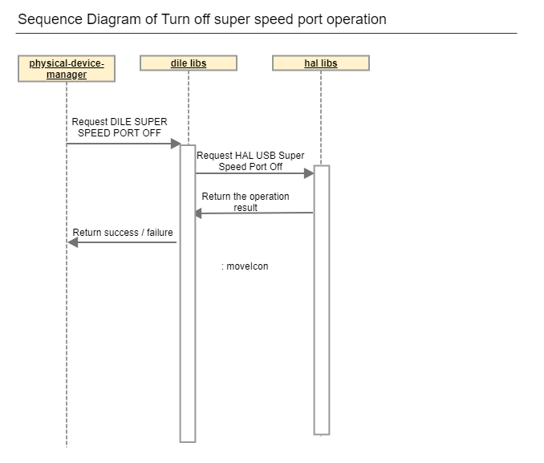
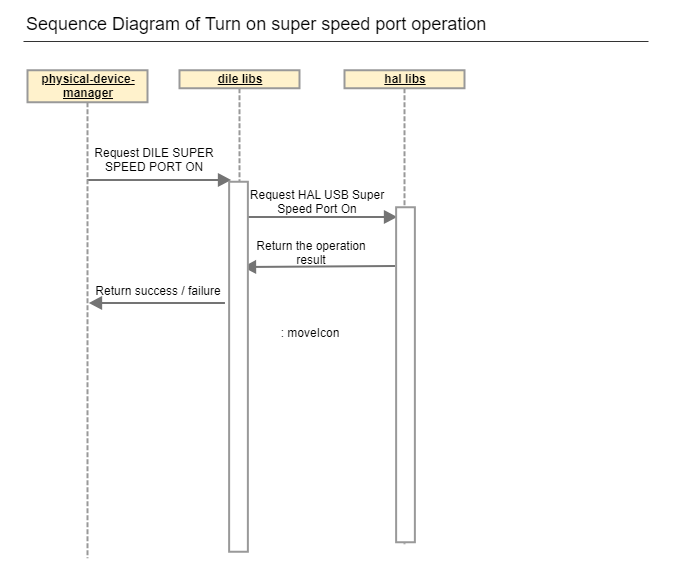
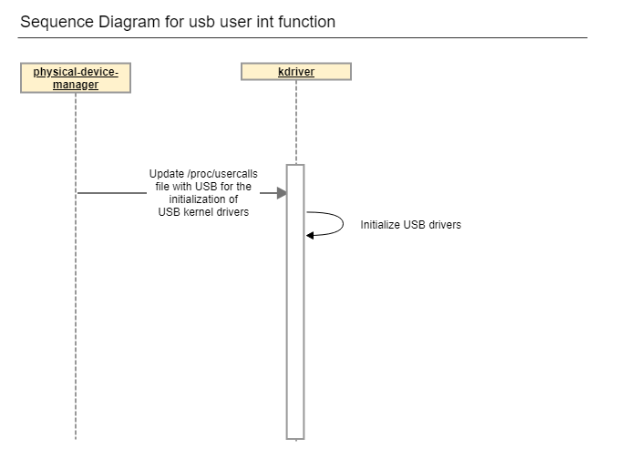
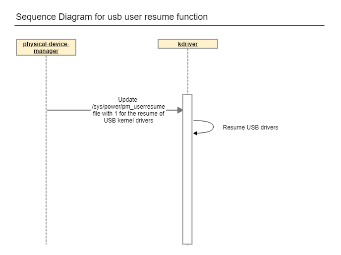

USB
#######

.. _santhosh.srinivasan: santhosh.srinivasan@lge.com
.. _yeggadi.babu: yeggadi.babu@lge.com
.. _hariharan.n: hariharan.n@lge.com

Introduction
************

|  This document describes the usb driver in the hal-libs layer of the webOS and intialization of USB drivers at the user level.
|  The document gives an overview of the usb driver and provides details about its functionalities and implementation requirements.

Revision History
================

======= ========== ===================== ======================
Version  Date        Changed by          Description
======= ========== ===================== ======================
2.0.0   2023-11-20   `yeggadi.babu`_     Update contents and new document form
1.1.0   2022-07-28   `jm0122.kang`_      Remove unused api (HAL_USB_SuperSpeedVBusControl)
1.0.0   2022-04-28   `jm0122.kang`_      1st edit for API Implementation Guide
======= ========== ===================== ======================

Terminology
===========

================================= ======================================
Definition                        Description
================================= ======================================
xhci                              xHCI(eXtensible Host Controller Interface)
ehci                              EHCI (Enhanced Host Controller Interface)
================================= ======================================

Technical Assistance
====================
|  For assistance or clarification on information in this guide, please create an issue in the LGE JIRA project and contact the following person:

================= ====================================================
Module             Owner
================= ====================================================
USB               `santhosh.srinivasan` `yeggadi.babu` `hariharan.n`
================= ====================================================

Overview
********

General Description
===================

|  USB is a general driver of the kernel, but there is a hal for the operation for the exceptional part.
The exceptional case is a problem with the device manufacturer
that is usb I/O not work correctly with usb 3.0 speed with some devices made by that usb device manufacturer.
For avoid this issue, webOS TV use the usb HAL API.
You can turn on/off the xhci controller through that API.
If this API is used, the above abnormal devices (black list devices) are recognized as usb 2.0 instead of usb 3.0.
By doing so, black devices help normal I/O to occur.
This API controls usb 3.0 by enabling/disabled xhci of a specific usb port to operate as echi.

|  webOS TV uses user init and user resume functions at the user level to improve the booting performance by delaying the initialization of USB kernel drivers. Accordingly, PDM is involved in the initialization of the usb driver when AC on booting.

|  The main features provided are :
- Turn off super speed port.
- Turn on super speed port.
- User init
- User resume

System Context
============

|  This section describes the system context of hal-libs usb.
|  Through this system context, external entities are identified and the system boundary is clarified.

.. image:: resources/usb_system_context.png

Overall Workflow
===============

|  The sequence diagram of Turn off super speed port operation

=============================================== ====================================================================================================
Associated Drawings:                            Perspective : Dynamic
=============================================== ====================================================================================================
Relationships                                   Responsibility
Physical device manager -> dile libs            Request DILE USB Super Speed port off api to turn off super speed port operation          
dile libs -> hal libs                           Request HAL USB Super Speed port off api to turn off super speed port operation									
hal libs -> dile libs                           Return operation result(SUCCESS/FAIL)
dile libs -> Physical device manager            Return operation result(SUCCESS/FAIL)
=============================================== ====================================================================================================

|  The sequence diagram of Turn on super speed port operation

=============================================== ====================================================================================================
Associated Drawings:                            Perspective : Dynamic
=============================================== ====================================================================================================
Relationships                                   Responsibility
Physical device manager -> dile libs            Request DILE USB Super Speed port up api to turn on super speed port operation        
dile libs -> hal libs                           Request HAL USB Super Speed port up api to turn on super speed port operation							
hal libs -> dile libs                           Return operation result(SUCCESS/FAIL)
dile libs -> Physical device manager            Return operation result(SUCCESS/FAIL)
=============================================== ====================================================================================================

|  The sequence diagram of usb user init operation

|  The sequence diagram of usb user resume operation

Requirements
************

|  They are simple functions for each modules. and they are in header file. 
|  Please refer to "hal_usb.h"

Functional Requirments
======================
The data types and functions used in this module are as follows.

HAL_USB_SuperSpeedPortOff
-------------------------

Description
^^^^^^^^^^^

Turn off super speed port
Disbale USB 3.0 PHY to work on the super speed mode

Syntax
^^^^^^

DTV_STATUS_T HAL_USB_SuperSpeedPortOff (unsigned int busNumber, unsigned int portNumber)

Parameters
^^^^^^^^^^

============ ===========
type         name
============ ===========
unsigned int busNumber
unsigned int portNumber
============ ===========

Return Value
^^^^^^^^^^^^

If the function succeeds, the return value is Zero(0).
If the function fails, the return value is non-Zero(-1 or errno).

HAL_USB_SuperSpeedPortUp
------------------------

Description
^^^^^^^^^^^

Turn on super speed port
Recovery USB 3.0 PHY to work on the super speed mode

Syntax
^^^^^^
DTV_STATUS_T HAL_USB_SuperSpeedPortUp(unsigned int busNumber, unsigned int portNumber)

Parameters
^^^^^^^^^^

============ ===========
type         name
============ ===========
unsigned int busNumber
unsigned int portNumber
============ ===========

Return Value
^^^^^^^^^^^^

If the function succeeds, the return value is OK.
If the function fails, the return value is NOT_OK.

usb userinit
------------

Description
^^^^^^^^^^^

User init is the process of initializing device drivers through usercalls after not initing the rest (ex> USB) at booting time, excluding device drivers that are essential for booting performance on webOS TV.

Syntax
^^^^^^
static void do_user_initcalls(const char *p_group)

Parameters
^^^^^^^^^^

============ ===========
type         name
============ ===========
const char*  groupName
============ ===========

Return Value
^^^^^^^^^^^^

If the function succeeds, it intializes USB drivers and it returns nothing.

usb userresume
--------------

Description
^^^^^^^^^^^

As with user init, a method to speed up resume by delaying the time by having the webOS TV service control the rest except for device drivers (ex> video, audio .. etc.) essential for resume at the time of resume.

Syntax
^^^^^^
static void _dpm_resume_user(pm_message_t state)

Parameters
^^^^^^^^^^

============ ========================
type         name
============ ========================
pm_message_t state (suspend / resume)
============ ========================

Return Value
^^^^^^^^^^^^

If the function succeeds, it resumes USB drivers and it returns nothing.

Function Calls
--------------

  * :cpp:func:`HAL_USB_SuperSpeedPortUp`
  * :cpp:func:`HAL_USB_SuperSpeedPortOff`

Quality and Constraints
=======================

Performance Requirements
------------------------

|  It should return within 100ms, if there are no special reasons.

Implementation
**************

File Location
=============
|  The Git repository of the hal usb module is available at "hal-libs-header".
|  This Git repository contains the header files for the hal usb implementation as well as documentation for the usb implementation guide and usb API reference.

API List
========

|  The functions used in this module are as follows.

Functions
---------

======================================= ======================================================
Name                                    Description
======================================= ======================================================
:cpp:func:`HAL_USB_SuperSpeedPortOff`   Turn off super speed port.
:cpp:func:`HAL_USB_SuperSpeedPortUp`    Turn on super speed port.
======================================= ======================================================

Implementation Details
======================

| USB API is common API based HW Layer(HAL) for various modules.
| So USB API is simple and the header file already has details comment for each functions. 
| Please refer to "hal_usb.h".

Testing
*******
|  To test the implementation of the USB module, webOS TV provides :doc:`SoCTS (SoC Test Suite) tests </part4/socts/Documentation/source/producer-manual/producer-manual_hal/producer-manual_hal-usb>`.
|  The SoCTS checks the basic operations of the USB module.

References
**********

