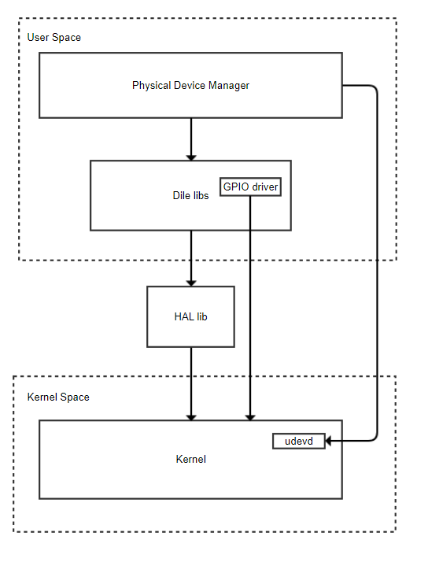

USB
#######

.. _jm0122.kang: jm0122.kang@lge.com
.. _santhosh.srinivasan: santhosh.srinivasan@lge.com
.. _yeggadi.babu: yeggadi.babu@lge.com
.. _hariharan.n: hariharan.n@lge.com

Introduction
************

|  This document describes the USB driver in the in the HAL libs layer of the webOS and intialization of USB drivers at the user level.
|  The document gives an overview of the USB driver and provides details about its functionalities and implementation requirements.

Revision History
================

======= ========== ===================== ==================================================
Version  Date        Changed by          Description
======= ========== ===================== ==================================================
2.0.0   2023-11-20   `yeggadi.babu`_     Update contents and new document form
1.1.0   2022-07-28   `jm0122.kang`_      Remove unused api (HAL_USB_SuperSpeedVBusControl)
1.0.0   2022-04-28   `jm0122.kang`_      1st edit for API Implementation Guide
======= ========== ===================== ==================================================

Terminology
===========

|  The following table lists the terms used throughout this document:

================================= ===========================================
Definition                        Description
================================= ===========================================
ehci                              EHCI (Enhanced Host Controller Interface)
PDM                               PDM (Physical Device Manager)
xhci                              xHCI(eXtensible Host Controller Interface)
================================= ===========================================

Technical Assistance
====================
|  For assistance or clarification on information in this guide, please create an issue in the LGE JIRA project and contact the following person:

================= ===========================
Module             Owner
================= ===========================
USB               | `santhosh.srinivasan`_
                  | `yeggadi.babu`_
                  | `hariharan.n`_
================= ===========================

Overview
********

General Description
===================

|  USB is a general driver in the kernel, but there is the Hardware Adaption Layer (HAL) for the operation for the exceptional part.
The exceptional case is a problem with the device manufacturer
that is USB I/O not work correctly with USB 3.0 speed with some devices made by that USB device manufacturer.
For avoid this issue, webOS TV use the USB HAL API.
You can turn on/off the xhci controller through that API.
If this API is used, the above abnormal devices (black list devices) are recognized as USB 2.0 instead of USB 3.0.
By doing so, black devices help normal I/O to occur.
This API controls USB 3.0 by enabling/disabled xhci of a specific USB port to operate as echi.

|  webOS TV uses user init and user resume functions at the user level to improve the booting performance by delaying the initialization of USB kernel drivers. Accordingly, PDM is involved in the initialization of the USB driver when AC on booting.

|  The main features provided are:
- Turn off super speed port.
- Turn on super speed port.
- User init
- User resume

Architecture
============

|  The following diagram shows the system context of hal-libs usb.
|  Through this system context, external entities are identified and the system boundary is clarified.

======================================= ==========================================================================================================================================================================================================================
Entity                                  Responsibility
======================================= ==========================================================================================================================================================================================================================
Dile libs				 Device Interface Layer Extenstion(DILE) libraries for LG webOS TV
GPIO driver				 A GPIO (General Purpose Input/Output) driver is a software component that facilitates communication between the operating system and hardware GPIO pins on a microcontroller, microprocessor, or similar embedded system.
HAL libs	        		 hal-libs, are a type of user-level device drivers. They provide an interface between the upper layer (webOS applications, modules, and services) and the hardware devices
Kernel					 Kernel is a piece of "operating system" software that manages and provides services to processes to use hardware resources.
Physical device manager                 Physical Device Manager has the function of providing information about USB and EMMC Apps partition during TV operation
udevd					 udevd listens to kernel uevents and passes the incoming events to udev.
======================================= ==========================================================================================================================================================================================================================

Overall Workflow
================

|  The following shows the sequence diagram of the Turn off super speed port operation.

.. image:: resources/usb_super_speed_port_off.png

=============================================== ====================================================================================================
Relationships                                   Responsibility
=============================================== ====================================================================================================
Physical device manager -> dile libs            Request DILE USB Super Speed port off api to turn off super speed port operation          
dile libs -> hal libs                           Request HAL USB Super Speed port off api to turn off super speed port operation									
hal libs -> dile libs                           Return operation result(SUCCESS/FAIL)
dile libs -> Physical device manager            Return operation result(SUCCESS/FAIL)
=============================================== ====================================================================================================

|  The following shows the sequence diagram of the Turn on super speed port operation.

.. image:: resources/usb_super_speed_port_up.png

=============================================== ====================================================================================================
Relationships                                   Responsibility
=============================================== ====================================================================================================
Physical device manager -> dile libs            Request DILE USB Super Speed port up api to turn on super speed port operation        
dile libs -> hal libs                           Request HAL USB Super Speed port up api to turn on super speed port operation							
hal libs -> dile libs                           Return operation result(SUCCESS/FAIL)
dile libs -> Physical device manager            Return operation result(SUCCESS/FAIL)
=============================================== ====================================================================================================

Requirements
************

|  This section describes the main functionalities of the USB module in terms of the module's requirements and constraints.

Functional Requirments
======================

The data types and functions used in this module are described in the Data Types and Functions in the API List.

usb userinit
------------

|  The following shows the sequence diagram of the USB user init operation.

.. image:: resources/usb_user_init.png

Description
^^^^^^^^^^^

User init is the process of initializing device drivers through usercalls after not initing the rest (ex> USB) at booting time, excluding device drivers that are essential for booting performance on webOS TV.

Syntax
^^^^^^
static void do_user_initcalls(const char *p_group)

Parameters
^^^^^^^^^^

============ ===========
type         name
============ ===========
const char*  groupName
============ ===========

Return Value
^^^^^^^^^^^^

If the function succeeds, it intializes USB drivers and it returns nothing.

usb userresume
--------------

|  The following shows the sequence diagram of the USB user resume operation.

.. image:: resources/usb_user_resume.png

Description
^^^^^^^^^^^

As with user init, a method to speed up resume by delaying the time by having the webOS TV service control the rest except for device drivers (ex> video, audio .. etc.) essential for resume at the time of resume.

Syntax
^^^^^^
static void _dpm_resume_user(pm_message_t state)

Parameters
^^^^^^^^^^

============ =========================
type         name
============ =========================
pm_message_t state (suspend / resume)
============ =========================

Return Value
^^^^^^^^^^^^

If the function succeeds, it resumes USB drivers and it returns nothing.

Quality and Constraints
=======================

Performance Requirements
------------------------

|  Each funtion in the API List should return within 100ms, unless there are any special reasons.

Implementation
**************

|  This section provides supplementary materials that are useful for USB module implementation.
- The File Location section provides the location of the Git repository where you can get the header file in which the interface for the USB module implementation is defined.
- The API List section provides a brief summary of USB APIs that you must implement.

File Location
=============

|  The UCOM interfaces are defined in the hal_usb.h header file, which can be obtained from https://swfarmhub.lge.com/.
- Git repository: bsp/ref/hal-libs-header
|  This Git repository contains the header files for the UCOM implementation as well as documentation for the UCOM implementation guide and UCOM API reference.

API List
========

|  The functions used in this module are as follows.

Functions
---------

======================================= ==============================
Name                                    Description
======================================= ==============================
:cpp:func:`HAL_USB_SuperSpeedPortOff`   Turn off super speed port.
:cpp:func:`HAL_USB_SuperSpeedPortUp`    Turn on super speed port.
======================================= ==============================

Implementation Details
======================

| The USB API is a common API based HW Layer (HAL) for various modules.
| Therefore, the USB API is simple and the header file already contains details comments for each functions.
| Please refer to "hal_usb.h".

Testing
*******
|  To test the implementation of the USB module, webOS TV provides :doc:`SoCTS (SoC Test Suite) tests </part4/socts/Documentation/source/producer-manual/producer-manual_hal/producer-manual_hal-usb>`.
|  The SoCTS checks the basic operations of the USB module.

