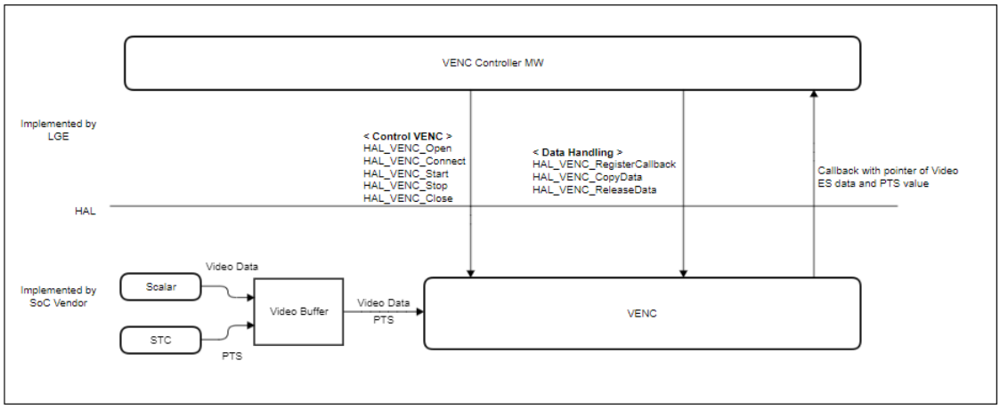
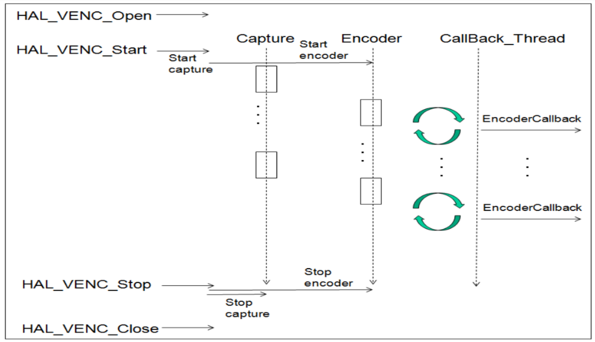

VENC
####

.. _usha.mp: usha.mp@lgepartner.com
.. _hwachin.lee: hwachin.lee@lge.com

Introduction
************

| This document gives an overview of the VENC (Video Encoder) module and provides details about working and its functionalities and implementation requirements. The converted Video ES Data is re-muxed with Audio ES Data encoded in the same way in AENC and delivered to the PVR download module.

| The VENC module is a module that receives video raw data from the video, encodes the digital video, and sends it to the place where it is needed (mainly SENC).

| The VENC module provides digital video encoding capabilities. The encoding codec of VENC supports H.264. It depends on the performance of the HW, but it supports resolutions up to 1280x720. Frame rate is supported up to 30fps, and several frames can be dropped or repeated to adjust the frame rate.

| The VENC module delivers the encoded data and PTS value to the requested module in a callback method. To do this, it supports the callback request function.

Revision History
================

=============== ============ =================== ================================
Version         Date         Changed by          Description
=============== ============ =================== ================================
1.0.0           2023.11.23   `usha.mp`_          initial update
=============== ============ =================== ================================

Terminology
===========

| The key words "must", "must not", "required", "shall", "shall not", "should", "should not", "recommended", "may", and "optional" in this document are to be interpreted as described in RFC2119.

| The following table lists the terms used in the VENC module guide. These are frequently used terms in the field of video encoding.

**webOS TV specific**

=================== ==========================================
Term                Description
=================== ==========================================
VENC                Video Encoder. Video data entered into the scaler is encoded and encoded into video ES data.
STC                 System time clock. Used in the AV sync control logic.
PTS                 Presentation time stamp. Used in the AV sync control logic.
ES                  Elementary stream
SENC                Muxer. Generate TS by muxing video stream data and other data received from VENC.
DASY                DVR middle ware. It is responsible for all processing and control related to DVR functions.
PAL	            Phase Alternation Line, it is color encoding method.
NTSC	            National Television System comity, color encoding method
SECAM	            Séquentiel de couleu mémoire, analog color encoding methos
=================== ==========================================

Technical Assistance
====================

For assistance or clarification on information in this guide, please create an issue in the LGE JIRA project and contact the following person:

=========== ===============================
Module      Owner
=========== ===============================
VENC        `hwachin.lee`_
=========== ===============================

Overview
********

General Description
===================

| VENC is a module that records video in Analog-Composite format. In webOS, analog-composite format video input is ATV. LGE Spec supports image display for the following 7 Color-System Standards, and when these signals are decoded by AVD module, VENC should be able to record all of them.

**webOS TV specific**

======================= ===================== ===========   
Color-System            Resolution            VFreq       
======================= ===================== ===========
NTSC-M                  704 x 480             59.94
PAL                     704 x 576             50
SECAM                   704 x 576             50
NTSC.4.43               704 x 480             59.94
PAL-M                   704 x 480             59.94
PAL-Nc                  704 x 576             50
PAL-60                  704 x 480             59.94        
======================= ===================== ===========

Features
========

| TV video encoders serve to compress and convert video signals into a format suitable for transmission and display.

| The key features of the VENC module are as follows:

- Compression Standards: TV encoders support various compression standards like H.264, H.265 (HEVC), or even newer standards for efficient video compression.

- Resolution Support: They handle different video resolutions, such as Full HD (1080p), 4K, and sometimes even higher resolutions.

- Frame Rate Control: TV encoders allow for control over the frame rate, ensuring smooth video playback.

- Bitrate Control: Users can adjust the bitrate to balance video quality and bandwidth usage.

- Input Interfaces: They provide various input interfaces to connect with different video sources, including HDMI, SDI, or others.

- Streaming Protocols: Support for streaming protocols like RTMP, HLS, or MPEG-DASH to enable content delivery over the internet.

- Audio Encoding: In addition to video, TV encoders handle audio encoding, supporting different audio formats and bitrates.

- Low Latency: Some encoders are designed for low-latency streaming, crucial for live broadcasts or interactive content.

- Network Connectivity: TV encoders often have Ethernet or Wi-Fi connectivity options for network communication.

- Hardware Acceleration: Many modern encoders utilize hardware acceleration to optimize video processing and reduce CPU load.

Architecture
============

This section describes the architecture of the VENC module from an inter-module perspective (driver architecture) as well as its internal point of view (internal architecture).

Driver Architecture
-------------------

The following diagram shows the driver level architecture of the VENC module where the VDEC module’s interaction with other modules is described.

| The Block-Diagram below shows(Figure 1) the relationship between VENC and its surrounding external modules. In the Video Module located at the front of the VENC, the Analog-Composite video signal is decoded by the AVD (Analog-Video-Decoder) module and converted into Digital Raw-Video-Data. This Digital Raw-Video-Data is supplied to the VENC module. The process in which this Digital Raw-Video-Data is supplied to VENC may be VideoPath through AVD and Video-Scaler, or it can also be an operation that goes through VENC’s own dedicated buffer. This is determined by the unique structure of the Soc. The VENC module performs Video-Capture operation whenever one image frame data is received. When the capture operation of every video frame occurs, VENC compresses the video data of one frame and then Callback is generated by creating ES (Elementary-Stream), and ES data information must be delivered. PTS is created based on the time when Video-Capture occurs, and this is also passed as an argument to the callback function. This will be used to synchronize video and audio when playing back recordings in the future.

| LG MW performs the following post-processing of ES-Data on the Kernel-Memory side based on the argument values ​​of this callback function.

- HAL_VENC_CopyData : Copy ES Data from Driver to MW memory

- HAL_VENC_ReleaseData : Release memory of ES Data from Driver.

Requirements
************

Functional Requirements
=======================

| **Video Capture**

| The video capture operation is an operation to capture one frame video data from a scaler (each Soc, it can be called a different name) that includes Raw-Video-Data at one frame rate cycle. In the current webOS spec, capture data and the resolution / frame rate of the original video must match. During Video Capture, Video-Scaling-Up or Video-Scaling-Down should not occur. If the original ATV is 720x480 59.9 fps, VENC capture is also captured 59.9 times per second with the same size. During recording, the setting state or operation (video signal format change, image quality setting, Video-Mute operation) of the Video-Main screen should not affect the video quality being recorded.

| **Video Encoding**

| The video captured through Video Capture is in the form of uncompressed raw data. You need to encode this with H264 video codec to create ES. In addition, it creates a PTS based on the time of the Video-Capture moment, and it is used for AV sync when playing back recordings in the future. When the video encoding and PTS generation for one frame is completed, a callback occurs and the pointer of the generated ES data and various related information must be delivered to the LG MW. In webOS, the encoding source is ATV, which is an interlaced-type. Interlaced-type video is a video composed of top/bottom fields, and deinterlacing operation is required during playback. When encoding an interlaced source, it must be encoded in the following two ways. #. Encoding an interlaced video source as an interlaced-type or #. After converting the interlaced video source to progressive through the deinterlacer module, then encoding to progressive-type. It should be noted that the frame rate is also reduced by half when converting to I->P. (Encoding of interlaced-type signals as progressive-type is not allowed)

| **Deinterlacing**

| The analog composite video signal is an interlaced type. LGE-Spec requires that the original resolution be maintained when playing back the recording. And the level of smoothness of the video motion is also required to be the same as the original. For this, in the process of capturing and compressing for recording, and controlling the video-path for playback, the Deinterlacing-Scheme must be carefully decided and the following requirements must be satisfied. #. There should be no loss of resolution compared to the original when playing the recording in Normal mode. #. When playing the recorded recording in Normal mode, the video movement should be as smooth as the original. #. There should be no loss of original contrast or resolution even when playing the recording in trick playback mode (1/2 speed, Pause, 2X speed, 4X speed, 8X speed, 16X speed). #. Even during Trick Mode playback of the recording, the motion of the video should be sufficiently smooth. #. When changing between playback modes of recordings (for example, when switching between Pause and 1x speed repeatedly), Motion-Adaptive-Deinterlacing must be appropriately controlled to prevent excessive screen shaking. #. In the case of the original PAL and DEM-Pattern still images, the Hanover-Bar phenomenon should not occur when playing the recorded material. #. In all the cases mentioned above, not only the case where the resolution of the original signal is “interlaced”, but also the case where the resolution of the original signal is “interlaced in 3:2-Pull-down Film mode” should be considered.

| **Encoding AV sync**

| In the case of an ATV input signal, since PTS is not transmitted, PTS must be generated during recording. VENC must generate PTS based on the time when video capture operation for analog-source occurs. This is because AV sync cannot be guaranteed if the PTS is generated at the start of encoding or at a later operation time. The generated PTS value is transferred to LG MW as a callback operation. The PTS generated in this way is used to keep the audio and video included in the analog recording contents in sync with each other when the recording is played back in the future. This PTS is generated from an independent STC, and AENC and VENC implement sync using the PTS obtained from the same STC.

| **VENC Callback**

| VENC must call the callback function passed through HAL_VENC_RegisterEncodiungCallback whenever picture encoding is completed. To prevent deadlock, VENC should implement the following logic. #. Do not use same semaphore with ES data(CopyData/ReleaseData) and VENC control (Open/Start/Stop/Close) #. Normal stop sequence is Stop - Close but in racing condition Close - Stop can happen. So Close should include Stop action. #. Use timeout for every waiting action (especially wait for Scaler-capture) #. Add enough check sequence not to make deadlock or crash.

| **Memory**

| For the memory of the internal buffer of VENC, a structure that can be dynamically alloc-free should be avoided and a pre-allocated memory structure such as a ring buffer should be used. Also, dynamic sharing of memory area with other modules is not allowed. Since data needs to be captured and encoded in real time, it is necessary to assign a sufficiently high priority to memory or CPU access so that Frame-Capture does not fail or noise is encoded.

Quality and Constraints
=======================

| These non-functional requirements contribute to the overall performance, reliability, and usability of the TV video encoder system. It includes:

- Performance: The encoder should operate efficiently, handling video encoding tasks with minimal delays or lag.

- Scalability: Ability to handle increased loads and demands as the number of users or video sources grows.

- Reliability: Ensuring stable and consistent performance, minimizing the risk of failures or crashes during operation.

- Compatibility: Support for a variety of video formats and devices to ensure broad compatibility with different TVs and playback systems.

- Security: Implement measures to protect against unauthorized access, tampering, or interception of encoded video streams.

- User Interface: Provide a user-friendly interface for configuration and monitoring, making it easy for users to manage settings.

Implementation
**************

| This section provides supplementary materials that are useful for VENC implementation.

| The File Location section provides the location of the Git repository where you can get the header files in which the interface for the VENC implementation is defined.

| The Implementation Details section sets implementation guidance for most common VENC usage scenarios.

| The API List section provides a brief summary of VENC APIs.

File Location
=============

| The Git repository of the VENC module is available at `hal-libs-header <https://wall.lge.com/admin/repos/bsp/ref/hal-libs-header,general>`_. This Git repository contains the header files for the VENC implementation as well as documentation for the VENC implementation guide and VENC API reference.

API List
========

| This section describe what are API's & functions are used for VENC implemetation.

Data Types
==========

VENC_MSG_TYPE_T
---------------
This structure contains message data transmitted as a parameter of VENC callback.

		.. code-block::

				typedef struct VENC_MSG_TYPE {
					UINT32   channel;
					UINT8    pictype;
					UINT64   pts;
					UINT8    *pData;
					UINT32   dataLen;
					UINT8    *pRStart;
					UINT8    *pREnd;
				} VENC_MSG_TYPE_T;

================= ============================================================================================
Member            Description
================= ============================================================================================
channel           Encoded picture type(IDR:1 I:2 P:4 B:8). if I frame with IDR, 1 | 2 = 3.
pts               | PTS value of encoded picture.
                  | Based on the time when the Video-Capture is performed, the pts is decided.
                  | This pts value will be deilvered to LGE-SW-Layer.
                  | The LGE-SW-Layer will create PES based on ES from driver.
                  | The LGE-SW-Layer will create PES-Header.
                  | The LGE-SW-Layer will insert the decided pts into the pts-parameter in the PES-Header.
pData             The pointer of encoded video ES data
dataLen           The length of encoded video ES data
pRStart           The start pointer of Ring buffer of ES data
pREnd             The end pointer of Ring buffer of ES data
================= ============================================================================================

VENC_INPUT_TYPE_T
-----------------
This enumeration contains the VENC input source index.

		.. code-block::

				typedef enum  {
					VENC_INPUT_MAIN = 0,
					VENC_INPUT_SUB,
					VENC_INPUT_EXT,
					VENC_INPUT_NUM
				} VENC_INPUT_TYPE_T;

================= ===================================================
Member            Description
================= ===================================================
VENC_INPUT_MAIN   Main video source. Normally means main scaler.
VENC_INPUT_SUB    Sub video source. Normally means sub-scaler.
VENC_INPUT_EXT    Extra video source.
VENC_INPUT_NUM    Number of VENC input
================= ===================================================

VENC_CODEC_T
------------
Encoding codec. (see VENC_INFO_CODEC)

		.. code-block::

				typedef  enum {
					VENC_CODEC_H264 = 0,
					VENC_CODEC_VP8
				} VENC_CODEC_T;

================= ======================
Member            Description
================= ======================
VENC_CODEC_H264   Encode H.264 codec
VENC_CODEC_VP8    Encode VP8 codec
================= ======================

VENC_FRAMERATE_T
----------------
This enumeration contains the VENC encoding target framerate type. (See VENC_INFO_FRAMERATE)

		.. code-block::

				typedef enum {
					VENC_FRAMERATE_AUTO = 0,
					VENC_FRAMERATE_ASIS,
					VENC_FRAMERATE_60P,
					VENC_FRAMERATE_60I,
					VENC_FRAMERATE_30P,
					VENC_FRAMERATE_30I,
					VENC_FRAMERATE_25P,
					VENC_FRAMERATE_25I,
					VENC_FRAMERATE_24P,
					VENC_FRAMERATE_24I,
					VENC_FRAMERATE_INVALID
				} VENC_FRAMERATE_T;

=========================== ===============================================
Member                      Description
=========================== ===============================================
VENC_FRAMERATE_AUTO         Set target framerate automatically.
                            | 60p -> 30p
                            | 60i -> 30p
                            | 50p -> 25p
                            | 50i -> 25p
                            | 30p -> 30p
                            | 30i -> 30p
                            | 24p -> 24p
                            | 24i -> 24p
VENC_FRAMERATE_ASIS         Set target framerate same with video source
VENC_FRAMERATE_60P          Framerate 60 progressive
VENC_FRAMERATE_60I          Framerate 60 interlaced
VENC_FRAMERATE_30P          Framerate 30 progressive
VENC_FRAMERATE_30I          Framerate 30 interlaced
VENC_FRAMERATE_25P          Framerate 25 progressive
VENC_FRAMERATE_25I          Framerate 25 interlaced
VENC_FRAMERATE_24P          Framerate 24 progressive
VENC_FRAMERATE_24I          Framerate 24 interlaced
VENC_FRAMERATE_INVALID      Framerate is Invalid
=========================== ===============================================

VENC_PROFILE_T
--------------
This enumeration contains profile type of encoded video ES. (See VENC_INFO_PROFILE).
Currently Main profile option is used for Analog recording

		.. code-block::

				typedef enum {
					VENC_PROFILE_BASE = 0,
					VENC_PROFILE_MAIN,
					VENC_PROFILE_EXT,
					VENC_PROFILE_HIGH
				} VENC_PROFILE_T;

		
VENC_PROFILELEVEL_T
-------------------
This enumeration contains profile level of encoded video ES. (See VENC_INFO_PROFILELEVEL)
Currently 3.1 option is used for Analog recording

		.. code-block::

				typedef enum {
					VENC_PROFILELEVEL_30 = 0,
					VENC_PROFILELEVEL_31,
					VENC_PROFILELEVEL_40,
					VENC_PROFILELEVEL_41
				} VENC_PROFILELEVEL_T;

========================= ======================
Member                    Description
========================= ======================
VENC_PROFILELEVEL_30      Profile level 3.0
VENC_PROFILELEVEL_31      Profile level 3.1
VENC_PROFILELEVEL_40      Profile level 4.0
VENC_PROFILELEVEL_41      Profile level 4.1
========================= ======================

VENC_SOURCE_T
-------------
This enumeration contains the type of input source of VENC. Currently only VENC_SOURCE_ATV is used

		.. code-block::

				typedef enum {
					VENC_SOURCE_ATV = 0,
					VENC_SOURCE_AV,
					VENC_SOURCE_SCARTIN,
					VENC_SOURCE_NUM
				} VENC_SOURCE_T;

========================= =========================
Member                    Description
========================= =========================
VENC_SOURCE_ATV           VENC source is ATV
VENC_SOURCE_AV            VENC source is AV
VENC_SOURCE_SCARTIN       VENC source is scart-in
========================= =========================

VENC_RATECONTROL_T
------------------
This enumeration contains bitrate control information.

		.. code-block::

				typedef enum {
					VENC_BITRATECONTROL_VBR = 0,
					VENC_BITRATECONTROL_CBR
				} VENC_SOURCE_T;

============================ ==============================================================================
Member                       Description
============================ ==============================================================================
VENC_BITRATECONTROL_VBR      Bitrate of encoded video data is changed to optimal quality while encoding.
VENC_BITRATECONTROL_CBR      Bitrate of encoded video data is not changed until finish encoding.
============================ ==============================================================================

VENC_INFO_T
-----------
This enum information means the information type used by the HAL_VENC_SetParam() function for VENC control and the HAL_VENC_GetParam() function for obtaining VENC status.

		.. code-block::

				typedef enum {
					VENC_INFO_FRAMERATE     = 0,
					VENC_INFO_WIDTH,
					VENC_INFO_HEIGHT,
					VENC_INFO_ASPECTRATIOIDC,
					VENC_INFO_SARWIDTH,
					VENC_INFO_SARHEIGHT,
					VENC_INFO_INPUT,
					VENC_INFO_BITRATE,
					VENC_INFO_PROFILE,
					VENC_INFO_PROFILELEVEL,
					VENC_INFO_CODEC,
					VENC_INFO_RATECONTROL,
					VENC_INFO_GOPLENGTH,
					VENC_INFO_QP,
					VENC_INFO_SOURCE,
					VENC_INFO_NUM
				} VENC_INFO_T;

		
Function Calls
==============

================================================ ===========================================================================================================================================
Function      		       		         Descrption
================================================ ===========================================================================================================================================
:cpp:func:`HAL_VENC_Open`                      	 Initializes and open VENC driver. Perform basic setting work to operate VENC.
:cpp:func:`HAL_VENC_Close`		   	 Close VENC driver.
:cpp:func:`HAL_VENC_OpenEx`	   		 Initializes and open VENC driver. Perform basic setting work to operate VENC. Encoding port number can be set as parameter.
:cpp:func:`HAL_VENC_CloseEx`                   	 Close VENC driver. This is for only LG SIC. For others implement it as empty.
:cpp:func:`HAL_VENC_Connect`		  	 This function determines which module VENC will connect with set VENC input video source.
:cpp:func:`HAL_VENC_Start`		  	 | Starts VENC encoding.ES data is newly generated per every video-frame is input. New ES data is saved in ES-Buffer. A Callback is generated from driver to Upper-SW-Layer.
:cpp:func:`HAL_VENC_Stop`	   		 Stops VENC encoding.
:cpp:func:`HAL_VENC_SetParam`	   		 Set VENC encoding ES parameters and various parameters for encoding.
:cpp:func:`HAL_VENC_GetParam`		  	 Get VENC encoding parameters.
:cpp:func:`HAL_VENC_RegisterEncoderCallback`	 Registers callback function that receives VENC callback message.
:cpp:func:`HAL_VENC_CopyData`		         Copy encoded ES data from VENC driver memory source to user memory destination.
:cpp:func:`HAL_VENC_ReleaseData`		 (In callback function) Free driver memory of encoded ES data after copy.
:cpp:func:`HAL_VENC_ResetGOP`			 Request IDR frame data by calling HAL_VENC_ResetGOP.The IDR picture data should be passed VENC picture callback.
================================================ ===========================================================================================================================================

Sequence Diagram
----------------

**Recording start -> Recording progress -> HAL function call sequence according to recording end is as follows.**

  .. code-block:: cpp
  
		HAL_VENC_Open();
		HAL_VENC_Connect(port, VENC_INPUT_MAIN);
		
		HAL_VENC_SetParam(port, VENC_INFO_CODEC, VENC_CODEC_H264);
		HAL_VENC_SetParam(port, VENC_INFO_FRAMERATE, VENC_FRAMERATE_AUTO);
		HAL_VENC_SetParam(port, VENC_INFO_PROFILE, VENC_PROFILE_MAIN);
		HAL_VENC_SetParam(port, VENC_INFO_PROFILELEVEL, VENC_PROFILELEVEL_40);
		HAL_VENC_SetParam(port, VENC_INFO_BITRATE, 3562);
		HAL_VENC_SetParam(port, VENC_INFO_RATECONTROL, VENC_RATECONTROL_VBR);
		
		HAL_VENC_RegisterEncoderCallback(port, _VENC_DataHandlingCB)
		
		HAL_VENC_Start(port);
		
		_VENC_DataHandlingCB() // Callback can be triggered every picture encodings
		{
			HAL_VENC_CopyData(0, testBuffer, pMsg->pData, pMsg->dataLen, pMsg->pRStart, pMsg->pREnd);
			HAL_VENC_ReleaseData(0, pMsg->pData, pMsg->dataLen);
		}
		
		HAL_VENC_Stop(port);
		HAL_VENC_Close();
		

Testing
*******

| To test the implementation of the VENC module, webOS TV provides SoCTS (SoC Test Suite) tests. 
| The SoCTS checks the basic operations of the VENC module and verifies the kernel event operations for the module by using a test execution file. 
| For more information, see :doc:`VENC’s SoCTS Unit Test manual </part4/socts/Documentation/source/producer-manual/producer-manual_hal/producer-manual_hal-venc>`.

References
**********

* `http://collab.lge.com/main/display/SOCVENDOR/5.6+VENC+-+Eng`
