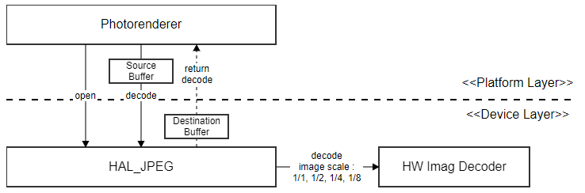

JPEG
==========

.. _taegyu74.kim: taegyu74.kimg@lge.com
.. _jh0506.lee: jh0506.lee@lge.com

Introduction
------------
This document describes the JPEC module in the HAL libs layer of the webOS. The document gives an overview of the JPEG module and provides details about its functionalities and implementation requirements.

Revision History
^^^^^^^^^^^^^^^^

======= ========== ================ =======
Version Date       Changed by       Comment
======= ========== ================ =======
1.2     2023-11-24 `taegyu74.kim`_  Change format & Update contents 
1.1.3   2018-02-26 `jh0506.lee`_    modify
1.1.2   2014-12-01 `jh0506.lee`_    modify
1.1.1   2014-05-22 `jh0506.lee`_    modify
1.1     2014-05-13 `jh0506.lee`_    modify
1.0.1   2013-10-21 `jh0506.lee`_    done
1.0     2013-06-20 `jh0506.lee`_    done
======= ========== ================ =======

Terminology
^^^^^^^^^^^
| The key words “must”, “must not”, “required”, “shall”, “shall not”, “should”, “should not”, “recommended”, “may”, and “optional” in this document are to be interpreted as described in RFC2119.

| The following table lists the terms used throughout this document:

====== =========================================
Term   Description
====== =========================================
DILE   Driver Interface Library Extension
====== =========================================

Technical Assistance
^^^^^^^^^^^^^^^^^^^^

For assistance or clarification on information in this guide, please create an issue in the LGE JIRA project and contact the following person:

======== ==================
Module   Owner
======== ==================
HAL_JPEG vikas.kumar
======== ==================

Overview
--------

General Description
^^^^^^^^^^^^^^^^^^^

The JPEG provides several interfaces which uses HW resources such as decoder and video output, so that dile_photo (driver interface library extension) is intoduces the hal_photo module (hardware abstraction layer).
The JPEG module is responsible for decoding compressed image format such as jpeg, png and bmp. 

Features
^^^^^^^^
* Decoding compressed image format

Architecture
^^^^^^^^^^^^
System Context
**************

The block diagram below represents photorenderer's module view in webOS TV.

The photorenderer provides several interfaces which use HW resources such as decoder and video output, so that dile_photo (driver interface library extension) is intoduced the hal_photo module (hardware abstraction layer).

These interfaces include the HW jpeg decoder / png decoder / video output, also they will have a benefit to reduce the processing load and take easy way display image through video path.

For this purpose, the SoC vendor must provide HW jpeg decoding capability through the HAL_JPEG interface. 

Requirements
------------

Functional Requirements
^^^^^^^^^^^^^^^^^^^^^^^

The data types and functions used in this module are described in the Data Types and Functions in the API List.

Quality and Constraints
^^^^^^^^^^^^^^^^^^^^^^^

The performance requirements (execution speed) for each function are described in the API Reference.

Implementation
--------------

This section provides materials that are useful for SVP implementation.

- The `File Location`_ section provides the location of the Git repository where you can get the header file in which the interface for the DRM implementation is defined.
- The `API List`_ section provides a brief summary of JPEG APIs that you must implement.
- The `Implementation Details`_ section sets implementation guidance.

File Location
^^^^^^^^^^^^^

The JPEC interfaces are defined in the hal_jpec.h header file, which can be obtained from https://swfarmhub.lge.com/.

- Git repository: bsp/ref/hal-libs-header

API List
^^^^^^^^

The JPEG module implementation must adhere to the interface specifications defined and implements its functions. Refer to the API Reference for more details.

Data Types
**********

===================================================== ================================================================================
Name                                                  Description
===================================================== ================================================================================
:cpp:type:`HAL_JPEG_PIXEL_FORMAT`                     Describes the supported pixel formats.
:cpp:type:`HAL_JPEG_DECODE_OPTION_SCALING`            Describes down-sampling factor using HW decoder.
:cpp:struct:`HAL_JPEG_RECT_T`                         Describes a rectangle specified by a point and a dimension.
:cpp:struct:`HAL_JPEG_DECODE_OPTION_T`                Describes option to decode image.
:cpp:struct:`HAL_JPEG_ENCODE_OPTION_T`                Describes option to encode image.
:cpp:struct:`HAL_JPEG_IMAGE_T`                        Describes a image information to decode or encode.
===================================================== ================================================================================

Functions
*********

=============================================== ====================================================================================================================
Function                                        Description
=============================================== ====================================================================================================================
:cpp:func:`HAL_JPEG_Open`                       Open the HW JPEG resources and set a memory to deal with decoded bit data.
:cpp:func:`HAL_JPEG_Close`                      Close the HW JPEG resources.
:cpp:func:`HAL_JPEG_Decode`                     Decompress bit data according to the input option.
:cpp:func:`HAL_JPEG_Encode`                     Not currently in use.
=============================================== ====================================================================================================================

Implementation Details
^^^^^^^^^^^^^^^^^^^^^^

In common, validation must be implemented for all parameters. In particular, null checking is performed on pointer parameters.

Testing
-------

To test the implementation of the JPEG module, webOS TV provides SoCTS (SoC Test Suite) tests. The SoCTS checks the basic operations of the JPEG module and verifies the kernel event operations for the module by using a test execution file. For more information, see :doc:`JPEG's SoCTS Unit Test manual </part4/socts/Documentation/source/producer-manual/producer-manual_hal/producer-manual_hal-photo_hal-jpeg>`.

