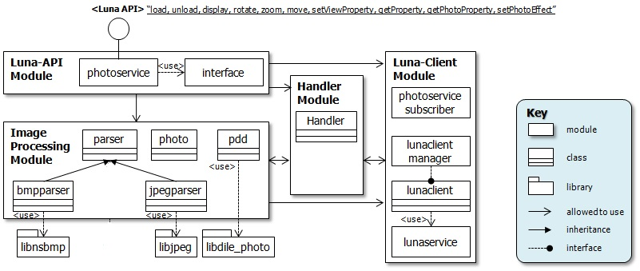

JPEG
==========

History
-------

======= ========== ============== =======
Version Date       Changed by     Comment
======= ========== ============== =======
1.0     2013-06-20 jh0506.lee     done
1.0.1   2013-10-21 jh0506.lee     done
1.1     2014-05-13 jh0506.lee     modify
1.1.1   2014-05-22 jh0506.lee     modify
1.1.2   2014-12-01 jh0506.lee     modify
1.1.3   2018-02-26 jh0506.lee     modify
1.2     2023-11-24 taegyu74.kim   Change format & Update contents 
======= ========== ============== =======

Terminology
-----------
| The key words “must”, “must not”, “required”, “shall”, “shall not”, “should”, “should not”, “recommended”, “may”, and “optional” in this document are to be interpreted as described in RFC2119.

| The following table lists the terms used throughout this document:

====== =========================================
Term   Description
====== =========================================
DILE   Driver Interface Library Extension
====== =========================================

Technical Assistance
--------------------

For assistance or clarification on information in this guide, please create an issue in the LGE JIRA project and contact the following person:

====== ==================
Module Owner
====== ==================
HAL_VO vikas.kumar
====== ==================

General Description

The photorenderer provides several interfaces which uses HW resources such as decoder and video output, so that dile_photo (driver interface library extension) is intoduces the hal_photo module (hardware abstraction layer).

System Context
^^^^^^^^^^^^^^

Below block diagram Fig.1 represents photorenderer's module view in webOS TV.

The photorenderer provides several interfaces which uses HW resources such as decoder and video output, so that dile_photo (driver interface library extension) is intoduces the hal_photo module (hardware abstraction layer).

It includes the HW jpeg decoder / png decoder / video output, also it will have a benefit to reduce the processing load and take easy way display image through video path.

In conclusion, HAL_PHOTO has to follow as below 2, 3 section.

Requirements
------------

Functional Requirements
^^^^^^^^^^^^^^^^^^^^^^^

Plese refer to each function's description and requirement.

Quality and Constraints
^^^^^^^^^^^^^^^^^^^^^^^

Requirements regarding the performance (execution speed) required by each function are described in each function part.

Implementation
--------------

This section provides materials that are useful for SVP implementation.

- The `File Location`_ section provides the location of the Git repository where you can get the header file in which the interface for the DRM implementation is defined.
- The `API List`_ section provides a brief summary of JPEG APIs that you must implement.
- The `Implementation Details`_ section sets implementation guidance and example code for some major functionalities.

File Location
^^^^^^^^^^^^^

The JEPG interfaces are defined in the hal_vo.h header file, which can be obtained from https://wall.lge.com/.

- Git repository: bsp/ref/hal-libs-header

API List
^^^^^^^^

The JPEG module implementation must adhere to the interface specifications defined and implements its functions. Refer to the API Reference for more details.

Data Types
**********

===================================================== ================================================================================
Name                                                  Description
===================================================== ================================================================================
:cpp:type:`HAL_JPEG_PIXEL_FORMAT`                     describes the supported pixel formats
:cpp:type:`HAL_JPEG_DECODE_OPTION_SCALING`            describes down-sampling factor using HW decoder
:cpp:struct:`HAL_JPEG_RECT_T`                         describes a rectangle specified by a point and a dimension
:cpp:struct:`HAL_JPEG_DECODE_OPTION_T`                describes option to decode image
:cpp:struct:`HAL_JPEG_ENCODE_OPTION_T`                describes option to encode image
:cpp:struct:`HAL_JPEG_IMAGE_T`                        describes a image information to decode or encode
===================================================== ================================================================================

Functions
*********

=============================================== ====================================================================================================================
Function                                        Description
=============================================== ====================================================================================================================
:cpp:func:`HAL_JPEG_Open`                       Open the HW JPEG resources and set a memory to deal with decoded bit data
:cpp:func:`HAL_JPEG_Close`                      Close the HW JPEG resources
:cpp:func:`HAL_JPEG_Decode`                     Decompress bit data according to the input option
:cpp:func:`HAL_JPEG_Encode`                     //except from socts, this will be deleted
=============================================== ====================================================================================================================

Implementation Details
^^^^^^^^^^^^^^^^^^^^^^

In common, validation must be implemented for all parameters. In particular, null checking is performed on pointer parameters.

Testing
-------

JPEG Funtions are tested by :doc:`the webOS TV SoCTS (SoC Test Suite) </part4/socts/Documentation/source/producer-manual/producer-manual_hal/producer-manual_hal-photo_hal-jpeg>`.

References
----------