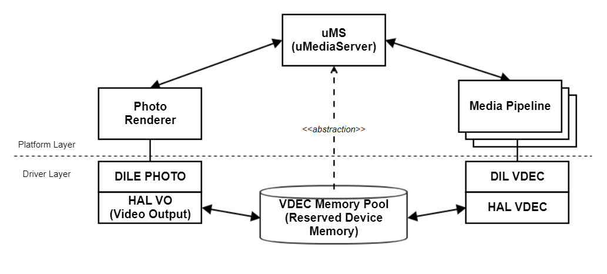
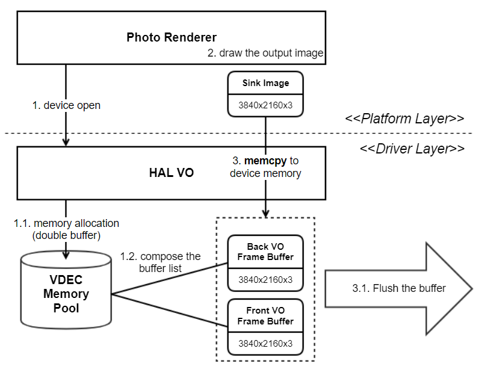
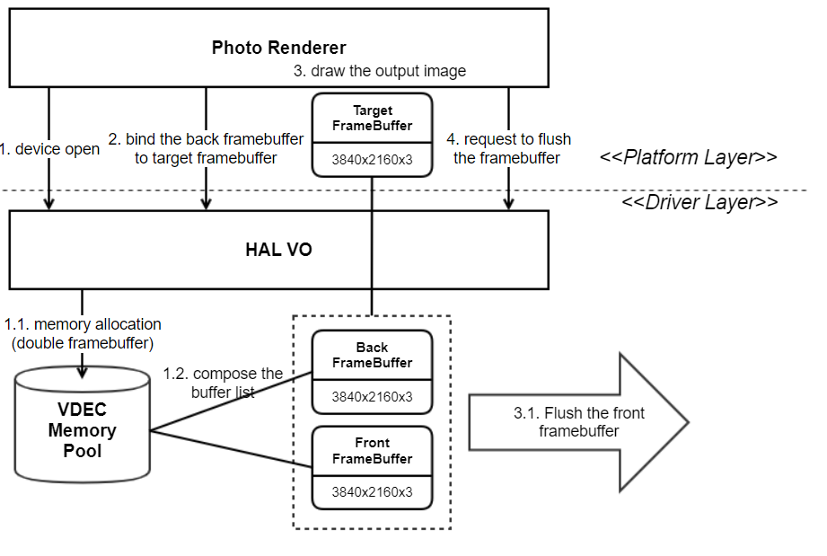

VO
###

Introduction
************

This document describes the Video Output (VO) module in the HAL libs layer of the webOS. The document gives an overview of the VO module and provides details about its functionalities and implementation requirements.

Revision History
================

======= ========== ============== =======
Version Date       Changed by     Comment
======= ========== ============== =======
1.6     2023-11-24 taegyu74.kim   Change format & Update contents
1.5     2019-08-27 jjaem.kim      HAL_VO_PANEL_TYPE add 8K UHD panel type 
1.4     2018-02-36 jh0506.lee     modify
1.3     2016-06-13 jh0506.lee     modify
1.2     2016-05-25 jh0506.lee     new
1.1.2   2014-12-01 jh0506.lee     modify
1.1.2   2014-12-01 jh0506.lee     modify
1.1.1   2014-05-22 jh0506.lee     modify
1.1     2014-05-13 jh0506.lee     modify
1.0.1   2013-10-21 jh0506.lee     done
1.0     2013-06-20 jh0506.lee     done
======= ========== ============== =======

Terminology
===========

| The key words “must”, “must not”, “required”, “shall”, “shall not”, “should”, “should not”, “recommended”, “may”, and “optional” in this document are to be interpreted as described in RFC2119.

| The following table lists the terms used throughout this document:

====== =========================================
Term   Description
====== =========================================
VO     Video Output
HAL    Hardware Adaptation Layer
====== =========================================

Technical Assistance
====================

For assistance or clarification on information in this guide, please create an issue in the LGE JIRA project and contact the following person:

====== ==================
Module Owner
====== ==================
HAL_VO vikas.kumar
====== ==================

Overview
********

General Description
===================

The photorenderer introduces a technique to draw the image directly on the VDEC memory (device memory), it leads to reduce the system memory usage.

The VO module is responsible for an interface to output the image data in memory to the video output of each SoC.
The advantage of outputting the image to the video output is that the quality can be enhanced using the image processing algorithm provided by each SoC. 

Features
========

The VO module provides the following features:
* Configure the video output
* display intput image to video output

Architecture
============

System Context
^^^^^^^^^^^^^^

The following diagram shows the system context surrounding the photorenderer program.

Requirements
************

Functional Requirements
=======================

The data types and functions used in this module are described in the Data Types and Functions in the API List.

Quality and Constraints
=======================

The performance requirements (execution speed) for each function are described in the API Reference.

Implementation
**************

This section provides materials that are useful for VO implementation.

- The `File Location`_ section provides the location of the Git repository where you can get the header file in which the interface for the VO implementation is defined.
- The `API List`_ section provides a brief summary of VO APIs that you must implement.
- The `Implementation Details`_ section sets implementation guidance and example code for some major functionalities.

File Location
=============

The VO interfaces are defined in the hal_vo.h header file, which can be obtained from https://swfarmhub.lge.com/.
- Git repository: bsp/ref/hal-libs-header

API List
========

The VO module implementation must adhere to the interface specifications defined and implements its functions. Refer to the API Reference for more details.

Data Types
----------

===================================================== ===============================
Name                                                  Description
===================================================== ===============================
:cpp:type:`HAL_VO_PIXEL_FORMAT`                       Describes the pixel format.
:cpp:type:`HAL_VO_PANEL_TYPE`                         Describes the panel type.
:cpp:type:`HAL_VO_CFG_TYPE`                           Describes a set of VO configurations.
:cpp:type:`HAL_VO_SUPPORT_PIXEL_FORMAT_T`             Describes the supported pixel format.
:cpp:type:`HAL_VO_SUPPORT_PANEL_TYPE_T`               Describes the supported panel type.
:cpp:type:`HAL_VO_FB_FRAMEBUFFER_PROPERTY_FLAGS_T`    Describes a framebuffer property flags.
:cpp:type:`HAL_VO_RECT_T`                             Describes a rectangle specified by a point and a dimension.
:cpp:type:`HAL_VO_IMAGE_T`                            Describes image information to VO.
:cpp:type:`HAL_VO_CFG_VALUE_T`                        Describes a value set for a configuration type.
:cpp:type:`HAL_VO_CFG_T`                              Describes a set of VO configurations.
:cpp:type:`HAL_VO_DEVICE_CAPABILITY_T`                Describes the VO capabilities of a device.
:cpp:type:`HAL_VO_FB_FRAMEBUFFER_T`                   Describes a framebuffer for VO.
:cpp:type:`HAL_VO_FB_FRAMEBUFFER_PROPERTY_T`          Describes a framebuffer property of VO.
===================================================== ===============================

Functions
---------

=============================================== ====================================================================================================================
Function                                        Description
=============================================== ====================================================================================================================
:cpp:func:`HAL_VO_Open`                         Open the video output module
:cpp:func:`HAL_VO_Config`                       Configure the video output
:cpp:func:`HAL_VO_DisplayPicture`               Display intput image
:cpp:func:`HAL_VO_Close`                        Close the video output module
:cpp:func:`HAL_VO_GetDeviceCapability`          Not currently in use. except from socts TC coverage
:cpp:func:`HAL_VO_Connect`                      Not currently in use. except from socts TC coverage
:cpp:func:`HAL_VO_RedrawPicture`                Not currently in use. except from socts TC coverage
:cpp:func:`HAL_VO_FB_Initialize`                Not currently in use. except from socts TC coverage
:cpp:func:`HAL_VO_FB_Finalize`                  Not currently in use. except from socts TC coverage
:cpp:func:`HAL_VO_FB_GetTargetFrameBuffer`      Not currently in use. except from socts TC coverage
:cpp:func:`HAL_VO_FB_UpdateFrameBuffer`         Not currently in use. except from socts TC coverage 
:cpp:func:`HAL_VO_FB_UpdateFrameBufferProperty` Not currently in use. except from socts TC coverage 
=============================================== ====================================================================================================================

Implementation Details
======================

The following diagram shows the process of the Photorenderer outputting an image to video output via VO. 
HAL_VO Family Functions: memcpy sink image (system memory) of the photorenderer to the framebuffer (device memory) of the HAL VO module
The photorenderer allocates the system memory as the sink image. Invoking HAL_VO_DisplayPicture is to set the framebuffer to be duplicated with this sink image, and the HAL VO calls memcpy() function to do it.

Functions: HAL_VO_Open / HAL_VO_Close / HAL_VO_DisplayPicture / HAL_VO_Config / HAL_VO_RedrawPicture

HAL_VO_FB Family Functions: draw sink image (device memory) on the target framebuffer binded to the writable framebuffer - Not Available
The photorenderer gets the target framebuffer to draw the sink image and requests to flush it. The HAL VO is returns the writable framebuffer (maybe, back framebuffer) as the target framebuffer and flushs it though VDEC port.

Functions: HAL_VO_GetDeviceCapability / HAL_VO_Open / HAL_VO_Close / HAL_VO_SetAlphaBlending / HAL_VO_SetInOutDisplayRegion / HAL_VO_GetTargetFrameBuffer / HAL_VO_UpdateFrameBuffer

