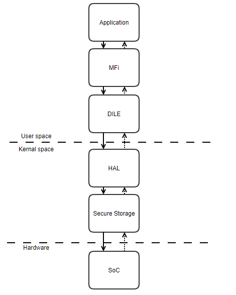
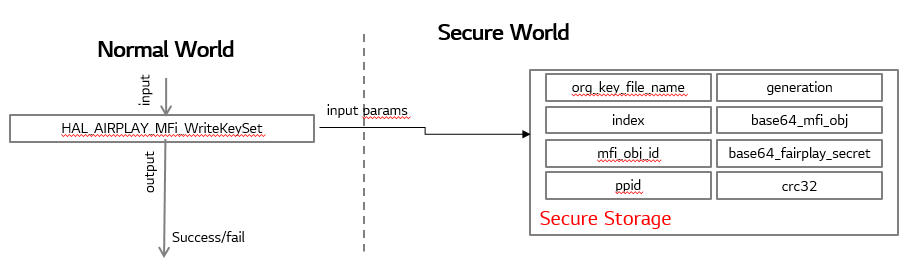
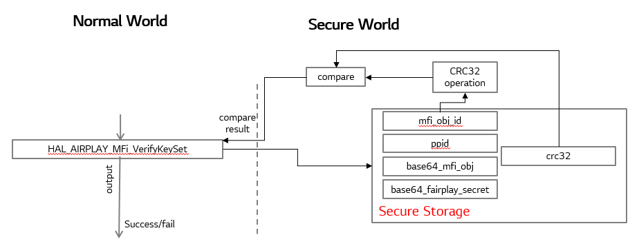
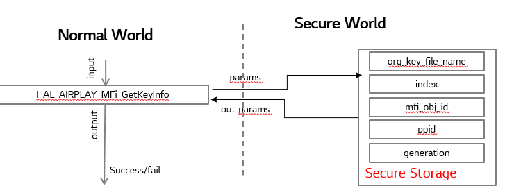
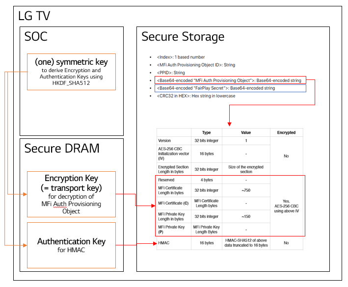
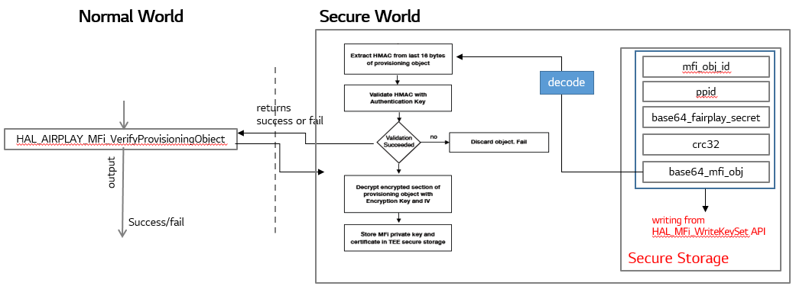
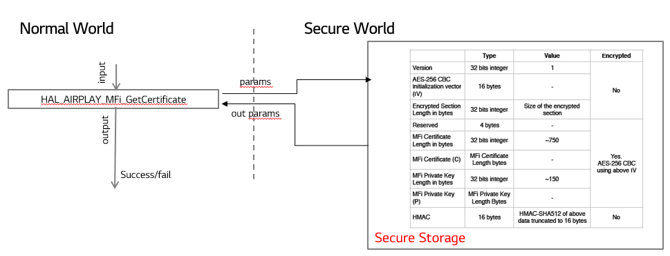
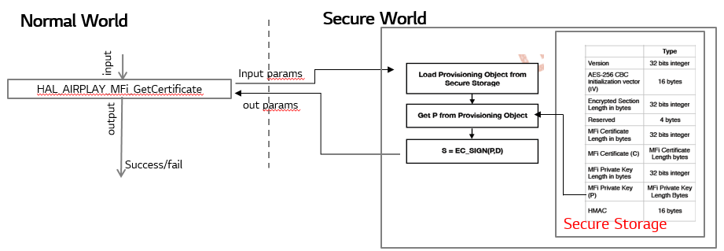

AirPlay
#######

.. _seulki329.kim: seulki329.kim@lge.com
.. _cs.jung: cs.jung@lge.com
.. _kyungnam.bae: kyungnam.bae@lge.com
.. _byounghyun.shin: byounghyun.shin@lge.com
.. _chihyoung2.kim: chihyoung2.kim@lge.com

Introduction
************

This document describes the AirPlay module in the kernel space. The document gives an overview of the AirPlay module and provides details about its functionalities and implementation requirements.

AirPlay is a proprietary wireless communication protocol stack/suite developed by Apple Inc. that allows streaming between devices of audio, video, device screens, and photos, together with related metadata. Apple has since licensed the AirPlay protocol stack as a third-party software component technology to manufacturers that build products compatible with Apple's devices.

Revision History
================

======= ========== =============== ===========
Version Date       Changed by      Description
======= ========== =============== ===========
2.1     2023-11-07 seulki329.kim   Update document
2.0     2019-12-27 kyungnam.bae    Handle the short MFi Private Key when implementing HAL_AIRPLAY_MFi_GetSignature
1.9     2019-07-11 byounghyun.shin Add note for implementing HAL_AIRPLAY_MFi_GetSignature
1.8     2019-03-21 kyungnam.bae    Add new function - HAL_AIRPLAY_MFi_DeleteKeySet / Modify function - HAL_AIRPLAY_MFi_GetKeyInfo2
1.7     2019-03-15 kyungnam.bae    Modify function - HAL_AIRPLAY_MFi_GetKeyInfo2
1.6     2018-12-21 kyungnam.bae    Modify functions - HAL_AIRPLAY_MFi_GetKeyInfo, HAL_AIRPLAY_MFi_GetKeyInfo2
1.5     2018-12-14 kyungnam.bae    Add new function - HAL_AIRPLAY_MFi_GetKeyInfo2
1.4     2018-12-03 kyungnam.bae    Modify functions description - HAL_AIRPLAY_MFi_WriteKeySet, HAL_AIRPLAY_MFi_VerifyKeySet
1.3     2018-10-31 kyungnam.bae    Modify function description - HAL_AIRPLAY_MFi_GetKeyInfo
1.2     2018-08-30 chihyoung.kim   Implement function - HAL_AIRPLAY_FairPlay_VerifyObject
1.1     2018-08-21 byounghyun.shin Implement functions - HAL_AIRPLAY_MFi_VerifyProvisioningObject, HAL_AIRPLAY_MFi_GetCertificate, HAL_AIRPLAY_MFi_GetSignature
1.0     2018-06-23 kyungnam.bae    Implement functions - HAL_AIRPLAY_MFi_WriteKeySet, HAL_AIRPLAY_MFi_VerifyKeySet, HAL_AIRPLAY_MFi_GetKeyInfo
======= ========== =============== ===========

Terminology
===========

The key words "must", "must not", "required", "shall", "shall not", "should", "should not", "recommended", "may", and "optional" in this document are to be interpreted as described in RFC2119. 

The following table lists the terms used throughout this document: 

================================= ======================================
Term                              Description
================================= ======================================
MFi                               Made for iPhone/iPod/iPad
FairPlay                          Digital rights management(DRM) technology developed by Apple
================================= ======================================

Technical Assistance
====================

For assistance or clarification on information in this guide, please create an issue in the LGE JIRA project and contact the following person:

============ ===============================
Module       Owner
============ =============================== 
MFi          `seulki329.kim`_ 
FairPlay     `cs.jung`_
============ =============================== 

Overview
********

General Description
===================

The AirPlay module is to support Apple MFi key based operations.

Features
========

The AirPlay module provides the following features:

- Key Writing
    - Save the inputs into the Secured Storage.
- Key Verification
    - Check the key fields written and CRC32.
- Key Deletion
    - Delete MFi Key from the Secure Storage.
- Key Information Return
    - Copy the string to the output variables.
- Key Certification Return
    - Copy certificate value and length to the output variables.
- Key Signature Return
    - Get MFi private Key from provisioning object and calculate signature using MFi private key and digest.
- MFi/FairPlay Provisioning Object Verification
    - Validate the provisioning object written.

Architecture
============

This section provides architecture information.

Driver Architecture
-------------------

The following diagram shows the driver architecture.

Requirements
************

This chapter describes the major functionalities.

- Key Writing
    - Save the inputs into the Secured Storage.
    - Functional Requirements : Write MFi Key into the Secure Storage.
    - Quality and Constraints : There are no performance requirements. There must be symmetric key exchanged with Apple on the board. If there is no symmetric key, this function cannot be tested. 
- Key Verification
    - Check the key fields written and CRC32.
    - Functional Requirements : Check lgcrc32 by using base64 decoded mfi_obj and fairplay_secret.
    - Quality and Constraints : There are no performance requirements. There must be symmetric key exchanged with Apple on the board. If there is no symmetric key, this function cannot be tested.
- Key Deletion
    - Delete MFi Key from the Secure Storage.
    - Functional Requirements : Delete MFi Key from the Secure Storage.
    - Quality and Constraints : There are no performance requirements. There must be symmetric key exchanged with Apple on the board. If there is no symmetric key, this function cannot be tested.
- Key Information Return (Deprecated)
    - Copy the string to the output variables.
    - Functional Requirements : Read values from Secure Storage and set the values into the out param. It's deprecated after webOS 4.5 MR update. just implement the dummy to avoid the compile error.
    - Quality and Constraints : There are no performance requirements. There must be symmetric key exchanged with Apple on the board. If there is no symmetric key, this function cannot be tested.
- Key Information Return
    - Copy the string to the output variables.
    - Functional Requirements : Read values from Secure Storage and set the values into the out param. Check the validation of the symmetric key in OTP area by using below method.
        - Set fixed 'plain text'
        - Make 'crypto or hash text' of 'plain text' using 'symmetric key' in OTP securely.
        - Compare 'crypto or hash text' and 'already known crypto or hash text'. if these are not matched, return -3
    - Quality and Constraints : There are no performance requirements. There must be symmetric key exchanged with Apple on the board. If there is no symmetric key, this function cannot be tested.
- Key Certification Return
    - Copy certificate value and length to the output variables.
    - Functional Requirements : Get MFi key certification.
    - Quality and Constraints : There are no performance requirements. There must be symmetric key exchanged with Apple on the board. If there is no symmetric key, this function cannot be tested.
- Key Signature Return
    - Get MFi private Key from provisioning object and calculate signature using MFi private key and digest.
    - Functional Requirements : Get MFi Private Key (P) from provisioning object. If the private key(P) is shorter than correct length, the high order bytes should be padded with 0s to a length of correct bytes. The private key is delivered in an unencrypted PKCS #8 DER envelope. However, if the high-order bytes of the private key are zero, the PKCS object will omit them, resulting in a “short” key(usually 31 bytes instead of 32.). Please check to make sure that your provisioning code and MFi signature implementation correctly handles the case of a private key shorter than 32 bytes. If the decoded key is <32 bytes, the high order bytes should be padded with 0s to a length of 32 bytes. Calculate Signature(S) using MFi Private key (P) and digest(D).
        - S = EC_SIGN(P,D)
        - EC_SIGN(key, digest) - NIST P256 Elliptic Curve Digital Signature Algorithm specified in FIPS 184-4. Output is the signature
        - Copy signature(S) value and length to the output variables
    - Quality and Constraints : There are no performance requirements. There must be symmetric key exchanged with Apple on the board. If there is no symmetric key, this function cannot be tested.
- MFi Provisioning Object Verification
    - Validate MFi provisioning object written.
    - Functional Requirements : On receiving the provisioning object the secure task must extract the HMAC from the last 16 bytes of the object. Validate it by computing HMAC-SHA512 on the rest of the object using the authentication key, truncating it to first 16 bytes and comparing it with the extracted HMAC. HMAC_SHA512(key, data) - SHA512 based HMAC, output is digest. If the HMAC tag of the payload fails to validate, returns fail. If HMAC validation succeeds, the secure task should decrypt the encrypted section of the provisioning object using the encryption key and initialization vector to retrieve the MFi private key and certificate. And returns success. 
    - Quality and Constraints : There are no performance requirements. There must be symmetric key exchanged with Apple on the board. If there is no symmetric key, this function cannot be tested.
- FairPlay Provisioning Object Verification
    - Validate FairPlay provisioning object written.
    - Functional Requirements : Compute the hash for the FairPlay Provisioning Object, and verify it against the hash value provided in the object. The last 32 bytes of the FairPlay Provisioning Object are reserved for a SHA-256 hash of the previous bytes (object length = 32bytes). If the calculated value matches the value in the object, the object integrity has been preserved.
    - Quality and Constraints : There are no performance requirements. There must be symmetric key exchanged with Apple on the board. If there is no symmetric key, this function cannot be tested.

Implementation
**************

This chapter provides materials that are useful for AirPlay implementation. 

- The File Location section provides the location of the Git repository where you can get the header file in which the interface for the AirPlay implementation is defined.
- The API List section provides a brief summary of AirPlay APIs that you must implement.
- The Implementation Details section sets implementation guidance and example code.

File Location
=============

The AirPlay interfaces are defined in the hal_airplay.h header file, which can be obtained from https://swfarmhub.lge.com/.

Git repository: bsp/ref/hal-libs-header
Location: [as_installed]/hal_inc/hal_airplay.h

API List
========

The AirPlay module implementation must adhere to the interface specifications defined and implements its functions.

Functions
---------

Extended Functions
^^^^^^^^^^^^^^^^^^

======================================== ==================================================================================
Function                                 Description
======================================== ==================================================================================
HAL_AIRPLAY_MFi_WriteKeySet              Write MFi Key into the Secure Storage
HAL_AIRPLAY_MFi_VerifyKeySet             Check lgcrc32 by using base64 decoded mfi_obj and fairplay_secret
HAL_AIRPLAY_MFi_DeleteKeySet             Delete MFi Key into the Secure Storage
HAL_AIRPLAY_MFi_GetKeyInfo               Read values from Secure Storage and set the values into the out param (deprecated)
HAL_AIRPLAY_MFi_GetKeyInfo2              Read values from Secure Storage and set the values into the out param
HAL_AIRPLAY_MFi_VerifyProvisioningObject Validate the provisioning object
HAL_AIRPLAY_MFi_GetCertificate           Get MFi key certification
HAL_AIRPLAY_MFi_GetSignature             Get MFi Private Key (P) from provisioning object
HAL_AIRPLAY_FairPlay_VerifyObject        Verify FairPlay provisioning object
======================================== ==================================================================================

Implementation Details
======================

int HAL_AIRPLAY_MFi_WriteKeySet(unsigned int argc, void \*\*argv)
-----------------------------------------------------------------

Parameters
^^^^^^^^^^

- argc [in] : currently it must be 8. it can be changed after release.
- argv [in] :
	- argv[0] org_key_file_name (string): original MFi key file name. to track records.
	- argv[1] index (string): index of the orginal MFi key file.
	- argv[2] mfi_obj_id (string): MFi auth provisioning object ID.
	- argv[3] ppid (string): PPID (Product Plan ID).
	- argv[4] generation (string): Generation id for revocation.
	- argv[5] base64_mfi_obj (string): base64 encoded MFi auth provisioning object.
	- argv[6] base64_fairplay_secret (string): base64 encoded FairPlay Secret.
	- argv[7] lgcrc32 (string): lgcrc32 value to check the mfi_obj and the fairplay_secret are valid.

Return
^^^^^^

- Success: 0
- Fail: -1
- In abnormal case, the BSP should return -1.

Operation
^^^^^^^^^

- Save the inputs into the Secured Storage.

Diagram
^^^^^^^

Example
^^^^^^^

.. code-block:: cpp

	gchar const *hal_key_argv[8] = { 0, };
	hal_key_argv[0] = file_name;
	hal_key_argv[1] = index;
	hal_key_argv[2] = mfi_obj_id;
	hal_key_argv[3] = ppid;
	hal_key_argv[4] = generation;
	hal_key_argv[5] = base64_mfi_obj;
	hal_key_argv[6] = base64_fairplay;
	hal_key_argv[7] = lg_crc32;
	
	ret = HAL_AIRPLAY_MFi_WriteKeySet(sizeof(hal_key_argv) / sizeof(gchar *), (void **)hal_key_argv);

int HAL_AIRPLAY_MFi_VerifyKeySet(void)
--------------------------------------

Parameters
^^^^^^^^^^

- None

Return
^^^^^^

- Success: 0
- Fail: -1
- In abnormal case, the BSP should return -1.

Operation
^^^^^^^^^

- Check lgcrc32 by using base64 decoded mfi_obj and fairplay_secret.
- Check CRC32
	- byte array = [mfi_obj_id bytes by ASCII encoding + ppid bytes by ASCII encoding + decoded base64_mfi_obj bytes + decoded base64_fairplay_secret bytes]
	- CRC32 HEX (byte array)
	- Check calculated CRC32 HEX is equal to the crc32
	- If it's matched return Success. Otherwise return false

Diagram
^^^^^^^

Example
^^^^^^^

.. code-block:: cpp

	if(HAL_AIRPLAY_MFi_VerifyKeySet() == 0) {
		printf("verified lgcrc32");
	}
	else {
		printf("verification fail of lgcrc32");
	}

int HAL_AIRPLAY_MFi_DeleteKeySet(void)
--------------------------------------

Parameters
^^^^^^^^^^

- None

Return
^^^^^^

- Success: 0
- No MFi key : -1
- Deletion fail : -2
- In abnormal case, the BSP should return -2.

Operation
^^^^^^^^^

- Delete MFi Key into the Secure Storage

Example
^^^^^^^

.. code-block:: cpp

	int ret = HAL_AIRPLAY_MFi_DeleteKeySet ();
	
	if (ret == 0) { delete ok }
	else if (ret == -1) { there is no key }
	else if (ret == -2) { deletion fail }
	else { unknown error }

int HAL_AIRPLAY_MFi_GetKeyInfo(unsigned char \*\*out_org_key_file_name, unsigned char \*\*out_index, unsigned char \*\*out_mfi_obj_id, unsigned char \*\*out_ppid)
------------------------------------------------------------------------------------------------------------------------------------------------------------------

Operation
^^^^^^^^^

- Read values from Secure Storage and set the values into the out param. (Deprecated)

int HAL_AIRPLAY_MFi_GetKeyInfo2(char \*\*out_key_info)
------------------------------------------------------

Parameters
^^^^^^^^^^

- out_key_info [out] : string including the delimiter '\n' and end of string

Return
^^^^^^

- Success: 0
- No MFi key : -1
- No symmetric key : -3
- SoC doesn't support AirPlay feature : -5
- When it returns -1, -3, and -5, the memory MUST not be allocated and MUST be NULL for all out_* param.
- In abnormal case, the BSP should return one of the negative number defined above.

Operation
^^^^^^^^^

- Read values from Secure Storage and set the values into the out param.

Diagram
^^^^^^^

Example
^^^^^^^

.. code-block:: cpp

	gchar *key_info = NULL;
	gint ret = HAL_AIRPLAY_MFi_GetKeyInfo2(&key_info);
	
	if(ret == 0) {
		gchar **key_info_each = g_strsplit (key_info, "\n", 0);
	
		// use org_key_file_name, index, mfi_obj_id, ppid, generation
	
		g_strfreev(key_info_each);
		g_free(key_info);
	}
	else if (ret == -1) {
		g_print("there is no mfi key in the secure storage");
	}
	else if (ret == -3) {
		g_print("there is no symmetric key in OTP area");
	}
	else if (ret == -5) {
		g_print("this soc doesn't support airplay");
	}
	else {
		g_print("unknown error");
	}

int HAL_AIRPLAY_MFi_VerifyProvisioningObject(void)
--------------------------------------------------

Background Information of MFi Provisioning Object
^^^^^^^^^^^^^^^^^^^^^^^^^^^^^^^^^^^^^^^^^^^^^^^^^

- Derive Encryption key and Authentication key from symmetric key
	- HKDF_SHA512(input key, salt, info, output key length)
		- HMAC-SHA512 based key derivation function as defined in RFC5869, output is derived key.
- ASCII encoding must be used for the salt and info passed to HKDF_SHA512
- Encryption Key (256 bits) = HKDF_SHA512( Base Key, “Apple-Provisioning-Object-Encrypt-Salt”, “Apple-Provisioning-Object-Encrypt-Info”, 256 bits )
- Authentication Key (256 bits) = HKDF_SHA512( Base Key, “Apple-Provisioning-Object-Auth-Salt”, “Apple-Provisioning-Object-Auth-Info”, 256 bits )

Parameters
^^^^^^^^^^

- None

Return
^^^^^^

- Success: 0
- Fail : -1
- In abnormal case, the BSP should return -1.

Operation
^^^^^^^^^

- Validate the provisioning object writing from HAL_MFi_WriteKeySet API.
- Validate the provisioning object
	- On receiving the provisioning object the secure task must extract the HMAC from the last 16 bytes of the object
	- Validate it by computing HMAC-SHA512 on the rest of the object using the authentication key, truncating it to first 16 bytes and comparing it with the extracted HMAC.
	- HMAC_SHA512(key, data) - SHA512 based HMAC, output is digest.
	- If the HMAC tag of the payload fails to validate, returns fail. 
	- If HMAC validation succeeds, the secure task should decrypt the encrypted section of the provisioning object using the encryption key and initialization vector to retrieve the MFi private key and certificate. And returns success.

Diagram
^^^^^^^

Example
^^^^^^^

.. code-block:: cpp

	if (HAL_AIRPLAY_MFi_VerifyProvisioningObject() == 0) {
		printf("mfi obj is verified");
	}
	else {
  		printf("mfi obj is not verified");
	}

int HAL_AIRPLAY_MFi_GetCertificate(unsigned char \*\*out_certificate, size_t \*out_certificate_len)
---------------------------------------------------------------------------------------------------

Parameters
^^^^^^^^^^

- certificate [out] : MFi Certificate
- certificate_len [out] : The length of MFi Certificate

Return
^^^^^^

- Success: 0
- Fail : -1
- All output values should be newly memory allocated. It will be freed at the user space
- In abnormal case, the BSP should return -1.

Operation
^^^^^^^^^

- Copy certificate value and length to the output variables.

Diagram
^^^^^^^

Example
^^^^^^^

.. code-block:: cpp

	unsigned char *certificate = NULL;
	size_t len;
	if (HAL_AIRPLAY_MFi_GetCertificate (&certificate, &len) == 0) {
		use certificate
		free(certificate);
	}
	else {
		print("cannot get certificate");
	}

int HAL_AIRPLAY_MFi_GetSignature(unsigned char \*digest, size_t digest_len, unsigned char \*\*out_signature, size_t \*out_signature_len)
----------------------------------------------------------------------------------------------------------------------------------------

Parameters
^^^^^^^^^^

- digest [in] : Digest value for calculating signature
- digest_len [in] : Length of digest
- signature [out] : Calculated signature using digest and private key
- signature_len [out] : Length of signature value

Return
^^^^^^

- Success: 0
- Fail : -1
- In abnormal case, the BSP should return -1.

Operation
^^^^^^^^^

- Get MFi Private Key (P) from provisioning object
- Calculate Signature(S) using MFi private key(P) and digest(D).
	- S = EC_SIGN(P,D)
	- EC_SIGN(key, digest) - NIST P256 Elliptic Curve Digital Signature Algorithm specified in FIPS 184-4. Output is the signature
	- Copy signature(S) value and length to the output variables

Diagram
^^^^^^^

Example
^^^^^^^

.. code-block:: cpp

	unsigned char *digest = { ... };
	size_t digest_len = sizeof(digest);
	unsigned char *signature = NULL;
	size_t signature_len;
	
	if (HAL_AIRPLAY_MFi_GetSignature(digest, digest_len, &signature, &signature_len) == 0) {
		use signature
		free(signature);
	}
	else {
		print("cannot get signature");
	}

Remark (Optional)
^^^^^^^^^^^^^^^^^

If the private key(P) is shorter than correct length, the high order bytes should be padded with 0s to a length of correct bytes. The private key is delivered in an unencrypted PKCS #8 DER envelope. However, if the high-order bytes of the private key are zero, the PKCS object will omit them, resulting in a “short” key (usually 31 bytes instead of 32.) Please check to make sure that your provisioning code and MFi signature implementation correctly handles the case of a private key shorter than 32 bytes. If the decoded key is < 32 bytes, the high order bytes should be padded with 0s to a length of 32 bytes.

int HAL_AIRPLAY_FairPlay_VerifyObject(void)
-------------------------------------------

Parameters
^^^^^^^^^^

- None

Return
^^^^^^

- Success: 0
- Fail : -1
- In abnormal case, the BSP should return -1.

Operation
^^^^^^^^^

- Verify FairPlay provisioning object

Example
^^^^^^^

.. code-block:: cpp

	if(HAL_AIRPLAY_FairPlay_VerifyObjectt() == 0) {
		printf("Success");
	}
	else {
		printf("Fail");
	}

Testing
*******

There must be symmetric key exchanged with Apple on the board. If there is no symmetric key, all APIs cannot be tested.

The real MFi key can be downloaded from LG SDP server in the webOS environment. If it is impossible to download the key from LG SDP server, LG MFi key engineer must provide the test MFi key to download manually. If there is no MFi key, some APIs cannot be tested.
