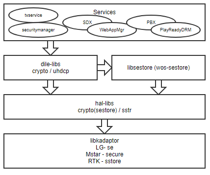

Crypto
######

.. _Eunsik Lee: eunsik0.lee@lge.com
.. _Kim Daesik: hedaesik.kim@lge.com
.. _Hwa Chin Lee: hwachin.lee@lge.com
.. _Han Gyu Park: hangyu.park@lge.com
.. _Jinyoung Choi: jinyoung76.choi@lge.com
.. _JUNG GIL WOO: jungkil.woo@lge.com
.. _CHO JUNG WON: jungwon.cho@lge.com
.. _Kihun Lee: khkh.lee@lge.com
.. _Koji Arai: koji.arai@lgjlab.com
.. _minjae choi: minjae.choi@lge.com
.. _Yoo Sun Woong: sunwoong.yoo@lge.com
.. _Woojoong Kim: woojoong.kim@lge.com
.. _Cho Yongjoon: yongjoon.cho@lge.com
.. _Won Young Gun: younggun.won@lge.com

Introduction
************
| This document describes the HAL Crypto API in the BSP layer.
  The document gives an overview of crypto APIs and provides details about its functionalities and implementation requirements.

| The crypto driver interfaces with trusted applications (TA) in the Trusted Execution Environment (TEE) to handle sensitive data such as key encryption/decryption.
  This guide assumes that readers are familiar with cryptographic, secure store and TrustZone.

Revision History
================
+---------+------------+-----------------+-------------------------------+
| Version | Date       | Changed by      | Description                   |
+=========+============+=================+===============================+
| 1.2     | 2023-11-XX | `Woojoong Kim`_ | Restructure this document     |
+---------+------------+-----------------+-------------------------------+
| 1.1     | 2023-09-05 | `Hwa Chin Lee`_ | Add functions for google cast |
+---------+------------+-----------------+-------------------------------+
| 1.0     | 2022-07-28 | `Kim Daesik`_   | Add new document              |
+---------+------------+-----------------+-------------------------------+

Terminology
===========
| The key words "must", "must not", "required", "shall", "shall not", "should", "should not", "recommended", "may", and "optional" in this document are to be interpreted as described in RFC2119.
| The following table lists the terms used throughout this document:

================================= ===============================
Term                              Description
================================= ===============================
DUK                               The key that is unique per device. DUK is used for KEK encryption. Every secure store keys are encrypted by their own unique KEK.
                                  That is, this is an anchor point to chain of trust in TEE and the root of every key chains of secure store keys. This is also called OTP key because it is stored in OTP memory. In this document, we call it DUK.
KEK                               key encryption key
SecureData                        The result from encrypting data using TEE Crypto API. The encryption key(SDEK) is unique key that is randomly generated per SecureData when requested and encrypted by DUK. The SecureData includes the encryption result and the encrypted SDEK (Protected SDEK).
SecureData Encryption Key (SDEK)  TThe key encryption key to be used to make a SecureData (encrypt data). This key is randomly generated each time that making SecureData is requested.
SecureData HMAC Key (SDHK)        TThe HMAC Key to be used to generate and verify HMAC value of Secure Data. This key is randomly generated each time that HMAC generation API is called. The key size is 32 bytes.
Protected SDEK                    The encrypted SDEK ( EDUK(SDEK) ). This data is attached in front of SecureData, and used to decrypt SecureData in TEE.
Protected SDHK                    The encrypted SDHK ( EDUK(SDHK) ).
webOS secure store                Platform Layer Secure Store. Most keys, except for those that need to be directly accessed by the SoC, are stored, including runtime-generated keys.
SoC secure store                  Provided SoC vendor Secure Store. Keys that need to be directly accessed by SoC are stored. For example, Netflix and playready.
HAL                               Hardware Abstraction Layer
REE                               Rich Execution Environment
SoCTS                             SoCTS (SoC Compliance Test Suite) is a verification testing tool for webOS TV BSP.
TA                                Trusted Application
TEE                               Trusted Execution Environment
================================= ===============================

Technical Assistance
====================
| For assistance or clarification on information in this guide, please create an issue in the LGE JIRA project and contact the following person:

=================== =================
Module              Owner
=================== =================
CRYPTO BASIC        `Kim Daesik`_,
                    `Woojoong Kim`_
CI Plus             `Yoo Sun Woong`_
DVR                 `Han Gyu Park`_
Freeview(fepg)      `minjae choi`_,
                    `JUNG GIL WOO`_
Google Cast         `Hwa Chin Lee`_
hybrid              `Koji Arai`_
LowLevelStorage     `Kihun Lee`_
MVPD(Amazone Prime) `CHO JUNG WON`_,
                    `Cho Yongjoon`_
Netflix             `Won Young Gun`_
TNM                 `Jinyoung Choi`_
Update              `Eunsik Lee`_
=================== =================

Overview
********

General Description
===================
The HAL crypto driver has a role in protecting important data such as keys by providing encryption/decryption and TA trigger functionality that operates in the TEE area with SoC secure store.
It provisions encrypted keys injected at the factory into the TEE secure storage.
It triggers the operations of specific TAs for running CP App(ex. amazone, netflix, ...)

Features
========
| The crypto driver provides the following features:

* Encryption/decryption
    * It provides an interface for the encryption and decryption operations that function work in the TEE.
* CI Plus
    * Return the ci plus regarding data from sestore
    * Need to be update
* DVR
    * Read/Write the dvr secret key to secure storage
    * Need to be update
* Freeview(fepg)
    * Read the freeview private key for certification
    * Need to be update
* Google Cast
    * Need to be update
* hybrid
    * Need to be update
* LowLevelStorage
    * Need to be update
* MVPD(Amazone Prime)
    * Read/Write Secure Data into Secure Store for Amazon
    * Need to be update
* Netflix
    * For running Netflix.
    * Need to be update
* TNM
    * Need to be update
* Update
    * Need to be update

Architecture
============

Driver Archiecture
-----------------------------

Requirements
************

Functional Requirements
=======================

Quality and Constraints
=======================
Most of crypto functions have to response within 100 ms.
Please refer to the performance requirements and constraints in the each link of API.

Implementation
**************
This section provides materials that are useful for crypto implementation.

- The File Location section provides the location of the Git repository where you can get the header file in which the interface for the VSC implementation is defined.
- The API List section provides a brief summary of crypto APIs that you must implement.
- The Implementation Details section sets implementation guidance and example code for some major functionalities.

File Location
=============
The crypto interfaces are defined in the hal_crypto.h header file, which can be obtained from https://swfarmhub.lge.com/

* Git repository: bsp/ref/hal-libs-header
* Location: [as_installed]/usr/include/hal_crypto.h

API List
========
The crypto driver implementation must adhere to the interface specifications defined and implements it's functions. Refer to the API Reference for more details.
There are deprecated functions also listed.

Data Types
----------
The crypto use common data type definded in :file:`hal_common.h`. :cpp:type:`UINT8`, :cpp:type:`UINT16`, :cpp:type:`UINT32` and below.

Extended Structure
^^^^^^^^^^^^^^^^^^
+--------------------------------+------------------------------------------------------------------------+
| Structure                      | Description                                                            |
+================================+========================================================================+
|| :cpp:struct:`_HAL_CRYPTO_ARG` || Used Netflix crypto TEE operations(:cpp:func:`HAL_CRYPTO_NF_Operate`) |
|| :cpp:type:`HAL_CRYPTO_ARG_T`  ||                                                                       |
+--------------------------------+------------------------------------------------------------------------+

Extended Enumerations
^^^^^^^^^^^^^^^^^^^^^
+----------------------------------------+-------------------------------------------------+
| Enumeration                            | Description                                     |
+========================================+=================================================+
|| :cpp:struct:`_HAL_CRYPTO_RSA_PADDING` || Padding Type for RSA encryption and decryption |
|| :cpp:type:`HAL_CRYPTO_RSA_PADDING_T`  ||                                                |
+----------------------------------------+-------------------------------------------------+

Functions
---------
BASIC
^^^^^
+----------------------------------------------------+-------------------------------------------------------+
| Function                                           | Description                                           |
+====================================================+=======================================================+
|| :cpp:func:`HAL_CRYPTO_Encrypt`                    || encrypt data with OTP based key or steady key in TEE |
|| :cpp:func:`HAL_CRYPTO_Decrypt`                    || cryptographic algorithm : AES 128 CBC                |
+----------------------------------------------------+-------------------------------------------------------+
|| :cpp:func:`HAL_CRYPTO_NYX_AES_GenerateSecureKey`  || Generate aes key for encryption and decrytion        |
||                                                   || The function owner is unknown(TVPLAT-197745)         |
+----------------------------------------------------+-------------------------------------------------------+
|| :cpp:func:`HAL_CRYPTO_NYX_AES_CryptCBC`           || Perform TEE AES encryption                           |
||                                                   || The function owner is unknown(TVPLAT-197745)         |
+----------------------------------------------------+-------------------------------------------------------+
|| :cpp:func:`HAL_CRYPTO_NYX_RSA_TransformSecureKey` || Transform secure data from RSA key                   |
||                                                   || The function owner is unknown(TVPLAT-197745)         |
+----------------------------------------------------+-------------------------------------------------------+
|| :cpp:func:`HAL_CRYPTO_NYX_RSA_Crypt`              || Perform TEE RSA encryption or decryption             |
||                                                   || The function owner is unknown(TVPLAT-197745)         |
+----------------------------------------------------+-------------------------------------------------------+
|| :cpp:func:`HAL_CRYPTO_NYX_RSA_ExportPublicKey`    || Transform secure data from RSA key                   |
||                                                   || The function owner is unknown(TVPLAT-197745)         |
+----------------------------------------------------+-------------------------------------------------------+
|| :cpp:func:`HAL_CRYPTO_AES_Encrypt`                || Perform TEE AES encryption                           |
|| :cpp:func:`HAL_CRYPTO_AES_Decrypt`                || The function owner is unknown.                       |
||                                                   || Not used in DILE.(TVPLAT-197745)                     |
+----------------------------------------------------+-------------------------------------------------------+
|| :cpp:func:`HAL_CRYPTO_RSA_Encrypt`                || Perform TEE RSA encryption                           |
||                                                   || The function owner is unknown.                       |
||                                                   || Not used in DILE.(TVPLAT-197745)                     |
+----------------------------------------------------+-------------------------------------------------------+
|| :cpp:func:`HAL_CRYPTO_RSA_Decrypt`                || Perform TEE RSA decryption                           |
||                                                   || The function owner is unknown(TVPLAT-197745)         |
+----------------------------------------------------+-------------------------------------------------------+
|| :cpp:func:`HAL_CRYPTO_RSA_Sign`                   || Perform RSA Signing in TEE                           |
||                                                   || The function owner is unknown.                       |
||                                                   || Not used in DILE.(TVPLAT-197745)                     |
+----------------------------------------------------+-------------------------------------------------------+
|| :cpp:func:`HAL_CRYPTO_RSA_Verify`                 || Perform RSA signature verification in TE             |
||                                                   || The function owner is unknown.                       |
||                                                   || Not used in DILE.(TVPLAT-197745)                     |
+----------------------------------------------------+-------------------------------------------------------+

CI Plus
^^^^^^^
+---------------------------------------------------+------------------------------------------+
| Function                                          | Description                              |
+===================================================+==========================================+
| :cpp:func:`HAL_CRYPTO_CI_PLUS_GetCiPlusSslPubKey` | Get the ci_ssl_pub_key data from sestore |
+---------------------------------------------------+------------------------------------------+
| :cpp:func:`HAL_CRYPTO_CI_PLUS_GetCiPlusStdKey`    | Get the ci_key data from sestore         |
+---------------------------------------------------+------------------------------------------+
| :cpp:func:`HAL_CRYPTO_CI_PLUS_GetCiPlusDhKey`     | Get the ci_dh_key data from sestore      |
+---------------------------------------------------+------------------------------------------+

DVR
^^^
+---------------------------------------------+--------------------------------------------+
| Function                                    | Description                                |
+=============================================+============================================+
| :cpp:func:`HAL_CRYPTO_ReadDVRDeviceSecret`  | Get the dvr secret key from secure storage |
+---------------------------------------------+--------------------------------------------+
| :cpp:func:`HAL_CRYPTO_WriteDVRDeviceSecret` | Write the dvr secret key to secure storage |
+---------------------------------------------+--------------------------------------------+

Freeview(fepg)
^^^^^^^^^^^^^^
+-----------------------------------------------+-------------------------------------------------+
| Function                                      | Description                                     |
+===============================================+=================================================+
| :cpp:func:`HAL_CRYPTO_ReadFreeViewPrivateKey` | Read the freeview private key for certification |
+-----------------------------------------------+-------------------------------------------------+

Google Cast
^^^^^^^^^^^^^^^^^^^^
+-----------------------------------------------+-------------------------------------------------------+
| Function                                      | Description                                           |
+===============================================+=======================================================+
| :cpp:func:`HAL_CRYPTO_CastGenerateClientAuth` | Genrate client certification                          |
+-----------------------------------------------+-------------------------------------------------------+
| :cpp:func:`HAL_CRYPTO_CastSignHash`           | Sign hash data to generate signature with private key |
+-----------------------------------------------+-------------------------------------------------------+

LowLevelStorage
^^^^^^^^^^^^^^^
+---------------------------------------+-------------------------------------------------------------------------------------+
| Function                              | Description                                                                         |
+=======================================+=====================================================================================+
| :cpp:func:`HAL_CRYPTO_EncryptDbgData` | Perform encryption with a randomly generated encryption key on TEE for each device. |
+---------------------------------------+-------------------------------------------------------------------------------------+
| :cpp:func:`HAL_CRYPTO_DecryptDbgData` | Perform decryption with a randomly generated encryption key on TEE for each device. |
+---------------------------------------+-------------------------------------------------------------------------------------+

MVPD
^^^^
+----------------------------------------+------------------------------------------------+
| Function                               | Description                                    |
+========================================+================================================+
| :cpp:func:`HAL_CRYPTO_ReadMVPDSecret`  | Read Secure Data from Secure Store for Amazon  |
+----------------------------------------+------------------------------------------------+
| :cpp:func:`HAL_CRYPTO_WriteMVPDSecret` | Write Secure Data into Secure Store for Amazon |
+----------------------------------------+------------------------------------------------+

Netflix
^^^^^^^
+------------------------------------------+-------------------------------------------------------------------------+
| Function                                 | Description                                                             |
+==========================================+=========================================================================+
| :cpp:func:`HAL_CRYPTO_WriteSecureData`   | Write ESN key to secure storage for provisioning                        |
+------------------------------------------+-------------------------------------------------------------------------+
| :cpp:func:`HAL_CRYPTO_NF_GetESN`         | Get ESN key value                                                       |
+------------------------------------------+-------------------------------------------------------------------------+
| :cpp:func:`HAL_CRYPTO_NF_Encrypt`        | encrypt data with device unique key                                     |
+------------------------------------------+-------------------------------------------------------------------------+
| :cpp:func:`HAL_CRYPTO_NF_Decrypt`        | decrypt data with device unique key                                     |
+------------------------------------------+-------------------------------------------------------------------------+
| :cpp:func:`HAL_CRYPTO_NF_Encrypt_Ex`     | encrypt data with device unique key and integrity check                 |
+------------------------------------------+-------------------------------------------------------------------------+
| :cpp:func:`HAL_CRYPTO_NF_Decrypt_Ex`     | decrypt data with device unique key and integrity check                 |
+------------------------------------------+-------------------------------------------------------------------------+
| :cpp:func:`HAL_CRYPTO_NF_WriteAppData`   | Write App Data to Secure Store                                          |
+------------------------------------------+-------------------------------------------------------------------------+
| :cpp:func:`HAL_CRYPTO_NF_ReadAppData`    | Read App Data to Secure Store                                           |
+------------------------------------------+-------------------------------------------------------------------------+
| :cpp:func:`HAL_CRYPTO_NF_Operate`        | Netflix crypto TEE operations(generate keys / encrypt / decrypt / HMAC) |
+------------------------------------------+-------------------------------------------------------------------------+
| :cpp:func:`HAL_CRYPTO_NF_Init`           | Init Netflix Crypto                                                     |
+------------------------------------------+-------------------------------------------------------------------------+
| :cpp:func:`HAL_CRYPTO_NF_CleanUp`        | To clean up Netflix webCrypto and SoC TEE operation                     |
+------------------------------------------+-------------------------------------------------------------------------+
| :cpp:func:`HAL_CRYPTO_NF_DestroyContext` | Destroy context.                                                        |
+------------------------------------------+-------------------------------------------------------------------------+

Excluded from SoCTS
^^^^^^^^^^^^^^^^^^^^
The following function is excluded from SoCTS as it is either unused or its owner cannot be identified.(TVPLAT-197745)

The functions owner is unknown
"""""""""""""""""""""""""""""""
+-----------------------------------------------------+--------------------------------------------------------------------------------------------------+
| Function                                            | Description                                                                                      |
+=====================================================+==================================================================================================+
| :cpp:func:`HAL_CRYPTO_ReadMskToSecureStore`         | - Not used in DILE.                                                                              |
+-----------------------------------------------------+--------------------------------------------------------------------------------------------------+
| :cpp:func:`HAL_CRYPTO_WriteMskToSecureStore`        | - Not used in DILE.                                                                              |
+-----------------------------------------------------+--------------------------------------------------------------------------------------------------+
| :cpp:func:`HAL_CRYPTO_SDP_ReadCommonKey`            | - Not used in DILE.                                                                              |
+-----------------------------------------------------+--------------------------------------------------------------------------------------------------+

The functions are not used
"""""""""""""""""""""""""""
+--------------------------------------------------+---------------------------+
| Function                                         | Description               |
+==================================================+===========================+
| :cpp:func:`HAL_CRYPTO_Debug`                     | not used                  |
+--------------------------------------------------+---------------------------+
| :cpp:func:`HAL_CRYPTO_ReadNLPSecret`             | not used                  |
+--------------------------------------------------+---------------------------+
| :cpp:func:`HAL_CRYPTO_BBC_ReadClientKey`         | not used                  |
+--------------------------------------------------+---------------------------+
| :cpp:func:`HAL_CRYPTO_ReadPrsSecret`             | not used                  |
+--------------------------------------------------+---------------------------+
| :cpp:func:`HAL_CRYPTO_GetDebugKey`               | not used                  |
+--------------------------------------------------+---------------------------+
| :cpp:func:`HAL_CRYPTO_Multiple_ReadClientKey`    | not used                  |
+--------------------------------------------------+---------------------------+
| :cpp:func:`HAL_CRYPTO_ReadSkypeSecret`           | not used                  |
+--------------------------------------------------+---------------------------+
| :cpp:func:`HAL_CRYPTO_ReadRemoteDiagSecret`      | not used                  |
+--------------------------------------------------+---------------------------+
| :cpp:func:`HAL_CRYPTO_SDI_ReadPrivKeyAndID`      | not used                  |
+--------------------------------------------------+---------------------------+
| :cpp:func:`HAL_CRYPTO_ReadRDXSecret`             | not used                  |
+--------------------------------------------------+---------------------------+
| :cpp:func:`HAL_CRYPTO_TWINTV_ReadSecret`         | not used                  |
+--------------------------------------------------+---------------------------+
| :cpp:func:`HAL_CRYPTO_WriteHDCPOnSecure`         | not used                  |
+--------------------------------------------------+---------------------------+
| :cpp:func:`HAL_CRYPTO_ReadHDCPFromSecure`        | not used                  |
+--------------------------------------------------+---------------------------+
| :cpp:func:`HAL_CRYPTO_SFU_Initialize`            | not used(module: update)  |
+--------------------------------------------------+---------------------------+
| :cpp:func:`HAL_CRYPTO_SFU_Finalize`              | not used(module: update)  |
+--------------------------------------------------+---------------------------+
| :cpp:func:`HAL_CRYPTO_SFU_GetRSAKey`             | not used(module: update)  |
+--------------------------------------------------+---------------------------+
| :cpp:func:`HAL_CRYPTO_SFU_GetAESKey`             | not used(module: update)  |
+--------------------------------------------------+---------------------------+
| :cpp:func:`HAL_CRYPTO_TNM_ReadSecretKey`         | not used(module: TNM)     |
+--------------------------------------------------+---------------------------+
| :cpp:func:`HAL_CRYPTO_TNM_WriteSecretKey`        | not used(module: TNM)     |
+--------------------------------------------------+---------------------------+
| :cpp:func:`HAL_CRYPTO_HYBRIDCAST_ReadSecret`     | not used(module: hybrid)  |
+--------------------------------------------------+---------------------------+
| :cpp:func:`HAL_CRYPTO_CIPLUS_GetCiPlusSslPubKey` | not used(module: CI Plus) |
+--------------------------------------------------+---------------------------+
| :cpp:func:`HAL_CRYPTO_CIPLUS_GetCiCanalReadyKey` | not used(module: CI Plus) |
+--------------------------------------------------+---------------------------+

Implementation Details
======================
Refer to the each function definition link in API list.

Testing
*******
To test the implementation of the crypto driver, webOS provides SoCTS tests.
The SoCTS checks the basic operation of the crypto driver and verifies the kernel event operation for the module by using a test execution file.
For details, see crypto Unit Test in SoCTS Unit Test Specification.

References
**********
NA