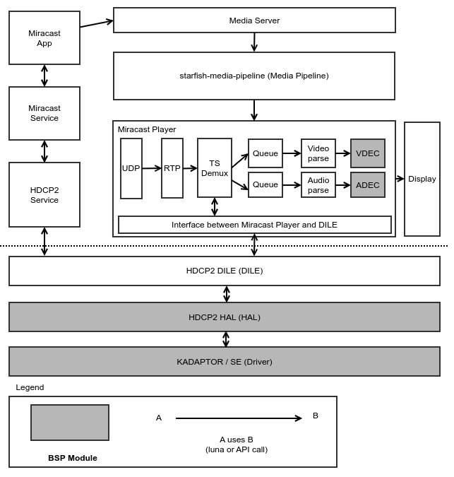

HDCP2
==========

Introduction
------------

To meet the requirements of confidentiality and integrity for values within
HDCP2.x IIA specification. HAL_HDCP2 functions support that the a confidential
value must never be revealed and the integrity of many values in the system is
protected by fail-safe mechanisms of the protocol.

Revision History
----------------

======= ========== ============== ===============================
Version Date       Changed by     Comment
======= ========== ============== ===============================
2.0.0   23.11.16   taeho.choi     Change format & Update contents
1.0.0   22.03.28   kyungnam.bae   Initial Documentation
======= ========== ============== ===============================

Terminology
-----------

The key words “must”, “must not”, “required”, “shall”, “shall not”, “should”, “should not”, “recommended”, “may”, and “optional” in this document are to be interpreted as described in RFC2119.

The following table lists the terms used throughout this document:

=======  ====================================================
Term     Description
=======  ====================================================
AKE      Authentication Key Exchange
DCP LLC  Digital Content Protection Limited Liability Company
HAL      Hardware Adaptation Layer
HDCP     High-bandwidth Digital Content Protection
RX       Receiver
TX       Transmitter
AES      Advanced Encryption Standard
AES-CTR  AES Counter
=======  ====================================================

Technical Assistance
--------------------

For assistance or clarification on information in this guide, please create an issue in the LGE JIRA project and contact the following person:

======== ====================
Module   Owner
======== ====================
HDCP2 TX kyungnam.bae@lge.com
HDCP2 RX taeho.choi@lge.com
======== ====================

Overview
--------

General Description
^^^^^^^^^^^^^^^^^^^

| HDCP is designed to protect the transmission of Audiovisual Content Content between an HDCP Transmitter and an HDCP Receiver.
| The HDCP Transmitter may support simultaneous connections to HDCP Receivers through on or more of its HDCP-protected interface ports.
| The system also allows for HDCP Repeaters that support downstream HDCP-protected Interface Ports.
| Refer to the HDCP2.x IIA specifications.

Architecture
^^^^^^^^^^^^

Refer to the HDCP2.x IIA specifications

Overall Workflow
^^^^^^^^^^^^^^^^

Requirements
------------

Functional Requirements
^^^^^^^^^^^^^^^^^^^^^^^

Please refer to each function's description and requirement.

Implementation
--------------

This section provides materials that are useful for HDCP2 implementation.

- The `File Location`_ section provides the location of the Git repository where you can get the header file in which the interface for the SVP implementation is defined.
- The `API List`_ section provides a brief summary of HDCP2 APIs that you must implement.
- The `Implementation Details`_ section sets implementation guidance and example code for some major functionalities.

File Location
^^^^^^^^^^^^^

The HDCP2 interfaces are defined in the hal_hdcp2.h header file, which can be obtained from https://wall.lge.com/.

- Git repository: bsp/ref/hal-libs-header

API List
^^^^^^^^

The HDCP2 module implementation must adhere to the interface specifications defined and implements its functions. Refer to the API Reference for more details.

Data Types
**********

NA

Functions
*********

=============================================== ============================================================================================
Function                                        Description
=============================================== ============================================================================================
:cpp:func:`HAL_HDCP2_WriteKeySet`               Key RW HALs when supporting Secure Storage
:cpp:func:`HAL_HDCP2_GetEncHdcp2Key`            Key RW HALs when supporting Secure Storage, except from socts, deprecated since webOS4.5
:cpp:func:`HAL_HDCP2_SetEncHdcp2Key`            Key RW HALs when supporting Secure Storage, except from socts, deprecated since webOS4.5
:cpp:func:`HAL_HDCP2_GetRootPublicKey`          Get root public key for TX, Read HDCP2 TX key from Secure Storage.
:cpp:func:`HAL_HDCP2_UseTestVector`             Test HAL_HDCP2 using Test Vector.
:cpp:func:`HAL_HDCP2_GetCertInfo`               Except from socts, deprecated since webOS1.0.
:cpp:func:`HAL_HDCP2_GetCertInfo2`              To read HDCP2 key from Secure Stroage.
:cpp:func:`HAL_HDCP2_Decrypt_RSAES_OAEP`        HAL decrypts the km and stores the decrypted km to the secure store.
:cpp:func:`HAL_HDCP2_Encrypt_RSAES_OAEP`        Generate random value for km - 16 byte, Encrypts km with kpubrx (Ekpub (km)).
:cpp:func:`HAL_HDCP2_Kd_Key_Derivation`         Key derivation by AES-CTR.
:cpp:func:`HAL_HDCP2_Compute_H_Prime`           HAL generates hash code using HMAC-SHA256.
:cpp:func:`HAL_HDCP2_Compute_L_Prime`           Write result L_prime value to pLPrime buffer.                                        
:cpp:func:`HAL_HDCP2_Compute_Kh`                hdcp2_kh is generated by HAL_HDCP2_WriteKeySet func, Store the kh value to the secure DRAM.
:cpp:func:`HAL_HDCP2_Encrypt_Km_using_Kh`       Encrypted Km value using kh key by AES mechanism.
:cpp:func:`HAL_HDCP2_Decrypt_Km_using_Kh`       Decrypts ekh_km using AES with the received pM as input and kh as key in to the AES module. Decrypted km must store to secure storage in the secure world.
:cpp:func:`HAL_HDCP2_Decrypt_EKs`               Decrypts ks using XOR operation.
:cpp:func:`HAL_HDCP2_HMAC_SHA256_with_kd`       Compute HMAC-SHA256 using the kd value as key.
:cpp:func:`HAL_HDCP2_XOR_Ks_with_LC128`         Do XOR operation ks with lc128 and the results is stored in secure DRAM.
:cpp:func:`HAL_HDCP2_Generate_Km`               Except from socts, deprecated since webOS4.5.
:cpp:func:`HAL_HDCP2_Generate_Ks`               Derivate dkey2.
:cpp:func:`HAL_HDCP2_Write_StoredKm`            Store hdcp2_km to selected StoredKm slot.
:cpp:func:`HAL_HDCP2_Select_StoredKm`           Select StoredKm slot and reload the StoredKm to hdcp2_km.
:cpp:func:`HAL_HDCP2_SHA256`                    Operate SHA-256, except from socts, deprecated since webOS4.5
:cpp:func:`HAL_HDCP2_AES_CTR`                   Operate a AES_CTR function with CTR mode, except from socts, deprecated since webOS4.5.
:cpp:func:`HAL_HDCP2_GetProtectedDecryptionKey` Get protected decryption key (Ks XOR LC128), it should be encrypted
:cpp:func:`HAL_HDCP2_SetProtectedDecryptionKey` Set protected decryption key (Ks XOR LC128), it can be executed the other process with HAL_HDCP2_GetProtectedDecryptionKey function.
:cpp:func:`HAL_HDCP2_Data_Decrypt`              Data Decryption
:cpp:func:`HAL_HDCP2_Data_Encrypt`              It is equal to the HAL_HDCP2_Data_Decrypt function except it’s operated in the secure world. Except from socts, it can be only verified by TAS.
:cpp:func:`HAL_HDCP2_Compute_V_Prime`           Repeater HALs, write result V_prime value to pVPrime buffer.
:cpp:func:`HAL_HDCP2_Compute_M_Prime`           Repeater HALs, write result M_prime value to pMPrime buffer.
:cpp:func:`HAL_HDCP2_HMAC_SHA256`               Compute HMAC-SHA256 using the kd value as key.
:cpp:func:`HAL_HDCP2_SHA1`                      Except from socts, deprecated since webOS4.5.
=============================================== ============================================================================================

Testing
-------

To test the implementation of the HDCP2 module, webOS TV provides SoCTS (SoC Test Suite) tests. The SoCTS checks the basic operations of the HDCP2 module and verifies the kernel event operations for the module by using a test execution file. For more information, see HDCP2's SoCTS Unit Test manual.

References
----------

Refer to the HDCP2.x IIA specifications