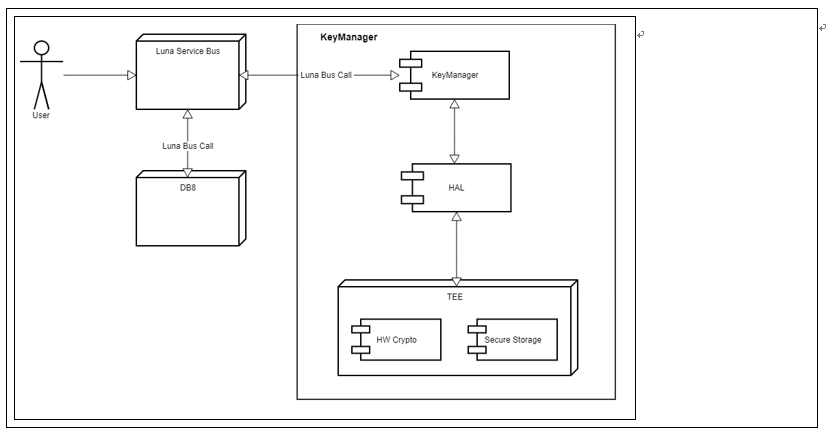

KEYMASTER
####

.. _daesik.kim: hedaesik.kim@lge.com

Introduction
************

| This document describes the keymaster module for crypto operation.

Revision History
================

======= ========== ============== ==================
Version Date       Changed by     Comment
======= ========== ============== ==================
1.0.0   2023.01.31 hedaesik.kim   Add Doc.
1.1.0   2023.11.27 hedaesik.kim   Update documents
======= ========== ============== ==================

Terminology
===========

| The following table lists the terms used throughout this document:

=============================== ===============================
Term                            Description
=============================== ===============================
Keymaster CA                    Library to interface with keymaster TA.
Keymaster TA                    Applications operating on the TEE responsible for managing the key.
Keymanager3                     A service that allows external services on webos to use the keymaster's functionality using the keymaster CA.
SecureStore TA                  Trusted application that receives and processes pre-encrypted data through pre-encryption tool at run time on the TV.
Master key                      Must be safely saved as a device uniquely generated key in the keymaster TA.
Key blob                        Data that is encrypted the key generated for crypto operation and related information with the master key of the key master TA.
TEE                             Truested Execution Environment.
REE                             Rich Execution Environment.
TA                              Trusted Applications running in TEE side.
CA                              Library to communicate to specific TA. (libopteeKeymasterCA.so)
SOCTS                           Test framework for testing BSP API like HAL SSTR API.
SSTR                            Short term of Secure Storage.
=============================== ===============================

Technical Assistance
====================

For assistance or clarification on information in this guide, please create an issue in the LGE JIRA project and contact the following person:

============ ===============================
Module       Owner
============ ===============================
KEYMASTER    `hedaesik.kim`_
============ ===============================

Overview
********

General Description
===================

| Secure Storage is a function commonly required by the connected embedded system and is also adopted by its products as a prerequisite for mass production.

| webOS provides several means for data protection, and KeyManager is provided to protect encryption keys that require the highest level of security.

| The keymaster in this requirement has the same requirement as the Android HW keymaster.

| The keymaster protects key data by generating and protecting key data in the TEE and encrypting it with the master key generated in the TEE.

| The keymaster TA receives and processes requests for encryption, decryption, and key generation through the keymaster CA library.

| Keymaster CA library should be installed to /usr/lib the file name libopteeKeymasterCA.so

Features
========

| The keymaster must support key generation. Create a key by referring to the requested information, encrypt it with the master key generated by the keymaster, and return it.

| The keymaster supports the creation of the keys below.

- 1. AES-128, AES-192, AES-256
- 2. RSA-1024, RSA-2048, RSA-3072, RSA-4096
- 3. EC-224, EC-256, EC-384, EC-521
- 4. HMAC-192

| The keymaster allows the import of externally generated keys.

- 1. AES-128, AES-192, AES-256
- 2. RSA-1024, RSA-2048, RSA-3072, RSA-4096
- 3. EC-224, EC-256, EC-384, EC-521
- 4. HMAC-192

| The keymaster should support the following operations using keys generated or imported through the keymaster.

- 1. Encryption
- 2. Decryption
- 3. Sign
- 4. Verify

Architecture
============

Driver Architecture
-------------------

| Keymaster3 is a service that receives requests from the App and performs key generation, key management, and cryptographic algorithm tasks using Keymaster TA operating within the TEE.

| Keymaster CA is responsible for converting and delivering input data so that the functions provided by Keymaster TA are accessible.

| The keymaster TA is an application that operates in a Trusted Execution Environment (TEE) and generates the requested key, Perform key management and cryptographic algorithm tasks Key generation and encryption algorithm operations are implemented using the Global Platform TEE Internal Core API.

| Sestore TA is an application that operates on the Trusted Execution Environment (TEE), encrypts the user's key using the key of the TEE, stores it securely, and returns the key plain text on request.

Overall Workflow
================

Steps Before Provisioning Key
-------------------

| The keymanager3 service will call keymaster api which is provided by keymaster CA library.

| The keymaster TA operates on TEE and aims to protect key data.

| The keymaster TA protects key data and properties by making them key blob and encrypting them with the keymaster TA's master key.

| The key data generated by the keymaster TA is not exposed to REE as a plain data.

| The keymaster TA should perform the crypto operation delivered through the keymaster CA. If there is HW supported crypto operation, it should be used to improve performance.

Requirements
************

Functional Requirements
=======================

Keymaster requirement
^^^^^^^^^^^^^^^^^^^^^^^^^^

================================= ======================================
REQ-ID                            Requirement
================================= ======================================
REQ-001                           Keymaster TA must be able to create a device unique master key and must be stored securely.
REQ-002                           Keymaster TA must be able to generate a key dynamically, and the generated key must be encrypted and returned using the master key.
REQ-003                           Keymaster TA must be able to perform the request-on operation using the key blob encrypted by the keymaster TA.
REQ-004                           Keymaster TA should be able to manage and complete/abort external requests on a handle basis.
REQ-005                           Keymaster TA should be able to process multiple encryption/decryption operations simultaneously and individually in units of hands.
================================= ======================================

Quality and Constraints
=======================

Exception Cases
-----------

| If there are more than 20 hands, delete the oldest hands first.

| keymaster TA's master key must not be deleted or changed after it has been created.

Implementation
**************

File Location
=============
| The keymaster api for crypto operations is provided by libopteeKeymasterCA library.
| libopteeKeymasterCA.so should be installed when hal-libs is built. 
| And keymaster code can be stored in hal-libs repo.

API List
========

Functions
---------

============================================================================ ===================================================================================================
Function                                                                     Description
============================================================================ ===================================================================================================
:cpp:func:`keymaster::OpteeKeymaster3Device::getHardwareFeatures`            Returns characteristic information for keymaster TA.
:cpp:func:`keymaster::OpteeKeymaster3Device::addRngEntropy`                  Not used
:cpp:func:`keymaster::OpteeKeymaster3Device::generateKey`                    Generate key for crypto operation.
:cpp:func:`keymaster::OpteeKeymaster3Device::getKeyCharacteristics`          Returns properties of key via Key Blob.
:cpp:func:`keymaster::OpteeKeymaster3Device::importKey`                      Create a key blob by receiving an externally generated plain key.
:cpp:func:`keymaster::OpteeKeymaster3Device::importSecKey`                   Converts and returns the keymaster key blob from enencrypted key data which is encrypted by SecureStore TA.
:cpp:func:`keymaster::OpteeKeymaster3Device::exportKey`                      Return public key from key blob generated by the keymaster TA, Return public key.
:cpp:func:`keymaster::OpteeKeymaster3Device::begin`                          Receives key blob generated by the keymaster TA and prepare crypto operation for requested crypto operation with key blob. And return the unique handle id to identify request of crypto operation.
:cpp:func:`keymaster::OpteeKeymaster3Device::update`                         Receive handle id and data to perform crypto operations
:cpp:func:`keymaster::OpteeKeymaster3Device::finish`                         Get hdndle id and data. Then returns final results of crypto operations.
:cpp:func:`keymaster::OpteeKeymaster3Device::abort`                          Terminate crypto operations corresponding to handle id.
============================================================================ ===================================================================================================

Implementation Details
======================

Scenario for creating a key
----------------------------------------------------

Normal Sequence
^^^^^^^^^^^^^^^

.. code-block:: text

    An external app requests key creation from keymanager3 service.
    |- Keymanager3 call the generateKey of keymaster CA library.
        |- Keymaster TA get key generation request.
        |- Keymaster TA generates requested key.
        |- Keymaster TA serialize key and key properties.
        |- Create a keyblob by encrypting with the master key of the keymaster TA.
        |- Return key blob.
    |- Get key blob and save that in db.
	
Scenario for importing a key
----------------------------------------------------

Normal Sequence
^^^^^^^^^^^^^^^

.. code-block:: text

    An external app generates key and requests to import keys to keymanager3 service.
    |- Keymanager3 call the importKey of keymaster CA library.
        |- Keymaster TA gets plain key data.
        |- Keymaster TA serialize key and key properties.
        |- Create a keyblob by encrypting with the master key of the keymaster TA.
        |- Return key blob.
    |- Get key blob and save that in db.

Use the key to perform a crypto operation
----------------------------------------------------

Normal Sequence
^^^^^^^^^^^^^^^

.. code-block:: text

    An external app requests to begin crypto operation with key name to keymanager3 service.
    |- Keymanager3 service gets the keys from db by key name and call begin api of keymaster CA library.
        |- Keymaster TA gets key blob and purpose.
        |- Keymaster TA decrypts key blob and initializes crypto operation.
        |- Keymaster TA creates crypto handle and return handle name.
        |- Get handle name and send that to external app.
    Deliver data and handle name to keymaster3 service.
    |- Keymanager3 service call update api in keymaster CA library with data and handle name.
    |- Keymaster TA gets data and handle.
        |- Keymaster TA updates data to right crypto handle.
        |- Keymaster TA returns the result.
    |- Get result and send that to external app.
    Delivery final data and handle name to keymaster3 service.
    |- Keymanager3 service call finish api in keymaster CA library with data and handle name.
        |- Keymaster TA gets data and handle.
        |- Keymaster TA updates data to right crypto handle.
        |- Keymaster TA returns the result.
    |- Get result and send that to external app.

Abort crypto operation
----------------------------------------------------

Normal Sequence
^^^^^^^^^^^^^^^

.. code-block:: text

    An external app requests to begin crypto operation with key name to keymanager3 service.
    |- Keymanager3 service gets the keys from db by key name and call begin api of keymaster CA library.
        |- Keymaster TA gets key blob and purpose.
        |- Keymaster TA decrypts key blob and initializes crypto operation.
        |- Keymaster TA creates crypto handle and return handle name.
    |- Get handle name and send that to external app.
    Request abort crypto operation with handle name to keymanager3 service.
    |- Keymanager3 service call abort api in keymaster CA library with handle name.
        |- Keymaster TA gets the request of abort.
        |- Keymaster TA releases and clean the resources relates to handle name.
        |- Keymaster TA returns the result.
    |- Get result and send that to external app.

Testing
*******
| If both CA and TA on the keymaster are corresponding, and the header files and library(libopteeKeymasterCA.so) are provided, LG can build and deliver a test binary.
| You can use this test binary to verify the operability of the apps provided by the keymaster CA.

References
**********

If you see this page in HTML, please click below tag.
:download:`keymaster CA reference source code <resource/keymaster-ca.tar>`

If you see this page in PDF, please check the keymaster-ca.tar in attachment tab of Adobe Reader
(View > Show/Hide > Navigation Panes > Attachments)

If you see this page in HTML, please click below tag.
:download:`keymaster TA reference source code <resource/keymaster-ta.tar>`

If you see this page in PDF, please check the keymaster-ta.tar in attachment tab of Adobe Reader
