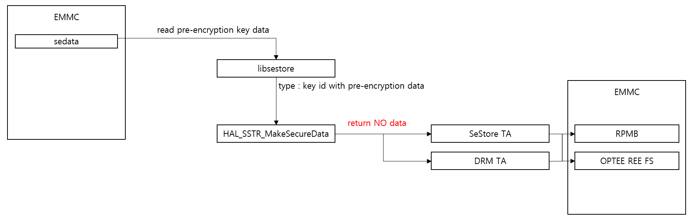

SSTR
####

.. _daesik.kim: hedaesik.kim@lge.com
.. _minsu.park: minsu0312.park@lge.com
.. _jiwon.seok : jiwon.seok@lge.com

Introduction
************

| This document describes the secure stroage for webOSTV and SSTR(Secure Storage) function for using secure storage.

Revision History
================

======= ========== ============== ==================
Version Date       Changed by     Comment
======= ========== ============== ==================
1.0.0   2022.07.26 hedaesik.kim   Add Doc.
1.1.0   2023.11.10 hedaesik.kim   Update documents
======= ========== ============== ==================

Terminology
===========

| The following table lists the terms used throughout this document:

=============================== ===============================
Term                            Description
=============================== ===============================
Pre-encryption tool             Tool for creating encrypted data before provisioning to the TV.
Pre-encryption key data         Data encrypted with pre-encryption tool.
SecureStore TA                  Trusted application that receives and processes pre-encrypted data through pre-encryption tool at run time on the TV.
Sedata                          Package name of pre-encryption data.
Factory key                     Provisioned key from factory line. Key to be injected device unqiue is injected from the factory production line.
Device unique key(DUK)          During mass production, device unique keys are injected into specific TA (each device has different key).
SecureData                      Encrypted data by secure SecureStore TA.
Wossestore                      Emmc partition name which SecureData are stored.
RPMB                            Replay Protected Memory Block is a dedicated partition available on EMMC.
Optee secure storage            REE FS Secure Storage.
KEK                             Key encryption key, KEK consist of encryption key and integrity protection key.
SDEK                            Secure data encryption key and randomly generated per a SEDATA.
SDHK                            Secure data HMAC key and randomly generated per a SEDATA.
TEE                             Truested Execution Environment.
REE                             Rich Execution Environment.
TA                              Trusted Applications running in TEE side.
SOCTS                           Test framework for testing BSP API like HAL SSTR API.
=============================== ===============================

Technical Assistance
====================

For assistance or clarification on information in this guide, please create an issue in the LGE JIRA project and contact the following person:

============ ===============================
Module       Owner
============ ===============================
SSTR         `hedaesik.kim`_
============ ===============================

Overview
********

General Description
===================

| In webOS, there are keys necessary for the operation of TV, and a mechanism is needed to safely store them.
| Functions necessary for safe injection and storage of keys correspond to SSTR functions.
| By the SSTR function, the keys are stored in a secure storage space on the TEE side, or in the REE side as a result of being encrypted by TA.
| The storage space of the TEE area has a storage space such as RPMB or optee secure storage.

Features
========

| In webOS, the key is injected into the TV in the following way.

- 1. Injection from the factory
- 2. Inject included in firmware
- 3. Download via server and save to TV

| Specifying and Requirements for key Injected at Factory:

- If keys need to be device unique, these keys are injected in the factory.
- Most of the keys injected from the factory should be safely stored in the TEE area. In addition, some keys must exist encrypted before being injected.
This is subject to the obligations of the key's contract.
- These keys are injected through a hal interface called CRYPTO, and this document does not deal with that CRYPTO HAL API. You can see CRYPTO HAL API in :doc:`CRYPTO document </part3/hal-libs-header/documentation_mo/source/security/crypto>`.

| Specifying and Requirements for key included in firmware:

- If the same key is used for each SW, the key in the firmware image (SW) is included.
- In this way, the keys included in the SW must be pre-encrypted, and these keys are included in a package named sedata.
- Keys packaged in sedata are injected through a hal interface called SSTR.
- Keys packaged in sedata are divided into keys that should be stored in secure storage in the TEE area and keys stored in the REE area.

| Downloaded from the server and stored on the TV key:

- It is a key that downloads a key through a server and is stored in a webOS.
- These keys are injected through a hal interface called CRYPTO, and this document does not deal with that CRYPTO HAL API.

Architecture
============

Driver Architecture
-------------------

| The TV communicates with the associated Trusted Application through the HAL SSTR API interface to inject, read, and write keys.

====================================================== ===================================================================================================
Function                                               Description
====================================================== ===================================================================================================
Security module                                        Use SSTR function to inject key or request decrypt, etc.
Truested Application                                   Certain DRM-related keys are encrypted to the respective TAs and the key is delivered. The received keys can only decrypt the TA using the key.
====================================================== ===================================================================================================

Overall Workflow
================

Steps Before Provisioning Key
-------------------

| The keys that are included in the firmware and want to be stored on the TV are packaged in sedata.

| The keys contained in the sedata are all encrypted using the pre-encryption tool.

| When Firmware is written to emmc, sedata is also written to emmc.

Among the keys included in the sedata, the keys stored in the REE
-------------------

| TV will read the key from the sedata when tv turns on first time.

| The keys included in the sedata are pre-encrypted key data, which can be decrypted in SeStore TA.

| The pre-encryption key is delivered via HAL_SSTR_MakeSecureData, and the parameter of key type is sedata when the function is called.

| In this case(type is sedata), key will be saved in the EMMC REE area.

| SeStore TA should decrypt the pre-encryption data and then re-encrypt with Device Unique Key and returned to REE.

| The returned key(re-encrypted key data) will be stored in the EMMC of the REE area.

Among the keys included in the sedata, the keys stored in the TEE
-------------------

| TV will read the key from the sedata when tv turns on first time.

| The keys included in the sedata are pre-encrypted key data, which can be decrypted in SeStore TA or DRM TA.

| The pre-encryption key is delivered via HAL_SSTR_MakeSecureData, and the parameter of key type is key id when the function is called.

| In this case(type is key id), key should be saved in the EMMC TEE area.

| SeStore TA and DRM TA should decrypt the pre-encryption data and that TAs should save key data to RPMB or OPTEE REE FS.

| These keys should never come up to REE unless there are special requirements.

Key generated in run time, the keys stored in the REE
-------------------

| When TV is running, some keys will be generated.

| These keys are delivered via HAL_SSTR_MakeSecureData, and the parameter of key type is general when the function is called.

| In this case(type is general), key will be saved in the EMMC REE area.

| SeStore TA should encrypt with Device Unique Key and returned to REE.

| The returned key(encrypted key data) will be stored in the EMMC of the REE area.

Requirements
************

Functional Requirements
=======================

Secure storage requirement
^^^^^^^^^^^^^^^^^^^^^^^^^^

================================= ======================================
REQ-ID                            Requirement
================================= ======================================
REQ-SS-001                        MUST support secure storage functionality which complies (or equivalent to) GlobalPlatform TEE standard. MUST support tee-supplicant module which runs in REE to access the file system and RPMB instead of TEE OS.
REQ-SS-002                        MUST support cryptographic isolation for secure storage of each TA and it MUST complies (or equivalent to) OP-TEE implementation. MUST provide a document which describes details (key length, algorithm and key hierarchy) of cryptographic keys. MUST use AES256 CBC/CTR with random IV or AES256 GCM (confidentiality), and HMAC-SHA256 (integrity) at least.
REQ-SS-003                        MUST derive RPMB key from HUK, program it in eMMC securely and never expose it to REE.
REQ-SS-004                        MUST not expose any REE interface which allow to generate HMAC for RPMB packet.
REQ-SS-005                        MUST support confidentiality and integrity of data stored in RPMB. MUST use AES256 CBC/CTR with random IV or AES256 GCM (confidentiality), and HMAC-SHA256 (integrity) at least. MUST support cryptographic isolation for RPMB data of each TA. MUST provide a document which describes details (key length, algorithm and key hierarchy) of cryptographic keys.
REQ-SS-006                        MUST support key backup and restore feature.
REQ-SS-007                        MUST not erase provisioned keys during factory data reset.
================================= ======================================

Key provisioning requirement
^^^^^^^^^^^^^^^^^^^^^^^^^^^^

================================= ======================================
REQ-ID                            Requirement
================================= ======================================
REQ-KP-001                        Keys stored in specific TA except SeStore TA MUST not be shared (exposed) to REE and MUST not support runtime key distribution through Inter-TA.
REQ-KP-002                        MUST use unique KEK (encryption key and integrity protection key) per TA. MUST use different key for encryption and integrity protection. MUST use AES256 CBC/CTR with random IV or AES256 GCM (confidentiality), and HMAC-SHA256 (integrity) at least. MUST provide a document which describes details (key length, algorithm and key hierarchy) of cryptographic keys.
REQ-KP-003                        MUST not expose KEK used by key data encryption tool in plain text form. MUST provide a document how the KEK is protected in key data encryption tool. MUST provide a document how the KEK is protected in key data encryption tool.
REQ-KP-004                        MUST comply TA design option
REQ-KP-005                        MUST provision device unique key and SEDATA_TEE key to intended TA (not SeStore TA).
REQ-KP-006                        MUST provision a key to specific TA if exist dedicated TA for the key.
REQ-KP-007                        MUST comply with key metadata requirement.
REQ-KP-008                        SHOULD not support runtime key distribution through Inter-TA. MUST support a way to check caller's identity and do access control based on metadata if support runtime key distribution.
REQ-KP-009                        MUST comply with SEDATA key requirement. MUST use AES256 CBC/CTR with random IV or AES256 GCM (confidentiality), and HMAC-SHA256 (integrity) at least.
REQ-KP-010                        MUST generate Secure Data only when metadata requirement it met.
================================= ======================================

Quality and Constraints
=======================

Exception Cases
-----------

| The keys that are requested to be stored in the TEE must have a back/recovery logic.

Implementation
**************

File Location
=============
| The SSTR API for storing the key is provided through hal-libs and can be stored in hal-libs repo.

API List
========

Functions
---------

====================================================== ===================================================================================================
Function                                               Description
====================================================== ===================================================================================================
:cpp:func:`HAL_SSTR_MakeSecureData`                    Send Key data to SeStore TA or DRM TA for provisioning key data.
:cpp:func:`HAL_SSTR_GetDataFromSecureData`             Request decrypt encrypted key data to SeStore TA.
:cpp:func:`HAL_SSTR_GetHMAC`                           Request generate hmac key and get hmac value.
:cpp:func:`HAL_SSTR_VerifyHMAC`                        Request verify data by hmac value and hmac key.
:cpp:func:`HAL_SSTR_GenAESKey`                         except from socts, deprecated.
:cpp:func:`HAL_SSTR_AES_Encrypt`                       except from socts, deprecated.
:cpp:func:`HAL_SSTR_AES_Decrypt`                       except from socts, deprecated.
:cpp:func:`HAL_SSTR_RSA_Encrypt`                       except from socts, deprecated.
:cpp:func:`HAL_SSTR_RSA_Decrypt`                       except from socts, deprecated.
:cpp:func:`HAL_SSTR_RSA_Sign`                          except from socts, deprecated.
:cpp:func:`HAL_SSTR_RSA_Verify`                        except from socts, deprecated.
====================================================== ===================================================================================================

Implementation Details
======================

Key provisioning flow when key type is "sedata"
----------------------------------------------------

Normal Sequence
^^^^^^^^^^^^^^^

.. code-block:: text

    TV turns on.
    |- Read sedata partition.
    |- Call HAL_SSTR_MakeSecureData with pre-encryption data when key type is sedata.
        |- SeStore TA get pre-encryption data.
        |- SeStore TA decrypt pre-encryption data.
        |- SeStore TA re-encrypt the decrypted data.
        |- SeStore TA return re-encrypted data to REE.
    |- Get re-encrypted data.
    |- Request hmac key and data with encrypted data.
        |- SeStore TA get encryption data.
        |- SeStore TA generates hmac key and calculate hmac value.
        |- SeStore TA encrypt hmac key data.
        |- SeStore TA return encrypted hmac key and hmac value.
    |- Save re-encrypted data and encrypted hmac key and hmac value to REE storage.
	
Key provisioning flow when key type is "key id"
----------------------------------------------------

Normal Sequence
^^^^^^^^^^^^^^^

.. code-block:: text

    TV turns on.
    |- Read sedata partition.
    |- Call HAL_SSTR_MakeSecureData with pre-encryption data when key type is key id and SeStore TA handles that key.
        |- SeStore TA get pre-encryption data.
        |- SeStore TA decrypt pre-encryption data.
        |- SeStore TA re-encrypt the decrypted data.
        |- Save re-encrypted data to TEE secure storage.
    |- Call HAL_SSTR_MakeSecureData with pre-encryption data when key type is key id and DRM TA handles that key.
        |- DRM TA get pre-encryption data.
        |- DRM TA decrypt pre-encryption data.
        |- DRM TA re-encrypt the decrypted data.
        |- Save re-encrypted data to TEE secure storage.

Key provisioning flow when key type is "general"
----------------------------------------------------

Normal Sequence
^^^^^^^^^^^^^^^

.. code-block:: text

    TV turns on.
    |- Generate key in run time.
    |- Call HAL_SSTR_MakeSecureData with generated key data when key type is general.
        |- SeStore TA get plain data.
        |- SeStore TA encrypt the plain data.
        |- SeStore TA return encrypted data to REE.
    |- Get re-encrypted data.
    |- Request hmac key and data with encrypted data.
        |- SeStore TA get encryption data.
        |- SeStore TA generates hmac key and calculate hmac value.
        |- SeStore TA encrypt hmac key data.
        |- SeStore TA return encrypted hmac key and hmac value.
    |- Save re-encrypted data and encrypted hmac key and hmac value to REE storage.

Key Usage Scenario
----------------------------------------------------

Normal Sequence
^^^^^^^^^^^^^^^

.. code-block:: text

    TV turns on.
    |- Read encrypted data and encrypted hmac key and hmac value.
    |- Call HAL_SSTR_VerifyHMAC with encrypted data and encrypted hmac key and hmac value.
        |- SeStore TA decrypt encrypted hmac key.
        |- SeStore TA verify encrypted data with hmac value.
        |- SeStore TA return verify result.
    |- Get verify result.
    |- Request decrypt data with HAL_SSTR_GetDataFromSecureData with encrypted data when verify is success.
        |- SeStore TA get encrypted data.
        |- SeStore TA decrypt encrypted data.
        |- SeStore TA return decrypted data.
    |- Get decrypted data.

Testing
*******
| LG provides :doc:`SOCTS for testing SSTR API </part4/socts/Documentation/source/producer-manual/producer-manual_hal/producer-manual_hal-sstr>`. However, for this, development of pre-encryption tool should be completed and delivered to LG.
| We verify the following functions through SOCTS.
| 1. Verification of operability by input various types to HAL_SSTR_MakeSecureData
| 2. Validation of the operability of HAL_SSTR_GetDataFromSecureData
| 3. HAL_SSTR_GetHMAC/HAL_SSTR_VerifyHMAC's operability

References
**********

If you see this page in HTML, please click below tag.
:download:`webOS TV Secure Storage Requirment <resource/webOSTVSecureStorageRequirement.pdf>`

If you see this page in PDF, please check the webOSTVSecureStorageRequirement.pdf in attachment tab of Adobe Reader
(View > Show/Hide > Navigation Panes > Attachments)

If you see this page in HTML, please click below tag.
:download:`HAL_SSTR implementation guide <resource/hal_sstr_v1.3.zip>`

If you see this page in PDF, please check the hal_sstr_v1.3.zip in attachment tab of Adobe Reader
(View > Show/Hide > Navigation Panes > Attachments)
