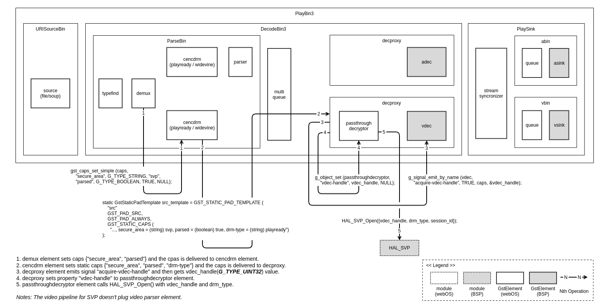

SVP
==========

Introduction
------------

This document describes the Secure Video Path (SVP) module in the Hardware Adaptation Layer (HAL) of the webOS. This document gives an overview of the SVP module and provides details about its functionalities and implementation requirements.

The SVP module is strongly associated with Video Decoder (VDEC) and Trusted Execution Environment (TEE) framework. Therefore, the document assumes that the readers are familiar with the VDEC and TEE technology, which include knowledge of their life-cycle, buffer management, among others.

The SVP module is responsible for performing video data protection with Digital Rights Management (DRM) solutions. Therefore, it is necessary to understand how to integrate with DRM solution.

Revision History
^^^^^^^^^^^^^^^^

======= ========== ========== =============================================================
Version Date       Changed by     Comment
======= ========== ========== =============================================================
2.0.0   2023.12.06 sehan.yoon Change format & Update contents
1.1.0   2023.08.01 sehan.yoon Remove unused APIs, Update description, diagrams and examples
1.0.0   2022.05.02 cs.jung    Initial Documentation
======= ========== ========== =============================================================

Terminology
^^^^^^^^^^^

The key words “must”, “must not”, “required”, “shall”, “shall not”, “should”, “should not”, “recommended”, “may”, and “optional” in this document are to be interpreted as described in RFC2119.

The following table lists the terms used throughout this document:

===== ==============================================================================================
Term  Description
===== ==============================================================================================
AU    Access Unit
AVC   Advanced Video Coding
AVCC  AVC Configuration Box
DRM   Digital Rights Management
DSC   Dynamic Stream Change
HAL   Hardware Adaptation Layer
HEVC  High Efficiency Video Coding
HVCC  HEVC Configuration Box
NALU  Network Adaptation Layer Unit
PPS   Picture Parameter Set
REE   Rich Execution Environment
SEBUF Secure Buffer, Permanent space with clear/decrypted video data where is referenced by decoder.
SEMEM Secure Memory, Temporary space with clear/decrypted video data where is referenced by SEBUF.
SPS   Sequence Parameter Set
TA    Trusted Application
TEE   Trusted Execution Environment
VDEC  Video Decoder
VPS   Video Parameter Set
===== ==============================================================================================

Technical Assistance
^^^^^^^^^^^^^^^^^^^^

For assistance or clarification on information in this guide, please create an issue in the LGE JIRA project and contact the following person:

====== ==================
Module Owner
====== ==================
SVP    sehan.yoon@lge.com
====== ==================

Overview
--------

General Description
^^^^^^^^^^^^^^^^^^^

SVP is a module to control resources which support enhanced content protection by TEE.

The main features required are :

- Open/Close SVP session
- Protect SVP resources and video data
- Provide capacity information of SVP resources
- Provide position information of video sample stacked in SEBUF

Architecture
^^^^^^^^^^^^

The HAL SVP functions have inter-dependencies, therefore please check the data flow which is numbered(① ~ ⑤) below refer to diagram in `Overall Workflow`_ section.

.. image:: resource/multi-svp-context.png
  :width: 100%
  :alt: System Context Diagram

① Video data will be delivered to SEMEM via HAL_SVP_Copy or Decrypt call. (If Decrypt was requested, decrypt operation shall be performed in SEMEM.)

② ~ ③ Video data (which is copied or decrypted) will be moved to SEBUF from SEMEM and then the position information(offset of SEBUF) for video data will be obtained via HAL_SVP_Write call.

④ The position information will be delivered to VDEC via Gstreamer pipeline.

⑤ VDEC will access video data refer to the position information.

Overall Workflow
^^^^^^^^^^^^^^^^

Below diagram shows how HAL SVP functions will be operated with life cycle.

.. image:: resource/multi-svp-flow-chart.png
  :width: 100%
  :alt: Sequence Diagram

Opening SVP session can be requested multiple to perform concurrent playback, therefore each session must control its owned SVP resources separately. If your platform doesn't support concurrent playback such as Multiview feature, you don't need to consider about multiple session. But, the session isolated design is recommended.

In the webOS SVP design, it is assumed that there are separated resources(SEMEM and SEBUF) for video data flow. SEMEM is a temporary space for decrypt operation by DRM TA and it is assumed that there is only one, therefore Copy(for not encrypted video) and Decrypt(for encrypted video) operations will be synchronized with Write operation for SEBUF by HAL APIs caller using semaphore. If your BSP implementation decided that managing only SEBUF, even if there is no SEMEM, you shall synchronize capacity information for SEMEM.

Requirements
------------

Functional Requirements
^^^^^^^^^^^^^^^^^^^^^^^

#. Creation/destruction and SVP resource control in accordance with the playback life cycle of Meida Pipeline
    #. `FR01-1` If HAL_SVP_Open is called, SVP resources must be allocated and a session is created, referring to vdec-handle and drm-type which are passed.
    #. `FR01-2` If HAL_SVP_Flush is called, the video data in SEMEM and SEBUF shall be emptied out and then the capacity information of SVP resources shall be initialized.
    #. `FR01-3` If HAL_SVP_Close is called, SVP resources must be released and a session is closed.
    #. `FR01-4` When an error is occured during creation/destruction and SVP resource control, a proper error code must be returned.
#. Data processing in accordance with the data flow control of Media Pipeline
    #. `FR02-1` If HAL_SVP_Copy is called, the video data shall be copied to SEMEM.
    #. `FR02-2` If decrypt operation is requested via each DRM interface, the video data shall be copied to SEMEM and then decrypt is performed.
    #. `FR02-3` If HAL_SVP_Write is called, the video data shall be moved from SEMEM to SEBUF.
        #. `FR02-3-1` The position information of current video data(written offset and length in SEBUF) must be provided by HAL_SVP_Write.
        #. `FR02-3-2` The position information for the next writable video data(available offset in SEBUF) must be provided by HAL_SVP_Write.
    #. `FR02-4` If HAL_SVP_Stat is called, current capacity information(available space) of SEMEM and SEBUF must be provided.
    #. `FR02-5` When an error is occured during data processing, a proper error code must be returned.

Quality and Constraints
^^^^^^^^^^^^^^^^^^^^^^^

Quality Attribute
*****************

#. `QA01` The module must implement access control mechanisms to prevent unauthorized access to data.
#. `QA02` 1 loop of Decrypt(or Copy), Stat, and Write of 1 sample (1 AU) be performed within 16ms.

Constraint Requirement
**********************

#. `CR01` The function is supported only for the following DRM solutions that require support for the SVP technique on webOS. Refer to `Use case of SEMEM information via DRM decrypt interfaces`_ section.
    - Microsoft PlayReady
    - Google Widevine Modular
    - Apple FairPlay
#. `CR02` If AVCC or HVCC (aka. non byte-stream) format is used in Media Pipeline, BSP TEE driver shall process data such as converting Annex-B format with the SVP resources. Refer to `Generic Pipeline`_ section.

Implementation
--------------

This section provides materials that are useful for SVP implementation.

- The `File Location`_ section provides the location of the Git repository where you can get the header file in which the interface for the SVP implementation is defined.
- The `API List`_ section provides a brief summary of SVP APIs that you must implement.
- The `Implementation Details`_ section sets implementation guidance and example code for some major functionalities.

File Location
^^^^^^^^^^^^^

The SVP interfaces are defined in the hal_svp.h header file, which can be obtained from https://wall.lge.com/.

- Git repository: bsp/ref/hal-libs-header

API List
^^^^^^^^

The SVP module implementation must adhere to the interface specifications defined and implements its functions. Refer to the API Reference for more details.

Data Types
**********

================================= =============================================
Name                              Description
================================= =============================================
:cpp:type:`HAL_SVP_RESULT_T`      Result codes for HAL_SVP functions.
:cpp:type:`HAL_SVP_OPEN_PARAM_T`  IN/OUT parameter for HAL_SVP_Open function.
:cpp:type:`HAL_SVP_CLOSE_PARAM_T` IN/OUT parameter for HAL_SVP_Close function.
:cpp:type:`HAL_SVP_STAT_PARAM_T`  IN/OUT parameter for HAL_SVP_Stat function.
:cpp:type:`HAL_SVP_SEMEM_PARAM_T` IN/OUT parameter for HAL_SVP_Copy function.
:cpp:type:`HAL_SVP_SEBUF_PARAM_T` IN/OUT parameter for HAL_SVP_Write function.
:cpp:type:`HAL_SVP_FLUSH_PARAM_T` IN/OUT parameter for HAL_SVP_Flush function.
:cpp:type:`SVP_STATUS_T`          Result codes for HAL_SVP_Widevine* functions.
================================= =============================================

Functions
*********

============================================= ==========================================================================
Function                                      Description
============================================= ==========================================================================
:cpp:func:`HAL_SVP_Open`                      Open SVP session and allocate SVP resources.
:cpp:func:`HAL_SVP_Close`                     Close SVP session and release SVP resources.
:cpp:func:`HAL_SVP_Stat`                      Get current capacities of SVP resource.
:cpp:func:`HAL_SVP_Copy`                      Copy data to ‘SEMEM’ with given information.
:cpp:func:`HAL_SVP_Write`                     Write data from ‘SEMEM’ to ‘SEBUF’ with given information.
:cpp:func:`HAL_SVP_Flush`                     Flush SVP resources.
:cpp:func:`HAL_SVP_WidevineSelectKey_OverV14` Selects Widevine content key for decryption of the encrypted video in TEE.
:cpp:func:`HAL_SVP_WidevineDecryptCENC_V16`   Decrypts content encrypted by Widevine Modular.
============================================= ==========================================================================

Implementation Details
^^^^^^^^^^^^^^^^^^^^^^

Use case of SEMEM information via DRM decrypt interfaces
********************************************************

In this section, examples will be provided which describe how to pass SEMEM information via each DRM decrypt interfaces.

PlayReady
~~~~~~~~~

PlayReady Porting Kit implementation in webOSTV will be customized by LG to pass 'session_id' and 'offset' from HAL_SVP_SEMEM_PARAM_T via a member 'cipher.cipherTEE.oOEMKeyInfo' in DRM_CIPHER_CONTEXT.

.. code-block:: cpp
  :caption: Prototype

  DRM_API DRM_RESULT DRM_CALL Drm_Reader_Bind(
      __in                           DRM_APP_CONTEXT      *f_poAppContext,
      __in_ecount( f_cRights ) const DRM_CONST_STRING     *f_rgpdstrRights[],
      __in                           DRM_DWORD             f_cRights,
      __in_opt                       DRMPFNPOLICYCALLBACK  f_pfnPolicyCallback,
      __in_opt                 const DRM_VOID             *f_pv,
      __out_opt                      DRM_DECRYPT_CONTEXT  *f_pcontextDCRY );

  DRM_API DRM_RESULT DRM_CALL Drm_Reader_DecryptOpaque(
      __in                                            DRM_DECRYPT_CONTEXT      *f_pDecryptContext,
      __in                                            DRM_DWORD                 f_cEncryptedRegionMappings,
      __in_ecount( f_cEncryptedRegionMappings ) const DRM_DWORD                *f_pdwEncryptedRegionMappings,
      __in                                            DRM_UINT64                f_ui64InitializationVector,
      __in                                            DRM_DWORD                 f_cbEncryptedContent,
      __in_bcount( f_cbEncryptedContent )       const DRM_BYTE                 *f_pbEncryptedContent,
      __out                                           DRM_DWORD                *f_pcbOpaqueClearContent,
      __deref_out_bcount( *f_pcbOpaqueClearContent )  DRM_BYTE                **f_ppbOpaqueClearContent );

  DRM_API DRM_RESULT DRM_CALL Drm_Reader_DecryptMultipleOpaque(
      __in                                                                 DRM_DECRYPT_CONTEXT      *f_pDecryptContext,
      __in                                                                 DRM_DWORD                 f_cEncryptedRegionInitializationVectors,
      __in_ecount( f_cEncryptedRegionInitializationVectors )         const DRM_UINT64               *f_pEncryptedRegionInitializationVectorsHigh,
      __in_ecount_opt( f_cEncryptedRegionInitializationVectors )     const DRM_UINT64               *f_pEncryptedRegionInitializationVectorsLow,
      __in_ecount( f_cEncryptedRegionInitializationVectors )         const DRM_DWORD                *f_pEncryptedRegionCounts,
      __in                                                                 DRM_DWORD                 f_cEncryptedRegionMappings,
      __in_ecount( f_cEncryptedRegionMappings )                      const DRM_DWORD                *f_pEncryptedRegionMappings,
      __in                                                                 DRM_DWORD                 f_cEncryptedRegionSkip,
      __in_ecount_opt( f_cEncryptedRegionSkip )                      const DRM_DWORD                *f_pEncryptedRegionSkip,
      __in                                                                 DRM_DWORD                 f_cbEncryptedContent,
      __in_bcount( f_cbEncryptedContent )                            const DRM_BYTE                 *f_pbEncryptedContent,
      __out                                                                DRM_DWORD                *f_pcbOpaqueClearContent,
      __deref_out_bcount( *f_pcbOpaqueClearContent )                       DRM_BYTE                **f_ppbOpaqueClearContent );

.. code-block:: cpp
  :caption: Example

  DRM_API DRM_RESULT DRM_CALL Drm_Reader_Bind(...)
  {
      ...

      /* Cleanup oOEMKeyInfo for SVP usage later. */
      DRM_TEE_NW_BASE_FreeBlob( NULL, &pCipherCtx->cipher.cipherTEE.oOEMKeyInfo );

      ...

  ErrorExit:

      ...

      return dr;
  }

  typedef struct __tagOEM_KEY_INFO_SVP
  {
      DRM_UINT64 ui64SessionId;
      DRM_DWORD  dwOffset;
  } OEM_KEY_INFO_SVP;

  HAL_SVP_SEMEM_PARAM_T semem_param;

  OEM_KEY_INFO_SVP oem_key_info_svp;
  oem_key_info_svp.ui64SessionId = semem_param.session_id;
  oem_key_info_svp.dwOffset = semem_param.offset;

  DRM_CIPHER_CONTEXT *pCipherContext = DRM_REINTERPRET_CAST( DRM_CIPHER_CONTEXT, pDecryptContext );
  /* Fill SEMEM info before decrypt function call. */
  DRM_TEE_NW_BASE_AllocBlob(NULL,
                            DRM_TEE_BLOB_ALLOC_BEHAVIOR_COPY,
                            sizeof( oem_key_info_svp ),
                            DRM_REINTERPRET_CAST( const DRM_BYTE, &oem_key_info ),
                            &pCipherContext->cipher.cipherTEE.oOEMKeyInfo);

  Drm_Reader_Decrypt[Multiple]Opaque( pDecryptContext, cbEncryptedContent, pbEncryptedContent, ... );

  /* Free oOEMKeyInfo after decrypt function call. */
  DRM_TEE_NW_BASE_FreeBlob( NULL, &pCipherCtx->cipher.cipherTEE.oOEMKeyInfo );

Widevine Modular
~~~~~~~~~~~~~~~~

SEMEM information will be set to OEMCrypto_SampleDescription and then will be passed via HAL_SVP_WidevineDecryptCENC_V16().

.. code-block:: cpp
  :caption: Prototype

  SVP_STATUS_T HAL_SVP_WidevineSelectKey_OverV14(UINT32 session,
                                                 const UINT8 *key_id,
                                                 size_t key_id_length,
                                                 SINT32 cipherMode);

  SVP_STATUS_T HAL_SVP_WidevineDecryptCENC_V16(UINT32 session,
                                               void *samples,
                                               size_t samples_length,
                                               void *pattern,
                                               UINT32 *oec_return);

.. code-block:: cpp
  :caption: Example

  HAL_SVP_STAT_PARAM_T stat_param;
  HAL_SVP_SEMEM_PARAM_T semem_param;

  OEMCrypto_SampleDescription sample_desc[NUM_OF_SAMPLE];
  for (int i = 0; i < NUM_OF_SAMPLE; i++) {
    ...
    sample_desc[i].buffers.output_descriptor.secure.handle = (void*)&semem_param.session_id;
    sample_desc[i].buffers.output_descriptor.secure.handle_length = stat_param.capacity.semem;
    sample_desc[i].buffers.output_descriptor.secure.offset = semem_param.offset;
    sample_desc[i].buffers.input_data = data[i].ptr;
    sample_desc[i].buffers.input_data_length = data[i].len;
    ...
  }

  void *samples = (void*)&sample_desc;
  size_t samples_length = NUM_OF_SAMPLE;

  HAL_SVP_WidevineSelectKey_OverV14(...);

  HAL_SVP_WidevineDecryptCENC_V16(..., samples, samples_length, ...);

FairPlay
~~~~~~~~

SEMEM information will be passed via apple_get_outsample_handle().

.. code-block:: cpp
  :caption: Prototype

  int apple_get_outsample_handle(uint32_t type,
                                 void *handle,
                                 size_t handle_size,
                                 size_t offset,
                                 uint8_t **out_sample);

  int apple_decrypt_sample(uint64_t movie_id,
                           uint64_t cryptor_id,
                           unt32_t content_type,
                           const uint8_t *in_sample,
                           size_t in_size,
                           uint8_t *out_sample,
                           sample_info *infos,
                           int num_info,
                           const uint8_t iv[16],
                           security_status_list_t *security_status,
                           int num_security_status);

.. code-block:: cpp
  :caption: Example

  HAL_SVP_STAT_PARAM_T stat_param;
  HAL_SVP_SEMEM_PARAM_T semem_param;

  void *handle = (void*)&semem_param.session_id;
  size_t handle_size = stat_param.capacity.semem;
  size_t offset = semem_param.offset;

  apple_get_outsample_handle(..., handle, handle_size, offset, ...);

  apple_decrypt_sample(...);

SVP flow based on Gstreamer
***************************

In this section, the SVP flow based on Gstreamer pipeline is provided from behavioral perspective for BSP driver developers.

Media pipeline construction
~~~~~~~~~~~~~~~~~~~~~~~~~~~

The media framework of webOS TV is Gstreamer. And the media pipeline is constructed with Gstreamer elements. This section describes the flow about signals/properties in each element when the media pipeline for SVP was constructed.

Custom pipeline
+++++++++++++++

The most of premium applications such as Netflix, Youtube, Disney+, Amazon and so on use the custom player on webOS. Gstreamer elements are plugged manually by the class CustomPipeline. We call it the custom pipeline. The video data in the custom pipeline is already pre-processed to Annex-B format by application and then byte-stream is pushed.

Following figure shows the operation sequence of the custom pipeline when SVP starts.

Generic pipeline
++++++++++++++++

Except of case using custom player, all of media playbacks use the generic player on webOS. Gstreamer elements are plugged automatically by the Gstreamer auto-plug mechanism. Also BSP decoder/sink elements are configured automatically instead of s/w decoders. For this job, the decproxy which is created by webOS plugs a fake decoder until acquisition of H/W resources and then changes from fake to BSP decoder.

Following figure shows the operation sequence of the generic pipeline when SVP starts.

In the generic pipeline, the video data should be processed from AVCC/HVCC(aka. non byte-stream) format to Annex-B(aka. byte-stream) format by parser element. But, SVP pipeline doesn't plug video parser element by setting caps "parsed = (boolean) true". So, converting stream format from AVCC/HVCC to Annex-B (aka. overwrite start-code per each NALU) is required by BSP TEE driver. It means that NALU parser which processes raw data(parameter set and decrypted video) in SEMEM or SEBUF may have to be implemented by BSP TEE driver. To support this, passthroughdecryptor element gets codec data from caps and parses parameter set(ex. SPS, PPS or VPS) and then pushes parameter set in front of video data. This is a minimum help, 1) to provide ommited data which should have to be provided by parser element, 2) to guarantee data order, because gst caps/flush-stop event may be async with data push in gst chain function.

Following figure shows how to support non byte-stream in the generic pipeline for SVP.

Performing Playback
~~~~~~~~~~~~~~~~~~~

HAL_SVP
+++++++

After SVP custom/generic pipeline is created, HAL_SVP functions call will be performed by passthroughdecryptor element. The sequence during playback is in progress can be referred by `Overall Workflow`_ section.

GstBuffer
+++++++++

GstBuffer passing from passthroughdecryptor element to vdec element contains offset and length information about video data in SEBUF.

Following code example shows how the GstBuffer is replaced with offset and length value from HAL_SVP_Write().

.. code-block:: cpp

  static GstFlowReturn
  _process_decrypted_example (GstPad * pad, GstObject * parent, GstBuffer * buf)
  {
    GstPassthroughDecryptor *self = GST_PASSTHROUGH_DECRYPTOR (parent);
    guint offset, length;
    GstByteWriter bw;
    gsize mem_size;
    guint8 *mem_data;
    GstMemory *mem;

    /* 1. Decrypt or HAL_SVP_Copy() has been performed before. */
    /* 2. HAL_SVP_Write() has been performed before. */

    offset = /* written offset value from HAL_SVP_Write(). */
    length = /* written length value from HAL_SVP_Write(). */
    if (length == 0) {
      /* We don't need to push '0' sized payload, remove it from buffer list */
      GST_DEBUG ("remove buf which contains 0-sized payload from buffer_list");
      gst_buffer_unref (buf);
      return GST_FLOW_OK;
    }

    /* 3. Put |offset|length| ordered GstBuffer by BIG-ENDIAN format. */
    gst_byte_writer_init (&bw);
    if (!gst_byte_writer_put_uint32_be (&bw, offset)) {
      GST_ERROR ("failed to put offset");
      return GST_FLOW_ERROR;
    }
    if (!gst_byte_writer_put_uint32_be (&bw, length)) {
      GST_ERROR ("failed to put length");
      return GST_FLOW_ERROR;
    }
    mem_size = gst_byte_writer_get_size (&bw);
    mem_data = gst_byte_writer_reset_and_get_data (&bw);
    mem = gst_memory_new_wrapped ((GstMemoryFlags) 0, mem_data, mem_size, 0,
        mem_size, mem_data, g_free);
    if (!mem) {
      GST_ERROR ("failed to new wrapped memory");
      return GST_FLOW_ERROR;
    }
    gst_buffer_replace_all_memory (buf, mem);

    /* 4. Push GstBuffer which contains |offset|length| information. */
    return gst_pad_push (self->srcpad, buf);
  }

Testing
-------

The SVP module is strongly coupled with SoC's VDEC driver implementation and integration level of each DRM solutions. Therefore webOS doesn't provide SoCTS (SoC Test Suite) for HAL SVP verification. We can verify SVP implementation via system test instead of SoCTS.
