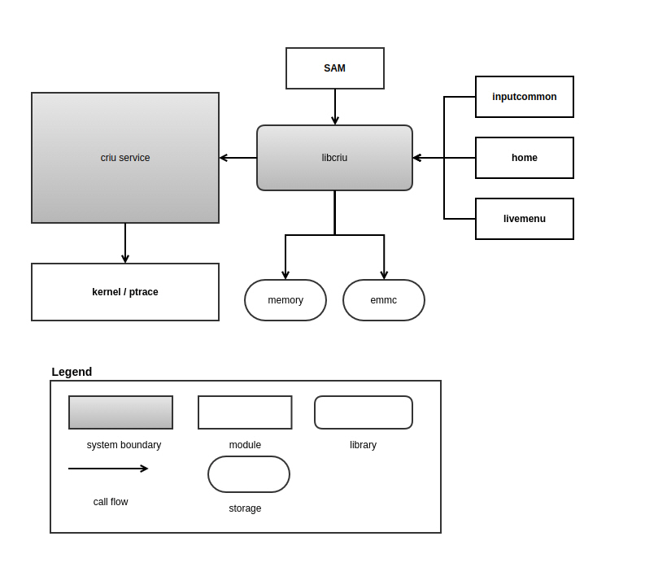
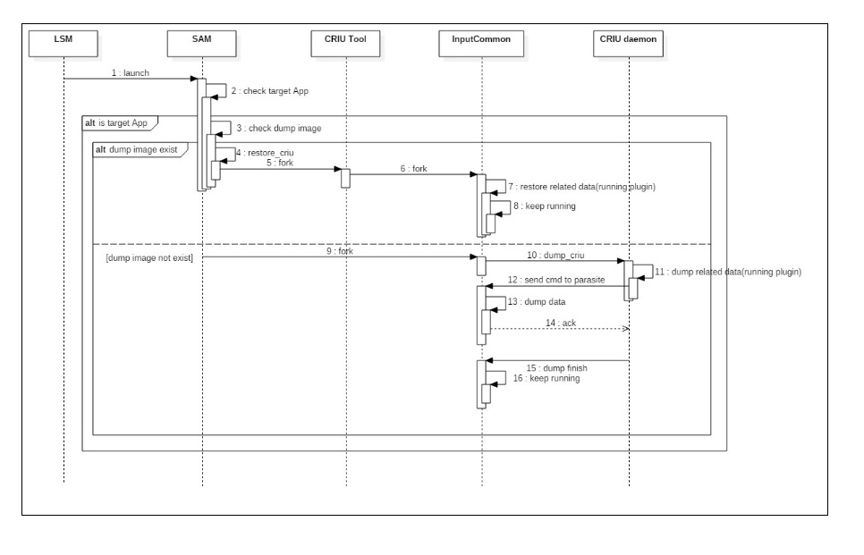

CRIU
#######

.. _jjinsuk.choi: jjinsuk.choi@lge.com
.. _jaeguk.lee: jaeguk.lee@lge.com

Introduction
************
|   This document describes the Checkpoint/Restore In Userspace (CRIU) module in the HAL libs layer of the webOS. The document gives an overview of the CRIU module and provides details about its functionalities and implementation requirements.
|
|   CRIU is an open-source software (https://criu.org/Main_Page). Therefore, the document assumes that the readers are familiar with the CRIU.
|   The CRIU allows freezing a running application (or part of it) and checkpointing it to persistent storage as a collection of files.

Revision History
================

======= ========== ===================== ======================
Version  Date        Changed by          Description
======= ========== ===================== ======================
2.0.0   2023.11.10   `jjinsuk.choi`_     Unpdate contents and new document form.
1.0.0   2022.07.22   `jaeguk.lee`_       First release
======= ========== ===================== ======================

Terminology
===========

================= ==================================================
Definition                Description
================= ==================================================
CRIU              checkpoint/restore functionality for Linux.
SAM               webOS System & Application Manager
================= ==================================================

Technical Assistance
====================
|  For assistance or clarification on information in this guide, please create an issue in the LGE JIRA project and contact the following person:

================= ============================
Module             Owner
================= ============================
CRIU                `jaeguk.lee`_
================= ============================

Overview
********

General Description
===================
|   Checkpoint/Restore In Userspace (CRIU) is a software for Linux operating system. Using CRIU, it is possible to freeze a running application (or part of it) and checkpoint it to persistent storage as a collection of files.
|   One can then use the files to restore and run the application from the point it was frozen at. The distinctive feature of the CRIU project is that it is mainly implemented in user space, rather than in the kernel. Using this functionality, application live migration, snapshots and many other things are now possible.
|
|   The CRIU module includes some modifications and extends for webOS TV.
|   The HAL_CRIU functions handle exceptions for unsupported operation such as device files, shared memory, and rw files.

Features
========
|   The main features provided by the CRIU module are:
- Freeze a running application and application live migration
- Checkpoint it to persistent storage as a collection of files
- Support snapshots

Architecture
============
|  This section describes the system context of hal-libs criu. Through this system context, external entities are identified and the system boundary is clarified.

====================== ====================================================================================================
Entity                  Responsibility
====================== ====================================================================================================
criu service            Execute the requested dump
kernel / ptrace         When dumping, control the dumpee process through ptrace and provide a system call to acquire resource information
libcriu                 Linked to sam and each criu app
                            sam : When running the criu app, after determining whether to restore or not, proceed with the corresponding operation
                            criu app : Request dump to criu service
sam                     When the app to be executed is criu app, restore request to libcriu
inputcommon             Dump request to libcriu to proceed with criu dump
home                    Dump request to libcriu to proceed with criu dump
livemenu                Dump request to libcriu to proceed with criu dump
memory                  To improve performance during criu dump, the dump image is saved to tmpfs.
emmc                    Save to emmc to keep dump image even when TV is turned off
====================== ====================================================================================================

=========================================== ====================================================================================================
Entity                                      Responsibility
=========================================== ====================================================================================================
criu service → kernel                       When dumping, adjust the dumpee process through ptrace, acquire and save the necessary resources.
                                            When restoring, clone the process and restore the saved resources.
libcriu → criu service                      If dump is requested to criu service during dump, the process is stopped through ptrace in criu service, and the dump operation proceeds.
sam → libcriu                               Check if criu dump image exists.
                                            Restore in progress when dump image or zygote process exists.
inputcommon / home / livemenu → libcriu     inputcommon / home / livemenu is executed to request criu dump during initialization.
                                            Even in the case of restore, it starts at the point where criu dump is returned.
libcriu → memory /  emmc                    Save dump images to tmpfs and emmc.
                                            When restoring, use the image stored in tmpfs or emmc.
=========================================== ====================================================================================================

Overal Workflow
===============

|  The following shows the sequence diagram of CRIU dump.

- HAL_CRIU_PreCheckpointNotify will be called at "10.dump_criu".
- HAL_CRIU_PostDumpNotify will be called at "15. dump finish".
- HAL_CRIU_PostRestoreNotify will be called at "8. keep running".

Requirements
************

|  This section describes the main functionalities of the criu module in terms of the module's requirements and constraints.

Functional Requirments
======================
|  The functional requirements of the CRIU module are as follows:
- Close opened device fd
- Reopen device fd
|  For more information, please refer to each function in the API List.

Quality and Constraints
=======================

Performance Requirements
------------------------

|   When dump / restore, it must be completed within the following time limits:

- dump : 7 sec
- restore : 3 sec
- Each funtion in the API List should return within 100ms, unless there are any special reasons.

Technical Constraints
---------------------

|  There are resources that cannot be dumped, such as:

- Unix domain socket
- System V shared memory
- Block and character device
- eMMC read-write data

|  In order to apply criu to the app, it is necessary to prepare in advance. The apps to which criu is currently applied are as follows.
- inputcommon
- livemenu
- home

Implementation
************
|  This section provides supplementary materials that are useful for CRIU module implementation.
- The File Location section provides the location of the Git repository where you can get the header file in which the interface for the CRIU module implementation is defined.
- The API List section provides a brief summary of CRIU APIs that you must implement.
- The Implementation Details section provides the sample code for the CRIU API.

File Location
========
|  The CRIU interfaces are defined in the hal_criu.h header file, which can be obtained from https://swfarmhub.lge.com/.
- Git repository: bsp/ref/hal-libs-header
|  This Git repository contains the header files for the SYS implementation as well as documentation for the CRIU implementation guide and CRIU API reference.

API List
========

|  The data types and functions used in this module are as follows.

Data Types
----------
NA

Functions
---------

======================================== ======================================================
Name                                     Description
======================================== ======================================================
:cpp:func:`HAL_CRIU_PreCheckpointNotify` Close opened device fd. Resources that can not be dumped should be freed here.
:cpp:func:`HAL_CRIU_PostDumpNotify`      Reopen device fd. The freed resources when dumping should be reassigned here.
:cpp:func:`HAL_CRIU_PostRestoreNotify`   Reopen device fd. The freed resources when dumping should be reassigned here.
======================================== ======================================================

Implementation Details
======================

|  Hear is the sample code for the HAL_CRIU_PreCheckpointNotify, HAL_CRIU_PostDumpNotify, and HAL_CRIU_PostRestoreNotify.

::

    int HAL_CRIU_PreCheckpointNotify(void)
    {
        //Implement file descriptor close.
        if(close_fd()){
            return NOT_OK;
        }

        return OK;
    }

    int HAL_CRIU_PostDumpNotify(void)
    {

        //Implement file descriptor open.
        if(open_fd()){
            return NOT_OK;
        }

        return OK;
    }

    int HAL_CRIU_PostRestoreNotify(void)
    {
        //Implement file descriptor open.
        if(open_fd()){
            return NOT_OK;
        }

        return OK;
    }

Testing
*******
|   To test the implementation of the CRIU module, webOS TV provides SoCTS (SoC Test Suite) tests. The SoCTS checks the basic operations of the criu module and verifies function operations for the module by using a test execution file.
|  For more information, see :doc:`criu’s SoCTS Unit Test manual. </part4/socts/Documentation/source/producer-manual/producer-manual_hal/producer-manual_hal-criu>`
|  :cpp:func:`HAL_CRIU_PostDumpNotify` //except from socts, TAS test by criu feature bat
|  :cpp:func:`HAL_CRIU_PostRestoreNotify` //except from socts, TAS test by criu feature bat

References
**********
|  For additional information on related standards or technical topics, refer to:
- https://criu.org/Main_Pag
