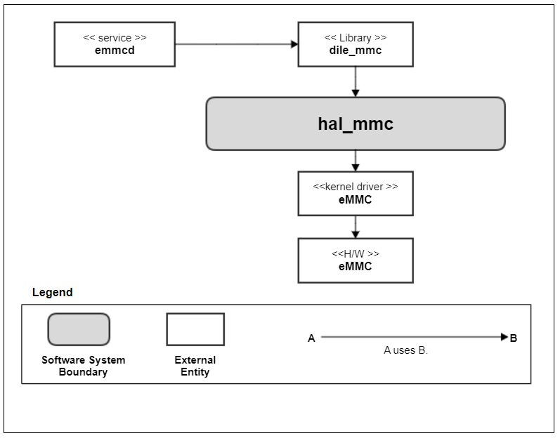
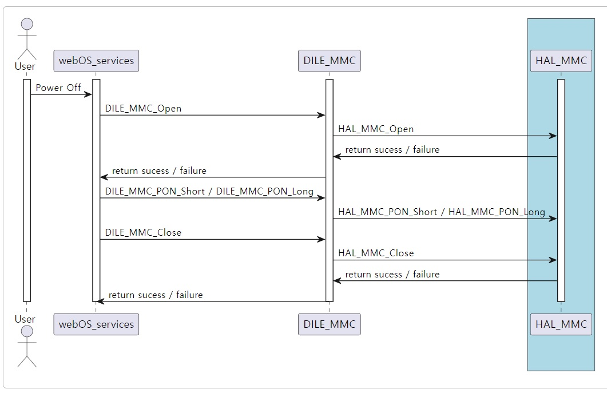
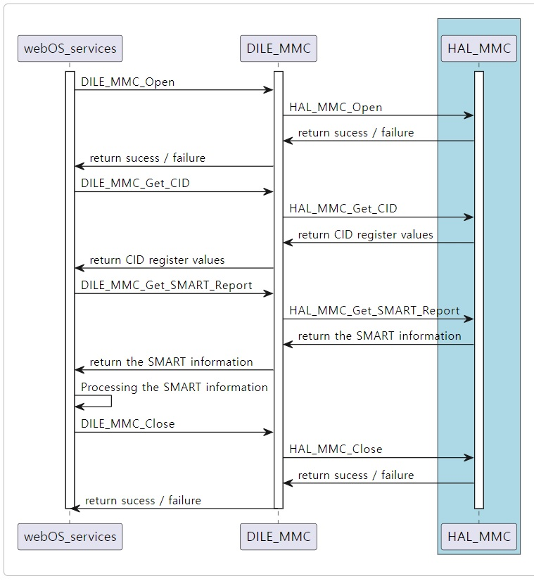
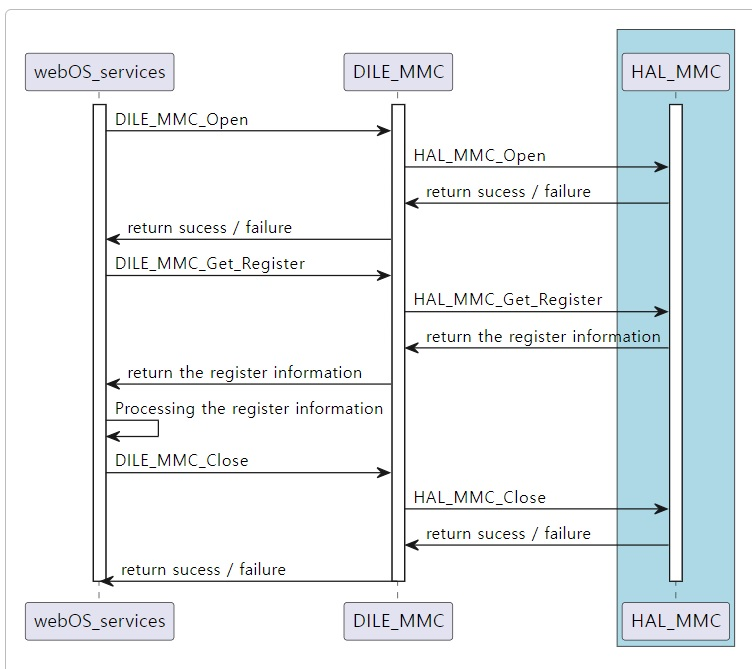
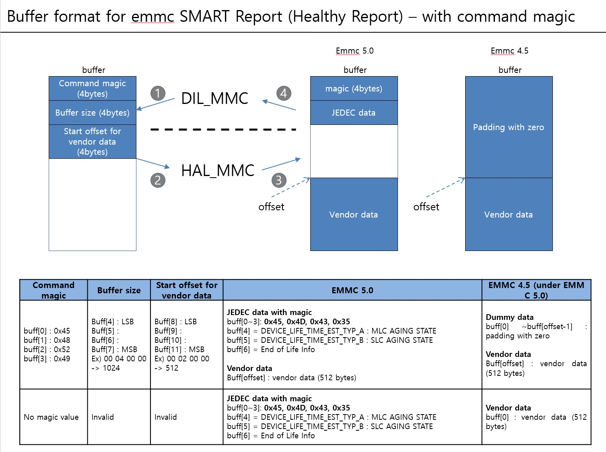
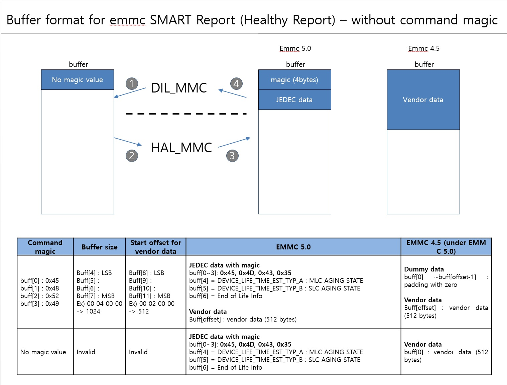

MMC
#######

.. _denis.hong: denis.hong@lge.com
.. _kwangseok.kim: kwangseok.kim@lge.com

Introduction
************

|  This document describes the Multi-Media Card (MMC) module in the HAL libs layer of the webOS. The document gives an overview of the MMC module and provides details about its functionalities and implementation requirements.
|  The MMC module is based on the embedded Multi-Media Card (eMMC) technology. Therefore, the document assumes that the readers are familiar with the JEDEC standard for the eMMC technology.
|  The MMC module is responsible for getting the eMMC register values and setting the Power Off Notification (PON), etc.

Revision History
================

======= ========== ===================== ======================
Version  Date        Changed by          Description
======= ========== ===================== ======================
2.0.0   2023.11.06   `kwangseok.kim`_    Unpdate contents and new document form.
1.0.0   2022.06.08   `denis.hong`_       First release
======= ========== ===================== ======================

Terminology
===========
| The key words "must", "must not", "required", "shall", "shall not", "should", "should not", "recommended", "may", and "optional" in this document are to be interpreted as described in RFC2119. 
| The following table lists the terms used throughout this document: 

================= ==================================================
Definition                Description
================= ==================================================
MMC                Multi-Media Card
PON                Power Off Notification
CID                Card IDentificatoin
SMART              Self Monitoring, Analysis and Reporting Technology
================= ==================================================

Technical Assistance
====================
|  For assistance or clarification on information in this guide, please create an issue in the LGE JIRA project and contact the following person:

================= ============================
Module             Owner
================= ============================
MMC                `kwangseok.kim`_
================= ============================

Overview
********

General Description
===================

|  The MMC module supports the block devices associated with the eMMC device. This module is responsible for the followings:
- Open MMC device
- Close MMC device
- Set PON with short time
- Set PON with long time
- Get MMC CID
- Get MMC usage information(SMART)
- Get MMC register's information

Features
========
| The main features provided by the MMC modules are:
- Setting the PON(Power Off Notification)
    - The host should notify the device before it powers the device off. This allows the device to better prepare itself for being powered off.
    - The webOS platform requests the PON when power off. The garbage collection of the eMMC will be processed during power off. It can make the booting performance better.

- Getting the register values.
    - CID register to check the Manufacture ID, etc
    - CSD register
    - ExtCSD register

- Getting the SMART(Self Monitoring, Analysis and Reporting Technology) Report
    - It provides the life cycle of the eMMC device.
    - There are 2 kind of the SMART reports.
        - The first is from the vendor command which depends on the each eMMC devices. Some eMMC devices support this function but some don't. The webOS platform doesn't use this type.
        - The second is from the "Device life time estimation" of the Extended CSD register.
        - The interface is designed for both but the webOS platform uses "Device life time estimation".

Architecture
============

|  This section describes the system context of hal-libs mmc. Through this system context, external entities are identified and the system boundary is clarified.

====================== ====================================================================================================
Entity                  Responsibility
====================== ====================================================================================================
<<service>> emmcd       Information such as the life time from an emmc device is processed so that it can be expressed in UI.
<<library>> dile_mmc    It is located in the layer between the webOS platform service and hal_mmc and provides functions such as emmc device information and PON.
<<kernel driver>> eMMC  The kernel controls the eMMC device.
<<H/W>> eMMC            This is a non-volatile memory H/W device.
====================== ====================================================================================================

====================================== ====================================================================================================
Relationships                           Responsibility
====================================== ====================================================================================================
emmcd -> dile_mmc                       The emmcd service calls the dile_mmc API to request PON (Power Off Notification) and various register information.
dile_mmc -> hal_mmc                     Calls the hal_mmc API to request PON and various register (CID, CSD, ExtCSD) information.
hal_mmc -> <<kernel driver>> eMMC       Calls the kernel driver to access the eMMC H/W device.
<<kernel driver>> eMMC -> <<H/W>> eMMC  Request PON and register information directly from the eMMC H/W device.
====================================== ====================================================================================================

Overal Workflow
===============

|  The following shows the sequence diagram of setting the PON(Power Off Notification)

|  The following shows the sequence diagram of getting the SMART report

|  The following shows the sequence diagram of getting the register(CSD, Extended CSD) information

Requirements
************

|  This section describes the main functionalities of the MMC module in terms of the module's requirements and constraints.

Functional Requirments
======================
|  The Functional Requirements section sets forth the requirements imposed on MMC's basic functionalities.

How to use the buffer for the SMART report
------------------------------------------

|  There are 2 kinds of the SMART reports.
|  The first is from the vendor command, which depends on the each eMMC device. Some eMMC devices support this function, but some don't. The webOS platform doesn't use this type.
|  The second is from the "Device life time estimation" of the Extended CSD register.
|  The interface is designed for both, but the webOS platform uses "Device life time estimation". We use the argument, "buff" of the following function for the both information.
- HAL_MMC_Get_SMART_Report(buff, len)

**"buff" with command magic for the SMART information**

|  1. The DILE_MMC(DIL_MMC) will fill the data into the argument, "buff" and send the "buff" to the HAL_MMC.
- The command magic, the buffer size, and the start offset for the vendor data will be filled.
|  2. The HAL_MMC will return the "buff" which is filled with "Device life time estimantion" from the ExtCSD register and the vendor data.
- The emmc version is 5.0 or higher
    - Fill the JEDEC life time estimation and the vendor data for the life time.
- The emmc version is 4.5 or lower
    - Fill the vendor data only and zero data in the JEDEC data field.
- The vendor data is not filled from the 2023 models. (just padding with zero.)

**"buff" without command magic for the SMART information**

|  1. The DILE_MMC(DIL_MMC) will send the "buff" to the HAL_MMC without the command magic.
|  2. The HAL_MMC will return the "buff" which is filled with "Device life time estimantion" from the ExtCSD register and the vendor data.
- The emmc version is 5.0 or higher
    - Fill the JEDEC life time estimation from the start of the "buff".
- The emmc version is 4.5 or lower
    - Fill the vendor data from the start of the "buff".
- The vendor data is not filled from the 2023 models. (just padding with zero.)

How to fill the buffer for the CID
----------------------------------

::

  mid = buff_CID[3];
  cbx = buff_CID[2]&0x03;
  oid = buff_CID[1];
  prv = buff_CID[10];
  psn |= (buff_CID[9]<<24);
  psn |= (buff_CID[8]<<16);
  psn |= (buff_CID[15]<<8);
  psn |= (buff_CID[14]);
  mdt = buff_CID[13];

Quality and Constraints
=======================

Performance Requirements
------------------------

|  Each funtion in the API List should return within 10ms, unless there are any special reasons.

Design Constraints
------------------

|  Please refer to the performance requirements and constraints of each function the API Reference.

**The SMART infromation**

|  The vendor specific command for the life time or the eMMC erase count is not common.
|  It is designed by the eMMC vendor. There might be command sequence set. The several commands might be issued to get the information.
|  Between the vendor commands for the life time, if there is another command(read or write), the emmc device could be in abnormal.
|  We should implement the function, to get vendor life time, as one command set. There must not be another command during issuing the vendor command for the life time.

Implementation
**************
|  This section provides supplementary materials that are useful for MMC module implementation.
- The File Location section provides the location of the Git repository where you can get the header file in which the interface for the MMC module implementation is defined.
- The API List section provides a brief summary of MMC APIs that you must implement.
- The Implementation Details section provides the sample code for the MMC API.

File Location
=============
|  The MMC interfaces are defined in the hal_mmc.h header file, which can be obtained from https://swfarmhub.lge.com/.
- Git repository: bsp/ref/hal-libs-header
|  This Git repository contains the header files for the MMC implementation as well as documentation for the MMC implementation guide and MMC API reference.

API List
========

|  The data types and functions used in this module are as follows.

Data Types
----------

Enumerations
^^^^^^^^^^^^

============================== ===================================
Name                           Description
============================== ===================================
:c:macro:`MMC_REGISTER_TYPE_T` Struct for the emmc register types
============================== ===================================

Functions
---------

==================================== ======================================================
Name                                 Description
==================================== ======================================================
:cpp:func:`HAL_MMC_Open`             Open MMC device.
:cpp:func:`HAL_MMC_Close`            Close MMC device.
:cpp:func:`HAL_MMC_PON_Short`        Set PON(Power Off Notification) with short time.
:cpp:func:`HAL_MMC_PON_Long`         Set PON(Power Off Notification) with long time.
:cpp:func:`HAL_MMC_Get_CID`          Get MMC CID(Card IDentification)
:cpp:func:`HAL_MMC_Get_SMART_Report` Get MMC usage information. (SMART : Self Monitoring, Analysis and Reporting Technology)
:cpp:func:`HAL_MMC_Get_Register`     Get MMC register’s information. (except from socts, it will be update if this function is to be tested.)
==================================== ======================================================

Implementation Details
======================

|  Refer to the section, the Requirements.

|  Here is the sample code for the HAL_MMC_Get_SMART_Report API.

::

	486 DTV_STATUS_T HAL_MMC_Get_SMART_Report(unsigned char *buff, unsigned int *len)
	487 {
	488     // received buffer
	489     static unsigned char cid[16] = {0};
	490     static unsigned char ext_csd[512] = {0};
	491     static int fgCID = 0;
	492     unsigned char flag = 0;
	493 
	494     unsigned char cmd_magic[4];
	495     unsigned int buf_size = 0;
	496     unsigned long buf_offset = 0;
	497 
	498     struct mmc_ioc_cmd idata;
	499     struct mmc_ioc_multi_cmd *multi_cmd = NULL;
	500     unsigned char *wbuf = NULL;
	501 
	502     ENTRY();
	503 
	504     cmd_magic[0] = buff[0];
	505     cmd_magic[1] = buff[1];
	506     cmd_magic[2] = buff[2];
	507     cmd_magic[3] = buff[3];
	508 
	509     // Get EXT CSD. Check eMMC version.
	510     // eMMC 5.0, use EXT_CSD[267] - EXT_CSD{269]
	511     memset(&idata, 0, sizeof(idata));
	512 
	513     idata.write_flag = 0;
	514     idata.opcode = MMC_SEND_EXT_CSD;
	515     idata.arg = 0;
	516     idata.flags = MMC_RSP_SPI_R1 | MMC_RSP_R1 | MMC_CMD_ADTC;
	517     idata.blksz = 512;
	518     idata.blocks = 1;
	519     mmc_ioc_cmd_set_data(idata, (unsigned long)ext_csd);
	520 
	521     if(ioctl(fd, MMC_IOC_CMD, &idata))
	522     {
	523         nERR("Cmd send failed(cmd8(0x0))!");
	524         RETURN(NOT_OK);
	525     }
	526 
	527     if( (cmd_magic[0] == 0x45) && (cmd_magic[1] == 0x48) &&
	528         (cmd_magic[2] == 0x52) && (cmd_magic[3] == 0x49) )
	529     {
	530         buf_size = buff[4] | (buff[5]<<8) | (buff[6]<<16) | buff[7]<<24;
	531         buf_offset = buff[8] | (buff[9]<<8) | (buff[10]<<16) | (buff[11]<<24);
	532 
	533         if( ext_csd[192] >= 7 )
	534         {
	535             buff[0] = 0x45;
	536             buff[1] = 0x4D;
	537             buff[2] = 0x43;
	538             buff[3] = 0x35;
	539             buff[4] = ext_csd[268];
	540             buff[5] = ext_csd[269];
	541             buff[6] = ext_csd[267];
	542 
	543             *len = buf_size;
	544 
	545         }
	546         else
	547         {
	548             memset(buff, 0, buf_offset); // padding with zero
	549         }
	550     }
	551     else
	552     {
	553         if( ext_csd[192] >= 7 )
	554         {
	555             buff[0] = 0x45;
	556             buff[1] = 0x4D;
	557             buff[2] = 0x43;
	558             buff[3] = 0x35;
	559             buff[4] = ext_csd[268];
	560             buff[5] = ext_csd[269];
	561             buff[6] = ext_csd[267];
	562 
	563             *len = buf_size;
	564 
	565             RETURN(OK);
	566         }
	567         else
	568         {
	569             buf_size = 512;
	570             buf_offset = 0;
	571         }
	572     }
	573 
	574     /*
	575      * MID can be the unique code for different manufacturers
	576      * Hynix - 90h
	577      * Kingston - 70h
	578      * Sandisk - 45h or 02h
	579      * Toshiba - 11h
	580      * Samsung - 15h
	581      * Micron - FE
	582      */
	583 
	584     if(fgCID == 0)
	585     {
	586         if(HAL_MMC_Get_CID(cid))
	587         {
	588             nERR("Get CID error!");
	589             RETURN(NOT_OK);
	590         }
	591 
	592         fgCID = 1;
	593     }
	594 
	595     nDBG("==>Enter HAL_MMC_Get_SMART_Report!");
	596 
	597 
	598     if(cid[3] == 0x15)
	599     {

	655     }
	656     else if(cid[3] == 0x90)
	657     {

	709     }
	710     else if(cid[3] == 0x70)
	711     {
	712         nERR("Smart Report Function is not prepared about Kingston eMMC");
	713         RETURN(NOT_OK);
	714     }
	715     else if((cid[3] == 0x45) || (cid[3] == 0x02))
	716     {

	755     }
	756     else if(cid[3] == 0x11)
	757     {

	816     }
	817     else if(cid[3] == 0xFE)
	818     {

	857     }
	858     else
	859     {
	860         nERR("Unknown eMMC");
	861         RETURN(NOT_OK);
	862     }
	863 
	864     if (multi_cmd)
	865         free(multi_cmd);
	866 
	867     RETURN(OK);
	868 }

Testing
*******
|  To test the implementation of the MMC module, webOS TV provides SoCTS (SoC Test Suite) tests. The SoCTS checks the basic operations of the MMC module and verifies the kernel event operations for the module by using a test execution file.
|  For more information, :doc:` MMC’s SoCTS Unit Test manual </part4/socts/Documentation/source/producer-manual/producer-manual_hal/producer-manual_hal-mmc>`.
